# Agentic Engineering Platform — Architecture

**Status:** Living document  
**Version:** 1.1 (container topology; extends Architecture Baseline v2.0)  
**Last updated:** 1 July 2026  
**Derived from:** Reference Architecture v1.0 · [CONSTITUTION.md](CONSTITUTION.md)  
**Implementation baseline:** [docs/architecture/ARCHITECTURE_BASELINE_V2.md](docs/architecture/ARCHITECTURE_BASELINE_V2.md) — **master reference for platform ontology** (Platform Objects, Provider Model, Execution Profiles, Metadata Engine)

> **Architecture Baseline v2.0:** Customer-facing behaviour is expressed as **metadata** (Platform Objects), not platform source forks. This document describes **deployable containers and services**. For primitives, contracts, and metadata architecture, see [docs/architecture/](docs/architecture/).

---

## Overview

The Agentic Engineering Platform is a vendor-neutral, multi-agent orchestration system for enterprise software engineering. Nine independently deployable containers communicate exclusively through an Event Bus. An Orchestrator plans and routes work; specialist agents execute. Humans approve at non-bypassable gates. Every action is recorded in an immutable audit store.

**Constitutional invariants:** Agents never call agents. Orchestrator plans, never executes. New agents plug in, never patch in. Humans approve, agents propose. Every decision is reconstructable. Vendor-neutral by construction.

---

## C4 Level 1 — System Context

The platform sits between people who request and approve work, and external systems that hold the enterprise's code, tickets, and infrastructure. It introduces no new system of record.

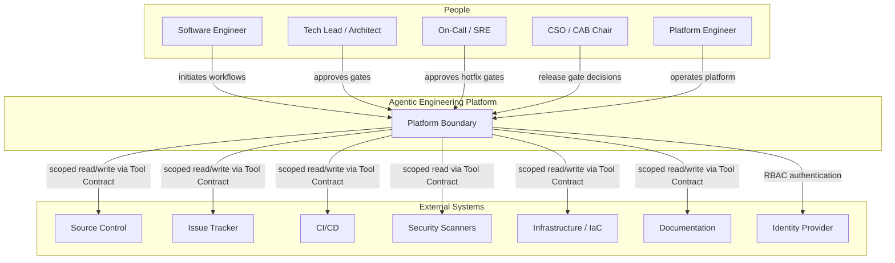

### Key Context Relationships

| Relationship | Nature | Rule |
|-------------|--------|------|
| People → Platform | Initiate workflows, approve gates | Gates block workflow; not notifications |
| Platform → External Systems | Scoped Tool Contract | Read/write per capability; never blanket credentials |
| Platform → Governance | Gate, not notification | Workflow cannot proceed without recorded decision |

*Reference: RA Section 2*

---

## C4 Level 2 — Containers

Nine containers, each independently deployable and scalable. The Event Bus is the only inter-container communication path.

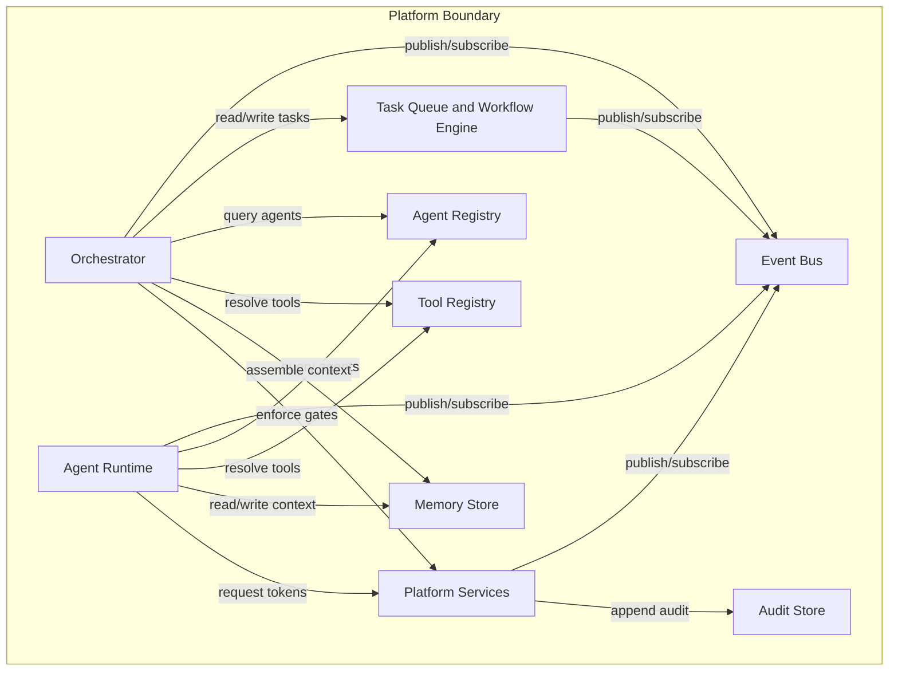

### Container Responsibilities

| Container | Responsibility | Scales by |
|-----------|---------------|-----------|
| **Orchestrator** | Workflow state machine, agent selection, context assembly, gate enforcement, cost-aware dispatch, retry/compensation | Workflow volume |
| **Agent Runtime** | Hosts specialist agent executions; publishes lifecycle events | Agent task volume (horizontal replicas) |
| **Event Bus** | Publish/subscribe backbone for all inter-container communication | Event throughput |
| **Task Queue & Workflow Engine** | Durable task state, workflow transitions, saga compensation | Task volume |
| **Agent Registry** | Dynamic **Provider** discovery by capability tag (`ai-agent` Providers) | Registry size (not traffic) |
| **Tool Registry** | **Provider** resolution for integrations (`connector` / `rest-api` Providers) by capability tag | Registry size |
| **Memory Store** | Working context (short-lived) + long-term memory (vector + metadata) | Storage + query volume |
| **Audit Store** | Immutable, append-only action and decision record | Write volume (append-only) |
| **Platform Services** | Human Approval Checkpoint, Model Router, Policy Engine, Secrets Vault, Observability | Service-specific |

*Reference: RA Section 3*

### Why Agents Never Call Each Other

If the Coding Agent called the Test Agent directly, every new agent would need to know about every agent that might call it — O(n²) coupling. Routing through the Event Bus means an agent has exactly one relationship: publish results, subscribe to relevant events. A thousand-engineer platform with fifty agents is architecturally identical to a five-agent pilot.

*Reference: RA Section 3.1; Constitution A1*

---

## C4 Level 3 — Orchestrator Components

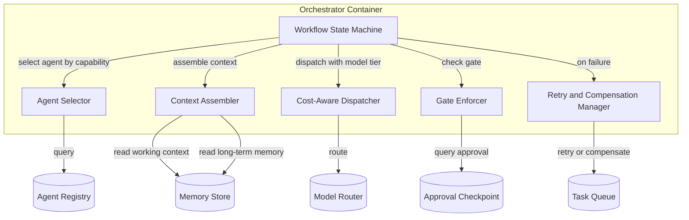

**Absent by design:** No component writes code, runs a test, or scans a dependency. The orchestrator is a planner and referee, never a player.

| Component | Responsibility |
|-----------|---------------|
| Workflow State Machine | Loads workflow template; manages state transitions; publishes `StateTransitioned` |
| Agent Selector | Queries Agent Registry by capability tag; resolves `assigned_agent_id` |
| Context Assembler | Builds working-context packet from prior agent outputs + long-term memory queries |
| Cost-Aware Dispatcher | Classifies task complexity/risk; routes to model tier via Model Router |
| Gate Enforcer | Refuses state transition until Human Approval Checkpoint returns recorded decision |
| Retry & Compensation Manager | Three-tier recovery: retry → saga compensation → human escalation |

*Reference: RA Section 4*

---

## Deployment Architecture

Vendor-neutral at the platform layer. Portable primitives at the infrastructure layer. Same containers deploy on Azure or AWS with configuration changes, not architecture changes.

| Container | Azure | AWS |
|-----------|-------|-----|
| Orchestrator / Agents | AKS or Azure Container Apps | EKS or ECS Fargate |
| Event Bus | Azure Service Bus / Event Grid | Amazon EventBridge / SQS+SNS |
| Task Queue & Workflow Engine | Durable Functions or workflow engine on AKS | Step Functions or workflow engine on EKS |
| Long-Term Memory | Azure AI Search (vector) or pgvector on Azure Postgres | OpenSearch (vector) or pgvector on RDS |
| Secrets Vault | Azure Key Vault | AWS Secrets Manager |
| Identity / RBAC | Microsoft Entra ID | AWS IAM Identity Center |
| Observability | Azure Monitor + Log Analytics | CloudWatch + OpenTelemetry collector |
| Infra-as-code | Terraform (azurerm) | Terraform (aws) |

**Constant across clouds:** Terraform for infrastructure-as-code.

*Reference: RA Section 12*

---

## Sequence Diagrams

### Greenfield Product Development

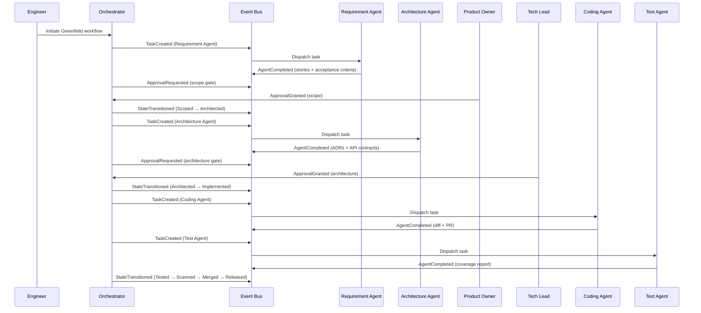

### Production Defect Resolution (with automatic rollback)

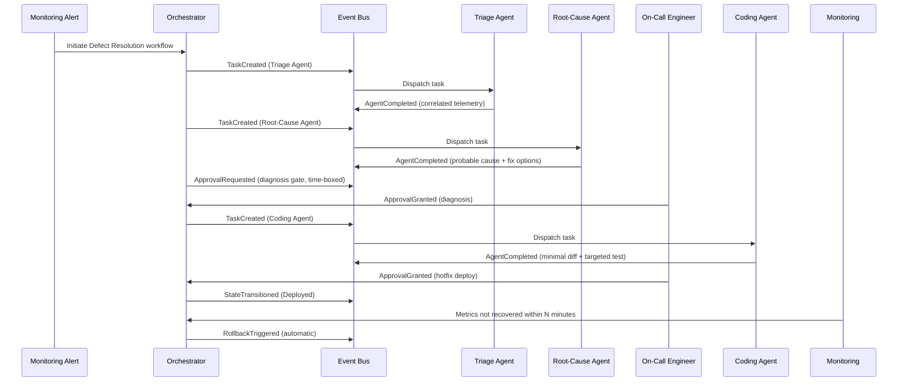

*Reference: RA Sections 11.1, 11.3*

---

## Event Model

Every event follows one envelope shape. Specific event types are the vocabulary for coordination.

### Event Envelope

| Field | Purpose |
|-------|---------|
| `event_id` | Unique event identity |
| `event_type` | Event classification (see below) |
| `timestamp` | Event ordering |
| `task_id` | Correlates to Task Schema |
| `workflow_run_id` | Correlates to workflow instance |
| `emitted_by` | agent_id or service name — always attributable |
| `payload` | Event-type-specific body |

### Core Event Types

| Event Type | When It Fires |
|------------|---------------|
| `TaskCreated` | Orchestrator decomposes a workflow step into a task |
| `AgentStarted` | Specialist agent begins execution |
| `AgentCompleted` | Specialist agent finishes successfully |
| `AgentFailed` | Specialist agent fails — triggers Retry & Compensation Manager |
| `ApprovalRequested` | Human Approval Checkpoint gate reached |
| `ApprovalGranted` | Named approver grants approval |
| `ApprovalDenied` | Named approver denies — routes back as revision task |
| `StateTransitioned` | Workflow state machine advances — canonical observability record |
| `RollbackTriggered` | Compensation logic activated |

### Event Flow

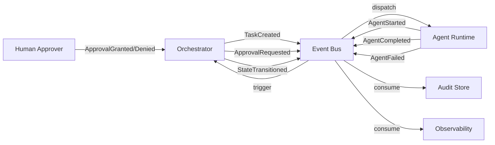

*Reference: RA Section 10*

---

## Service Boundaries

| Service | Owns | Does NOT Own | Communicates via |
|---------|------|-------------|-----------------|
| Orchestrator | Workflow state, agent selection, context assembly, gate enforcement, dispatch, retry | Code generation, testing, scanning, credentials | Event Bus, Task Queue (read/write), Registries (read) |
| Agent Runtime | Agent execution, tool invocation, result publishing | Workflow sequencing, approval decisions, model selection | Event Bus, Registries (read), Memory Store (read/write), Platform Services (token request) |
| Task Queue | Durable task state, workflow transitions, saga compensation | Agent logic, approval logic | Event Bus |
| Agent Registry | Agent registration, capability index, contract validation | Agent execution, workflow logic | API (read by Orchestrator and Agent Runtime) |
| Tool Registry | Tool registration, capability resolution, response normalisation | Tool execution, credential storage | API (read by Agent Runtime), Secrets Vault (token issuance) |
| Memory Store | Working context, long-term memory, vector retrieval | Workflow state, audit records | API (read/write by Orchestrator and Agent Runtime) |
| Audit Store | Immutable action and decision records | Any mutable state | Event Bus (consume all events) |
| Approval Checkpoint | Gate records, approver identity, decision audit | Workflow state transitions (Gate Enforcer owns) | API (read by Gate Enforcer) |
| Model Router | Model tier routing, per-tenant quota | Agent logic, task classification (Dispatcher owns) | API (read by Cost-Aware Dispatcher) |
| Policy Engine | Agent action permissions | Human RBAC, approval authority | API (read by Agent Runtime before side effects) |
| Secrets Vault | Short-lived scoped token issuance | Credential storage in agents/tools | API (read by Tool Registry at invocation) |

**Boundary rule:** No service reaches into another service's owned data. All cross-boundary communication is via Event Bus events or documented APIs.

---

## Data Flow

### Task Lifecycle Data Flow

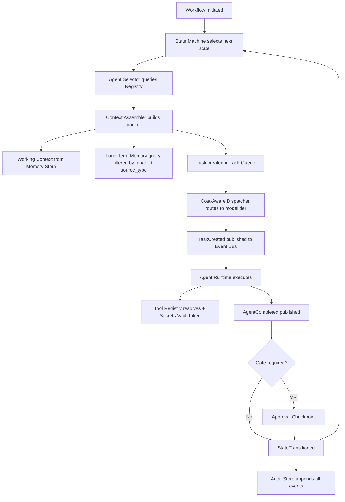

### Memory Data Flow

| Memory Type | Lifetime | Written by | Read by | Storage |
|-------------|----------|-----------|---------|---------|
| Working context | Task/workflow run | Context Assembler | Agent via Task Schema `context` field | Task Queue + Memory Store (ephemeral namespace) |
| Long-term memory | Durable | Deliberate write after verified outcomes | Any agent via filtered query | Vector store + structured metadata |

**Separation rule:** Working context passes explicitly per Task Schema. Long-term memory is queried by filter (tenant_id, source_type, recency_weight). Never conflated.

*Reference: RA Sections 5.3, 8, 9*

---

## Security Architecture

Three distinct controls, never merged:

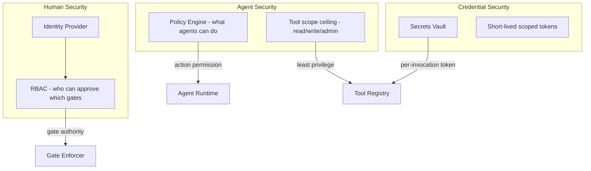

| Control | Governs | Example |
|---------|---------|---------|
| RBAC | Which humans can approve which gates | Only Tech Leads approve architecture gate |
| Policy Engine | Which actions an agent may perform regardless of who triggered the workflow | Coding Agent cannot push to `main` |
| Secrets Vault | Credential issuance — no agent or tool holds credentials directly | GitHub PAT issued per invocation, scoped to repo |

*Reference: RA Section 5.9; Constitution S1–S4*

---

## Memory Architecture

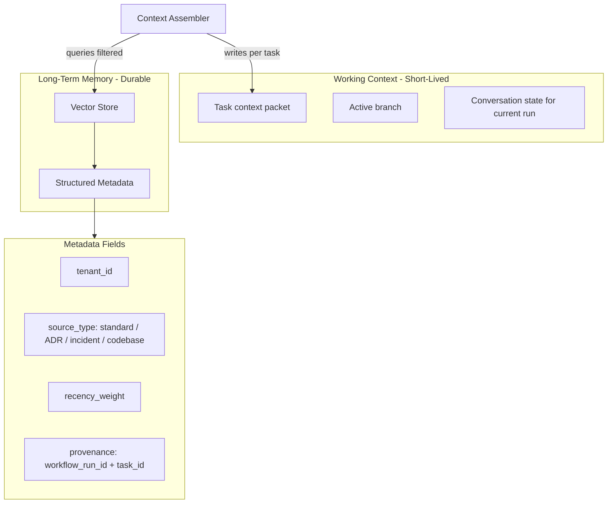

| Field | Purpose |
|-------|---------|
| `memory_id` | Stable identity |
| `embedding` | Semantic similarity retrieval |
| `source_type` | Filter: standard / ADR / incident / codebase |
| `tenant_id` | Isolation at memory layer |
| `recency_weight` | Newer decisions outrank stale |
| `provenance` | Auditable origin (which workflow/task wrote it) |

*Reference: RA Sections 5.3, 9; Constitution M1–M5*

---

## Tool Architecture

Every external system is wrapped identically via the Tool Contract:

| Field | Purpose |
|-------|---------|
| `tool_id` | Stable identity (e.g., `github-prod`, `azure-devops-tenant-a`) |
| `capability_tags` | What agents request (e.g., `create-pull-request`) |
| `auth_strategy` | OAuth / PAT / managed-identity |
| `scope` | read / write / admin — least-privilege ceiling |
| `rate_limit_policy` | Per-tenant API quota protection |
| `response_normaliser` | Maps vendor response to common shape |

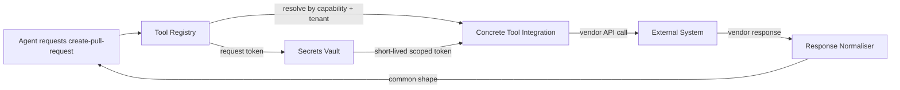

**Swappability:** Tenant A uses GitHub; Tenant B uses Azure DevOps. Agent logic is identical. Only the Tool Registry entry changes.

*Reference: RA Section 7; Constitution PL2*

---

## Agent Runtime

### Agent Contract

| Field | Type | Purpose |
|-------|------|---------|
| `agent_id` | string (unique) | Stable identity for registry and audit |
| `capabilities` | string[] | Matched by Agent Selector (e.g., `generates-unit-tests`) |
| `input_schema` | schema ref | Expected context packet shape |
| `output_schema` | schema ref | Published result shape |
| `required_tools` | string[] | Tool capability tags needed before execution |
| `cost_class` | enum: low / medium / high | Default hint to Model Router |
| `approval_required` | boolean | Output must pass gate before next transition |
| `idempotency_key_strategy` | function ref | Prevents duplicate side effects on retry |
| `contract_version` | string | Platform contract compatibility |

### Runtime Lifecycle

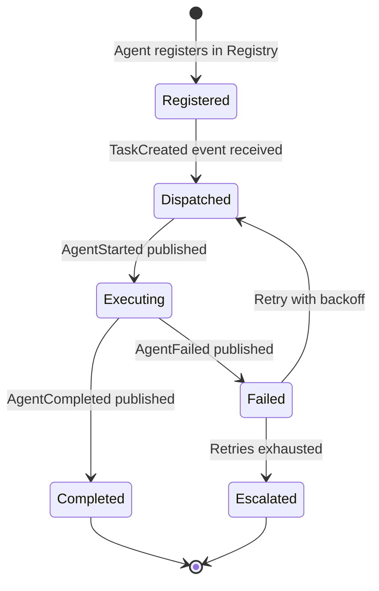

**Runtime rules:**
- Stateless — no session state between invocations
- Tools resolved via Tool Registry, never called directly
- Model tier assigned by Cost-Aware Dispatcher, not selected by agent
- Results published as events, never as commands to other agents

*Reference: RA Section 6; Constitution AG1–AG5*

---

## SDK Architecture

### Agent SDK

Provides contract validation, registration, and execution scaffolding:

| Capability | Description |
|------------|-------------|
| Contract validator | Validates agent implements all required Agent Contract fields |
| Registration client | Registers/deregisters agent in Agent Registry |
| Event publisher | Publishes `AgentStarted`, `AgentCompleted`, `AgentFailed` with correct envelope |
| Tool client | Requests tools by capability tag via Tool Registry |
| Idempotency helper | Implements `idempotency_key_strategy` pattern |
| Context parser | Deserialises Task Schema `context` field per `input_schema` |

### Tool SDK

Provides integration scaffolding for external systems:

| Capability | Description |
|------------|-------------|
| Contract validator | Validates tool implements all required Tool Contract fields |
| Registration client | Registers tool in Tool Registry with capability tags |
| Response normaliser scaffold | Template for mapping vendor response to common shape |
| Auth adapter | Integrates with Secrets Vault for token issuance |
| Rate limiter | Implements `rate_limit_policy` per tenant |

### SDK Boundaries

- SDKs MUST NOT expose orchestrator internals, workflow state machine, or gate logic
- SDKs MUST NOT allow direct agent-to-agent communication
- SDKs MUST enforce contract_version compatibility at registration time

---

## Model Routing

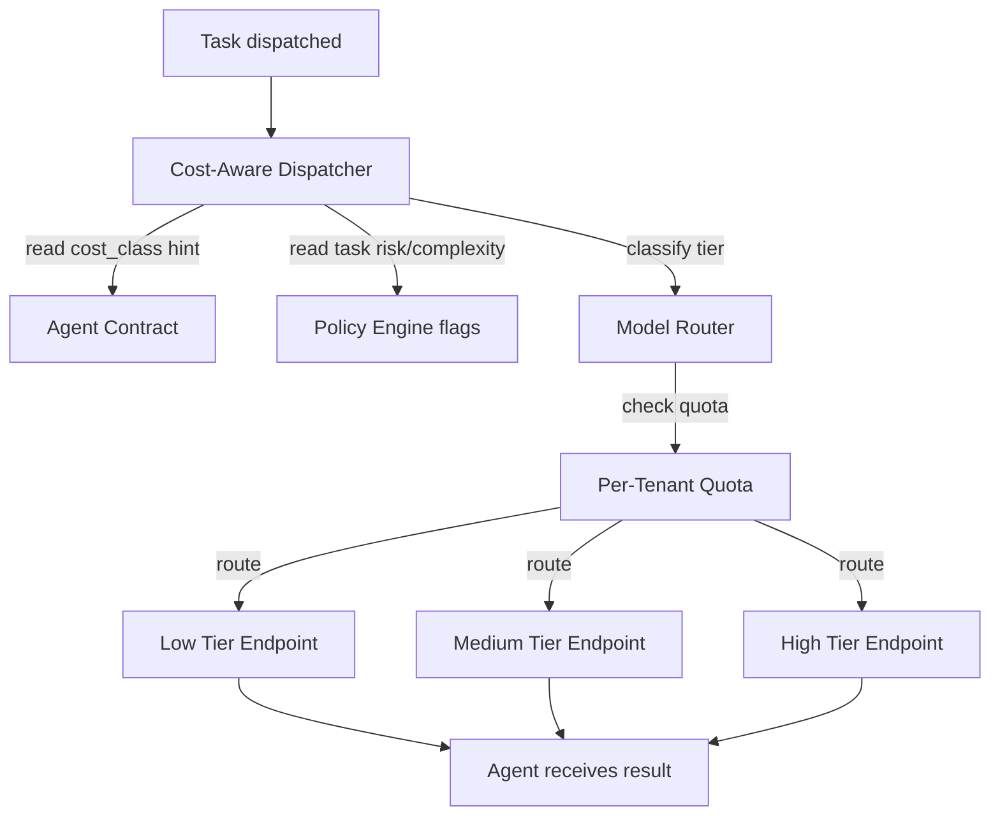

| Routing Input | Source | Example |
|--------------|--------|---------|
| Default tier | Agent `cost_class` | Architecture Agent → high |
| Task override | Policy Engine / task metadata | Security-critical patch → high |
| Quota check | Per-tenant Model Router quota | Throttle when exceeded |
| Endpoint | Configuration (not architecture) | Swap provider without code change |

**Honest limit:** Model routing optimises cost and tier assignment. It does not improve model judgement quality.

*Reference: RA Sections 5.10, 13; Constitution MI1–MI3, CO1*

---

## Multi-Tenancy

Three-layer enforcement:

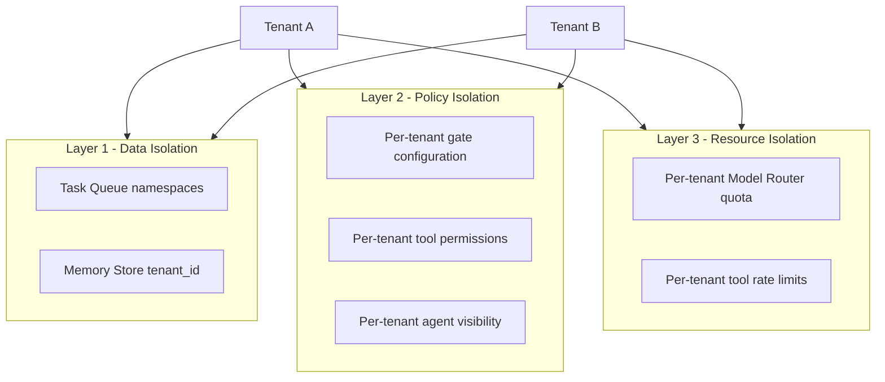

| Layer | Mechanism | Prevents |
|-------|-----------|----------|
| Data | Namespace isolation in Task Queue; `tenant_id` on every memory entry | Cross-tenant data leakage |
| Policy | Per-tenant gate config, tool permissions, agent visibility | Policy conflicts between tenants |
| Resource | Per-tenant model quota, per-tenant tool rate limits | Noisy-neighbour resource exhaustion |

**Rule:** One platform deployment, many isolated tenants. No per-tenant code forks.

*Reference: RA Section 5.8; Constitution MT1–MT3*

---

## Scalability

Three dimensions, three mechanisms:

| Dimension | Mechanism | Scales to |
|-----------|-----------|-----------|
| More engineers using the platform | Horizontal agent replicas behind Event Bus | 5,000+ engineers |
| More capabilities (new agent types) | Agent Registry growth — independent registration | 50+ agent types |
| More tenants / business units | Namespace isolation at Task Queue and Memory layers | Multi-BU / multi-client |

**Honest limit:** The platform scales coordination capacity. It does not scale individual agent judgement quality. Model capability and platform capability are separate investments.

**Stability point:** After the full agent catalog is loaded (RA Stage 3), the platform shape stops changing. Further growth is a rollout problem, not an architecture problem.

*Reference: RA Section 13, 14; Constitution SC1–SC3*

---

## Task Schema

Contract schema: [contracts/task-schema.schema.json](./contracts/task-schema.schema.json)

| Field | Type | Purpose |
|-------|------|---------|
| `task_id` | string (unique) | Correlates across events, logs, audit |
| `workflow_run_id` | string | End-to-end workflow instance |
| `workflow_type` | enum | Selects state machine template |
| `context` | object | Working-context packet from Context Assembler |
| `assigned_agent_id` | string | Resolved by Agent Selector |
| `state` | enum (per workflow) | Current position in state machine |
| `retry_count` | integer | Drives retry/compensation escalation |
| `approval_record` | object or null | Populated after gate satisfaction |

*Reference: RA Section 8*

---

## Document Relationships

| Document | Relationship |
|----------|---------------|
| [CONSTITUTION.md](./CONSTITUTION.md) | Immutable principles governing this architecture |
| [docs/architecture/ARCHITECTURE_BASELINE_V2.md](docs/architecture/ARCHITECTURE_BASELINE_V2.md) | **Implementation baseline v2** — ontology and gap register |
| [docs/architecture/PLATFORM_PRIMITIVES.md](docs/architecture/PLATFORM_PRIMITIVES.md) | Platform Object model and thirteen primitives |
| [docs/architecture/PLATFORM_GLOSSARY.md](docs/architecture/PLATFORM_GLOSSARY.md) | Official vocabulary |
| [contracts/](./contracts/) | JSON Schema definitions for all platform contracts |
| [workflows/](./workflows/) | Versioned workflow state machine templates |
| [VISION.md](./VISION.md) | Product vision this architecture realises |
| [ROADMAP.md](./ROADMAP.md) | Phased delivery of architecture components |
| [docs/architecture/IMPLEMENTATION_READINESS.md](docs/architecture/IMPLEMENTATION_READINESS.md) | Readiness gate before full v2 realisation |
| [DECISIONS.md](./DECISIONS.md) | ADRs for architectural decisions |
| [CLAUDE.md](./CLAUDE.md) | Implementation rules for AI-assisted development |

---

*This is a living document. Update when containers, contracts, or boundaries change. Changes that violate CONSTITUTION.md require a Decision Record.*
