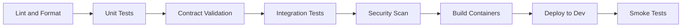

# Agentic Engineering Platform — AI Implementation Rules

**Status:** Living document  
**Version:** 1.0  
**Last updated:** 27 June 2026  
**Audience:** AI assistants (Claude, Cursor, Copilot) and all engineers using AI-assisted development on this platform  
**Authority:** [CONSTITUTION.md](CONSTITUTION.md) is supreme. This document operationalises it.

---

## Purpose

This document defines the rules every AI-assisted implementation MUST follow. When an AI assistant writes code, tests, documentation, or configuration for this platform, it MUST comply with these rules. Violations are treated as constitutional violations.

**Read order for AI assistants:**
1. [CONSTITUTION.md](CONSTITUTION.md) — what MUST NEVER be violated
2. [ARCHITECTURE.md](./ARCHITECTURE.md) — how the system is structured
3. This document — how to implement correctly
4. [DECISIONS.md](docs/architecture/ADR/DECISIONS.md) — why specific choices were made

---

## Architecture Rules

### AR1. Agents Never Call Agents

AI assistants MUST NOT generate code where one agent invokes another agent's API, imports another agent's module, or publishes command events instructing another agent.

**Correct:** Agent publishes `AgentCompleted` with results. Orchestrator decides next step.  
**Forbidden:** `testAgent.run(codingAgent.getOutput())` or `eventBus.publish({ next_agent: "test-agent", action: "run" })`

### AR2. Orchestrator Plans, Never Executes

AI assistants MUST NOT add code generation, test execution, security scanning, or any specialist logic to the Orchestrator container or its components.

**Correct:** Orchestrator dispatches task to agent via `TaskCreated` event.  
**Forbidden:** Orchestrator contains a `generateCode()` method or imports a test framework.

### AR3. New Agents Plug In via Registry

AI assistants MUST NOT modify orchestrator code to add a new agent. New agents register in the Agent Registry with the standard Agent Contract.

**Correct:** New file implementing Agent Contract + registration call.  
**Forbidden:** Adding a case to the orchestrator's switch statement for the new agent.

### AR4. Event Bus Is the Only Inter-Container Communication Path

AI assistants MUST NOT generate direct HTTP/gRPC calls between platform containers.

**Correct:** Container A publishes event. Container B subscribes.  
**Forbidden:** `orchestratorClient.callAgentRuntime(task)` or `memoryStore.getContext(taskId)`.

### AR5. Service Boundaries Are Hard

AI assistants MUST NOT allow one service to read or write another service's owned data store directly. Cross-boundary access is via published APIs or events only.

### AR6. Contracts Before Implementations

AI assistants MUST implement the Agent Contract, Tool Contract, Task Schema, Memory Schema, and Event Envelope before writing agent/tool logic. Validate against schemas at registration time.

---

## Coding Standards

### Language & Style

| Rule | Standard |
|------|----------|
| Primary languages | TypeScript (platform services, SDKs), Python (agent runtime) |
| Formatting | Prettier (TS), Black (Python) — enforced in CI |
| Linting | ESLint (TS), Ruff (Python) — zero warnings in CI |
| Type safety | Strict mode enabled. No `any` in TypeScript. Type hints in Python. |
| Error handling | Explicit error types. No silent catch-and-ignore. Agent failures publish `AgentFailed`. |
| Logging | Structured JSON logs. Always include `task_id`, `workflow_run_id`, `emitted_by`. |

### Code Organisation

```
platform/
├── containers/
│   ├── orchestrator/
│   ├── agent-runtime/
│   ├── event-bus/
│   ├── task-queue/
│   ├── agent-registry/
│   ├── tool-registry/
│   ├── memory-store/
│   ├── audit-store/
│   └── platform-services/
├── agents/
│   ├── requirement-agent/
│   ├── coding-agent/
│   └── ...
├── tools/
│   ├── github-tool/
│   ├── jira-tool/
│   └── ...
├── sdks/
│   ├── agent-sdk/
│   └── tool-sdk/
├── contracts/
│   ├── agent-contract.schema.json
│   ├── tool-contract.schema.json
│   ├── task-schema.schema.json
│   ├── memory-schema.schema.json
│   └── event-envelope.schema.json
├── workflows/
│   ├── greenfield-v1.json
│   ├── brownfield-v1.json
│   └── ...
└── infra/
    ├── terraform/
    └── k8s/
```

### Naming Conventions

| Entity | Convention | Example |
|--------|-----------|---------|
| Agent ID | kebab-case, descriptive | `coding-agent-v2` |
| Tool ID | kebab-case, env-qualified | `github-prod`, `jira-tenant-a` |
| Capability tags | kebab-case, verb-noun | `generates-unit-tests`, `create-pull-request` |
| Event types | PascalCase | `TaskCreated`, `AgentCompleted` |
| Task ID | UUID v4 | `t-550e8400-e29b-41d4-a716-446655440000` |
| Workflow run ID | UUID v4 | `wr-550e8400-e29b-41d4-a716-446655440000` |
| Workflow type | kebab-case | `greenfield-product-development` |
| State names | PascalCase or kebab-case (consistent per template) | `Architected`, `Root-Cause-Identified` |
| Tenant ID | kebab-case | `tenant-acme-corp` |
| Memory source_type | lowercase enum | `standard`, `adr`, `incident`, `codebase` |
| Cost class | lowercase enum | `low`, `medium`, `high` |
| Environment variables | SCREAMING_SNAKE_CASE | `EVENT_BUS_CONNECTION_STRING` |
| Terraform resources | snake_case with prefix | `aep_event_bus_topic` |

### File Naming

| Type | Convention | Example |
|------|-----------|---------|
| Agent implementation | `{agent-name}.agent.ts` | `coding-agent.agent.ts` |
| Tool implementation | `{tool-name}.tool.ts` | `github-prod.tool.ts` |
| Workflow template | `{workflow-type}-v{version}.json` | `greenfield-v1.json` |
| Contract schema | `{contract-name}.schema.json` | `agent-contract.schema.json` |
| Test files | `{name}.test.ts` or `{name}.spec.ts` | `agent-selector.test.ts` |
| ADR | `ADR-{NNN}-{short-title}.md` | `ADR-001-event-mediated-communication.md` |

---

## Testing Rules

### Test Pyramid

| Level | Scope | Required for |
|-------|-------|-------------|
| Unit | Individual functions, schema validation | All services and agents |
| Integration | Container-to-container via Event Bus | All containers |
| Contract | Agent/Tool Contract compliance | All agents and tools |
| Workflow | End-to-end workflow execution | All workflow templates |
| Tenancy | Cross-tenant isolation | Memory, Task Queue, policy |
| Chaos | Container failure, network partition | Orchestrator, Task Queue, Event Bus |

### Mandatory Test Cases

Every agent MUST have tests for:
- [ ] Contract validation (all fields present and valid)
- [ ] Idempotency (retry does not duplicate side effects)
- [ ] Event publishing (correct envelope, correct event types)
- [ ] Tool resolution via capability tag (not tool name)
- [ ] Failure handling (AgentFailed published on error)

Every tool MUST have tests for:
- [ ] Contract validation
- [ ] Response normalisation (vendor shape → common shape)
- [ ] Scope enforcement (cannot exceed registered scope)
- [ ] Token usage (requests from Secrets Vault, not embedded)

Every workflow MUST have tests for:
- [ ] Complete state machine traversal
- [ ] Gate blocking (transition refused without approval)
- [ ] Gate denial → revision task (not workflow failure)
- [ ] Platform restart recovery (resume mid-workflow)

### Test Naming

```
describe('{Component}')
  describe('{method/scenario}')
    it('should {expected behaviour}')
    it('should not {forbidden behaviour}')
```

Example:
```
describe('GateEnforcer')
  describe('when approval_record is null')
    it('should refuse state transition')
    it('should not bypass gate on timeout')
```

---

## Security Rules

### SR1. No Credentials in Code or Images

AI assistants MUST NOT hardcode API keys, tokens, passwords, or connection strings. All credentials via Secrets Vault at runtime.

### SR2. Least Privilege

AI assistants MUST register tools with the minimum scope required. Default to `read` unless `write` is explicitly needed. Never use `admin` unless documented and approved.

### SR3. Tenant Isolation in Every Query

AI assistants MUST include `tenant_id` in every memory query, task query, and policy check. No unscoped queries.

### SR4. RBAC ≠ Policy ≠ Secrets

AI assistants MUST NOT merge RBAC, Policy Engine, and Secrets Vault into a single module. Three separate services, three separate test suites.

### SR5. Input Validation

AI assistants MUST validate all inputs against contract schemas at boundaries. Task context, agent output, tool responses, and event payloads are validated before processing.

### SR6. Audit Everything

AI assistants MUST ensure every agent action and human decision produces an auditable event. No silent operations.

---

## Documentation Rules

### When to Document

| Change type | Document to update |
|------------|-------------------|
| New container or service | ARCHITECTURE.md |
| New agent or tool | ARCHITECTURE.md (agent/tool sections) |
| New workflow template | ARCHITECTURE.md, ROADMAP.md if phase change |
| Constitutional implication | DECISIONS.md (new ADR) |
| New epic/feature/story | TASKS.md |
| API or contract change | Contract schema + ARCHITECTURE.md |
| Deployment change | ARCHITECTURE.md (deployment section) |

### Documentation Standards

- Reference CONSTITUTION.md principle IDs when explaining design choices
- Include mermaid diagrams for flows with 3+ steps
- Keep ARCHITECTURE.md as the single source of truth for system structure
- Do not duplicate content across documents — link instead
- ADRs for any decision that future engineers would ask "why"

---

## Git Workflow

### Branch Strategy

| Branch | Purpose | Naming |
|--------|---------|--------|
| `main` | Production-ready code | — |
| `develop` | Integration branch | — |
| `feature/*` | New features | `feature/E{epic}-F{feature}-{short-name}` |
| `fix/*` | Bug fixes | `fix/{issue-id}-{short-name}` |
| `adr/*` | Decision records | `adr/ADR-{NNN}-{short-title}` |
| `release/*` | Release preparation | `release/v{version}` |

### Commit Messages

```
{type}({scope}): {description}

[optional body]

[optional footer: Refs ADR-NNN, Closes #issue]
```

**Types:** `feat`, `fix`, `docs`, `refactor`, `test`, `infra`, `chore`  
**Scopes:** container name, agent name, or `contracts`, `sdks`, `workflows`, `infra`

Examples:
```
feat(agent-registry): add capability-based query endpoint
fix(gate-enforcer): deny transition when approval_record is null
docs(architecture): add Brownfield sequence diagram
feat(coding-agent): implement idempotency key strategy
```

### Branch Rules

- `main` is protected. No direct pushes.
- All changes via pull request with at least one review.
- PR must pass CI before merge.
- Squash merge preferred for feature branches.
- Delete branch after merge.

---

## PR Checklist

Every pull request MUST satisfy this checklist before merge:

### Constitutional Compliance
- [ ] No agent calls another agent directly
- [ ] No specialist logic added to Orchestrator
- [ ] New agents register via Agent Registry (no orchestrator modification)
- [ ] Events use standard envelope shape
- [ ] No credentials in code or container images
- [ ] Tenant isolation maintained (tenant_id in all queries)
- [ ] No gate bypass mechanism introduced

### Code Quality
- [ ] TypeScript strict mode / Python type hints
- [ ] Zero lint warnings
- [ ] Unit tests for new logic
- [ ] Integration tests for cross-container interactions
- [ ] Contract validation tests for agents/tools

### Security
- [ ] No hardcoded secrets
- [ ] Tool scope set to minimum required
- [ ] Input validation at boundaries
- [ ] RBAC, Policy, Secrets remain separate

### Documentation
- [ ] ARCHITECTURE.md updated if structural change
- [ ] ADR created if architectural decision made
- [ ] TASKS.md updated if scope change
- [ ] Contract schemas updated if contract change

---

## CI/CD Expectations

### Pipeline Stages



| Stage | Tool | Pass criteria |
|-------|------|--------------|
| Lint & Format | ESLint, Prettier, Ruff, Black | Zero warnings/errors |
| Unit Tests | Jest (TS), pytest (Python) | 100% pass, > 80% coverage on new code |
| Contract Validation | JSON Schema validator | All agents/tools pass contract check |
| Integration Tests | Testcontainers + Event Bus | All cross-container flows pass |
| Security Scan | Snyk, Trivy (container scan) | Zero critical/high vulnerabilities |
| Build | Docker multi-stage builds | All 9 containers build successfully |
| Deploy to Dev | Terraform + K8s | All containers healthy |
| Smoke Tests | Workflow runner | Greenfield workflow completes end-to-end |

### Deployment Rules

- Platform containers: rolling update, zero workflow loss
- Agents: independent deployment, registry deregistration/registration
- Workflow templates: new version for new runs only
- Infrastructure: Terraform plan reviewed before apply
- Secrets: rotated via Vault, never in CI variables

---

## Forbidden Patterns

AI assistants MUST NOT generate code exhibiting these patterns. CI SHOULD detect and reject them.

| Pattern | Constitutional Violation | Detection |
|---------|------------------------|-----------|
| Agent-to-agent direct call | A1 | Import analysis, static analysis |
| Specialist logic in Orchestrator | A2 | Code ownership boundaries |
| Orchestrator modification for new agent | A3 | PR review, registry-only check |
| Gate bypass flag or timeout auto-approve | H2 | Code search for `bypass`, `skip_gate`, `auto_approve` |
| Hardcoded credentials | S2 | Secret scanning (Snyk, git-secrets) |
| Blanket API credentials | S4 | Tool scope validation |
| Shared mutable context between agents | M2 | No shared state store for agent context |
| Auto-write to long-term memory | M3, AI3 | Memory write audit |
| Blind vector similarity search | M4 | Query must include metadata filters |
| Vendor-specific types in agent logic | P4, AP5 | Import analysis for vendor SDKs in agents/ |
| Model name in Agent Contract | MI3 | Contract schema validation |
| Synchronous inter-container calls | P3 | Architecture test |
| `EMERGENCY_BYPASS` or equivalent | H2 | Code search |
| Monolithic security module | S1 | Service boundary check |
| Per-tenant code forks | MT3 | Single codebase verification |

---

## Prompting Standards

### For AI Assistants Working on This Platform

When prompting an AI assistant to implement platform code, include:

1. **Context:** Which epic/feature/story from TASKS.md
2. **Constraints:** Reference specific constitutional principles (e.g., "must comply with A1, AG4")
3. **Contracts:** Specify which contract schema the implementation must satisfy
4. **Boundaries:** Which container/service this code belongs to
5. **Tests:** What test cases are required per testing rules above
6. **Anti-patterns:** Explicitly state which forbidden patterns to avoid

### Prompt Template

```
Implement {story_id}: {description}

Container: {container_name}
Contract: {contract_schema_path}
Constitutional constraints: {principle_ids}

Requirements:
- {requirement_1}
- {requirement_2}

Tests required:
- {test_case_1}
- {test_case_2}

Forbidden:
- {forbidden_pattern_1}
- {forbidden_pattern_2}

Reference: ARCHITECTURE.md section {X}, DECISIONS.md ADR-{NNN}
```

### Example Prompt

```
Implement S3.2.3: PR creation via Tool Registry

Container: agents/coding-agent
Contract: contracts/agent-contract.schema.json
Constitutional constraints: AG3, AG4, E2, S2

Requirements:
- Request create-pull-request via Tool Registry capability tag
- Implement idempotency_key_strategy: task_id + branch_name
- Publish AgentCompleted with diff + pr_url in output_schema
- No direct GitHub SDK imports in agent code

Tests required:
- Contract validation (all fields)
- Idempotency (retry does not create duplicate PR)
- Tool resolved by capability tag, not tool name
- AgentFailed published on tool error

Forbidden:
- Direct GitHub API calls (AP5)
- Agent-to-agent calls (A1)
- Hardcoded credentials (S2)

Reference: ARCHITECTURE.md Tool Architecture, DECISIONS.md ADR-007
```

---

## Review Checklist

Use this checklist when reviewing AI-generated or human-written code:

### Architecture Review
- [ ] Code belongs to the correct container/service
- [ ] No cross-boundary data access
- [ ] Events use standard envelope
- [ ] Contracts validated at registration
- [ ] No new extension mechanism outside registries

### Agent Review
- [ ] Implements full Agent Contract
- [ ] Publishes events, never commands
- [ ] Tools requested by capability tag
- [ ] Idempotency strategy implemented
- [ ] cost_class declared
- [ ] No model selection logic in agent

### Tool Review
- [ ] Implements full Tool Contract
- [ ] Response normaliser maps to common shape
- [ ] Scope set to minimum required
- [ ] Auth via Secrets Vault
- [ ] Rate limit policy defined

### Security Review
- [ ] No credentials in code/images/config
- [ ] tenant_id in all data queries
- [ ] RBAC/Policy/Secrets separate
- [ ] Input validated at boundaries

### Constitutional Review
- [ ] No principle violations (cross-reference CONSTITUTION.md)
- [ ] If borderline, ADR created before merge

---

## Document Relationships

| Document | Purpose |
|----------|---------|
| [CONSTITUTION.md](CONSTITUTION.md) | Immutable principles |
| [ARCHITECTURE.md](./ARCHITECTURE.md) | System structure |
| [DECISIONS.md](docs/architecture/ADR/DECISIONS.md) | Why decisions were made |
| [TASKS.md](./TASKS.md) | What to build |
| [ROADMAP.md](docs/product/ROADMAP.md) | When to build it |

---

*This is a living document. Update when tooling, conventions, or CI pipeline changes. Changes that weaken constitutional compliance require a Decision Record.*
