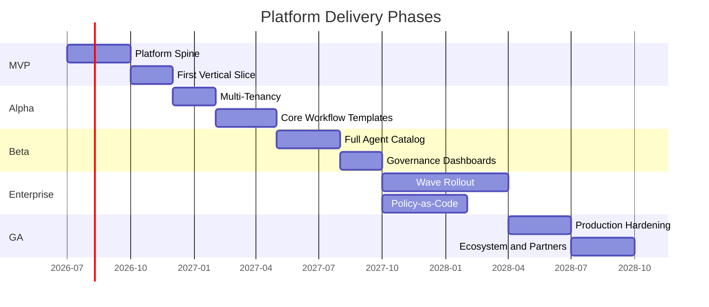
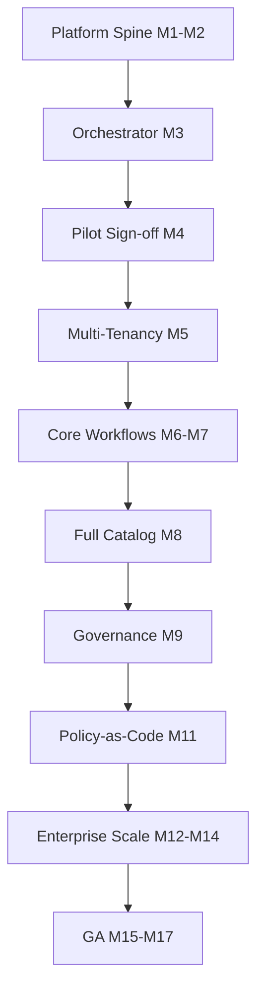

# Agentic Engineering Platform — Roadmap

**Status:** Living document  
**Version:** 1.1 (extends Architecture Baseline v2.0)  
**Last updated:** 1 July 2026  
**Derived from:** Reference Architecture v1.0 Section 14 · [CONSTITUTION.md](CONSTITUTION.md) · [VISION.md](./VISION.md)  
**Baseline:** [docs/architecture/ARCHITECTURE_BASELINE_V2.md](docs/architecture/ARCHITECTURE_BASELINE_V2.md)

---

## Architecture Baseline v2.0 milestone

**Completed (July 2026):** Architecture stabilisation before implementation resume — Platform Primitives, Contracts, Meta Model, UX Model, Glossary, philosophy whitepaper, Baseline v2, changelog, implementation readiness. See [docs/architecture/ARCHITECTURE_CHANGELOG_V2.md](docs/architecture/ARCHITECTURE_CHANGELOG_V2.md).

**Next:** PI-01 spine completion → PI-02+ per phases below. Metadata Engine, Provider Builder, and Marketplace land in PI-08–PI-10 per baseline gap register.

---

## Release Phases Overview

| Phase | RA Stage | Theme | Duration (est.) |
|-------|----------|-------|-----------------|
| MVP | 0–1 | Platform spine + first vertical slice | 5 months |
| Alpha | 2 + partial 3 | Multi-tenancy + core workflows | 5 months |
| Beta | 3–4 | Full agent catalog + governance | 5 months |
| Enterprise | 4–5 | Org-wide rollout + policy-as-code | 6 months |
| GA | Post-5 | Production hardening + ecosystem | 6 months |

---

## MVP

**Goal:** Prove the platform spine under real load with one pilot team on one real workflow.

### Scope

| Deliverable | RA Reference |
|-------------|--------------|
| Event Bus (publish/subscribe) | Section 3, 5.4, 10 |
| Task Queue (durable, persisted state) | Section 5.5, 8 |
| Agent Registry (capability-based discovery) | Section 5.1, 6 |
| Tool Registry (one integration: source control) | Section 5.2, 7 |
| Audit Store (immutable, append-only) | Section 5.7 |
| Orchestrator (State Machine, Agent Selector, Context Assembler, Gate Enforcer) | Section 4 |
| 2–3 specialist agents: Requirement, Coding, Test | Section 11.1 |
| Greenfield workflow template (subset of states) | Section 11.1 |
| 2 human approval gates (scope, merge) | Section 5.6 |
| Basic task-level observability | Section 5.12 |

### Out of Scope

- Multi-tenancy
- Model Router / cost optimisation
- Brownfield, Defect Resolution, or other workflows
- Full agent catalog
- Governance dashboards
- Self-serve UI

### Exit Criteria

- [ ] Pilot team completes end-to-end Greenfield workflow (scope → PR → test report)
- [ ] Full audit trail reconstructable for the workflow run
- [ ] Fourth agent registers without orchestrator code change
- [ ] Platform restart resumes in-progress workflow mid-state
- [ ] Zero gate bypass incidents

### Target: Q4 2026

---

## Alpha

**Goal:** Multi-tenant isolation and core workflow templates before a second business unit onboards.

### Scope

| Deliverable | RA Reference |
|-------------|--------------|
| Namespace isolation (Task Queue, Memory) | Section 5.8 |
| Per-tenant policy configuration | Section 5.8 |
| Per-tenant Model Router quota | Section 5.8, 5.10 |
| Secrets Vault (short-lived scoped tokens) | Section 5.9 |
| RBAC + Policy Engine (separate) | Section 5.9 |
| Cost-Aware Dispatcher / Model Router | Section 4, 5.10 |
| Retry & Compensation Manager (tier 1–2) | Section 5.11 |
| Long-term memory store (vector + metadata) | Section 5.3, 9 |
| Additional Tool Registry entries (issue tracker, CI/CD, security scanner) | Section 5.2 |
| Brownfield workflow template | Section 11.2 |
| Defect Resolution workflow template | Section 11.3 |
| Security and Review agents | Section 11 |
| Time-boxed and open-ended gate support | Section 5.6, 11.3 |

### Exit Criteria

- [ ] Two tenants fully isolated (zero cross-tenant leakage in test suite)
- [ ] Brownfield workflow completes with per-increment rollback
- [ ] Defect resolution workflow with time-boxed gate and automatic rollback
- [ ] Model Router routes tasks to configured tiers
- [ ] Per-tenant quota enforced

### Target: Q2 2027

---

## Beta

**Goal:** Full agent catalog, all workflow templates, governance backed by real data.

### Scope

| Deliverable | RA Reference |
|-------------|--------------|
| All 8 workflow templates | Section 11 |
| Full specialist agent catalog (16+ agents) | Section 11 |
| Feature Enhancement, Security Remediation, Tech Debt, Legacy Migration, Release Management workflows | Section 11.4 |
| Saga compensation (tier 3 failure recovery) | Section 5.11 |
| Org-wide observability dashboard | Section 5.12 |
| DORA metrics aggregation | Section 5.12 |
| Compliance audit export | Section 5.7, 5.12 |
| Self-serve agent invocation UI (basic) | Section 14, Stage 4 |
| Agent SDK (registration, contract validation) | Section 6 |
| Tool SDK (registration, response normalisation) | Section 7 |

### Exit Criteria

- [ ] All 8 workflow types operational with at least one completed run each
- [ ] Governance dashboard populated with real workflow history
- [ ] Third-party agent registers via SDK without platform code changes
- [ ] Platform shape stable — no new containers required
- [ ] 5+ teams onboarded

### Target: Q3 2027

---

## Enterprise

**Goal:** Org-wide rollout with policy-as-code and wave-based team onboarding.

### Scope

| Deliverable | RA Reference |
|-------------|--------------|
| Policy-as-code library | Section 5.9, 14 Stage 4 |
| Advanced RBAC (per-gate, per-workflow) | Section 5.9 |
| Wave-based team onboarding tooling | Section 14, Stage 5 |
| Per-tenant cost attribution and reporting | Section 5.10 |
| Rate limiting per tool per tenant | Section 7 |
| High-availability deployment (multi-AZ) | Section 12 |
| Disaster recovery (workflow state recovery) | Section 5.5, 5.11 |
| Partner agent certification process | Section 5.1, 6 |
| Legacy Migration + Release Management at scale | Section 11.4 |

### Exit Criteria

- [ ] 20+ teams onboarded in waves
- [ ] Policy-as-code governs agent actions across all tenants
- [ ] HA deployment validated (single-AZ failure, zero workflow loss)
- [ ] Per-tenant cost reports available
- [ ] 1,000+ engineers active

### Target: Q1 2028

---

## GA (General Availability)

**Goal:** Production-hardened platform ready for 5,000+ engineer scale. Ecosystem and partner agents.

### Scope

| Deliverable | RA Reference |
|-------------|--------------|
| Performance benchmarks published | Section 13 |
| Security audit / penetration test passed | Section 5.9 |
| SLA definitions (uptime, MTTR for platform) | Section 5.11 |
| Agent marketplace / certified partner catalog | Section 5.1 |
| Cost optimisation recommendations | Section 5.10 |
| Cross-workflow analytics | Section 5.12 |
| Full documentation suite | All sections |
| Constitutional compliance certification | CONSTITUTION.md |
| Reference implementation open-sourced (optional) | Section 14 |

### Exit Criteria

- [ ] 5,000+ engineers across 50+ teams
- [ ] Platform shape unchanged since Beta
- [ ] 99.9% platform uptime over 90 days
- [ ] Zero constitutional violations in production audit
- [ ] Third-party review confirms 10-year architecture validity

### Target: Q3 2028

---

## Milestones

| # | Milestone | Phase | Date (target) | Dependency |
|---|-----------|-------|---------------|------------|
| M1 | Event Bus operational | MVP | 2026-08 | — |
| M2 | Agent Registry accepts first agent | MVP | 2026-09 | M1 |
| M3 | First workflow run with audit trail | MVP | 2026-10 | M1, M2 |
| M4 | Pilot team sign-off | MVP | 2026-11 | M3 |
| M5 | Multi-tenant isolation proven | Alpha | 2027-01 | M4 |
| M6 | Brownfield workflow complete | Alpha | 2027-02 | M5 |
| M7 | Defect resolution with auto-rollback | Alpha | 2027-03 | M5 |
| M8 | All 8 workflows operational | Beta | 2027-06 | M6, M7 |
| M9 | Governance dashboard live | Beta | 2027-07 | M8 |
| M10 | 5 teams onboarded | Beta | 2027-08 | M9 |
| M11 | Policy-as-code deployed | Enterprise | 2027-12 | M10 |
| M12 | 20 teams onboarded | Enterprise | 2028-02 | M11 |
| M13 | HA/DR validated | Enterprise | 2028-03 | M12 |
| M14 | 1,000 engineers active | Enterprise | 2028-04 | M13 |
| M15 | Security audit passed | GA | 2028-06 | M14 |
| M16 | 5,000 engineers active | GA | 2028-09 | M15 |
| M17 | Constitutional compliance certified | GA | 2028-09 | M16 |

---

## Risks

| Risk | Likelihood | Impact | Mitigation |
|------|-----------|--------|------------|
| Agent quality insufficient for enterprise trust | High | High | Model Router tier routing; human gates at every critical transition; track AI accuracy metrics |
| Inference cost exceeds budget at scale | Medium | High | Per-tenant quota; cost_class per agent; task-level cost attribution; tier differentiation |
| Pilot success does not generalise to other teams | Medium | High | Stage 0 spine before agents; Stage 2 tenancy before multi-team; constitutional invariants prevent pilot-specific hacks |
| Regulatory environment blocks AI in production | Medium | High | Immutable audit; named approvers; non-bypassable gates; governance-first positioning |
| Key model provider changes API/pricing | Medium | Medium | Model Independence principles; endpoints as configuration; no model names in contracts |
| O(n²) agent coupling introduced via shortcuts | Medium | Critical | Constitution A1 enforced in CI; Agent Registry-only extension; architecture review checklist |
| Multi-tenancy retrofitted after shared state | Low | Critical | Stage 2 before second team (constitutional requirement G4) |
| Governance dashboards built before data exists | Medium | Medium | Stage 4 only after Stages 0–3 (constitutional requirement G2) |
| Talent: platform engineering skills scarce | Medium | Medium | Reference Architecture as onboarding doc; Agent/Tool SDKs reduce specialist knowledge |
| Competitor ships "good enough" enterprise agentic | Medium | Medium | Differentiate on governance, audit, vendor neutrality — not demo speed |

---

## Dependencies

### Internal Dependencies

### External Dependencies

| Dependency | Required by | Risk if unavailable |
|------------|-------------|-------------------|
| Cloud provider (Azure or AWS) | MVP | Deployment blocked |
| Kubernetes / container runtime | MVP | No agent scaling |
| Source control API (GitHub or Azure DevOps) | MVP | No Coding Agent integration |
| LLM provider API | Alpha | No agent intelligence |
| Identity provider (Entra ID or IAM) | Alpha | No RBAC |
| Issue tracker API | Alpha | No Requirement Agent integration |
| CI/CD platform API | Alpha | No Test Agent integration |
| Security scanner API (Snyk/SonarQube) | Beta | No Security Agent |
| Vector store (pgvector/OpenSearch) | Alpha | No long-term memory |
| Terraform | MVP | No portable IaC |

---

## Release Strategy

### Versioning

- **Platform:** Semantic versioning (contract-centric). Major = breaking contract change. Minor = additive. Patch = fix.
- **Agents:** Independent versioning with `contract_version` declared at registration.
- **Workflow templates:** Independently versioned. In-flight runs complete on the version they started.

### Release Cadence

| Phase | Cadence | Channel |
|-------|---------|---------|
| MVP | Bi-weekly | Internal pilot only |
| Alpha | Monthly | Internal + 2 design partners |
| Beta | Monthly | Early adopter tenants |
| Enterprise | Monthly (platform) / bi-weekly (agents) | Production tenants |
| GA | Monthly (platform) / independent (agents) | All tenants |

### Deployment Model

- **Platform containers:** Rolling update with workflow-state durability guarantee. In-flight workflows MUST survive platform updates.
- **Agents:** Independent deployment. New agent version registers in Agent Registry. Old version deregistered after migration window.
- **Workflow templates:** New version for new runs only. In-flight runs are not affected.
- **Configuration (tools, models, policies):** Hot-reload where possible. Breaking config changes require tenant notification.

### Rollback Policy

- Platform rollback: revert to prior container version. Durable task state ensures workflow resumption.
- Agent rollback: deregister new version, re-register prior version. In-flight tasks on new version complete or escalate.
- Workflow template rollback: new runs use prior template version. No effect on in-flight runs.

### Feature Flags

- New workflow templates: enabled per tenant via policy configuration.
- New agents: enabled per tenant via Agent Registry visibility.
- Model tier changes: enabled per tenant via Model Router configuration.
- Feature flags MUST NOT bypass constitutional gates or audit requirements.

---

## Document Relationships

| Document | Relationship |
|----------|---------------|
| [VISION.md](./VISION.md) | Five-year vision this roadmap implements |
| [ARCHITECTURE.md](./ARCHITECTURE.md) | Technical architecture delivered per phase |
| [TASKS.md](./TASKS.md) | Engineering work breakdown per milestone |
| [CONSTITUTION.md](CONSTITUTION.md) | Invariants that constrain all releases |
| [DECISIONS.md](./DECISIONS.md) | Decision records for roadmap changes |

---

*This is a living document. Update milestones and dates as delivery progresses. Phase scope changes that weaken constitutional invariants require a Decision Record.*
