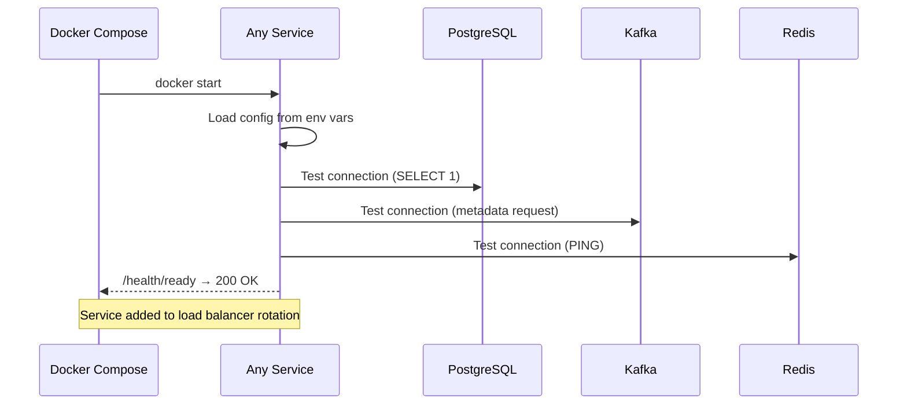
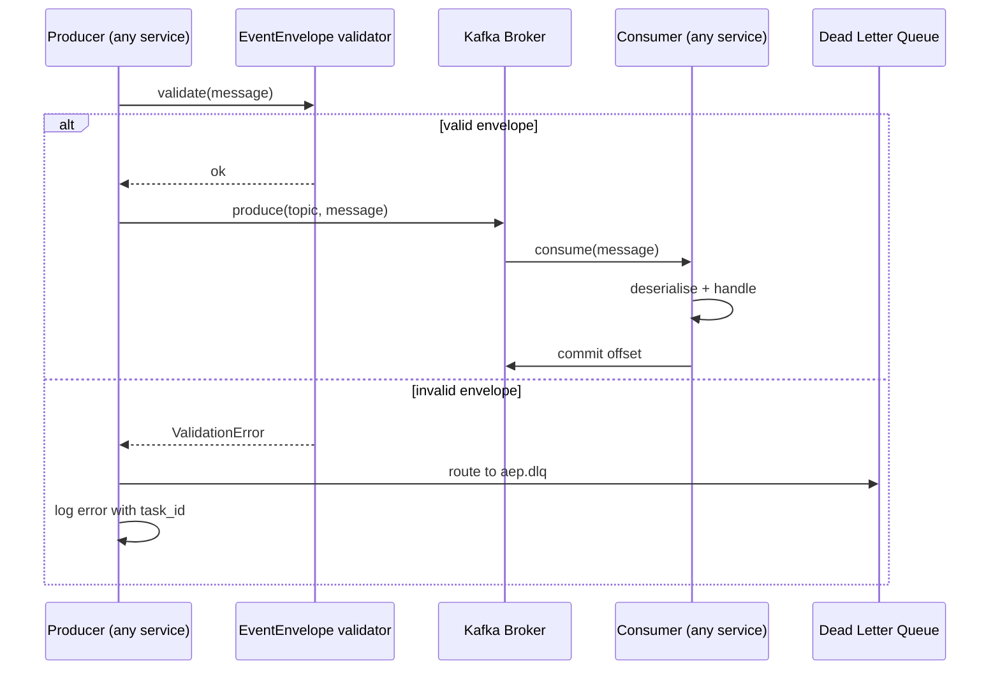
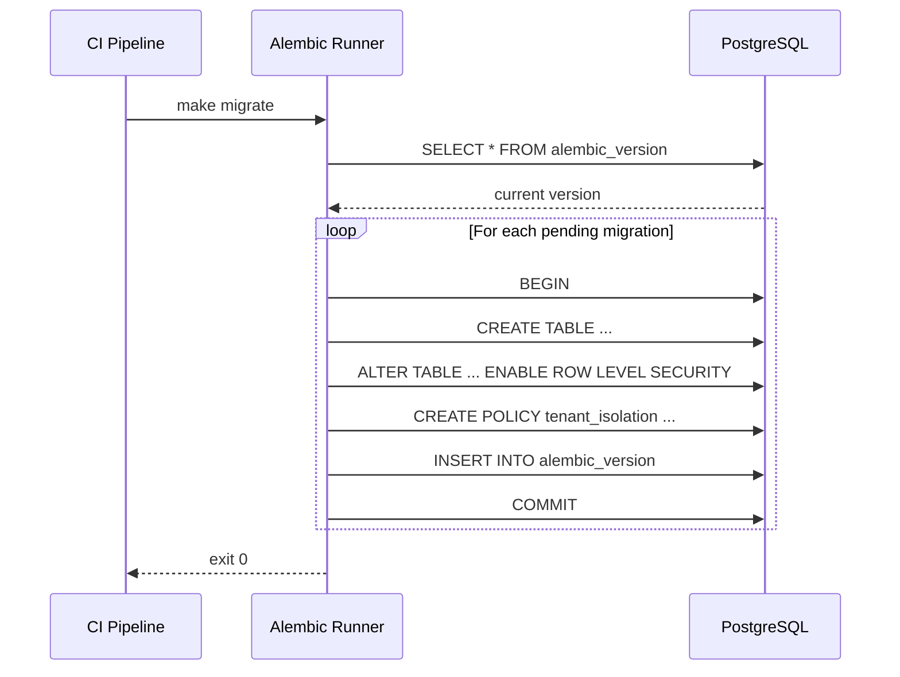

# PI-01 — Sequence Diagrams

## Service Startup Sequence

```mermaid
sequenceDiagram
    participant DC as Docker Compose
    participant SVC as Any Service
    participant DB as PostgreSQL
    participant K as Kafka
    participant R as Redis

    DC->>SVC: docker start
    SVC->>SVC: Load config from env vars
    SVC->>DB: Test connection (SELECT 1)
    SVC->>K: Test connection (metadata request)
    SVC->>R: Test connection (PING)
    SVC-->>DC: /health/ready → 200 OK
    Note over DC,SVC: Service added to load balancer rotation
```

## Kafka Event Round-Trip

```mermaid
sequenceDiagram
    participant P as Producer (any service)
    participant EV as EventEnvelope validator
    participant K as Kafka Broker
    participant C as Consumer (any service)
    participant DLQ as Dead Letter Queue

    P->>EV: validate(message)
    alt valid envelope
        EV-->>P: ok
        P->>K: produce(topic, message)
        K->>C: consume(message)
        C->>C: deserialise + handle
        C->>K: commit offset
    else invalid envelope
        EV-->>P: ValidationError
        P->>DLQ: route to aep.dlq
        P->>P: log error with task_id
    end
```

## Database Migration on Startup

```mermaid
sequenceDiagram
    participant CI as CI Pipeline
    participant MIG as Alembic Runner
    participant DB as PostgreSQL

    CI->>MIG: make migrate
    MIG->>DB: SELECT * FROM alembic_version
    DB-->>MIG: current version
    loop For each pending migration
        MIG->>DB: BEGIN
        MIG->>DB: CREATE TABLE ...
        MIG->>DB: ALTER TABLE ... ENABLE ROW LEVEL SECURITY
        MIG->>DB: CREATE POLICY tenant_isolation ...
        MIG->>DB: INSERT INTO alembic_version
        MIG->>DB: COMMIT
    end
    MIG-->>CI: exit 0
```
