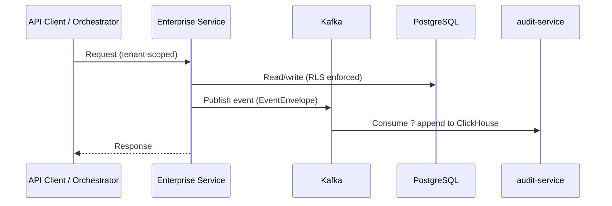
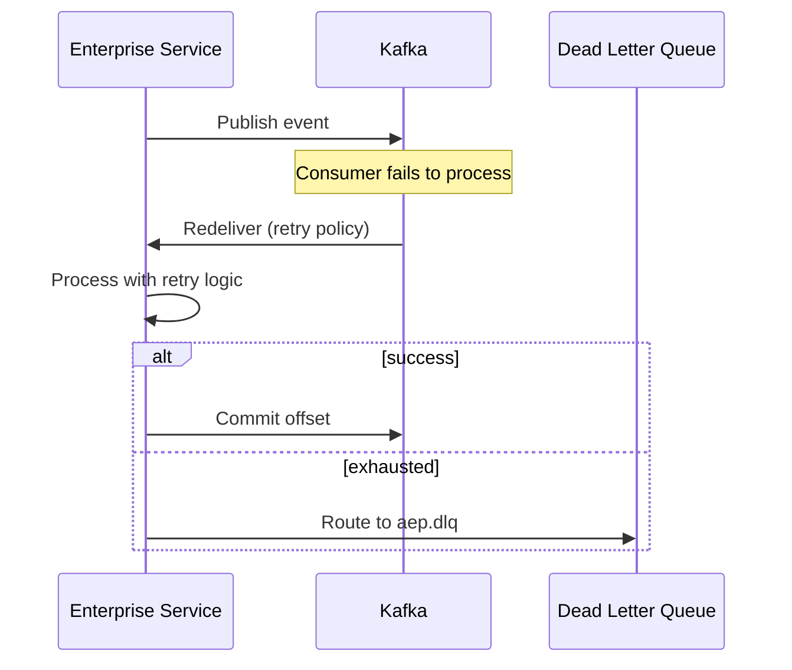

# PI-08-Enterprise — Sequence Diagrams

## Primary Flow

```mermaid
sequenceDiagram
    participant Client as API Client / Orchestrator
    participant SVC as Enterprise Service
    participant KAFKA as Kafka
    participant DB as PostgreSQL
    participant AUD as audit-service

    Client->>SVC: Request (tenant-scoped)
    SVC->>DB: Read/write (RLS enforced)
    SVC->>KAFKA: Publish event (EventEnvelope)
    KAFKA->>AUD: Consume ? append to ClickHouse
    SVC-->>Client: Response
```

## Error / Retry Flow

```mermaid
sequenceDiagram
    participant SVC as Enterprise Service
    participant KAFKA as Kafka
    participant DLQ as Dead Letter Queue

    SVC->>KAFKA: Publish event
    Note over KAFKA: Consumer fails to process
    KAFKA->>SVC: Redeliver (retry policy)
    SVC->>SVC: Process with retry logic
    alt success
        SVC->>KAFKA: Commit offset
    else exhausted
        SVC->>DLQ: Route to aep.dlq
    end
```

See docs/artifacts/TECHNICAL_ARCHITECTURE.md for full platform-level sequence diagrams.
