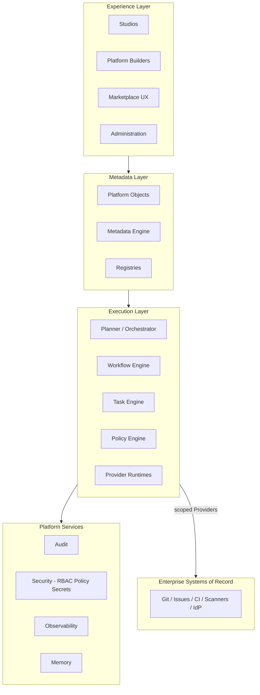
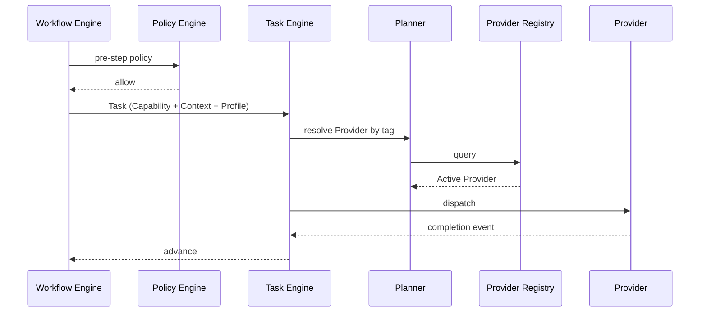

# Agentic Engineering Platform — Architecture Baseline v2.0

**Status:** Normative master reference (implementation baseline)  
**Version:** 2.0  
**Effective:** 1 July 2026  
**Authority:** Subordinate to [CONSTITUTION.md](../../CONSTITUTION.md); supersedes informal interpretations of [ARCHITECTURE.md](../../ARCHITECTURE.md) on platform ontology  
**Audience:** Chief architects, PI leads, engineers, product owners, partners

---

## Document charter

This document is the **master reference for implementation** following Architecture Baseline v2.0 stabilisation. It synthesises normative architecture without replacing specialised documents.

| Read first | Document |
|------------|----------|
| Principles | [CONSTITUTION.md](../../CONSTITUTION.md) |
| Why metadata | [METADATA_DRIVEN_ENTERPRISE_PLATFORM.md](./METADATA_DRIVEN_ENTERPRISE_PLATFORM.md) |
| Vocabulary | [PLATFORM_GLOSSARY.md](./PLATFORM_GLOSSARY.md) |
| Ontology | [PLATFORM_PRIMITIVES.md](./PLATFORM_PRIMITIVES.md) |
| Behaviour | [PLATFORM_CONTRACTS.md](./PLATFORM_CONTRACTS.md) |
| Metadata representation | [PLATFORM_META_MODEL.md](./PLATFORM_META_MODEL.md) |
| Experience | [PLATFORM_UX_MODEL.md](./PLATFORM_UX_MODEL.md) |
| v2 delta | [ARCHITECTURE_V2_CHANGE_SUMMARY.md](./ARCHITECTURE_V2_CHANGE_SUMMARY.md) |
| Change log | [ARCHITECTURE_CHANGELOG_V2.md](./ARCHITECTURE_CHANGELOG_V2.md) |
| Readiness | [IMPLEMENTATION_READINESS.md](./IMPLEMENTATION_READINESS.md) |

**No production code** is specified herein.

---

## Table of contents

1. [Executive summary](#1-executive-summary)
2. [Platform vision](#2-platform-vision)
3. [Platform philosophy](#3-platform-philosophy)
4. [Architecture principles](#4-architecture-principles)
5. [Platform layers](#5-platform-layers)
6. [Platform Objects](#6-platform-objects)
7. [Platform Primitives](#7-platform-primitives)
8. [Platform Contracts](#8-platform-contracts)
9. [Metadata Engine](#9-metadata-engine)
10. [Execution Engine](#10-execution-engine)
11. [Provider Model](#11-provider-model)
12. [Provider Builder](#12-provider-builder)
13. [Workflow Model](#13-workflow-model)
14. [Execution Profile Model](#14-execution-profile-model)
15. [Marketplace](#15-marketplace)
16. [Solution Packs](#16-solution-packs)
17. [Commercial Packs](#17-commercial-packs)
18. [Entitlements](#18-entitlements)
19. [Platform Services](#19-platform-services)
20. [Security](#20-security)
21. [Governance](#21-governance)
22. [Observability](#22-observability)
23. [Configuration hierarchy](#23-configuration-hierarchy)
24. [Composition model](#24-composition-model)
25. [Versioning](#25-versioning)
26. [Lifecycle](#26-lifecycle)
27. [Relationship model](#27-relationship-model)
28. [Runtime execution](#28-runtime-execution)
29. [Deployment view](#29-deployment-view)
30. [Scalability](#30-scalability)
31. [Extensibility](#31-extensibility)
32. [Reference architecture](#32-reference-architecture)
33. [Future evolution](#33-future-evolution)
34. [Architecture gap register](#34-architecture-gap-register)

---

## 1. Executive summary

The Agentic Engineering Platform is a **metadata-driven enterprise orchestration platform** for software engineering. Customers compose an **Engineering Operating System** — Studios, Workflows, Providers, Policies, Execution Profiles, and Packs — **without modifying platform source code**.

**Baseline v2.0** formalises discoveries from Architecture v2:

- **Platform Object** as universal base class for all definable entities
- **Provider Model** as first-class abstraction (AI agents, connectors, humans, scripts, APIs, MCP, automation)
- **Execution Profiles** replacing ad hoc model routing
- **Provider Builder** and **Marketplace** for customer and partner extension
- **Metadata Engine** as the publishing and resolution authority
- **Governance and observability by default** on every object

Implementation resumes against this baseline. [ARCHITECTURE.md](../../ARCHITECTURE.md) container topology remains valid; **ontology and customer extension model** are defined here and in sibling `docs/architecture/` standards.

---

## 2. Platform vision

See [VISION.md](../../VISION.md). Baseline v2 adds:

> Enterprises orchestrate people, AI, tools, and governance through **declared metadata**, not per-tenant platform forks — at Salesforce-class configurability for engineering process.

The platform remains a **coordination layer**, not a new system of record. It scales from pilot teams to global engineering organisations with the **same engines** and **different metadata**.

---

## 3. Platform philosophy

| Principle | Baseline v2 meaning |
|-----------|---------------------|
| **Metadata over code** | Customer intent in versioned Platform Objects; engines interpret |
| **Configuration over customization** | Assemble objects via Builders and Packs; no Platform Core forks |
| **Composition over hardcoding** | Solution Packs and Workflows compose primitives |
| **Platform over framework** | Governed product with lifecycle, audit, entitlements — not embeddable library |
| **Governance by default** | Versioning, approval, publishing, rollback on every object |
| **Observability by default** | Events, metrics, logs, traces, audit, health, cost, usage — no exemptions |
| **Everything measurable** | Usage and cost meters on execution paths |
| **Everything auditable** | Immutable records for mutations and material executions |
| **Everything configurable** | Layered configuration within Entitlement and Policy bounds |

Detail: [METADATA_DRIVEN_ENTERPRISE_PLATFORM.md](./METADATA_DRIVEN_ENTERPRISE_PLATFORM.md).

---

## 4. Architecture principles

Validated against enterprise requirements (see [§34 Gap register](#34-architecture-gap-register)):

| Principle | Status in v2 docs | Implementation alignment |
|-----------|-------------------|-------------------------|
| Metadata-driven platform | ✅ Normative | ⚠️ Metadata Engine not yet built |
| Configuration over customization | ✅ Normative | ⚠️ Builders mostly future |
| Platform Object abstraction | ✅ Normative | ⚠️ Schemas partial |
| Provider Model | ✅ Normative | ⚠️ Agent/Tool contracts legacy names |
| Execution Profiles | ✅ Normative | ⚠️ Model Router in code/docs |
| Provider Builder | ✅ UX + primitives | ❌ Not implemented |
| Marketplace / Packs / Entitlements | ✅ Normative | ❌ PI-08+ |
| Observability / Governance / Audit | ✅ Normative | 🟡 PI-01 partial |
| Multi-tenancy / Security | ✅ CONSTITUTION + ARCHITECTURE | 🟡 PI-08 |
| Lifecycle / Versioning / Inheritance / Composition | ✅ Normative | ⚠️ Partial in workflows only |

**Constitutional invariants unchanged:** Agents never call agents; Orchestrator plans; registry extension; human gates; event bus; tenant isolation.

### Enterprise principles coverage (validation)

| Principle | Doc coverage | Implementation | Gap ID |
|-----------|--------------|----------------|--------|
| Metadata Driven Platform | ✅ Philosophy, META_MODEL, BASELINE | ❌ Metadata Engine | G-01 |
| Configuration over Customization | ✅ PRIMITIVES §1.2, CONTRACTS | ⚠️ No Builders yet | G-07 |
| Composition over Hardcoding | ✅ Solution Packs, Workflows | 🟡 JSON workflows only | G-09 |
| Platform Object | ✅ PRIMITIVES §3, CONTRACTS CR-16 | ⚠️ No envelope schema | G-05 |
| Provider Model | ✅ PRIMITIVES §5.1, §6.4 | ⚠️ agent/tool contracts split | G-02 |
| Execution Profiles | ✅ PRIMITIVES §6.5, UX §9 | ⚠️ Model Router in code | G-04 |
| Provider Builder | ✅ UX §10, PRIMITIVES | ❌ Not implemented | G-07 |
| Marketplace | ✅ META_MODEL §12 | ❌ Not implemented | G-06 |
| Solution Packs | ✅ PRIMITIVES §4.12, §6.11 | 🟡 Docs only | G-06 |
| Commercial Packs | ✅ PRIMITIVES §6.12 | 🟡 Docs only | G-10 |
| Entitlements | ✅ PRIMITIVES §6.13, CONTRACTS §16 | ❌ Runtime checks | G-10 |
| Observability | ✅ PRIMITIVES §3.8, CONTRACTS §13 | 🟡 PI-01 partial | — |
| Governance | ✅ PRIMITIVES §4.13, CONTRACTS §14 | 🟡 PI-07 planned | — |
| Audit | ✅ CONSTITUTION E2–E3, Audit Store | 🟡 PI-07 planned | — |
| Metrics | ✅ Observability contract | 🟡 PI-01 partial | — |
| Lifecycle | ✅ PRIMITIVES §3.4 | 🟡 Workflows partial | G-09 |
| Versioning | ✅ CONTRACTS §15 | ✅ Contract semver | — |
| Inheritance | ✅ META_MODEL §5, PRIMITIVES §4.6 | ⚠️ Engine not built | G-01 |
| Composition | ✅ PRIMITIVES §4.7, META_MODEL §7 | 🟡 Pack docs only | G-06 |
| Multi-tenancy | ✅ CONSTITUTION MT1–MT3, ARCHITECTURE | 🟡 PI-08 planned | — |
| Security | ✅ CONSTITUTION S1–S4, CONTRACTS §11 | 🟡 PI-07/08 | — |
| Scalability | ✅ BASELINE §30, META_MODEL §1.4 | 🟡 Spine in progress | — |

**Validation result:** All 22 enterprise principles are **normatively documented**. Four have **Critical/High implementation gaps** (G-01, G-02, G-04, G-06/G-07) tracked in [§34](#34-architecture-gap-register). Documentation passes; runtime lags by design until PI-08/09.

---

## 5. Platform layers



| Layer | Owns | Does not own |
|-------|------|--------------|
| **Experience** | Authoring UX, Object Inspector, dashboards | Business logic execution |
| **Metadata** | Publish, validate, resolve, registry index | Task dispatch |
| **Execution** | Workflow progression, task dispatch, policy eval | Customer-specific branching in core |
| **Platform services** | Cross-cutting security, audit, observability, memory | Domain workflows |

---

## 6. Platform Objects

Every definable entity inherits the **Platform Object envelope**: identity, metadata, configuration, lifecycle, relationships, security, observability, governance, versioning.

**Rule:** No parallel type hierarchies. Thirteen **primitive roles** specialise the envelope.

Detail: [PLATFORM_PRIMITIVES.md](./PLATFORM_PRIMITIVES.md) §3; [PLATFORM_GLOSSARY.md](./PLATFORM_GLOSSARY.md).

---

## 7. Platform Primitives

Exactly thirteen primitives:

| Primitive | Purpose |
|-----------|---------|
| Studio | Domain product module |
| Capability | Routable unit of work (capability tag) |
| Workflow | Event-driven process state machine |
| Provider | Backend advertising capabilities |
| Execution Profile | How execution runs (models, prompts, budget, retry) |
| Policy | Machine-evaluable rules |
| Context | Scoped knowledge bundle for execution |
| Resource | Metered platform asset |
| Artifact | Durable execution output |
| Plugin | Engine extension hook |
| Solution Pack | Composed solution metadata |
| Commercial Pack | SKU and licensing definition |
| Entitlement | Tenant grant of commercial/technical rights |

**Lexical compatibility:** *Agent* = `provider_kind: ai-agent`. *Connector* = `provider_kind: connector`. Neither is a fourteenth primitive.

---

## 8. Platform Contracts

Contracts define **how every Platform Object behaves** at API, persistence, registry, and UI boundaries — lifecycle, audit, observability, validation, security, commercial checks.

Implementation contracts today: [contracts/](../../contracts/) (agent, tool, task, memory, event schemas v1.0.0). **Gap:** unified Platform Object / Provider schemas — see [§34](#34-architecture-gap-register).

Detail: [PLATFORM_CONTRACTS.md](./PLATFORM_CONTRACTS.md).

---

## 9. Metadata Engine

**Responsibilities:** Object Registry, Schema Registry, validation, inheritance, composition, dependency resolution, configuration overrides, publishing, discovery, runtime resolution, lifecycle management.

**Non-responsibilities:** Execute capabilities; call external APIs; bypass Policy Engine.

Produces **Execution Plan Documents** for the Planner. Materialises **effective_configuration**.

Detail: [PLATFORM_META_MODEL.md](./PLATFORM_META_MODEL.md) §3.

---

## 10. Execution Engine

| Component | Role |
|-----------|------|
| **Planner (Orchestrator)** | Workflow coordination, gate enforcement, **Provider selection by capability tag** |
| **Workflow Engine** | State machine execution from Workflow metadata |
| **Task Engine** | Task dispatch, retry, timeout, correlation |
| **Policy Engine** | Policy evaluation at enforcement points |
| **Provider runtimes** | Agent Runtime (ai-agent), connector workers, human queues, etc. |

Event-mediated coordination only ([CONSTITUTION.md](../../CONSTITUTION.md) P3).

Detail: [ARCHITECTURE.md](../../ARCHITECTURE.md); [PLATFORM_PRIMITIVES.md](./PLATFORM_PRIMITIVES.md) §4.10.

---

## 11. Provider Model

Generic **Provider** primitive with `provider_kind`: `ai-agent`, `connector`, `human`, `script`, `rest-api`, `container`, `mcp`, `automation`, `marketplace`, `partner`.

| Concept | Rule |
|---------|------|
| Discovery | By **capability tag**, never hard-coded provider name in orchestration |
| Connectors | Provider Plugins; Marketplace install; auto-register |
| Agents | Product language for ai-agent Providers |
| Tool Registry | Implementation view for connector/rest Providers satisfying tool-like capabilities |

Detail: [PLATFORM_PRIMITIVES.md](./PLATFORM_PRIMITIVES.md) §5.1, §6.4.

---

## 12. Provider Builder

Guided authoring of Provider metadata without Platform Core changes. Templates for all provider kinds. Output: Draft → Published Provider objects validated by Metadata Engine.

Detail: [PLATFORM_UX_MODEL.md](./PLATFORM_UX_MODEL.md) §10.0.

---

## 13. Workflow Model

**Workflow** = published state machine. **Workflow Node** = step binding Capability + optional Execution Profile + gates. **Workflow Template** = reusable published pattern (Marketplace / Solution Pack).

Runtime: Workflow Engine + Planner; tasks created per node; events advance state.

Workflow files: [workflows/](../../workflows/). Detail: [PLATFORM_PRIMITIVES.md](./PLATFORM_PRIMITIVES.md) §6.3.

---

## 14. Execution Profile Model

Reusable object defining **how** Capabilities execute:

- Preferred, fallback, consensus model strategies
- Prompt Profiles, Context Policies
- Budget, latency, quality, retry strategy
- Resource class

Replaces ad hoc Model Router configuration in **authoring**; Model Registry remains runtime catalogue for tier resolution.

Detail: [PLATFORM_PRIMITIVES.md](./PLATFORM_PRIMITIVES.md) §6.5.

---

## 15. Marketplace

Distributes **metadata and plugins only** — never business logic or Platform Core binaries.

| Distributes | Install effect |
|-------------|----------------|
| Provider Plugins, Workflow/Policy Plugins | Registry update via Metadata Engine |
| Execution Profiles, Knowledge Packs | Published objects |
| Solution Packs, Studio Extensions | Composed object graphs |

Detail: [PLATFORM_META_MODEL.md](./PLATFORM_META_MODEL.md) §12.

---

## 16. Solution Packs

Versioned compositions: Engineering, Industry, Team, Customer, Partner packs. Members: Studios, Capabilities, Providers, Policies, Workflows, Execution Profiles, Knowledge, Dashboards, Reports, Templates, Plugins.

Detail: [PLATFORM_PRIMITIVES.md](./PLATFORM_PRIMITIVES.md) §4.12, §6.11.

---

## 17. Commercial Packs

Define licensing, feature availability, studio/marketplace access, profile/provider/pack allowlists, connector limits, usage limits, support levels. **Produce Entitlements.**

Detail: [PLATFORM_PRIMITIVES.md](./PLATFORM_PRIMITIVES.md) §6.12.

---

## 18. Entitlements

Tenant grants enabling Active objects and runtime execution in production. Checked before activation and execution.

Detail: [PLATFORM_PRIMITIVES.md](./PLATFORM_PRIMITIVES.md) §6.13; [PLATFORM_CONTRACTS.md](./PLATFORM_CONTRACTS.md) §16.

---

## 19. Platform Services

Baseline v2 maps to deployment containers/services ([ARCHITECTURE.md](../../ARCHITECTURE.md), [REFERENCE_ARCHITECTURE.md](./REFERENCE_ARCHITECTURE.md)):

| Service / container | Baseline v2 role |
|---------------------|------------------|
| Orchestrator | Planner |
| Task Queue & Workflow Engine | Workflow + Task execution |
| Agent Runtime | Host for ai-agent Providers |
| Agent Registry | Typed index of ai-agent Providers |
| Tool Registry | Typed index of connector/tool Providers |
| Memory Store | Context assembly + durable memory |
| Audit Store | Immutable audit |
| Platform Services | Approval, Policy, Secrets, Observability, Model Registry |
| Event Bus | Sole inter-container coordination |
| **Metadata Engine** (future) | Publish, resolve, registry canonical index |
| **config-service** (PI-08) | Effective configuration materialisation |

---

## 20. Security

| Concern | Mechanism |
|---------|-----------|
| Authentication | Identity provider integration |
| Authorisation | RBAC — separate from Policy and Secrets |
| Policy | Policy Engine — machine rules |
| Secrets | Vault references only — never in metadata |
| Tenant isolation | `tenant_id` on every query and message |
| Least privilege | Provider scope; tool scope ceiling |

Detail: [CONSTITUTION.md](../../CONSTITUTION.md) S1–S4; [PLATFORM_CONTRACTS.md](./PLATFORM_CONTRACTS.md) §11.

---

## 21. Governance

Unified model: versioning, approval, publishing, rollback, audit, ownership, dependencies, validation, security, lifecycle. Human gates non-bypassable.

Detail: [PLATFORM_PRIMITIVES.md](./PLATFORM_PRIMITIVES.md) §4.13; [PLATFORM_CONTRACTS.md](./PLATFORM_CONTRACTS.md) §14.

---

## 22. Observability

Mandatory per object: events, metrics, logs, distributed traces, audit records, health, cost, usage, performance, correlation IDs.

Detail: [PLATFORM_PRIMITIVES.md](./PLATFORM_PRIMITIVES.md) §3.8; [PLATFORM_CONTRACTS.md](./PLATFORM_CONTRACTS.md) §13.

---

## 23. Configuration hierarchy

```
vendor defaults
  → Commercial Pack edition defaults
    → Solution Pack defaults
      → tenant overrides
        → environment overrides
          → object overrides
          = effective_configuration
```

Detail: [PLATFORM_META_MODEL.md](./PLATFORM_META_MODEL.md) §6.

---

## 24. Composition model

| Pattern | Use |
|---------|-----|
| **Inheritance** | Specialise Capability, Policy, Provider, Profile, Studio |
| **Composition** | Solution Pack, Workflow references |
| **Reference** | Non-owning links (Workflow → Profile) |

Max composition depth enforced at publish.

Detail: [PLATFORM_PRIMITIVES.md](./PLATFORM_PRIMITIVES.md) §4.6–4.7.

---

## 25. Versioning

- Platform Objects: semver; Published immutable
- Contract schemas: independent version stream
- Workflow templates: versioned files ([workflows/](../../workflows/))
- Packs: pin member versions

Detail: [PLATFORM_CONTRACTS.md](./PLATFORM_CONTRACTS.md) §15.

---

## 26. Lifecycle

Draft → Review → Approved → Published → Active → Deprecated → Retired → Archived (all objects).

Detail: [PLATFORM_PRIMITIVES.md](./PLATFORM_PRIMITIVES.md) §3.4.

---

## 27. Relationship model

Typed associations: contains, grants, references, specialises. Exposed via APIs, Relationships tab, Object Explorer graph.

Detail: [PLATFORM_PRIMITIVES.md](./PLATFORM_PRIMITIVES.md) §7; [PLATFORM_CONTRACTS.md](./PLATFORM_CONTRACTS.md) §9.

---

## 28. Runtime execution



---

## 29. Deployment view

Sixteen microservices, event bus, data tier — see [REFERENCE_ARCHITECTURE.md](./REFERENCE_ARCHITECTURE.md). Baseline v2 does not change deployment topology; adds **Metadata Engine** service as future container when implemented.

Kubernetes/Terraform: [docs/reference/blueprints/](../reference/blueprints/).

---

## 30. Scalability

| Dimension | Strategy |
|-----------|----------|
| Tenants | Partition by `tenant_id` |
| Metadata | Registry sharding; immutable Published blobs |
| Execution | Horizontal agent/runtime replicas; Kafka throughput |
| Resolution | Cached effective configuration |

Detail: [PLATFORM_META_MODEL.md](./PLATFORM_META_MODEL.md) §1.4.

---

## 31. Extensibility

| Mechanism | Delivers |
|-----------|----------|
| Provider Builder | Tenant Providers |
| Marketplace | Certified metadata + plugins |
| Solution Packs | Composed primitives |
| Plugins | Engine hooks |

**Forbidden:** Orchestrator modification for new agents; per-tenant core forks.

Detail: [PLATFORM_META_MODEL.md](./PLATFORM_META_MODEL.md) §13.

---

## 32. Reference architecture

### Document stack (normative read order)

1. [CONSTITUTION.md](../../CONSTITUTION.md)
2. [METADATA_DRIVEN_ENTERPRISE_PLATFORM.md](./METADATA_DRIVEN_ENTERPRISE_PLATFORM.md)
3. [PLATFORM_GLOSSARY.md](./PLATFORM_GLOSSARY.md)
4. [PLATFORM_PRIMITIVES.md](./PLATFORM_PRIMITIVES.md)
5. [PLATFORM_CONTRACTS.md](./PLATFORM_CONTRACTS.md)
6. [PLATFORM_META_MODEL.md](./PLATFORM_META_MODEL.md)
7. [PLATFORM_UX_MODEL.md](./PLATFORM_UX_MODEL.md)
8. **This document** (implementation baseline)
9. [ARCHITECTURE.md](../../ARCHITECTURE.md) (containers)
10. [REFERENCE_ARCHITECTURE.md](./REFERENCE_ARCHITECTURE.md) (diagrams)

### PI alignment

| PI | Baseline v2 focus |
|----|-------------------|
| PI-01 | Spine + observability foundation |
| PI-02 | ai-agent Provider runtime |
| PI-03 | Planner; capability-tag Provider resolution |
| PI-04 | Memory + Context |
| PI-05 | Provider/connector registry (Tool Registry view) |
| PI-06 | Engineering agent Providers |
| PI-07 | Policy, audit, governance |
| PI-08 | Multi-tenancy, config, Entitlements, Marketplace prep |
| PI-09 | Builders, Object Explorer, Developer Experience |
| PI-10 | GA, partner ecosystem |

**Engineering roadmap alignment:** [ARCHITECTURE_ALIGNMENT_REPORT.md](../engineering/architecture-alignment/ARCHITECTURE_ALIGNMENT_REPORT.md) — PI classifications, story impacts, implementation order.

---

## 33. Future evolution

- Metadata Engine as first-class container
- Provider Contract schema unifying agent + tool registration
- Execution Profile schema in contracts/
- Marketplace operational in PI-08/09
- ADR-025+ for Provider Model and Metadata Engine (proposed in changelog)

Platform Core remains stable; vocabulary grows through glossary governance.

---

## 34. Architecture gap register

| ID | Gap | Severity | Current state | Desired state | Business value | Implementation impact | Affected documents | Affected PI | Migration strategy |
|----|-----|----------|---------------|---------------|----------------|----------------------|-------------------|-------------|-------------------|
| G-01 | No Metadata Engine service | **Critical** | Metadata docs only; config in services ad hoc | Central publish/resolve/registry | Customer metadata without code forks | New container + APIs; PI-08/09 | META_MODEL, BASELINE | PI-08, PI-09 | Phase 1: config-service; Phase 2: full ME |
| G-02 | Provider Contract schema missing | **Critical** | agent-contract + tool-contract separate | Unified provider-contract.schema.json | Provider Model in validation CI | New schema; registry merge path | contracts/, CONTRACTS | PI-02, PI-05, PI-06 | Add schema v2; map agent/tool as kinds |
| G-03 | ARCHITECTURE.md agent-centric | **High** | Nine containers; lexical mapping added | Baseline v2 cross-reference; Provider lexical map | Single ontology for implementers | Doc + comments only | ARCHITECTURE.md | All | ✅ § Baseline v2 lexical mapping |
| G-04 | Model Router vs Execution Profile | **High** | ADR-012; model-router service | Profiles in metadata; router as resolver | Governed AI cost/quality | Profile metadata store; router reads profiles | PRIMITIVES, TECH_ARCH | PI-02, PI-06 | Router becomes profile resolver |
| G-05 | No Platform Object API schema | **High** | Per-contract schemas | platform-object.schema.json envelope | Generic SDK/UI | New schema + validation | contracts/, CONTRACTS | PI-09 | Add envelope schema MINOR |
| G-06 | Marketplace not implemented | **High** | Architecture only | Install pipeline + ME integration | Partner ecosystem | PI-08/09/10 scope | META_MODEL, UX | PI-08, PI-10 | Blueprint → PI stories |
| G-07 | Builders not implemented | **High** | UX model only | Studio designers | Configuration over customization | Frontend PI-09 | UX_MODEL | PI-09 | Builder MVP per primitive |
| G-08 | TECH_ARCH Model Routing section | **Medium** | §24 + §24.1 Execution Profile evolution | Execution Profile model documented | Align diagrams | Doc update | TECHNICAL_ARCHITECTURE | PI-06 | ✅ §24.1 added; v1 diagram retained |
| G-09 | Workflow metadata vs JSON files | **Medium** | greenfield-v1.0.0.json file | Workflow Platform Objects in registry | Full metadata-driven workflows | Workflow Engine reads registry | workflows/, PRIMITIVES | PI-03 | Dual path: file → object migration |
| G-10 | Entitlement runtime checks | **Medium** | Commercial docs only | Enforcement in activation/execute | Revenue protection | Platform Services extension | CONTRACTS | PI-08 | Entitlement service + checks |
| G-11 | ADR for Provider Model | **Medium** | ADR-025–027 in DECISIONS.md | Decision traceability | DECISIONS.md entry | DECISIONS | — | ✅ ADR-025–027 accepted |
| G-12 | PI prompt mappings lack v2 context | **Low** | PI-01–04, 06–08, 10 updated | Baseline v2 reference in context lines | Correct AI-assisted impl | Prompt mapping headers | PI-*/PROMPT_MAPPING | All | ✅ Surgical PI updates; PI-05 on touch |
| G-13 | Skills reference agent-only patterns | **Low** | .ai/skills implement-story | Glossary + baseline in skills | Consistent AI dev | Skill header links | .ai/skills | — | Update skill references |
| G-14 | Single workflow template | **Low** | greenfield only | Brownfield + more templates | Domain coverage | workflows/ | ROADMAP | PI-03+ | Add templates per roadmap |

---

*Architecture Baseline v2.0 is the implementation master reference. When documents conflict on ontology, this baseline and PLATFORM_PRIMITIVES prevail. When documents conflict on containers, ARCHITECTURE.md and TECHNICAL_ARCHITECTURE prevail until Metadata Engine container is added via ADR.*
