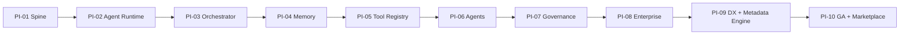

# Implementation Readiness Assessment

**Status:** Architecture gate review  
**Version:** 1.0  
**Effective:** 1 July 2026  
**Baseline:** [ARCHITECTURE_BASELINE_V2.md](./ARCHITECTURE_BASELINE_V2.md)  
**Audience:** Engineering leadership, PI leads, architects

---

## Executive conclusion

The repository is **ready to resume implementation** against **Architecture Baseline v2.0** for **continued PI-01 spine work** and **planned PI-02+ delivery**, with **documented blockers** for full metadata-driven customer self-service (Metadata Engine, Provider Contract schema, Builders, Marketplace).

**Overall readiness score: 72 / 100** — architecture stabilised; implementation lags ontology by design.

---

## Scoring summary

| Dimension | Score | Weight | Weighted | Status |
|-----------|-------|--------|----------|--------|
| Architecture | 92 | 20% | 18.4 | ✅ Stabilised v2 |
| Documentation | 88 | 15% | 13.2 | ✅ Comprehensive |
| Repository structure | 78 | 10% | 7.8 | 🟡 Mature docs; early code |
| Contracts | 55 | 15% | 8.25 | ⚠️ v1 schemas only |
| Skills | 70 | 5% | 3.5 | 🟡 Agent-centric wording |
| Prompt library | 72 | 5% | 3.6 | 🟡 PI mappings need v2 context |
| Platform design | 90 | 15% | 13.5 | ✅ Primitives, UX, glossary |
| Governance | 85 | 10% | 8.5 | ✅ Constitution + contracts |
| Developer experience | 65 | 5% | 3.25 | 🟡 PI-01 in progress | 
| **Total** | | **100%** | **72.0** | |

---

## 1. Architecture — 92 / 100

**Strengths**

- Complete normative stack: CONSTITUTION, PLATFORM_PRIMITIVES v2, CONTRACTS v2, META_MODEL v2, UX_MODEL v2
- [ARCHITECTURE_BASELINE_V2.md](./ARCHITECTURE_BASELINE_V2.md) master reference with gap register
- [PLATFORM_GLOSSARY.md](./PLATFORM_GLOSSARY.md) official vocabulary
- [METADATA_DRIVEN_ENTERPRISE_PLATFORM.md](./METADATA_DRIVEN_ENTERPRISE_PLATFORM.md) philosophy for all stakeholders
- Gap register with severity and migration strategy

**Gaps**

- [ARCHITECTURE.md](../../ARCHITECTURE.md) and [TECHNICAL_ARCHITECTURE.md](../artifacts/TECHNICAL_ARCHITECTURE.md) still v1 container/agent framing (G-03, G-08) — mitigated by baseline cross-links
- ADR-025+ not yet in DECISIONS.md (G-11)

**Verdict:** ✅ Ready for implementation with baseline as ontology authority.

---

## 2. Documentation — 88 / 100

**Strengths**

- Ten PI folders with objectives, stories, acceptance criteria, prompt mappings
- Eleven blueprints for future capabilities
- Product docs (STUDIO_OVERVIEW, PLATFORM_CORE, DOMAIN_INTERACTION)
- Migration plan and reports

**Gaps**

- PI docs partially pre-v2 terminology
- TECHNICAL_ARCHITECTURE not yet aligned to Execution Profiles

**Verdict:** ✅ Sufficient for PI execution; update PI headers as stories are touched.

---

## 3. Repository structure — 78 / 100

**Strengths**

- `contracts/`, `workflows/`, `docs/04-program/`, `docs/05-blueprints/`, `docs/architecture/`
- `src/` platform services scaffold (PI-01)
- `.ai/commands/` and `.ai/skills/` for AI-assisted development
- `observability/` stack artifacts

**Gaps**

- No `platform/` monolith yet — services under `src/` (intentional per migration plan)
- Metadata Engine not present in codebase

**Verdict:** 🟡 Structure matches current maturity; not final GA layout.

---

## 4. Contracts — 55 / 100

**Strengths**

- agent, tool, task, memory, event schemas v1.0.0
- Validation script and CI contract stage planned

**Gaps (blockers for full v2)**

- No `provider-contract.schema.json` (G-02)
- No `platform-object.schema.json` envelope (G-05)
- No `execution-profile.schema.json`
- agent/tool split predates Provider Model

**Verdict:** ⚠️ Adequate for PI-01–06 spine; **blocker** for Metadata Engine and Provider Builder GA.

---

## 5. Skills — 70 / 100

**Strengths**

- implement-story, generate-tests, security-review, aep-review skills
- Constitutional rules in CLAUDE.md

**Gaps**

- Skills reference agent/orchestrator patterns without baseline v2 vocabulary (G-13)

**Verdict:** 🟡 Usable; add glossary/baseline links to skill headers in PI-09.

---

## 6. Prompt library — 72 / 100

**Strengths**

- `.ai/commands/` covers implement, review, test, security, release
- PI PROMPT_MAPPING indexes stories to commands

**Gaps**

- PI prompt context lines agent-centric (G-12)

**Verdict:** 🟡 Functional; surgical PI PROMPT_MAPPING updates applied in stabilisation.

---

## 7. Platform design — 90 / 100

**Strengths**

- Thirteen primitives defined
- UX constitution with Object Inspector tabs, Provider Builder, Execution Profile Designer
- Enterprise examples in glossary and philosophy docs

**Gaps**

- Builders exist in UX model only (G-07)

**Verdict:** ✅ Design ready; implementation in PI-09.

---

## 8. Governance — 85 / 100

**Strengths**

- CONSTITUTION immutable principles
- Platform rules PR/CR/MM/UX
- Audit, lifecycle, governance contracts
- PI-07 scoped for policy and gates

**Gaps**

- Entitlement enforcement not implemented (G-10)

**Verdict:** ✅ Governance architecture complete; runtime in PI-07/08.

---

## 9. Developer experience — 65 / 100

**Strengths**

- PI-01 dev-up target, docker compose, Makefile/scripts
- REPOSITORY_GUIDE, CLAUDE.md
- Contract validation tooling

**Gaps**

- PI-01 not complete (16 services health)
- No Object Explorer or Builder UX yet

**Verdict:** 🟡 Resume PI-01; DX designers follow PI-09.

---

## Remaining blockers before full v2 realisation

| Priority | Blocker | Unblocks | Target PI |
|----------|---------|----------|-----------|
| **P0** | Complete PI-01 platform spine | All subsequent PIs | PI-01 |
| **P1** | Provider Contract + Platform Object schemas | Registry unification, validation CI | PI-09 |
| **P1** | Metadata Engine MVP | Publish, resolve, Marketplace install | PI-09 |
| **P2** | Execution Profile storage + Model Router integration | Governed AI execution | PI-06 |
| **P2** | Entitlement runtime checks | Commercial gating | PI-08 |
| **P3** | Marketplace install pipeline | Partner ecosystem | PI-10 |
| **P3** | Provider Builder UX | Customer self-service integrations | PI-09 |

---

## Recommended implementation resume sequence

**Gate criteria to exit architecture-only mode:**

- [x] ARCHITECTURE_BASELINE_V2.md published
- [x] Glossary and philosophy published
- [x] Gap register documented
- [ ] PI-01 Definition of Done met (implementation)
- [ ] provider-contract.schema.json drafted (PI-09 story)

---

## Sign-off checklist

| Stakeholder | Question | Answer |
|-------------|----------|--------|
| Chief Architect | Is ontology stable? | Yes — Baseline v2 |
| PI-01 Lead | Can spine work continue? | Yes |
| PI-09 Lead | Is Builder scope clear? | Yes — UX_MODEL + Baseline |
| Security | Constitution intact? | Yes |
| Product | Can we sell metadata-driven story? | Yes — philosophy + packs docs |

---

*Assessment valid at Architecture Baseline v2.0 stabilisation. Re-score after PI-01 completion and provider-contract schema merge.*
