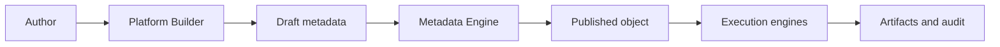
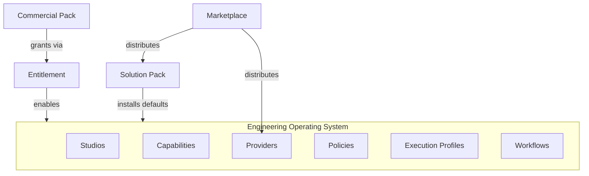
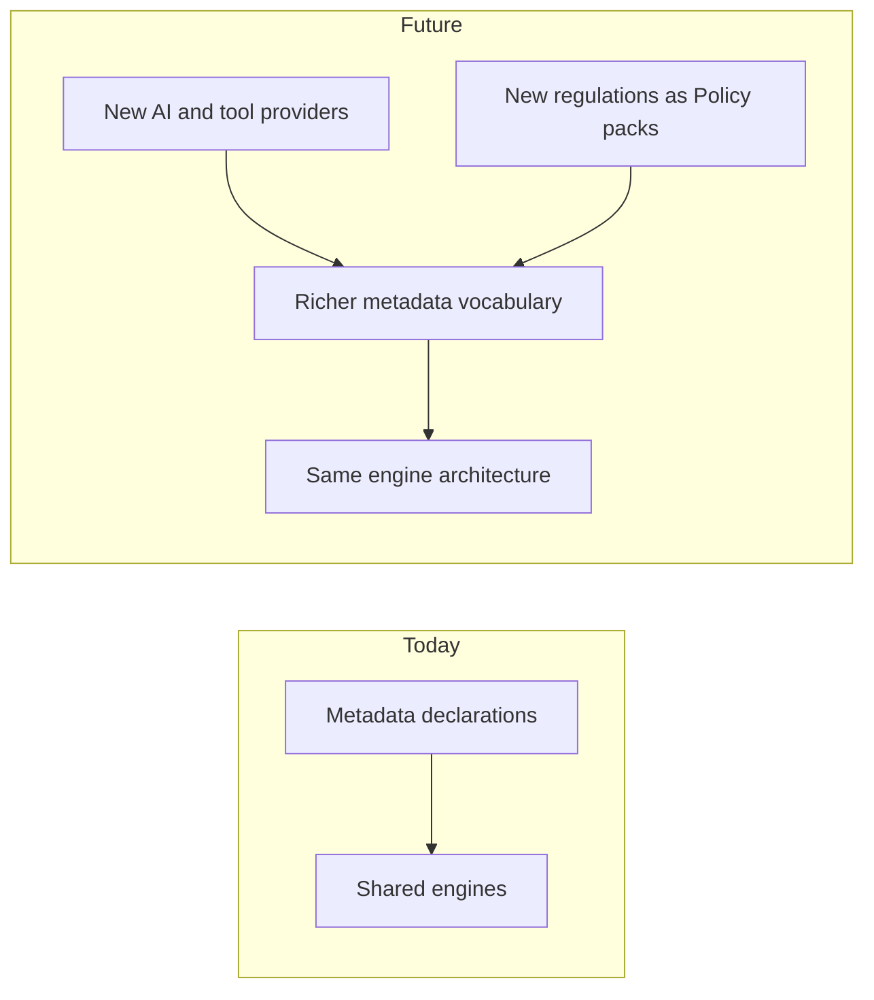

# Metadata-Driven Enterprise Platform

**Status:** Normative platform philosophy  
**Version:** 1.0  
**Effective:** 1 July 2026  
**Architecture release:** Platform Architecture v2  
**Authority:** Subordinate to [CONSTITUTION.md](../../CONSTITUTION.md); companion to [PLATFORM_GLOSSARY.md](./PLATFORM_GLOSSARY.md)  
**Audience:** Every architect, engineer, and product owner working on or with the Agentic Engineering Platform

---

## Document charter

This document explains **why** the Agentic Engineering Platform is built on metadata.

It is **not** implementation guidance. It is **not** structural architecture. It does not prescribe containers, APIs, or databases. For those, see [PLATFORM_PRIMITIVES.md](./PLATFORM_PRIMITIVES.md), [PLATFORM_CONTRACTS.md](./PLATFORM_CONTRACTS.md), [PLATFORM_META_MODEL.md](./PLATFORM_META_MODEL.md), and [PLATFORM_UX_MODEL.md](./PLATFORM_UX_MODEL.md).

This document answers a single strategic question:

> **How can an enterprise build its own Engineering Operating System without modifying platform source code?**

**Required reading** for anyone who designs, builds, sells, or operates on this platform.

**No production code** is specified herein.

---

## Table of contents

1. [Executive summary](#1-executive-summary)
2. [What is metadata?](#2-what-is-metadata)
3. [Platform philosophy](#3-platform-philosophy)
4. [Platform Object](#4-platform-object)
5. [Metadata Engine](#5-metadata-engine)
6. [Platform Builders](#6-platform-builders)
7. [Provider Builder](#7-provider-builder)
8. [Composition](#8-composition)
9. [Marketplace](#9-marketplace)
10. [Enterprise examples](#10-enterprise-examples)
11. [Benefits](#11-benefits)
12. [Future vision](#12-future-vision)

---

## 1. Executive summary

### 1.1 The vision

The Agentic Engineering Platform exists so that **every enterprise can assemble its own Engineering Operating System** — the workflows, integrations, policies, AI execution standards, and governance structures that define how software is conceived, built, tested, secured, and released — **without forking the platform**.

The platform is a **planner and referee**, not a player. It orchestrates the systems of record an organisation already trusts: source control, issue trackers, CI/CD, security scanners, identity providers, and human approval bodies. It introduces no parallel truth. It introduces **coherent process** across those truths.

That coherence is expressed as **metadata**: versioned, governed, tenant-scoped declarations that immutable platform engines interpret at runtime.

### 1.2 Why enterprise platforms evolve through metadata

History shows a predictable pattern. Successful enterprise platforms — whether for customer relationship management, IT service management, or cloud infrastructure — eventually converge on the same architectural bet:

> **Desired behaviour is declared. The platform reconciles reality to the declaration.**

Early products encode process in application code. Each new customer segment becomes a branch. Each regulatory regime becomes an emergency release. Each new integration becomes a patch. Scale collapses into combinatorial complexity. Engineering cost grows linearly with customer count; innovation slows.

Mature platforms invert the model. **Engines are shared and versioned by the vendor. Objects are composed and versioned by the customer.** A bank and a startup run the same engines. They run different metadata.

The Agentic Engineering Platform applies this lesson to **engineering orchestration in the age of AI**. AI agents, human reviewers, external APIs, and automation platforms are not hard-wired into orchestrator code. They are **Providers** — registered metadata that advertises what they can do. Workflows do not live in deployment pipelines as scripts. They are **published state machines** that the Workflow Engine executes. Policies are not `if` statements buried in services. They are **first-class objects** evaluated by a Policy Engine.

Metadata is therefore not a convenience feature. It is the **foundation** that makes the platform an enterprise product rather than a bespoke integration project per tenant.

### 1.3 What this means for you

| Role | Implication |
|------|-------------|
| **Architect** | Design compositions of Platform Objects, not forks of Platform Core |
| **Engineer** | Implement engines that interpret metadata; resist tenant-specific code paths |
| **Product owner** | Ship Builders and templates that produce metadata; measure adoption in Published objects |
| **Customer** | Own your Engineering Operating System as configuration you can audit, version, and rollback |
| **Partner** | Distribute metadata packs and Provider Plugins, not platform patches |

---

## 2. What is metadata?

### 2.1 Simple definition

**Metadata**, on this platform, is **declarative description of intent** — who owns a workflow, what capability it invokes, which approval is required, which AI execution standard applies, which integration satisfies a task — stored as **versioned Platform Objects**, not as custom source code.

Metadata answers **what should happen**. Platform engines answer **how it happens safely, observably, and at scale**.

### 2.2 Metadata is not code

| Code | Metadata |
|------|----------|
| Requires compile, deploy, and rollback of binaries | Requires publish, activate, and optional rollback of versions |
| Hides intent in logic branches | Surfaces intent in inspectable objects |
| Forks per customer | Composes per customer |
| Audited through log archaeology | Audited through object history and approval records |

Customers do not "program" the platform in a general-purpose language. They **author** metadata through guided Builders, import certified packs from the Marketplace, and inherit defaults from their edition. Advanced users may export JSON; they are never required to.

### 2.3 Business examples: change without code

#### Changing a workflow

A release manager needs a new human gate before production deployment.

**Without metadata:** raise a change request, wait for engineering capacity, modify orchestration service, pass security review, deploy through the platform release train, hope nothing regresses for other tenants.

**With metadata:** open the Workflow Builder, add an approval node, attach the existing CAB Policy, submit for review, publish version 2.3.0, activate in staging, validate, activate in production. Prior version remains available for rollback. Audit trail records approver and reason.

#### Changing an AI model

An architecture team wants premium models for design work and economy models for routine test generation.

**Without metadata:** patch agent configurations, redeploy agent containers, update scattered prompt files, reconcile drift across environments.

**With metadata:** publish two Execution Profiles — `premium-architecture` and `economy-test` — with preferred and fallback model strategies, prompt bindings, and cost ceilings. Workflow nodes reference profiles by name. Model routing changes propagate wherever the profile is referenced. No Platform Core change.

#### Changing an approval policy

A compliance officer requires dual approval for any Policy marked critical.

**Without metadata:** embed conditional logic in multiple services; risk inconsistent enforcement.

**With metadata:** publish a single Policy object with a rule evaluated at publish and execute enforcement points. Policy Engine denies transitions that lack required Approval records. Governance and Audit tabs show enforcement history.

### 2.4 The customer promise

> **If your intent can be stated as engineering process, integration scope, or governance rule, it belongs in metadata — not in a platform fork.**

---

## 3. Platform philosophy

These principles are non-negotiable. They are expanded normatively in [PLATFORM_PRIMITIVES.md](./PLATFORM_PRIMITIVES.md) §1 and [PLATFORM_GLOSSARY.md](./PLATFORM_GLOSSARY.md) §2.

### 3.1 Metadata over code

**Meaning:** Behaviour, composition, and policy are declared in versioned metadata. Immutable engines interpret declarations. Customer-specific outcomes never require modifications to Platform Core source.

**Enterprise example:** A global insurer operates in twelve countries. Each jurisdiction has different release documentation requirements. Instead of twelve platform branches, they publish twelve Workflow variants and one shared Capability catalog — same engines, different metadata. When the vendor upgrades the Workflow Engine, all twelve variants benefit without merge conflicts.

### 3.2 Configuration over customization

**Meaning:** Customers **assemble** Studios, Providers, Workflows, Execution Profiles, and Packs from metadata. They do not **customize** the platform through source forks, orchestrator patches, or per-tenant engine builds.

**Enterprise example:** A retail bank's security team authors a REST Provider for an internal fraud API using Provider Builder. The Provider advertises a new capability tag. Development Workflows reference the tag. No vendor ticket. No platform redeploy. The Provider passes the same validation, lifecycle, and audit rules as vendor-shipped Connectors.

### 3.3 Composition over hardcoding

**Meaning:** Complex outcomes arise from **composing** primitives — Solution Packs bundle Workflows, Policies, Providers, and Profiles — not from embedding domain logic in engines.

**Enterprise example:** A systems integrator ships a `regulated-banking-engineering` Solution Pack to five clients. Each client activates the pack, then layers Team Packs for squad-specific namespaces. The integrator maintains one metadata product line, not five codebases.

### 3.4 Platform over framework

**Meaning:** The product is a governed **orchestration platform** with identity, lifecycle, audit, observability, commercial entitlements, and human gates — not a library that customers embed and self-assemble.

**Enterprise example:** A startup could stitch together scripts, webhooks, and chatbots. An enterprise cannot — it needs tenant isolation, immutable audit, approval records, and cost attribution across thousands of engineers. The platform provides that infrastructure once; metadata provides the variation.

### 3.5 Governance by default

**Meaning:** Every definable entity participates in versioning, approval, publishing, rollback, ownership, dependency validation, and audit. No primitive opts out.

**Enterprise example:** A healthcare organisation publishes a Workflow that touches protected health information. Risk level is `critical`. Governance routes the transition through dual approval. The Approval record is immutable. Regulators can reconstruct the decision chain from audit objects, not from log files.

### 3.6 Observability by default

**Meaning:** Every Platform Object automatically emits events, metrics, logs, distributed traces, audit records, health signals, cost, and usage. No team adds bespoke instrumentation for a new Capability.

**Enterprise example:** An SRE investigates a failed release. Correlation IDs link a Workflow run to Tasks, Provider invocations, and Policy denials across a single trace — without requesting custom dashboards from the team that authored the Workflow.

### 3.7 Everything measurable

**Meaning:** Usage and cost attach to execution paths and objects. Executives and FinOps see engineering AI spend by Capability, Profile, and Studio — not a single opaque invoice.

**Enterprise example:** A CTO compares cost per merged feature across two Execution Profiles and retires the profile with poor quality-to-cost ratio — a product decision backed by platform meters, not anecdote.

### 3.8 Everything auditable

**Meaning:** Mutations and material executions produce append-only audit records. Approval without audit is void.

**Enterprise example:** An internal audit samples change management for SOX. Auditors query Approval and Publish events for Policies and Workflows in the release path. Evidence is structural, not reconstructed from chat logs.

### 3.9 Everything configurable

**Meaning:** Within Entitlement and Policy bounds, behaviour changes through metadata layers — edition defaults, pack defaults, tenant overrides, environment overrides — merged deterministically into effective configuration.

**Enterprise example:** Production uses stricter Context Policies than development. The same Published Workflow runs in both environments; environment configuration changes redaction and token limits without a second Workflow version.

---

## 4. Platform Object

### 4.1 One object model

Every definable platform entity — a Workflow, a GitHub integration, an approval rule, a commercial edition — is a **Platform Object**: a shared envelope of identity, metadata, configuration, lifecycle, relationships, security, observability, governance, and versioning.

**Platform Primitive** is the **role** an object plays: Studio, Capability, Workflow, Provider, Execution Profile, Policy, Context, Resource, Artifact, Plugin, Solution Pack, Commercial Pack, or Entitlement. There are exactly thirteen primitives. There is one object model.

This matters because **infrastructure behaves identically at the boundary**. An operator who learns to publish a Policy already knows how to publish a Workflow. An API client that lists Versions works for every primitive. An auditor who reads Audit tabs applies the same literacy everywhere.

### 4.2 Why common behaviour inheritance wins

Without a universal object model, every team invents its own lifecycle, audit shape, and permission model. Integrations become bespoke. Governance cannot be centralised. Training cost explodes.

With Platform Objects, **specialisation is in domain semantics, not infrastructure**. A Capability describes routable work. A Workflow describes process order. Both transition Draft → Review → Approved → Published → Active the same way. Both appear in Object Explorer. Both emit the same observability dimensions.

### 4.3 Examples in business language

| Object | What the business sees | What metadata captures |
|--------|------------------------|-------------------------|
| **Workflow** | "How we deliver a feature from idea to production" | States, gates, Capability bindings, Execution Profile references |
| **Capability** | "What work can be requested" — e.g. create a pull request | Stable capability tag, contracts, cost class |
| **Provider** | "Who or what performs the work" — AI, human, API, script | Provider kind, advertised capabilities, scope, auth handles |
| **Connector** | Product language for an integration Provider — e.g. GitHub | Same as Provider; `connector` kind; Marketplace install |
| **Policy** | "Rules the platform enforces automatically" | Rules, enforcement points, severity |
| **Execution Profile** | "How AI and tools run — cost, quality, models, prompts" | Model strategy, prompt profiles, context policy, budget, retry |
| **Solution Pack** | "A starter kit for an industry or team" | Manifest of composed Workflows, Policies, Providers, Studios |
| **Commercial Pack** | "What we purchased" | Edition, limits, marketplace access, support level → Entitlements |

### 4.4 The architectural sentence

> **Primitives are nouns. Platform Objects are the grammar every noun must speak.**

Detail: [PLATFORM_PRIMITIVES.md](./PLATFORM_PRIMITIVES.md) §3; terminology: [PLATFORM_GLOSSARY.md](./PLATFORM_GLOSSARY.md).

---

## 5. Metadata Engine

The **Metadata Engine** is the subsystem that makes metadata trustworthy. It does not execute engineering work — it **materialises truth** for engines that do.

Think of it as the **publishing house and library** of the platform: manuscripts are validated, editions are frozen, catalogues are indexed, and readers receive resolved copies for runtime.

### 5.1 Responsibilities in business terms

| Responsibility | What it means for the enterprise |
|----------------|----------------------------------|
| **Configuration** | Merges edition, pack, tenant, and environment layers into effective settings operators can preview before activation |
| **Validation** | Blocks publish when schemas, dependencies, policies, or business rules fail — defects caught before production |
| **Composition** | Expands Solution Packs and Workflow graphs; verifies pins and depth limits |
| **Inheritance** | Resolves parent-child specialisation — e.g. a Java-specific Capability extending a general backend Capability |
| **Discovery** | Powers search, Object Explorer, and capability-tag lookup for Planner resolution |
| **Runtime resolution** | Produces execution plans when Workflows start — which Profile, which Provider binding, which Policy attachments |
| **Publishing** | Freezes immutable Published versions; prevents silent mutation of production intent |
| **Registry** | Maintains the canonical catalogue of objects and typed indexes Providers and Workflows consume |

### 5.2 What the Metadata Engine refuses to do

It does not call external APIs. It does not execute agents. It does not bypass the Policy Engine. It does not read across tenants. Those boundaries keep **declaration** separate from **execution** — the same separation that lets Salesforce upgrade metadata interpreters without running your business logic in their publishing pipeline.

Detail: [PLATFORM_META_MODEL.md](./PLATFORM_META_MODEL.md) §3.

---

## 6. Platform Builders

### 6.1 The Builder concept

A **Platform Builder** is a guided authoring experience — visual designer, wizard, or structured form — that produces **valid Platform Object metadata**. Builders are how metadata-driven platforms stay approachable: authors rarely write raw JSON; they **configure** outcomes.

**Every major Platform Object should have a Builder.** Builders generate metadata, not platform source code. Output flows through the Metadata Engine validation and publishing pipelines like any other authoring path.

### 6.2 Builder catalogue

| Builder | Creates | Author persona |
|---------|---------|----------------|
| **Studio Builder** | Studio objects — domain modules, namespaces, default navigation | Platform product / partner |
| **Capability Builder** | Capability definitions — tags, contracts, cost class | Domain architect |
| **Workflow Builder** | Workflow graphs — nodes, gates, Capability bindings | Process owner, engineering lead |
| **Provider Builder** | Provider registrations — integrations, agents, humans, APIs | Integration engineer, partner |
| **Policy Builder** | Policy rules — enforcement points, conditions | Compliance, security |
| **Execution Profile Builder** | Profiles — models, prompts, budget, retry | AI operations, architect |
| **Context Builder** | Context templates — knowledge sources, assembly rules | Architect, tech lead |
| **Resource Builder** | Resource quotas — model capacity, connection limits | Platform admin, FinOps |
| **Solution Pack Builder** | Pack manifests — composed primitives for a outcome | Partner, platform product |
| **Commercial Pack Builder** | SKU definitions — edition, limits, feature gates | Product management, finance |
| **Dashboard Builder** | Dashboard metadata — widgets bound to Metrics | Studio owner, SRE |
| **Marketplace Publisher** | Signed distribution packages — packs, Provider Plugins | Partner, vendor certification |

### 6.3 How Builders preserve the philosophy

1. Author uses Builder — no repository access to Platform Core required.
2. Builder emits Draft Platform Object metadata.
3. Metadata Engine validates, governs, and publishes.
4. Engines interpret Published metadata at runtime.
5. Observability and Audit record outcomes automatically.

**Builders are the UX expression of configuration over customization.**

Detail: [PLATFORM_UX_MODEL.md](./PLATFORM_UX_MODEL.md).

---

## 7. Provider Builder

Provider Builder deserves special attention because **integrations and AI execution are where enterprises most often asked to fork platforms in the past**.

Provider Builder lets customers and partners create **Provider** Platform Objects — backends that advertise **Capabilities** — without modifying platform source code.

### 7.1 Supported provider kinds

| Kind | Business purpose |
|------|------------------|
| **AI Agents** | LLM or specialist execution for generative and analytical Capabilities |
| **Connectors** | Integrations to systems of record — source control, issues, CI/CD |
| **Humans** | Task queues, CAB boards, specialist review surfaces |
| **Scripts** | Sandboxed automation for normalisation and lightweight tasks |
| **REST APIs** | Generic HTTP integrations without waiting for a certified Connector pack |
| **Containers** | Containerised workloads with declared health and resource class |
| **MCP Servers** | Model Context Protocol tool servers for standardised AI tool access |
| **Automation platforms** | External RPA or orchestration systems participating as Providers |

### 7.2 What authors configure

| Concern | Role in Provider metadata |
|---------|---------------------------|
| **Capabilities** | Tags this Provider satisfies — Planner resolves by tag, never by hard-coded name |
| **Execution Profiles** | Optional defaults when this Provider runs AI work |
| **Policies** | Attachments declaring required compliance scope |
| **Resources** | Quotas and reservations — connection slots, model budget |
| **Context** | Templates for knowledge assembly when this Provider executes |

### 7.3 Marketplace publishing and automatic registration

Partners certify Provider Plugins for Marketplace distribution. On install:

1. Metadata Engine validates the package manifest.
2. Provider metadata registers in the Provider Registry.
3. Connectors and MCP Providers **auto-register** capability advertisements on activation.
4. Entitlement checks enforce connector limits from Commercial Pack.

Tenants configure secrets through vault handles — never embedded in metadata. Health checks confirm connectivity before Active promotion.

### 7.4 The strategic guarantee

> **A customer integration is a Provider object with the same lifecycle, audit, and observability as a vendor-shipped GitHub Connector — not a unsupported script living outside the platform.**

Detail: [PLATFORM_PRIMITIVES.md](./PLATFORM_PRIMITIVES.md) §6.4; [PLATFORM_UX_MODEL.md](./PLATFORM_UX_MODEL.md) §10.0; [PLATFORM_GLOSSARY.md](./PLATFORM_GLOSSARY.md) §3.3.

---

## 8. Composition

### 8.1 Building an Engineering Operating System

An **Engineering Operating System** is not a single Workflow or Studio. It is the **composed set** of metadata objects that defines how an organisation engineers software:

- which **Studios** practitioners use
- which **Capabilities** can be requested
- which **Providers** perform work
- which **Policies** guard mutations and execution
- which **Execution Profiles** govern AI cost and quality
- which **Workflows** orchestrate end-to-end process
- which **Solution Packs** supply industry or team defaults
- which **Commercial Pack** and **Entitlements** bound the above

Enterprises **compose** these objects like instruments in an orchestra — same platform engines, unique arrangement.

### 8.2 Composition patterns

| Pattern | Description |
|---------|-------------|
| **Inherit and specialise** | Child Capability extends parent; child Execution Profile tightens budget |
| **Reference and bind** | Workflow nodes reference Capability tags and Profile ids |
| **Aggregate in packs** | Solution Pack ships a coherent starting Operating System |
| **Layer configuration** | Environment overrides tighten Context Policy in production |
| **Govern and audit** | Policies attach at publish and execute; Approvals attach at gates |

### 8.3 No code path

At no point does composition require:

- patching the Orchestrator
- importing vendor SDKs into agent logic
- deploying a tenant-specific container image of Platform Core

If composition cannot be expressed in metadata, the gap is a **product decision** — a new primitive, Builder, or pack category — not a customer fork.

Detail: [PLATFORM_PRIMITIVES.md](./PLATFORM_PRIMITIVES.md) §9; [PLATFORM_GLOSSARY.md](./PLATFORM_GLOSSARY.md) §7.

---

## 9. Marketplace

### 9.1 Metadata distribution, not application logic

The **Marketplace** is the platform's **distribution channel** for metadata packages and Provider Plugins. It never ships business logic that executes inside Platform Core. It never replaces engines. It **installs declarations** that engines already know how to interpret.

This distinction protects enterprises: certified Marketplace content passes validation and security review; it enters the same registry and lifecycle rules as tenant-authored metadata.

### 9.2 What the Marketplace distributes

| Category | Examples |
|----------|----------|
| Provider Plugins | Connectors, MCP servers, certified agents |
| Workflow Plugins | Reusable Workflow templates |
| Policy Plugins | Compliance rule packs |
| Execution Profiles | Model and prompt standards |
| Knowledge Packs | Context templates |
| Solution Packs | Industry, engineering, and partner bundles |
| Studio and UI Extensions | Studio metadata and presentation Plugins |

### 9.3 Installation, registration, versioning, dependencies

**Installation** begins with Entitlement verification — the tenant's Commercial Pack permits the install. The Metadata Engine validates every contained object, resolves version pins, registers Published metadata, and emits installation events. Typed registries update from those events — **no hardcoded registration** in core services.

**Registration** makes objects discoverable in Object Explorer and resolution paths. Connectors advertise Capabilities automatically on activation.

**Versioning** follows semver immutability. Upgrades install new package versions; Active bindings can roll forward or back with audit.

**Dependencies** form a directed acyclic graph validated at publish — a Workflow cannot reference an unpublished Capability; a pack cannot pin incompatible Profile versions.

> **Marketplace is an app store for declarations, not an escape hatch for executable customisation.**

Detail: [PLATFORM_META_MODEL.md](./PLATFORM_META_MODEL.md) §12; [PLATFORM_UX_MODEL.md](./PLATFORM_UX_MODEL.md) §6.

---

## 10. Enterprise examples

The same platform. Five different Engineering Operating Systems — all metadata, no forks.

### 10.1 Healthcare — `Metro Health`

**Profile:** Regulated clinical software; HIPAA-aware; safety gates on every release.

| Composition choice | Metadata expression |
|--------------------|---------------------|
| Industry defaults | `hipaa-engineering-controls` Industry Pack |
| AI conservatism | `hipaa-conservative` Execution Profile with strict Context Policy |
| Human oversight | Human Provider for clinical safety board on release Workflow |
| Integrations | GitHub Connector + internal EHR REST Provider via Provider Builder |
| Governance | Critical Policies with dual Approval; PHI redaction Context Policy |

**Outcome:** Same Workflow Engine as other tenants; unique Operating System shaped by packs and Policies.

### 10.2 Banking — `First National`

**Profile:** Core banking change; segregation of duties; regulatory evidence.

| Composition choice | Metadata expression |
|--------------------|---------------------|
| Release train | `core-banking-release-train` Workflow with parallel test nodes |
| Consensus AI for architecture | Execution Profile with multi-model strategy for ADR generation |
| Compliance | Policy pack denying deploy without regulatory scan Artifact |
| Integrations | Mainframe Script Provider + GitHub Connector + MCP regulation lookup Provider |
| Commercial limits | Enterprise Entitlement — 50 Connectors, premium Profiles |

**Outcome:** Audit reconstructs every gate and Approval for regulators without custom reporting code.

### 10.3 Government — `National Digital Service`

**Profile:** Public sector procurement; change advisory boards; long retention.

| Composition choice | Metadata expression |
|--------------------|---------------------|
| Process formality | Workflow Templates with mandatory human gates at each stage |
| Data classification | Policies binding Artifact classification and retention |
| Vendor mix | Partner Packs for certified integrations; REST Providers for legacy systems |
| Transparency | Executive Dashboard — delivery velocity and open Policy violations |
| Environment separation | Strict production Configuration overrides on Context and Profiles |

**Outcome:** Multi-year audit retention on immutable Published versions and audit records.

### 10.4 Startup — `Launchpad`

**Profile:** Small team; speed over ceremony; tight AI budget.

| Composition choice | Metadata expression |
|--------------------|---------------------|
| Fast start | `greenfield-saas-starter` Engineering Pack |
| Cost control | `economy-backend` Execution Profile on all implementation nodes |
| Minimal integrations | GitHub Connector from Marketplace; Stripe REST Provider via Provider Builder |
| Studios | Development and Testing Studios only — Professional Entitlement |
| Observability | AI Operations dashboard for cost per feature |

**Outcome:** Full platform governance model at startup scale — no "we'll add compliance later" fork.

### 10.5 Consulting — `Apex Systems Integrator`

**Profile:** Partner delivering repeatable vertical solutions to many clients.

| Composition choice | Metadata expression |
|--------------------|---------------------|
| Product line | Partner Pack per vertical — retail, logistics, insurance |
| Certification | Marketplace Publisher for Provider Plugins and Solution Packs |
| Client tenancy | Each client receives Pack install + Team Pack for custom namespaces |
| Differentiation | Proprietary Connectors as Provider Plugins — not platform patches |
| Revenue | Commercial Packs per client tier; Entitlements provisioned at sale |

**Outcome:** Partner scales metadata products across clients; Platform Core remains single codebase.

---

## 11. Benefits

### 11.1 Business agility

Process changes publish in days — new gates, new integrations, new AI standards — without waiting for vendor engineering queues or internal platform forks.

### 11.2 Reduced cost

One engine codebase serves all tenants. Customer variation is metadata storage and resolution, not duplicate runtime fleets or merge-heavy branches.

### 11.3 Lower maintenance

Vendor upgrades improve interpretation engines; customer metadata migrates through declared rules. Partner packs version independently.

### 11.4 Faster delivery

Solution Packs and Workflow Templates compress time-to-first-value. Builders reduce authoring skill requirements.

### 11.5 Governance

Uniform lifecycle, Approval, and Audit across every object type. Risk level and ownership are fields, not folklore.

### 11.6 Compliance

Policies evaluated centrally; evidence is queryable audit objects; Published immutability preserves point-in-time intent.

### 11.7 Scalability

Tenant partition on metadata; engines scale with execution demand; registry caches materialised effective configuration.

### 11.8 Extensibility

Plugins and Provider Builder extend behaviour through declared hooks — not orchestrator modification.

### 11.9 Partner ecosystem

Marketplace distributes certified metadata products — ISVs and SIs build on the same object model as the vendor.

---

## 12. Future vision

### 12.1 Platform Core stays stable; the vocabulary grows

The future of enterprise engineering will bring new AI models, new tool protocols, new regulatory regimes, and new Studio domains. A metadata-driven platform absorbs that change **at the metadata layer**:

| Future addition | How metadata enables it |
|-----------------|-------------------------|
| New AI model family | Model Registry entry + Execution Profile preferred model list |
| New Provider protocol | New `provider_kind` + Provider Builder template + Marketplace category |
| New engineering domain | New Studio object + Solution Pack + Workflow templates |
| New compliance regime | Policy Plugin + Industry Pack |
| New commercial tier | Commercial Pack + Entitlement template |

**Platform Core engines gain interpretation capability through vendor releases — not through per-customer conditionals.**

### 12.2 The long arc

Enterprises will not ask "can the platform support our process?" They will ask **"which objects do we compose?"** Partners will not ask "can we patch the orchestrator?" They will ask **"which pack do we publish?"**

### 12.3 The commitment

The Agentic Engineering Platform commits to:

1. **Preserving the thirteen-primitive object model** except through governed Decision Records
2. **Investing in Builders** that lower the cost of correct metadata authoring
3. **Certifying Marketplace metadata** so enterprises trust third-party declarations as much as vendor defaults
4. **Never requiring tenant source forks** for customer-specific engineering process

### 12.4 Required reading path

| Order | Document | Why |
|-------|----------|-----|
| 1 | [CONSTITUTION.md](../../CONSTITUTION.md) | Immutable principles |
| 2 | **This document** | Why metadata is the foundation |
| 3 | [PLATFORM_GLOSSARY.md](./PLATFORM_GLOSSARY.md) | Official vocabulary |
| 4 | [PLATFORM_PRIMITIVES.md](./PLATFORM_PRIMITIVES.md) | What exists |
| 5 | [PLATFORM_CONTRACTS.md](./PLATFORM_CONTRACTS.md) | How objects behave |
| 6 | [PLATFORM_META_MODEL.md](./PLATFORM_META_MODEL.md) | How metadata is represented |
| 7 | [PLATFORM_UX_MODEL.md](./PLATFORM_UX_MODEL.md) | How humans author metadata |

---

## Closing statement

The Agentic Engineering Platform is a **metadata-driven enterprise platform** because enterprises do not need another bespoke integration project. They need an **Engineering Operating System they own** — versioned, governed, observable, and composable — running on engines they share with the industry.

Metadata is not a implementation detail. It is the **contract between vendor and customer** about where flexibility lives and where stability is guaranteed.

> **Engines are shared. Objects are yours. Compose your Engineering Operating System.**

---

*This document is normative philosophy. On questions of structure and behaviour, [PLATFORM_PRIMITIVES.md](./PLATFORM_PRIMITIVES.md) and [PLATFORM_CONTRACTS.md](./PLATFORM_CONTRACTS.md) prevail. On vocabulary, [PLATFORM_GLOSSARY.md](./PLATFORM_GLOSSARY.md) prevails.*
