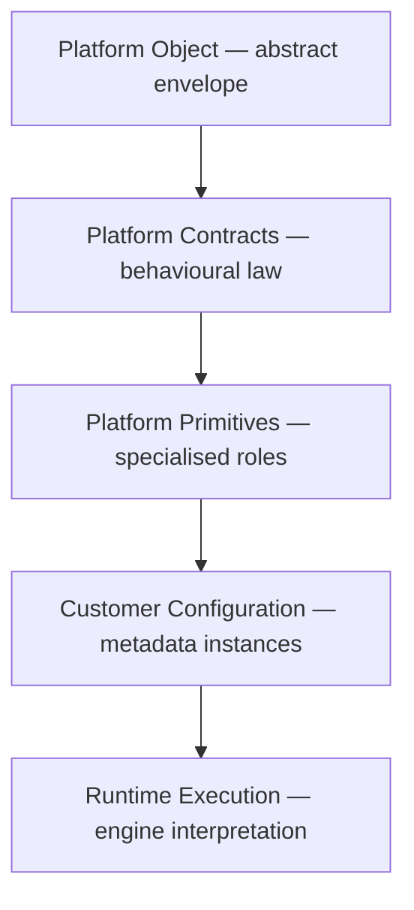
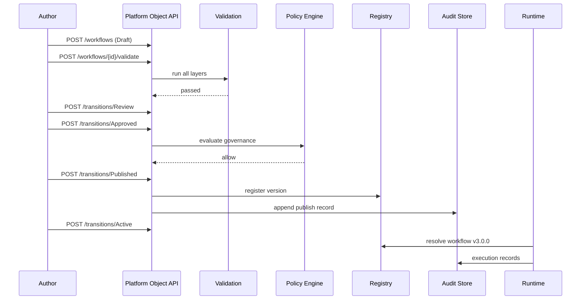

# Agentic Engineering Platform — Platform Contracts

**Status:** Normative behavioural standard  
**Version:** 1.0  
**Effective:** 1 July 2026  
**Authority:** Subordinate to [CONSTITUTION.md](../../CONSTITUTION.md); co-equal with [PLATFORM_PRIMITIVES.md](./PLATFORM_PRIMITIVES.md) on matters of object behaviour  
**Audience:** API designers, SDK authors, registry engineers, persistence architects, Studio UX leads, governance officers, enterprise integrators

---

## Document charter

[PLATFORM_PRIMITIVES.md](./PLATFORM_PRIMITIVES.md) defines **what exists** — the thirteen primitives, the Platform Object envelope, and their relationships.

**This document defines how every Platform Object behaves** — the mandatory contracts that engines, APIs, SDKs, registries, persistence layers, and UI surfaces must honour.

Every **Studio**, **Capability**, **Workflow**, **Provider**, **Connector** (Provider implementation), **Execution Profile**, **Policy**, **Context**, **Resource**, **Artifact**, **Plugin**, **Solution Pack**, **Commercial Pack**, and **Entitlement** **must implement** these contracts.

**Implementation independence:** This standard prescribes observable behaviour and data obligations, not programming languages, frameworks, or storage engines.

**Stability intent:** Contract identifiers, lifecycle transitions, and failure semantics defined here are designed to remain valid for years. Customer behaviour changes through **configuration and metadata**, not through contract mutation.

**No production code** is specified in this document.

---

## Table of contents

1. [Purpose](#1-purpose)
2. [Contract philosophy](#2-contract-philosophy)
3. [Contract hierarchy](#3-contract-hierarchy)
4. [Universal Platform Object Contract](#4-universal-platform-object-contract)
5. [Identity Contract](#5-identity-contract)
6. [Metadata Contract](#6-metadata-contract)
7. [Configuration Contract](#7-configuration-contract)
8. [Lifecycle Contract](#8-lifecycle-contract)
9. [Relationship Contract](#9-relationship-contract)
10. [Dependency Contract](#10-dependency-contract)
11. [Security Contract](#11-security-contract)
12. [Validation Contract](#12-validation-contract)
13. [Observability Contract](#13-observability-contract)
14. [Governance Contract](#14-governance-contract)
15. [Versioning Contract](#15-versioning-contract)
16. [Commercial Contract](#16-commercial-contract)
17. [Runtime Contract](#17-runtime-contract)
18. [Audit Contract](#18-audit-contract)
19. [Extension Contract](#19-extension-contract)
20. [API Contract](#20-api-contract)
21. [Registry Contract](#21-registry-contract)
22. [Persistence Contract](#22-persistence-contract)
23. [UI Contract](#23-ui-contract)
24. [Platform rules](#24-platform-rules)
25. [Examples](#25-examples)
26. [Future evolution](#26-future-evolution)

---

## 1. Purpose

### 1.1 Why platform contracts exist

A metadata-driven platform fails when every team invents its own lifecycle API, audit shape, versioning rules, and observability tags. Integrations become bespoke. SDKs cannot be generic. Governance cannot be centralised. Operators cannot reason about blast radius.

**Platform Contracts** are the **behavioural law** that makes a thousand different Platform Object instances **interchangeable at the infrastructure boundary** while remaining specialised in domain semantics.

Contracts exist so that:

| Stakeholder | Benefit |
|-------------|---------|
| **API designers** | One resource model, one error model, one pagination model |
| **SDK authors** | One client surface for all primitives |
| **Studio UX** | One create/edit/history/approval pattern |
| **Governance** | One approval and audit query model |
| **SRE** | One metrics cardinality model and trace propagation |
| **Customers** | Predictable behaviour across all Studios and packs |

### 1.2 Primitives vs contracts

| Dimension | Platform Primitives | Platform Contracts |
|-----------|---------------------|-------------------|
| **Question answered** | What entities exist in the meta model? | How must every entity behave? |
| **Nature** | Ontology — roles and relationships | Normative behaviour — obligations and failures |
| **Changes when** | New domain concepts are recognised | Platform engines gain cross-cutting capability |
| **Customer impact** | New primitives are rare; introduced via Decision Record | Customer metadata changes; contracts stay stable |
| **Document** | [PLATFORM_PRIMITIVES.md](./PLATFORM_PRIMITIVES.md) | This document |

**Analogy:** Primitives are **nouns**. Contracts are **grammar** — the rules every sentence must follow.

A **Capability** (primitive) declares that routable work exists. The **Lifecycle Contract** (contract) declares that every Capability transitions Draft → Review → … → Retired identically to a Workflow.

### 1.3 Mandatory applicability

No primitive, registry, microservice, or Studio module may:

- Expose a alternate lifecycle state machine
- Emit audit records in a private format
- Version objects outside semver rules defined here
- Skip validation at publish or runtime boundaries
- Bypass Policy Engine evaluation where contracts require it

Violation is a **contract defect**, not a local implementation choice.

---

## 2. Contract philosophy

### 2.1 Metadata-driven behaviour

The platform separates **engines** (immutable vendor code) from **objects** (customer and vendor metadata). Contracts bind **engines to objects**:

```
Customer changes metadata → engines re-interpret → behaviour changes
Customer never changes contracts → engines remain compatible
```

**Business behaviour changes through configuration.** Contracts **never** change for individual customer implementations.

### 2.2 Consistency guarantee

Contracts guarantee that an operator who understands one Platform Object understands **all** Platform Objects at the infrastructure boundary:

- Same lifecycle verbs
- Same audit query parameters
- Same correlation ID propagation
- Same permission evaluation order
- Same version resolution algorithm

Domain-specific Studio UX may add fields and wizards; it may **not** replace contract behaviour.

### 2.3 Failure philosophy

| Principle | Meaning |
|-----------|---------|
| **Fail closed** | Ambiguous security, validation, or commercial state → deny |
| **Fail explicit** | Every denial includes machine code + human reason |
| **Fail auditable** | Every denial emits audit + metric |
| **Fail recoverable** | Where contracts allow rollback, rollback is deterministic |

### 2.4 Contract stability

Contracts version independently of primitive metadata:

- **Contract MAJOR** — breaking API or behavioural semantics; requires migration tooling
- **Contract MINOR** — additive obligations (new optional telemetry field)
- **Contract PATCH** — clarifications with no behavioural change

Customer Published object versions are unaffected by Contract PATCH and MINOR.

---

## 3. Contract hierarchy



| Layer | Responsibility | Mutable by customer? |
|-------|----------------|----------------------|
| **Platform Object** | Universal sections every instance carries | No — structure fixed |
| **Platform Contracts** | How sections behave | No — only via platform release |
| **Platform Primitives** | Domain role + additional metadata keys | No — ontology fixed |
| **Customer Configuration** | Values, bindings, compositions | Yes — within contract rules |
| **Runtime Execution** | Tasks, events, traces | Ephemeral — engines produce |

**Derivation rule:** Every API route, SDK method, database table, and UI screen **must declare** which contract clauses it implements.

---

## 4. Universal Platform Object Contract

Every Platform Object **must** implement all sub-contracts below. Sub-contracts are **not optional modules** — they are facets of one object.

### 4.1 Contract index

| Sub-contract | Clause ID | Purpose (summary) |
|--------------|-----------|-------------------|
| Identity | `C-ID` | Stable, unique, tenant-scoped identification |
| Metadata | `C-MD` | Extensible descriptive and technical facts |
| Configuration | `C-CF` | Layered, inheritable effective config |
| Lifecycle | `C-LC` | Universal state machine |
| Relationships | `C-RL` | Graph of parent, child, reference, composition |
| Dependencies | `C-DP` | Versioned prerequisite DAG |
| Security | `C-SC` | RBAC, secrets, visibility, least privilege |
| Observability | `C-OB` | Automatic telemetry emission |
| Governance | `C-GV` | Approval, compliance, retention |
| Versioning | `C-VS` | Semver, publish immutability, rollback |
| Validation | `C-VA` | Multi-layer validation gates |
| Commercial | `C-CM` | Entitlement, quota, feature gating |
| Runtime Behaviour | `C-RT` | Execution semantics when active |
| Audit | `C-AU` | Immutable change and execution record |
| Extension Points | `C-EX` | Plugin and metadata extension without fork |

Sections [5](#5-identity-contract) through [19](#19-extension-contract) define each sub-contract normatively. This section states **cross-cutting obligations** that apply to all.

### 4.2 Universal obligations

| ID | Obligation |
|----|------------|
| `U-01` | Object MUST be addressable by `(tenant_id, primitive_type, id, version)` |
| `U-02` | Object MUST emit `ObjectCreated` on first persist |
| `U-03` | Object MUST NOT be physically deleted; Retired is terminal storage state |
| `U-04` | Object MUST pass Validation Contract before Published transition |
| `U-05` | Object MUST honour Security Contract on every read and mutation |
| `U-06` | Object MUST emit Observability Contract signals on mutation and execution |
| `U-07` | Object MUST append Audit Contract records; never mutate prior audit rows |
| `U-08` | Object MUST resolve Effective Configuration per Configuration Contract |
| `U-09` | Object MUST register in Registry Contract on Published |
| `U-10` | Object MUST expose API Contract surface without primitive-specific divergence |

### 4.3 Universal contract template

Every sub-contract section below follows this normative structure:

| Field | Meaning |
|-------|---------|
| **Purpose** | Why the contract exists |
| **Responsibilities** | What implementers must do |
| **Mandatory fields** | Required data elements |
| **Optional fields** | May be absent; engines must tolerate |
| **Validation rules** | Publish-time and runtime checks |
| **Failure behaviour** | Codes, HTTP mapping, retry, audit |
| **Examples** | Illustrative instances |

### 4.4 Contract clause — Identity (`C-ID`)

**Purpose:** Globally unambiguous reference within tenant boundaries.

**Responsibilities:** Assign immutable `id`; enforce unique `(tenant_id, namespace, name, major_version)`; expose ownership.

**Mandatory fields:** `id`, `name`, `display_name`, `description`, `version`, `namespace`, `tenant_id`, `owner`, `created_by`, `created_at`, `modified_at`, `status`

**Optional fields:** `tags`, `category`, `aliases`

**Validation rules:** `id` UUID v4; `name` kebab-case; `tenant_id` non-empty; `version` valid semver

**Failure behaviour:** `IDENTITY_CONFLICT` on duplicate name in namespace; `IDENTITY_IMMUTABLE` on `id` mutation attempt

**Examples:** See [§5](#5-identity-contract)

### 4.5 Contract clause — Metadata (`C-MD`)

**Purpose:** Extensible facts without schema migration for every tenant field.

**Responsibilities:** Preserve unknown keys; index `labels`; store `annotations` without indexing

**Mandatory fields:** `metadata.business`, `metadata.technical` (may be empty objects)

**Optional fields:** `custom`, `labels`, `annotations`, `classification`, `documentation_links`, `examples`

**Validation rules:** Keys ≤ 256 chars; label count ≤ 64; custom metadata validated against registered extension schemas if declared

**Failure behaviour:** `METADATA_SCHEMA_VIOLATION` blocks publish; unknown keys never dropped

**Examples:** See [§6](#6-metadata-contract)

### 4.6 Contract clause — Configuration (`C-CF`)

**Purpose:** Deterministic effective config from layered overrides.

**Responsibilities:** Merge layers; validate merged result; store history

**Mandatory fields:** `configuration.defaults`

**Optional fields:** `customer_overrides`, `environment_overrides`, `templates`, `history`

**Validation rules:** Merged config must validate against primitive JSON Schema

**Failure behaviour:** `CONFIG_INVALID` blocks activation; runtime uses last known good on hot-reload failure

**Examples:** See [§7](#7-configuration-contract)

### 4.7 Contract clause — Lifecycle (`C-LC`)

**Purpose:** One state machine for all primitives.

**Responsibilities:** Enforce transitions; invoke Policy on gated transitions; emit lifecycle events

**Mandatory fields:** `status` ∈ {Draft, Review, Approved, Published, Active, Deprecated, Archived, Retired}

**Optional fields:** `successor_id`, `deprecation_notice`, `retirement_reason`

**Validation rules:** Only allowed transitions; Published requires validation pass

**Failure behaviour:** `LIFECYCLE_INVALID_TRANSITION`; `LIFECYCLE_POLICY_DENIED`

**Examples:** See [§8](#8-lifecycle-contract)

### 4.8 Contract clause — Relationships (`C-RL`)

**Purpose:** Navigable object graph for impact analysis and UX.

**Responsibilities:** Maintain typed edges; expose traversal APIs; enforce composition bounds

**Mandatory fields:** Relationship records include `type`, `target_id`, `target_primitive_type`

**Optional fields:** `cardinality`, `labels`, `effective_from`

**Validation rules:** No orphaned composition children on parent Retired without cascade policy

**Failure behaviour:** `RELATIONSHIP_INVALID`; graph queries return partial results with `stale_edge` warnings

**Examples:** See [§9](#9-relationship-contract)

### 4.9 Contract clause — Dependencies (`C-DP`)

**Purpose:** Safe publish and runtime prerequisite resolution.

**Responsibilities:** Build DAG; detect cycles; resolve semver ranges

**Mandatory fields:** `dependencies` list with `target_id`, `constraint`, `kind`

**Optional fields:** `optional_dependencies`, `runtime_dependencies`

**Validation rules:** Acyclic; all hard dependencies Published or Active

**Failure behaviour:** `DEPENDENCY_CYCLE`; `DEPENDENCY_UNSATISFIED` blocks publish

**Examples:** See [§10](#10-dependency-contract)

### 4.10 Contract clause — Security (`C-SC`)

**Purpose:** Tenant isolation and least privilege.

**Responsibilities:** Evaluate RBAC + Policy; resolve secrets via vault handles only

**Mandatory fields:** `security.visibility`, `security.classification`, `security.owner`

**Optional fields:** `permissions`, `approval_requirements`, `secret_refs`

**Validation rules:** No inline secrets; cross-tenant access always denied

**Failure behaviour:** `SECURITY_DENIED` HTTP 403; audit security event

**Examples:** See [§11](#11-security-contract)

### 4.11 Contract clause — Observability (`C-OB`)

**Purpose:** Automatic, uniform telemetry.

**Responsibilities:** Emit metrics, logs, traces, events with mandatory dimensions

**Mandatory fields:** Telemetry includes `tenant_id`, `object_id`, `primitive_type`, `object_version`

**Optional fields:** Primitive-specific attributes

**Validation rules:** Cardinality limits on label sets

**Failure behaviour:** Telemetry failure must not block execution; buffer and drop with `telemetry_dropped` metric

**Examples:** See [§13](#13-observability-contract)

### 4.12 Contract clause — Governance (`C-GV`)

**Purpose:** Human accountability and compliance.

**Responsibilities:** Route approvals; enforce retention; attach compliance tags

**Mandatory fields:** `governance.business_owner`, `governance.technical_owner`, `governance.risk_level`

**Optional fields:** `compliance_rules`, `retention_policy`, `approval_workflow_id`

**Validation rules:** High/critical risk requires approval workflow before Published

**Failure behaviour:** `GOVERNANCE_APPROVAL_REQUIRED`

**Examples:** See [§14](#14-governance-contract)

### 4.13 Contract clause — Versioning (`C-VS`)

**Purpose:** Immutable publish with safe coexistence.

**Responsibilities:** Freeze Published blobs; maintain change history; support rollback pointer

**Mandatory fields:** `version` semver; `published_at` when Published

**Optional fields:** `compatibility_matrix`, `migration_rules`, `changelog`

**Validation rules:** Version monotonicity within object family

**Failure behaviour:** `VERSION_CONFLICT` on duplicate publish version

**Examples:** See [§15](#15-versioning-contract)

### 4.14 Contract clause — Validation (`C-VA`)

**Purpose:** Multi-layer correctness before exposure.

**Responsibilities:** Run schema, business, dependency, policy, security, commercial validators

**Mandatory fields:** `validation.last_result`, `validation.checked_at` on publish attempts

**Optional fields:** `validation.warnings` (non-blocking)

**Validation rules:** Blocking errors prevent Published; warnings recorded in audit

**Failure behaviour:** `VALIDATION_FAILED` with structured `errors[]`

**Examples:** See [§12](#12-validation-contract)

### 4.15 Contract clause — Commercial (`C-CM`)

**Purpose:** Entitlement-aware execution.

**Responsibilities:** Check license, edition, quota before Active execution

**Mandatory fields:** `commercial.license_required` (boolean)

**Optional fields:** `edition`, `entitlement_refs`, `quotas`, `feature_flags`, `billing_meters`

**Validation rules:** Active without entitlement when `license_required=true` is forbidden

**Failure behaviour:** `COMMERCIAL_ENTITLEMENT_DENIED`

**Examples:** See [§16](#16-commercial-contract)

### 4.16 Contract clause — Runtime Behaviour (`C-RT`)

**Purpose:** Predictable execution semantics.

**Responsibilities:** Honour timeout, retry, idempotency, execution profile binding

**Mandatory fields:** `runtime.execution_profile_ref` when executable

**Optional fields:** `runtime.retry_policy`, `runtime.timeout`, `runtime.schedule`

**Validation rules:** Retry policy must declare idempotency key strategy for side-effecting capabilities

**Failure behaviour:** `RUNTIME_TIMEOUT`, `RUNTIME_RETRY_EXHAUSTED`, `RUNTIME_CANCELLED`

**Examples:** See [§17](#17-runtime-contract)

### 4.17 Contract clause — Audit (`C-AU`)

**Purpose:** Reconstructability ([CONSTITUTION.md](../../CONSTITUTION.md)).

**Responsibilities:** Append-only records for mutation, approval, execution, security

**Mandatory fields:** `who`, `what`, `when`, `tenant_id`, `object_id`

**Optional fields:** `why`, `where`, `diff`, `correlation_ids`

**Validation rules:** Audit store writes are synchronous with successful mutations

**Failure behaviour:** Mutation fails if audit append fails (`AUDIT_WRITE_FAILED`)

**Examples:** See [§18](#18-audit-contract)

### 4.18 Contract clause — Extension Points (`C-EX`)

**Purpose:** Extend without platform fork.

**Responsibilities:** Load plugins at declared hooks; validate extension signatures

**Mandatory fields:** `extensions.hooks[]` declarations when plugins attached

**Optional fields:** `extensions.custom_metadata_schema`, `extensions.callbacks`

**Validation rules:** Plugins must be Published and entitlement-permitted

**Failure behaviour:** `EXTENSION_DENIED`; hook timeout → `EXTENSION_TIMEOUT` (fail per hook policy)

**Examples:** See [§19](#19-extension-contract)

---

## 5. Identity Contract

### 5.1 Purpose

Provide **immutable, tenant-scoped identity** so every engine, registry, and audit record references the same object unambiguously across years of operation.

### 5.2 Responsibilities

| ID | Responsibility |
|----|----------------|
| `ID-R01` | Assign `id` at creation; never reuse |
| `ID-R02` | Enforce unique machine `name` per `(tenant_id, namespace)` per major version family |
| `ID-R03` | Maintain `display_name` and `aliases` for UX search without affecting resolution |
| `ID-R04` | Record `owner` and `created_by` principals |
| `ID-R05` | Include `tenant_id` in every identity-bearing API response |

### 5.3 Mandatory fields

| Field | Type | Rules |
|-------|------|-------|
| `id` | UUID v4 | Immutable |
| `name` | string | kebab-case, 3–64 chars |
| `display_name` | string | 1–256 chars |
| `description` | string | 1–4096 chars |
| `version` | semver | See Versioning Contract |
| `namespace` | string | Studio or organisational prefix |
| `tenant_id` | string | kebab-case tenant identifier |
| `owner` | principal | User, group, or service account |
| `created_by` | principal | Creation actor |
| `created_at` | timestamp | UTC ISO 8601 |
| `modified_at` | timestamp | UTC ISO 8601, updated on metadata mutation |
| `status` | enum | Lifecycle state |

### 5.4 Optional fields

| Field | Purpose |
|-------|---------|
| `aliases` | Alternative search names; non-unique |
| `tags` | Unstructured categorisation |
| `category` | Taxonomy bucket |
| `external_id` | Customer CMDB correlation |

### 5.5 Validation rules

- `id` cannot appear twice in tenant scope
- `name` change allowed only in Draft; Published identity `name` is immutable
- `tenant_id` on object must match authenticated tenant context
- `global_id` (informative) = `{tenant_id}/{primitive_type}/{namespace}/{name}`

### 5.6 Failure behaviour

| Code | Condition | HTTP | Retry |
|------|-----------|------|-------|
| `IDENTITY_CONFLICT` | Duplicate name | 409 | No |
| `IDENTITY_IMMUTABLE` | Mutate `id` | 400 | No |
| `IDENTITY_TENANT_MISMATCH` | Cross-tenant access | 403 | No |

### 5.7 Examples

```json
{
  "id": "a1b2c3d4-e5f6-7890-abcd-ef1234567890",
  "name": "create-pull-request",
  "display_name": "Create Pull Request",
  "description": "Opens a scoped PR in tenant source control",
  "version": "2.1.0",
  "namespace": "development-studio",
  "tenant_id": "tenant-acme-corp",
  "owner": "group:platform-admins",
  "created_by": "user:jane.doe@acme.com",
  "status": "Published"
}
```

### 5.8 Immutable identity rules

1. `id` never changes.
2. `tenant_id` never changes.
3. `primitive_type` never changes.
4. Published `name` and `namespace` never change.
5. New behaviour → new semver version, not identity mutation.

---

## 6. Metadata Contract

### 6.1 Purpose

Separate **extensible description** from **executable configuration** while enabling schema evolution without platform releases.

### 6.2 Responsibilities

- Store business intent and technical hints in distinct namespaces
- Index `labels` for query; store `annotations` without index
- Register optional custom metadata schemas per tenant or Plugin
- Forward unknown keys verbatim through APIs and persistence

### 6.3 Mandatory fields

| Path | Content |
|------|---------|
| `metadata.business` | Object | May be `{}` |
| `metadata.technical` | Object | May be `{}` |

### 6.4 Optional fields

`custom`, `labels`, `annotations`, `classification`, `documentation_links`, `examples`

### 6.5 Validation rules

| Rule | Detail |
|------|--------|
| Label keys | DNS subdomain prefix optional; max 63 chars |
| Label values | Max 256 chars |
| Classification | Enum: `public`, `internal`, `confidential`, `restricted` |
| Schema evolution | New keys additive; removing registered keys requires MAJOR metadata schema version |

### 6.6 Metadata inheritance

Child objects inherit parent `labels` and `classification` unless explicitly overridden. Merge: child wins on key collision.

### 6.7 Failure behaviour

`METADATA_SCHEMA_VIOLATION` blocks publish; `METADATA_SIZE_EXCEEDED` if document exceeds tier quota.

### 6.8 Examples

```json
{
  "metadata": {
    "business": { "outcome": "Reduce PR cycle time", "kpi": "lead_time_days" },
    "technical": { "input_schema_ref": "contracts/schemas/pr-input.json" },
    "labels": { "domain": "development", "risk": "medium" },
    "classification": "internal"
  }
}
```

---

## 7. Configuration Contract

### 7.1 Purpose

Produce **deterministic effective configuration** from layered overrides without customer code.

### 7.2 Responsibilities

- Merge configuration layers in fixed order
- Validate merged output against primitive schema
- Persist configuration history for rollback
- Support environment-specific activation

### 7.3 Configuration layer order (lowest → highest precedence)

```
1. Platform defaults (vendor)
2. Commercial Pack edition defaults
3. Solution Pack defaults
4. Parent object inheritance
5. Tenant overrides
6. Environment overrides (dev | staging | prod)
7. Object-level overrides
```

### 7.4 Mandatory fields

| Field | Purpose |
|-------|---------|
| `configuration.defaults` | Baseline object |
| `configuration.schema_ref` | JSON Schema URI for validation |

### 7.5 Optional fields

`customer_overrides`, `environment_overrides`, `templates`, `history`, `last_applied_at`

### 7.6 Validation rules

- Deep merge: objects merge; scalars and arrays replace
- Merged config must pass `configuration.schema_ref`
- Secrets in config forbidden — use `secret_ref` indirection

### 7.7 Dynamic reload

| State | Reload behaviour |
|-------|------------------|
| Draft | Immediate |
| Active | Hot-reload if primitive allows; else requires re-activation |
| Published metadata | Never hot-reloaded; new version required |

**Failure:** invalid reload rejected; previous effective config remains; `CONFIG_RELOAD_FAILED` audit event.

### 7.8 Configuration versioning

Each history entry: `{ version, applied_at, applied_by, diff, reason }`.

### 7.9 Examples

```json
{
  "configuration": {
    "defaults": { "timeout_seconds": 300, "retry_max": 3 },
    "environment_overrides": {
      "prod": { "timeout_seconds": 600 }
    }
  }
}
```

---

## 8. Lifecycle Contract

### 8.1 Purpose

**One state machine** for every primitive — enabling generic lifecycle APIs, approval routing, and registry indexing.

### 8.2 States (normative)

`Draft` → `Review` → `Approved` → `Published` → `Active` → (`Deprecated` → `Archived` →) `Retired`

### 8.3 Allowed transitions

| From | To | Approval required |
|------|-----|-------------------|
| Draft | Review | Author |
| Review | Draft | Reviewer (reject) |
| Review | Approved | Policy + designated approver |
| Approved | Published | Publish permission |
| Published | Active | Activate permission + Entitlement |
| Active | Deprecated | Admin |
| Deprecated | Archived | Admin |
| Archived | Retired | Admin + retention check |
| Active | Retired | Admin (emergency) |

### 8.4 Invalid transitions

Any transition not listed above **must** fail with `LIFECYCLE_INVALID_TRANSITION`. Examples of forbidden shortcuts:

- Draft → Published (skips governance)
- Published → Draft (immutability violation)
- Retired → Active (terminal state)

### 8.5 Approval requirements

Transitions into `Approved`, `Published`, and `Active` **must** evaluate Governance Contract and Policy Engine. High-risk objects require recorded Human Approval Checkpoint ([CONSTITUTION.md](../../CONSTITUTION.md) H2).

### 8.6 Rollback

| Scenario | Action |
|----------|--------|
| Bad Active version | Point Active binding to prior Published version |
| Bad Published version | Deprecate; publish patch or new minor |
| Emergency | Active → Retired; activate predecessor |

Rollback **never** mutates Published blobs.

### 8.7 Failure behaviour

`LIFECYCLE_POLICY_DENIED`, `LIFECYCLE_ENTITLEMENT_DENIED`, `LIFECYCLE_VALIDATION_FAILED`

### 8.8 Examples

Event: `LifecycleTransitioned` with `{ object_id, from, to, actor, reason }`.

---

## 9. Relationship Contract

### 9.1 Purpose

Expose a **navigable, typed graph** for impact analysis, Studio UX, and dependency reasoning.

### 9.2 Relationship types

| Type | Semantics | Lifecycle coupling |
|------|-----------|-------------------|
| **Parent / Child** | Containment tree | Configurable cascade on Retire |
| **Reference** | Loose link | Independent |
| **Composition** | Strong aggregate | Child cannot Active without parent |
| **Inheritance** | Specialisation | Child extends parent schema |
| **Association** | Bidirectional link | Independent |
| **Aggregation** | Pack membership | Pack version pins member versions |

### 9.3 Responsibilities

- Persist edges as first-class records with `type`, `source`, `target`
- Expose graph traversal API (depth-limited, default max 5)
- Support reverse lookup (`required_by`)

### 9.4 Mandatory fields per edge

`edge_id`, `type`, `source_id`, `target_id`, `target_primitive_type`, `created_at`

### 9.5 Optional fields

`labels`, `cardinality`, `effective_from`, `effective_to`

### 9.6 Relationship discovery

Registries **must** index edges on publish. UI **must** render relationship panel from API — not hard-coded per primitive.

### 9.7 Failure behaviour

`RELATIONSHIP_CYCLE` (where forbidden), `RELATIONSHIP_COMPOSITION_VIOLATION`

### 9.8 Examples

Workflow **composition** → Capability `generates-unit-tests`; Workflow **reference** → Execution Profile `standard-backend`.

---

## 10. Dependency Contract

### 10.1 Purpose

Guarantee publish-time and runtime **prerequisite satisfaction** with version discipline.

### 10.2 Dependency kinds

| Kind | Publish | Runtime |
|------|---------|---------|
| **Hard** | Required Published | Must be Active |
| **Soft** | Recommended | Degraded mode allowed with warning |
| **Optional** | Ignored if absent | Ignored if absent |
| **Runtime** | Declared | Resolved at execution |

### 10.3 Version constraints

Semver ranges: `^1.2.0`, `~2.0.0`, `>=3.0.0 <4.0.0`, exact `1.2.3`.

Resolution algorithm: highest compatible Published version unless pinned by Solution Pack.

### 10.4 Circular dependency detection

Publish **must** reject cycles in hard dependencies with `DEPENDENCY_CYCLE`.

### 10.5 Validation rules

- All hard dependencies resolvable in tenant scope
- Runtime dependencies checked at execution start
- Optional missing → `dependency_warning` event, not failure

### 10.6 Failure behaviour

`DEPENDENCY_UNSATISFIED`, `DEPENDENCY_VERSION_CONFLICT`

### 10.7 Examples

Capability hard-depends on Provider satisfying `read-repository` with `^2.0.0`.

---

## 11. Security Contract

### 11.1 Purpose

Enforce **tenant isolation**, **least privilege**, and **non-bypassable authorization** uniformly.

### 11.2 Responsibilities

| Area | Obligation |
|------|------------|
| **RBAC** | Role bindings on object + operation |
| **Ownership** | Owner always has administer unless Policy denies |
| **Authentication** | All APIs require authenticated principal |
| **Authorization** | RBAC then Policy; default deny |
| **Secrets** | Vault handle references only |
| **Scope** | Provider scope cannot exceed registration |
| **Visibility** | `tenant`, `namespace`, `restricted` |
| **Approval policies** | Security-classification driven |
| **Audit** | All denials logged |

### 11.3 Mandatory fields

`security.owner`, `security.visibility`, `security.classification`

### 11.4 Optional fields

`permissions[]`, `secret_refs[]`, `approval_requirements[]`, `service_accounts[]`

### 11.5 Validation rules

- Restricted objects require explicit `permissions.read` grant
- `admin` scope on Providers requires documented approval
- Cross-tenant query returns empty set, not error, for existence leakage prevention

### 11.6 Failure behaviour

`SECURITY_DENIED` (403), `SECURITY_CLASSIFICATION_VIOLATION`, `SECRET_INLINE_FORBIDDEN`

### 11.7 Examples

Policy denies `write` Provider scope without linked change ticket Artifact.

---

## 12. Validation Contract

### 12.1 Purpose

Layer validators so **invalid metadata never reaches runtime**.

### 12.2 Validation layers

| Layer | When | Blocks publish |
|-------|------|----------------|
| Schema | Draft save, publish | Yes |
| Business | Publish | Yes |
| Dependency | Publish | Yes |
| Policy | Publish, execute | Yes |
| Security | Publish, read | Yes |
| Configuration | Activate | Yes |
| Commercial | Activate, execute | Yes |
| Runtime | Execute | Yes |

### 12.3 Responsibilities

- Return structured `errors[]` with `code`, `path`, `message`, `severity`
- Distinguish `error` vs `warning`
- Record validation result in audit on publish attempt

### 12.4 Mandatory fields

`validation.status` ∈ {`passed`, `failed`, `warnings`}, `validation.checked_at`

### 12.5 Failure behaviour

`VALIDATION_FAILED` with full error list; no partial publish

### 12.6 Examples

Workflow publish fails: `BUSINESS_UNREACHABLE_STATE` — gate without approver role.

---

## 13. Observability Contract

### 13.1 Purpose

**Automatic telemetry** without per-primitive instrumentation code in customer metadata.

### 13.2 Mandatory signals

| Signal | Requirements |
|--------|--------------|
| **Events** | Lifecycle + runtime on Event Bus; standard envelope |
| **Metrics** | Prometheus format; mandatory dimensions |
| **Logs** | Structured JSON |
| **Traces** | OTLP; span per API and execution |
| **Health** | Aggregate from dependencies |
| **Usage** | Invocation counters |
| **Performance** | Latency histograms |
| **Cost** | Attributed units per execution |
| **Errors** | Typed error counters |
| **SLA** | SLO breach counters where SLA declared |

### 13.3 Mandatory dimensions

`tenant_id`, `primitive_type`, `object_id`, `object_version`, `environment`

### 13.4 Correlation IDs

`task_id`, `workflow_run_id`, `trace_id`, `span_id` propagated across all signals ([CONSTITUTION.md](../../CONSTITUTION.md) logging principles).

### 13.5 Failure behaviour

Telemetry pipeline failure **must not** block business execution; emit `aep_telemetry_dropped_total` counter.

### 13.6 Examples

Metric: `aep_object_executions_total{primitive_type="Capability",tenant_id="tenant-acme-corp"}`

---

## 14. Governance Contract

### 14.1 Purpose

Bind **human accountability**, **compliance**, and **change management** to metadata mutations.

### 14.2 Responsibilities

- Route approval workflows by risk level
- Enforce retention and data classification
- Record business and technical ownership
- Block publish without required approvals

### 14.3 Mandatory fields

`governance.business_owner`, `governance.technical_owner`, `governance.risk_level`

### 14.4 Optional fields

`compliance_rules[]`, `retention_policy`, `review_schedule`, `change_ticket_ref`

### 14.5 Policy enforcement

Governance Contract **delegates** enforcement to Policy Engine — no parallel rule interpreter.

### 14.6 Failure behaviour

`GOVERNANCE_APPROVAL_REQUIRED`, `GOVERNANCE_RETENTION_VIOLATION`

### 14.7 Examples

`risk_level: critical` Workflow requires CAB approval record before Active.

---

## 15. Versioning Contract

### 15.1 Purpose

**Immutable publish** with semver semantics and safe coexistence of versions.

### 15.2 Semantic versioning rules

| Bump | When |
|------|------|
| MAJOR | Breaking consumer contract |
| MINOR | Additive compatible change |
| PATCH | Backward-compatible fix |

### 15.3 Compatibility

Published objects **must** declare `compatibility_matrix` when they consume or produce versioned schemas.

### 15.4 Migration

`migration_rules` describe automated metadata transforms Draft → Draft for version bumps.

### 15.5 Rollback

Active binding may reference any non-Retired Published version satisfying dependency constraints.

### 15.6 Deprecation

Deprecated objects emit `DeprecationWarning` event on use; metrics include `deprecated_invocation_total`.

### 15.7 Coexistence

Multiple Published versions coexist; runtime selects by Active binding or explicit pin.

### 15.8 Failure behaviour

`VERSION_CONFLICT`, `VERSION_INCOMPATIBLE`

---

## 16. Commercial Contract

### 16.1 Purpose

Gate **Active** and **execute** paths by license, edition, quota, and feature flags.

### 16.2 Responsibilities

- Consult Entitlement before Active transition and execution
- Meter billable usage
- Enforce quotas with configurable overage policy

### 16.3 Mandatory fields

`commercial.license_required`

### 16.4 Optional fields

`edition`, `entitlement_refs`, `quotas`, `feature_flags`, `billing_meters`, `usage_limits`, `commercial_policies`

### 16.5 Consumption metrics

Named meters (e.g. `agent_executions`, `tokens`, `provider_calls`) emitted per Runtime Contract.

### 16.6 Failure behaviour

`COMMERCIAL_ENTITLEMENT_DENIED`, `COMMERCIAL_QUOTA_EXCEEDED`

### 16.7 Examples

Enterprise edition required for `risk_level: critical` Policy attachments.

---

## 17. Runtime Contract

### 17.1 Purpose

Normative **execution semantics** when objects participate in workflow runs.

### 17.2 Execution states

`pending`, `scheduled`, `running`, `succeeded`, `failed`, `compensating`, `cancelled`

### 17.3 Responsibilities

| Concern | Rule |
|---------|------|
| **Timeout** | Wall-clock enforced; emits `RUNTIME_TIMEOUT` |
| **Retry** | Exponential backoff; max attempts declared |
| **Scheduling** | Cron or event triggers via metadata |
| **Concurrency** | Resource Contract limits |
| **Priority** | Queue ordering hint |
| **Execution Profile** | Must bind for agent execution |
| **Failure recovery** | Saga compensation per Workflow |
| **Idempotency** | Required for side-effecting operations |
| **Cancellation** | Cooperative; emits `RUNTIME_CANCELLED` |

### 17.4 Mandatory fields (runtime instance)

`execution_id`, `object_id`, `object_version`, `execution_profile_ref`, `started_at`

### 17.5 Failure behaviour

`RUNTIME_RETRY_EXHAUSTED`, `RUNTIME_PROFILE_UNAVAILABLE`, `RUNTIME_IDEMPOTENCY_CONFLICT`

### 17.6 Examples

Capability execution with idempotency key `task_id + branch_name` prevents duplicate PR.

---

## 18. Audit Contract

### 18.1 Purpose

**Immutable reconstructability** of who did what, when, where, and why.

### 18.2 Mandatory audit dimensions

| Dimension | Field |
|-----------|-------|
| **Who** | `actor_principal` |
| **What** | `action`, `object_id`, `primitive_type` |
| **When** | `timestamp` UTC |
| **Where** | `source_service`, `source_ip` (if applicable) |
| **Why** | `reason` (required for prod mutations) |

### 18.3 History types

| Type | Content |
|------|---------|
| **Approval history** | Gate decisions |
| **Configuration history** | Effective config diffs |
| **Execution history** | Run outcomes |
| **Security history** | AuthZ denials, secret access |

### 18.4 Responsibilities

- Append-only storage
- Tenant-scoped queries
- Synchronous write with mutation (no mutation if audit fails)

### 18.5 Failure behaviour

`AUDIT_WRITE_FAILED` rolls back mutation

### 18.6 Examples

```json
{
  "action": "LifecycleTransitioned",
  "actor_principal": "user:jane.doe@acme.com",
  "object_id": "a1b2c3d4-...",
  "from": "Review",
  "to": "Approved",
  "reason": "CAB-4521 approved",
  "workflow_run_id": "wr-...",
  "tenant_id": "tenant-acme-corp"
}
```

---

## 19. Extension Contract

### 19.1 Purpose

Allow **Plugins**, **Solution Packs**, and **custom metadata** to extend behaviour without modifying platform source ([CONSTITUTION.md](../../CONSTITUTION.md) A3).

### 19.2 Extension channels

| Channel | Mechanism |
|---------|-----------|
| **Plugins** | Signed hook registration |
| **Hooks** | Named interception points |
| **Events** | Subscribe to standard envelope |
| **Callbacks** | Timeout-bounded sync calls |
| **Custom metadata** | Registered JSON Schemas |
| **SDK extensions** | Client-side helpers; server validation still required |
| **Marketplace extensions** | Certified Plugin + Solution Pack distribution |

### 19.3 Responsibilities

- Validate plugin signature and compatibility matrix
- Enforce hook permission declarations
- Isolate plugin failures from core engines where possible

### 19.4 Failure behaviour

`EXTENSION_NOT_ENTITLED`, `EXTENSION_HOOK_FAILED`, `EXTENSION_TIMEOUT`

### 19.5 Examples

Plugin normaliser on Provider `github-prod` maps vendor PR response to platform Artifact schema.

---

## 20. API Contract

### 20.1 Purpose

**One generic REST (and event) surface** for all primitives — enabling one SDK, one OpenAPI generator, one Studio data layer.

### 20.2 Mandatory operations

Every primitive **must** expose:

| Operation | Method | Path pattern |
|-----------|--------|--------------|
| Create draft | `POST` | `/api/v1/{primitive_type}` |
| Get by id | `GET` | `/api/v1/{primitive_type}/{id}` |
| List/search | `GET` | `/api/v1/{primitive_type}` |
| Update draft | `PUT` | `/api/v1/{primitive_type}/{id}` |
| Transition lifecycle | `POST` | `/api/v1/{primitive_type}/{id}/transitions/{target}` |
| List versions | `GET` | `/api/v1/{primitive_type}/{id}/versions` |
| Get version | `GET` | `/api/v1/{primitive_type}/{id}/versions/{version}` |
| Audit history | `GET` | `/api/v1/{primitive_type}/{id}/audit` |
| Metrics | `GET` | `/api/v1/{primitive_type}/{id}/metrics` |
| Health | `GET` | `/api/v1/{primitive_type}/{id}/health` |
| Relationships | `GET` | `/api/v1/{primitive_type}/{id}/relationships` |
| Validate | `POST` | `/api/v1/{primitive_type}/{id}/validate` |
| Effective configuration | `GET` | `/api/v1/{primitive_type}/{id}/effective-configuration` |
| Permissions | `GET` | `/api/v1/{primitive_type}/{id}/permissions` |
| History | `GET` | `/api/v1/{primitive_type}/{id}/history` |

### 20.3 Search contract

Query parameters (all optional, combinable):

`tenant_id` (required context), `namespace`, `name`, `status`, `labels.*`, `q` (full text), `page`, `page_size`, `sort`

### 20.4 Response envelope

```json
{
  "data": { },
  "meta": { "request_id": "...", "api_version": "v1" },
  "errors": []
}
```

### 20.5 Error model

```json
{
  "errors": [{
    "code": "LIFECYCLE_INVALID_TRANSITION",
    "message": "Cannot transition from Draft to Published",
    "path": "/status",
    "retryable": false
  }]
}
```

### 20.6 Custom API prohibition

Primitive-specific endpoints **forbidden** unless:

1. Decision Record justifies exception
2. Endpoints still honour Security, Audit, and Observability contracts
3. OpenAPI documents extension

---

## 21. Registry Contract

### 21.1 Purpose

Every primitive **automatically participates** in a registry enabling discovery, resolution, and health aggregation.

### 21.2 Registry types (informative mapping)

| Primitive | Registry service |
|-----------|------------------|
| Capability | Agent Registry (capability index) |
| Provider | Tool Registry |
| Workflow | Workflow Template Registry |
| Plugin | Plugin Registry |
| Solution Pack | Solution Pack Catalog |
| Policy | Policy Registry |
| All | Platform Object Catalog (unified index) |

### 21.3 Registration

| Event | Registry action |
|-------|-----------------|
| Published | Index immutable version |
| Active | Mark resolvable for runtime |
| Deprecated | Flag warnings |
| Retired | Remove from resolution; retain historical index |

### 21.4 Discovery operations

`register`, `deregister`, `lookup`, `search`, `resolve_version`, `resolve_capability`, `health_aggregate`

### 21.5 Capability resolution

Runtime **must** resolve Providers and agents by **capability tag**, never vendor name ([PLATFORM_PRIMITIVES.md](./PLATFORM_PRIMITIVES.md) PR-04).

### 21.6 Version resolution

Algorithm: filter Published ∩ Active entitlement ∩ semver constraint → select highest compatible unless pinned.

### 21.7 Failure behaviour

`REGISTRY_NOT_FOUND`, `REGISTRY_RESOLUTION_AMBIGUOUS`, `REGISTRY_UNHEALTHY`

---

## 22. Persistence Contract

### 22.1 Purpose

Generic storage expectations so **any database** can implement Platform Objects consistently.

### 22.2 Persistence partitions

| Partition | Guidance |
|-----------|----------|
| **Identity + Metadata** | Relational or document; strongly consistent |
| **Configuration + History** | Relational; versioned rows |
| **Relationships** | Graph-friendly store or adjacency table |
| **Audit** | Append-only; WORM or immutable log |
| **Events** | Event Bus (Kafka) — not DB substitute |
| **Metrics** | Time-series (Prometheus) |
| **Search** | Optional index (OpenSearch) derived from canonical store |

### 22.3 SQL vs NoSQL guidance

| Use SQL when | Use document NoSQL when |
|--------------|-------------------------|
| Transactional lifecycle transitions | Large variable metadata blobs |
| Relationship integrity constraints | Rapid schema-flexible custom metadata |
| Audit adjacency | — |

**Rule:** canonical object store **must** be source of truth; search indices are eventually consistent.

### 22.4 Mandatory persistence behaviours

| Behaviour | Rule |
|-----------|------|
| **Soft delete** | Status → Retired; no hard delete |
| **Archival** | Archived objects in cold tier; retrievable |
| **Partitioning** | By `tenant_id` mandatory |
| **Caching** | Cache key includes `tenant_id` + `version`; invalidate on transition |
| **History** | All versions retained per retention policy |

### 22.5 Mandatory stored artefacts

Identity, Metadata, Configuration, Relationships, Version blobs, Audit pointers, Commercial bindings

### 22.6 Failure behaviour

`PERSISTENCE_CONFLICT` (optimistic locking), `PERSISTENCE_TENANT_ISOLATION_VIOLATION`

---

## 23. UI Contract

### 23.1 Purpose

Every Platform Object **automatically supports** standard Studio UX patterns without per-primitive UI frameworks.

### 23.2 Mandatory UI capabilities

| Capability | Description |
|------------|-------------|
| **Create** | Draft from template or blank |
| **Edit** | Draft-only field mutation |
| **View** | Read-only Published/Active inspect |
| **Clone** | New Draft from any version |
| **Compare** | Diff two versions |
| **History** | Audit + version timeline |
| **Approval** | Lifecycle transition UX with reason |
| **Metrics** | Embedded dashboard panel |
| **Health** | Dependency health rollup |
| **Relationships** | Graph and table views |
| **Configuration** | Layer editor with effective preview |
| **Permissions** | RBAC matrix read (admin edit) |

### 23.3 UX rules

- Lifecycle transitions use identical verbs across primitives
- Error display uses API error `code` → localised message map
- Classification drives field masking in UI

### 23.4 Failure behaviour

UI displays API failures; never bypasses Security or Governance calls client-side

---

## 24. Platform rules

These rules **restate and extend** [PLATFORM_PRIMITIVES.md](./PLATFORM_PRIMITIVES.md) §8 for contract enforcement.

| ID | Rule |
|----|------|
| **CR-01** | No Platform Object may define its own lifecycle |
| **CR-02** | No Platform Object may define its own versioning scheme |
| **CR-03** | No Platform Object may define its own audit model |
| **CR-04** | No Platform Object may define its own observability schema |
| **CR-05** | No Platform Object may bypass governance approvals |
| **CR-06** | No Platform Object may bypass Policy Engine evaluation |
| **CR-07** | No Platform Object may bypass Security Contract |
| **CR-08** | All Platform Objects inherit contracts automatically |
| **CR-09** | No primitive-specific API unless Decision Record exception |
| **CR-10** | Connectors implement Provider Contract ([PLATFORM_PRIMITIVES.md](./PLATFORM_PRIMITIVES.md) §5.1) |
| **CR-11** | Audit write failure rolls back mutation |
| **CR-12** | Cross-tenant access returns deny or empty — never foreign data |
| **CR-13** | Published metadata is immutable |
| **CR-14** | Execution must be entitlement-checked in production |
| **CR-15** | Validation failure blocks publish |

**All Platform Objects inherit these contracts. No exceptions without Decision Record.**

---

## 25. Examples

Each example shows **contract clauses satisfied** by a Published object summary. Domain fields live in `metadata.technical`.

### 25.1 Capability — `create-pull-request` v2.1.0

| Contract | Evidence |
|----------|----------|
| Identity | `name: create-pull-request`, `namespace: development-studio` |
| Metadata | `input_schema_ref`, `output_schema_ref`, `cost_class: medium` |
| Configuration | `timeout_seconds: 300`, inherited from parent Capability family |
| Lifecycle | `Published` → bound `Active` in tenant |
| Relationships | Inherits `open-change-request`; required by Workflow step |
| Dependencies | Hard-depends on Provider capability `write-repository` `^2.0.0` |
| Security | `visibility: namespace`, scope `write` |
| Validation | Schema + policy passed at publish |
| Observability | Emits `CapabilityInvoked`, `CapabilityCompleted` |
| Runtime | Idempotency `task_id + branch_name`; Execution Profile `standard-backend` |
| Audit | PR URL recorded as Artifact reference |
| Commercial | `license_required: true`; Enterprise entitlement |

### 25.2 Workflow — `greenfield-product-development` v3.0.0

| Contract | Evidence |
|----------|----------|
| Lifecycle | CAB approval on `Review → Approved` |
| Relationships | Composes 12 Capability steps; references 3 Policies |
| Governance | `risk_level: high`, `business_owner: product-ops` |
| Runtime | Gate blocks until `GateApproved` event |
| Validation | Unreachable state detection passed |
| Versioning | MAJOR 3.0 — breaking gate on security step |

### 25.3 Connector (Provider) — `github-acme-prod` v2.4.1

| Contract | Evidence |
|----------|----------|
| Identity | `provider_type: connector`, `vendor: github` (informational) |
| Security | `auth_secret_ref: vault://tenant/github-prod` |
| Configuration | `endpoint: https://github.acme.com/api` |
| Registry | Resolves capability tags `create-pull-request`, `read-repository` |
| Extension | Plugin normaliser `github-response-v2` |
| Observability | `provider_requests_total`, latency histogram |

### 25.4 Execution Profile — `standard-backend-implementation` v1.2.0

| Contract | Evidence |
|----------|----------|
| Configuration | `model_tier: standard`, `max_tokens: 8192` |
| Commercial | `cost_ceiling` per tenant override |
| Runtime | `timeout_seconds: 600`, `retry_max: 2` |
| Dependencies | References Resource `tenant-model-tokens-monthly` |

### 25.5 Policy — `require-security-scan-before-merge` v1.0.0

| Contract | Evidence |
|----------|----------|
| Lifecycle | `Active` baseline policy |
| Security | `enforcement_point: execute` |
| Governance | `compliance_rules: [SOC2-CC7]` |
| Validation | Rego compile check at publish |
| Runtime | Deny workflow transition with `POLICY_DENIED` |

### 25.6 Solution Pack — `regulated-banking-engineering` v2.0.0

| Contract | Evidence |
|----------|----------|
| Relationships | Aggregates 4 Studios, 8 Workflows, 15 Policies, 6 Providers |
| Dependencies | Requires Commercial Pack `AEP-Enterprise-2026` |
| Lifecycle | `Published` in marketplace; `Active` per tenant install |
| Versioning | Pack MAJOR 2 — migration rules from v1.x |
| Configuration | Pack defaults merged on activation |

### 25.7 Commercial Pack — `AEP-Enterprise-2026` v1.0.0

| Contract | Evidence |
|----------|----------|
| Commercial | `sku`, `edition: enterprise`, `feature_flags` map |
| Relationships | Templates Entitlement grants |
| Governance | `commercial_policies: overage_bill` |
| Observability | `billing_meters` for executions and tokens |

### 25.8 End-to-end contract flow



---

## 26. Future evolution

### 26.1 Contract evolution without breaking customers

| Mechanism | Effect |
|-----------|--------|
| **Additive optional fields** | Contract MINOR; old clients ignore |
| **New validation warnings** | Non-blocking; customers fix before next MAJOR |
| **New primitives** | Require Decision Record + primitive spec; contracts unchanged |
| **New hook points** | Extension Contract MINOR |
| **Contract MAJOR** | Migration tooling + coexistence period |

### 26.2 Customer implementation stability

Customer Published objects **remain valid** when:

- New observability metrics are added
- New optional API query parameters are added
- New Plugin hooks are introduced
- New primitives are added to the catalog

Customers **must migrate** when:

- Contract MAJOR removes or redefines mandatory field semantics
- Validation rules tighten blocking conditions (announced deprecation window)

### 26.3 Introducing new primitives

Process:

1. Decision Record
2. Add primitive to [PLATFORM_PRIMITIVES.md](./PLATFORM_PRIMITIVES.md)
3. Declare primitive-specific `metadata.technical` keys
4. **Do not** add primitive-specific lifecycle or API — inherit contracts
5. Register default validators and Studio UX templates

### 26.4 Backward compatibility guarantee

The platform vendor guarantees:

- Published customer metadata remains resolvable for **N-1** major contract versions during announced migration window
- Rollback tooling for Active bindings to prior Published versions
- Contract compatibility matrix published with each platform release

### 26.5 Relationship to implementation

When `contracts/*.schema.json` or `src/platform/` services are implemented, they **conform to** this document — not the reverse. Schema files are **projections** of Platform Contracts into JSON Schema for machine validation.

---

## Appendix A — Contract compliance checklist

Use for PI reviews and architecture sign-off:

- [ ] Identity Contract — all mandatory fields in API and persistence
- [ ] Lifecycle Contract — no custom states
- [ ] Security Contract — tenant_id on all queries; vault refs only
- [ ] Audit Contract — synchronous append; rollback on failure
- [ ] Observability Contract — mandatory dimensions on all signals
- [ ] API Contract — generic CRUD + transitions + audit routes
- [ ] Registry Contract — Published objects indexed
- [ ] Validation Contract — publish blocked on error
- [ ] Commercial Contract — entitlement checked before Active execute
- [ ] Platform rules CR-01 through CR-15 — no violations

---

## Appendix B — Document authority

```
CONSTITUTION.md
    ↓
PLATFORM_PRIMITIVES.md  (what exists)
PLATFORM_CONTRACTS.md   (how it behaves)  ← this document
    ↓
ARCHITECTURE.md         (containers and services)
contracts/              (machine schemas)
implementation
```

Amendments require Decision Record, contract version bump, and conformance test plan.

---

## Appendix C — Glossary

| Term | Definition |
|------|------------|
| **Contract** | Normative behavioural obligation on Platform Objects |
| **Effective configuration** | Result of layered configuration merge |
| **Published** | Immutable metadata version approved for binding |
| **Active** | Version selected for runtime in an environment |
| **Connector** | Provider implementation for external system integration |
| **Registry** | Index supporting discovery and resolution |
| **Engine** | Platform code interpreting metadata (Orchestrator, Policy Engine, etc.) |

---

*This document is the behavioural constitution for all future APIs, SDKs, registries, persistence layers, and Studio UX. No service or schema may violate these contracts without a recorded Decision Record and explicit migration path.*
