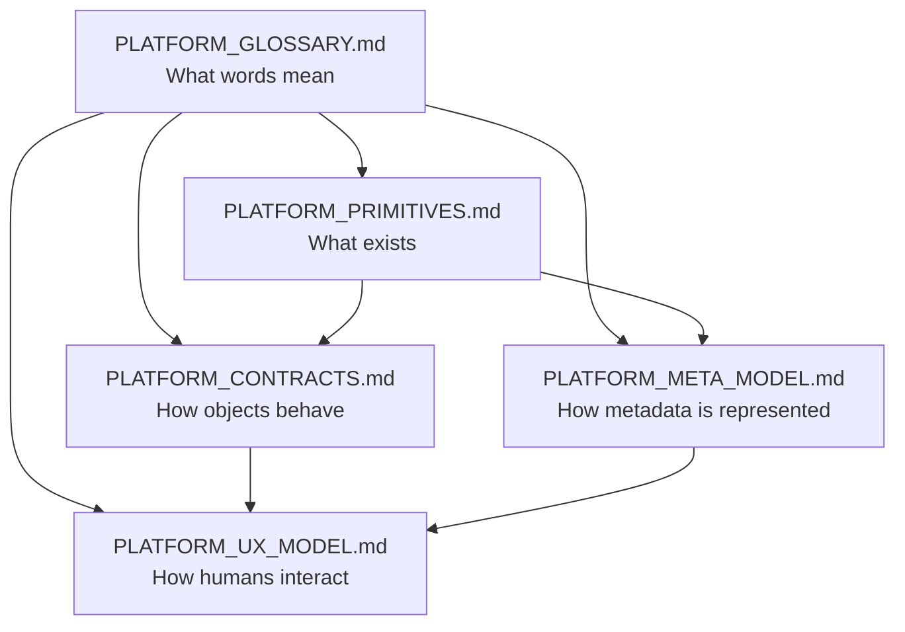
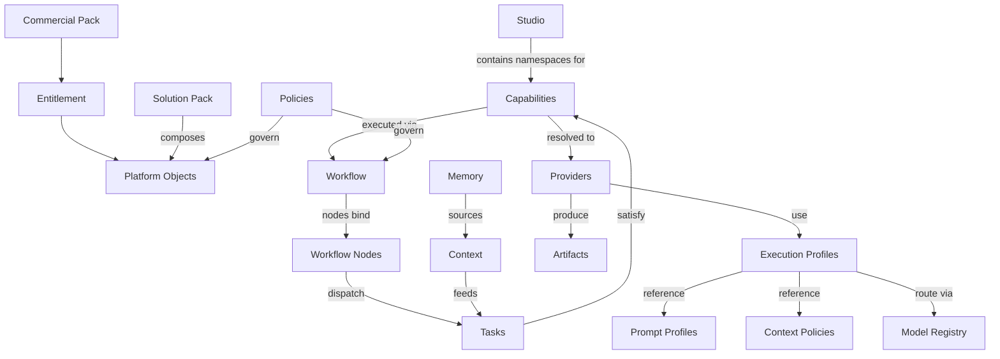
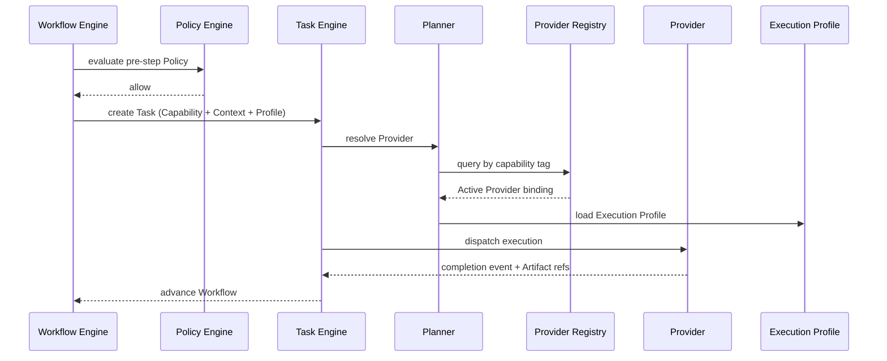
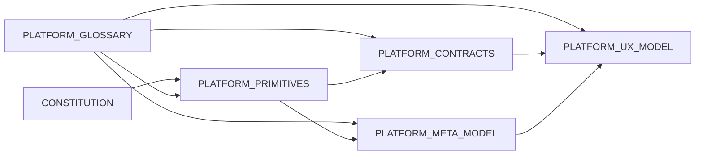

# Agentic Engineering Platform — Platform Glossary

**Status:** Normative vocabulary standard  
**Version:** 1.0  
**Effective:** 1 July 2026  
**Architecture release:** Platform Architecture v2  
**Authority:** Subordinate to [CONSTITUTION.md](../../CONSTITUTION.md); co-equal reference with [PLATFORM_PRIMITIVES.md](./PLATFORM_PRIMITIVES.md) on terminology  
**Audience:** Architects, developers, product owners, customers, partners, technical writers, AI assistants

---

## Document charter

This document is the **official dictionary** of the Agentic Engineering Platform. It defines what every architectural term **means**, how terms **relate**, and how they **must be named**.

| Rule | Obligation |
|------|------------|
| **Single source of truth** | No API, SDK, UI label, database entity, workflow, prompt, user story, or implementation may introduce new platform terminology without updating this glossary |
| **Reference, don't duplicate** | Behavioural and structural detail lives in sibling architecture documents; this glossary defines terms and points to them |
| **Implementation independence** | No programming languages, frameworks, or vendor products are normative here |
| **Stability** | Terms are designed to remain valid for years; changes follow the governance process in [§10](#10-future-evolution) |

**No production code** is specified herein.

---

## Table of contents

1. [Purpose](#1-purpose)
2. [Platform philosophy](#2-platform-philosophy)
3. [Core platform terms](#3-core-platform-terms)
4. [Concept relationships](#4-concept-relationships)
5. [Naming standards](#5-naming-standards)
6. [Common misconceptions](#6-common-misconceptions)
7. [Business examples](#7-business-examples)
8. [Implementation examples](#8-implementation-examples)
9. [Quick reference dictionary](#9-quick-reference-dictionary)
10. [Future evolution](#10-future-evolution)

---

## 1. Purpose

### 1.1 Why a glossary exists

Enterprise platforms fail when every team invents its own vocabulary. Product calls an integration a "connector"; engineering calls it an "agent"; sales calls it a "plugin". Architects cannot reason about composition. Customers cannot compare editions. Partners ship incompatible metadata.

The **Platform Glossary** eliminates that drift. One term, one meaning, one owner.

### 1.2 Why platform vocabulary matters

| Stakeholder | Benefit |
|-------------|---------|
| **Architects** | Shared ontology for design reviews and Decision Records |
| **Developers** | Consistent API resource names, event types, and registry labels |
| **Product owners** | Stable user-facing language across Studios |
| **Customers** | Predictable documentation and training |
| **Partners** | Certified packs use the same primitive names as Platform Core |
| **AI assistants** | Authoring prompts and stories without inventing synonyms |

### 1.3 How to use this document

1. **Before naming anything** — search [§9 Quick reference](#9-quick-reference-dictionary).
2. **When designing** — read the term entry in [§3](#3-core-platform-terms) and follow references.
3. **When confused** — check [§6 Common misconceptions](#6-common-misconceptions).
4. **When proposing a new term** — follow [§10 Future evolution](#10-future-evolution); do not ship until the glossary is updated.

### 1.4 Relationship with sibling architecture documents

| Document | Question answered | Glossary role |
|----------|-------------------|---------------|
| [PLATFORM_PRIMITIVES.md](./PLATFORM_PRIMITIVES.md) | What entities exist? | Defines primitive **names**; primitives doc defines **specifications** |
| [PLATFORM_CONTRACTS.md](./PLATFORM_CONTRACTS.md) | How must objects behave? | Defines **contract** and obligation **terms** |
| [PLATFORM_META_MODEL.md](./PLATFORM_META_MODEL.md) | How is metadata stored and resolved? | Defines **engine** and **registry** terms |
| [PLATFORM_UX_MODEL.md](./PLATFORM_UX_MODEL.md) | How do users experience the platform? | Defines **surface** and **designer** terms |
| **This document** | What does each word mean? | **Authoritative definitions** |

---

## 2. Platform philosophy

These convictions govern every term in this glossary. They are expanded in [PLATFORM_PRIMITIVES.md](./PLATFORM_PRIMITIVES.md) §1.

| Principle | Meaning |
|-----------|---------|
| **Metadata over code** | Customer intent is declared in versioned Platform Object metadata. Engines interpret; platform source does not fork per tenant. |
| **Configuration over customization** | Customers assemble outcomes from metadata — Studios, Providers, Workflows, Packs — without modifying Platform Core. |
| **Composition over hardcoding** | Solution Packs and Workflows **compose** primitives; orchestration logic is not embedded in engines. |
| **Platform over framework** | The product is an orchestration **platform** with governed objects and engines — not a library customers embed. |
| **Governance by default** | Versioning, approval, publishing, rollback, audit, and ownership apply to every Platform Object. |
| **Observability by default** | Every Platform Object emits events, metrics, logs, traces, audit records, health, cost, and usage — no exemptions. |

**Corollaries:**

- **Everything is measurable** — usage and cost meters attach to execution and objects.
- **Everything is auditable** — mutations and runtime actions produce immutable audit records.
- **Everything is configurable** — within Entitlement and Policy bounds, behaviour changes through metadata.

---

## 3. Core platform terms

Each entry uses a standard template. **Ownership** indicates who authors, operates, or is accountable for instances of the concept.

**Ownership legend:** `Platform vendor` · `Tenant admin` · `Customer author` · `Partner` · `Engine (automated)`

### 3.1 Platform and foundation

#### Platform

| Field | Value |
|-------|-------|
| **Definition** | The **Agentic Engineering Platform** — a metadata-driven orchestration plane for enterprise software engineering that coordinates people, AI, tools, and governance without becoming a new system of record. |
| **Purpose** | Provide a reusable engineering orchestration product across industries and tenants. |
| **Responsibilities** | Host engines, registries, Studios, Marketplace, and observability; enforce [CONSTITUTION.md](../../CONSTITUTION.md). |
| **Ownership** | Platform vendor |
| **Related terms** | Platform Core, Platform Object, Metadata Engine |
| **Examples** | Acme Corp deploys the platform to orchestrate greenfield product development. |
| **Common mistakes** | Calling a single Studio or agent runtime "the platform". |
| **References** | [PLATFORM_PRIMITIVES.md](./PLATFORM_PRIMITIVES.md) §1.1; [CONSTITUTION.md](../../CONSTITUTION.md) |

#### Platform Core

| Field | Value |
|-------|-------|
| **Definition** | Immutable vendor-owned **engines and services** that interpret metadata — Orchestrator, Workflow Engine, Metadata Engine, Policy Engine, Event Bus, and related containers. Excludes customer metadata. |
| **Purpose** | Separate shared execution logic from tenant-specific configuration. |
| **Responsibilities** | Interpret Platform Objects; never contain customer-specific branching logic ([CONSTITUTION.md](../../CONSTITUTION.md) MT3). |
| **Ownership** | Platform vendor |
| **Related terms** | Metadata Engine, Planner, Workflow Engine |
| **Examples** | A platform upgrade patches Platform Core; tenant Workflows are unchanged. |
| **Common mistakes** | Patching Platform Core for one customer's policy — use Policy objects instead. |
| **References** | [PLATFORM_META_MODEL.md](./PLATFORM_META_MODEL.md) MM-01; [ARCHITECTURE.md](../../ARCHITECTURE.md) |

#### Platform Object

| Field | Value |
|-------|-------|
| **Definition** | The **conceptual base class** of the platform — the universal envelope (identity, metadata, configuration, lifecycle, relationships, security, observability, governance, versioning) inherited by every definable entity. |
| **Purpose** | One object model for APIs, UI, registries, and audit. |
| **Responsibilities** | Provide identical infrastructure semantics for all specialisations; no primitive may subset or replace the envelope. |
| **Ownership** | Customer author (instances); Platform vendor (envelope specification) |
| **Related terms** | Platform Primitive, Lifecycle, Governance, Observability |
| **Examples** | `create-pull-request` Capability v2.1.0 is a Platform Object. |
| **Common mistakes** | Creating a "custom object type" outside the thirteen primitives without a Decision Record. |
| **References** | [PLATFORM_PRIMITIVES.md](./PLATFORM_PRIMITIVES.md) §3; [PLATFORM_CONTRACTS.md](./PLATFORM_CONTRACTS.md) §4 |

#### Platform Primitive

| Field | Value |
|-------|-------|
| **Definition** | One of **exactly thirteen** specialised **roles** a Platform Object may assume: Studio, Capability, Workflow, Provider, Execution Profile, Policy, Context, Resource, Artifact, Plugin, Solution Pack, Commercial Pack, Entitlement. |
| **Purpose** | Typed domain semantics on top of the common Platform Object envelope. |
| **Responsibilities** | Declare primitive-specific metadata extensions; remain interchangeable at the contract boundary. |
| **Ownership** | Platform vendor (primitive catalogue); Customer author (instances) |
| **Related terms** | Platform Object, Registry |
| **Examples** | A GitHub integration is a **Provider** primitive, not a new primitive called "Integration". |
| **Common mistakes** | Treating "Agent" or "Connector" as a fourteenth primitive. |
| **References** | [PLATFORM_PRIMITIVES.md](./PLATFORM_PRIMITIVES.md) §5 |

#### Platform Contract

| Field | Value |
|-------|-------|
| **Definition** | Normative **behavioural law** every Platform Object must honour — lifecycle, audit, observability, security, validation, and API shape. |
| **Purpose** | Make all objects interchangeable at the infrastructure boundary. |
| **Responsibilities** | Bind engines to objects; define failure semantics and mandatory fields. |
| **Ownership** | Platform vendor |
| **Related terms** | Governance, Lifecycle, Observability, Validation |
| **Examples** | Every primitive transitions Draft → Review → Approved → Published → Active identically. |
| **Common mistakes** | Implementing a custom lifecycle for one Studio's objects. |
| **References** | [PLATFORM_CONTRACTS.md](./PLATFORM_CONTRACTS.md) |

#### Metadata Engine

| Field | Value |
|-------|-------|
| **Definition** | Platform subsystem responsible for **metadata lifecycle and resolution** — object and schema registries, validation, inheritance, composition, dependency resolution, configuration overrides, publishing, discovery, runtime resolution, and lifecycle management. |
| **Purpose** | Materialise truth for execution engines; customer-specific behaviour is metadata, not code. |
| **Responsibilities** | Validate and publish objects; compute effective configuration; produce Execution Plan Documents; **must not** execute Capabilities or call external APIs directly. |
| **Ownership** | Platform vendor (engine); Tenant admin (published metadata) |
| **Related terms** | Platform Registry, Configuration, Inheritance, Composition |
| **Examples** | On Publish, Metadata Engine validates a Workflow DAG and indexes it in the Object Registry. |
| **Common mistakes** | Embedding orchestration logic in the Metadata Engine. |
| **References** | [PLATFORM_META_MODEL.md](./PLATFORM_META_MODEL.md) §3 |

#### Platform Registry

| Field | Value |
|-------|-------|
| **Definition** | Umbrella term for **indexed catalogues** of Platform Objects and runtime bindings — centred on the **Object Registry** (canonical) with **typed registry views** (Provider, Workflow, Capability, etc.). |
| **Purpose** | Discovery, resolution, and materialised views for engines and Studios. |
| **Responsibilities** | Index Published objects; support capability-tag queries; update from Marketplace install events. |
| **Ownership** | Platform vendor (infrastructure); Tenant admin (tenant partition) |
| **Related terms** | Registry, Marketplace, Provider, Capability |
| **Examples** | Planner queries Provider Registry by capability tag `create-pull-request`. |
| **Common mistakes** | Hard-coding provider names in orchestration instead of registry resolution. |
| **References** | [PLATFORM_META_MODEL.md](./PLATFORM_META_MODEL.md) §5; [PLATFORM_CONTRACTS.md](./PLATFORM_CONTRACTS.md) §21 |

#### Registry

| Field | Value |
|-------|-------|
| **Definition** | A **catalogue service or view** that indexes Platform Objects of a given type or relationship for query and resolution. |
| **Purpose** | Decouple engines from storage; enable dynamic discovery. |
| **Responsibilities** | Serve tenant-scoped queries; emit index update events; never bypass Object Catalog as canonical source. |
| **Ownership** | Platform vendor |
| **Related terms** | Platform Registry, Capability, Provider |
| **Examples** | Agent Registry is a typed view for `provider_kind: ai-agent` Providers. |
| **Common mistakes** | Creating a shadow registry outside Metadata Engine pipelines. |
| **References** | [PLATFORM_META_MODEL.md](./PLATFORM_META_MODEL.md) MM-09 |

### 3.2 Studios and capabilities

#### Studio

| Field | Value |
|-------|-------|
| **Definition** | A **product module** on the Engineering Platform exposing designers, dashboards, and default compositions for a domain (Requirements, Architecture, Development, Testing, Security, Release, Operations). A Platform Object primitive. |
| **Purpose** | Package domain UX and default metadata for a persona without forking Platform Core. |
| **Responsibilities** | Namespace primitives; expose designers; surface execution history; require Entitlement for activation. |
| **Ownership** | Platform vendor (vendor Studios); Partner (certified Studios); Tenant admin (configuration) |
| **Related terms** | Capability, Workflow, Solution Pack, Dashboard |
| **Examples** | Development Studio orchestrates implementation Workflows and PR Artifacts. |
| **Common mistakes** | Building a Studio that bypasses Platform Object lifecycle or Policy Engine. |
| **References** | [PLATFORM_PRIMITIVES.md](./PLATFORM_PRIMITIVES.md) §6.1; [PLATFORM_UX_MODEL.md](./PLATFORM_UX_MODEL.md) §5 |

#### Capability

| Field | Value |
|-------|-------|
| **Definition** | A **declarable unit of routable work** identified by a stable **capability tag** (verb-noun, kebab-case). Satisfied at runtime by one or more Providers. A Platform Object primitive. |
| **Purpose** | Decouple orchestration from implementation — Planner resolves Providers by tag, not by name. |
| **Responsibilities** | Declare input/output contracts, idempotency, cost class, and required Policies; be entitlement-gated. |
| **Ownership** | Platform vendor or Partner (catalog); Customer author (extensions) |
| **Related terms** | Provider, Workflow Node, Task, Execution |
| **Examples** | `generates-unit-tests`, `create-pull-request`, `analyses-requirements`. |
| **Common mistakes** | Hard-coding `github-prod` in a Workflow instead of `create-pull-request`. |
| **References** | [PLATFORM_PRIMITIVES.md](./PLATFORM_PRIMITIVES.md) §6.2; [CONSTITUTION.md](../../CONSTITUTION.md) AG4 |

#### Workflow

| Field | Value |
|-------|-------|
| **Definition** | A **published event-driven state machine** orchestrating an engineering process from trigger to completion. A Platform Object primitive executed by the Workflow Engine. |
| **Purpose** | Model end-to-end process with gates, parallelism, and compensation — as metadata, not code. |
| **Responsibilities** | Bind Workflow Nodes to Capabilities and Execution Profiles; reference Policies; emit workflow events. |
| **Ownership** | Customer author; Partner (packaged templates) |
| **Related terms** | Workflow Template, Workflow Node, Planner, Task |
| **Examples** | `greenfield-product-development` Workflow from intake to release. |
| **Common mistakes** | Encoding business rules only in Workflow graph without Policy objects. |
| **References** | [PLATFORM_PRIMITIVES.md](./PLATFORM_PRIMITIVES.md) §6.3 |

#### Workflow Template

| Field | Value |
|-------|-------|
| **Definition** | A **reusable Workflow metadata pattern** — typically Published and distributed via Marketplace or Solution Pack — cloned into tenant namespace before customisation. |
| **Purpose** | Accelerate authoring; standardise industry or team processes. |
| **Responsibilities** | Ship as immutable Published metadata; declare version pins and prerequisites. |
| **Ownership** | Platform vendor; Partner |
| **Related terms** | Workflow, Solution Pack, Marketplace |
| **Examples** | `regulated-banking-release` Workflow Template in an Industry Pack. |
| **Common mistakes** | Confusing a Draft Workflow with a certified Template — templates are Published and signed. |
| **References** | [PLATFORM_CONTRACTS.md](./PLATFORM_CONTRACTS.md) §21; [PLATFORM_META_MODEL.md](./PLATFORM_META_MODEL.md) §12 |

#### Workflow Node

| Field | Value |
|-------|-------|
| **Definition** | A **single step or state** in a Workflow graph that binds a **Capability**, optional **Execution Profile**, Policies, and gate configuration. |
| **Purpose** | Atomic unit of orchestration — where work is dispatched as Tasks. |
| **Responsibilities** | Declare transitions, retry semantics, and human gate attachments; reference Capability by tag. |
| **Ownership** | Customer author (within Workflow metadata) |
| **Related terms** | Capability, Task, Execution Profile, Approval |
| **Examples** | Node `implement-feature` invokes `generates-backend` with Execution Profile `standard-backend`. |
| **Common mistakes** | Binding a Provider name directly on a node — bind Capability; Planner selects Provider. |
| **References** | [PLATFORM_PRIMITIVES.md](./PLATFORM_PRIMITIVES.md) §6.3, §4.7 |

### 3.3 Providers and integrations

#### Provider

| Field | Value |
|-------|-------|
| **Definition** | Generic first-class primitive for any backend that **advertises and satisfies Capabilities** at runtime. Discriminated by `provider_kind` (ai-agent, connector, human, script, rest-api, container, mcp, automation, marketplace, partner). |
| **Purpose** | Unify AI agents, integrations, humans, scripts, APIs, and MCP servers under one abstraction. |
| **Responsibilities** | Register capability tags; declare scope, auth, and health; publish execution results as events. |
| **Ownership** | Platform vendor; Partner; Customer author (via Provider Builder) |
| **Related terms** | Provider Plugin, Connector, Agent, Capability |
| **Examples** | `github-prod` Provider (`provider_kind: connector`) satisfies `create-pull-request`. |
| **Common mistakes** | Treating Provider as synonymous with LLM only. |
| **References** | [PLATFORM_PRIMITIVES.md](./PLATFORM_PRIMITIVES.md) §5.1, §6.4 |

#### Provider Plugin

| Field | Value |
|-------|-------|
| **Definition** | **Packaged distribution** of a Provider — metadata plus optional Plugin normaliser artefact — installed from Marketplace. |
| **Purpose** | Ship integrations and specialised Providers without Platform Core changes. |
| **Responsibilities** | Auto-register on install/activate; declare compatibility and permissions. |
| **Ownership** | Partner; Platform vendor |
| **Related terms** | Provider, Plugin, Marketplace, Connector Plugin |
| **Examples** | Jira Connector Provider Plugin from Marketplace. |
| **Common mistakes** | Shipping executable business logic inside Marketplace packages — only metadata and plugins. |
| **References** | [PLATFORM_META_MODEL.md](./PLATFORM_META_MODEL.md) §12 |

#### Provider Builder

| Field | Value |
|-------|-------|
| **Definition** | **Metadata authoring experience** that lets customers and partners create Provider Platform Objects without modifying platform source code. |
| **Purpose** | Self-service integration and agent registration through configuration. |
| **Responsibilities** | Emit validated Draft Provider metadata per template; support all standard `provider_kind` values. |
| **Ownership** | Platform vendor (UX); Customer author (output) |
| **Related terms** | Provider, Connector, Marketplace |
| **Examples** | Security team authors a `rest-api` Provider for internal scanner API. |
| **Common mistakes** | Using Provider Builder to bypass Policy or Entitlement checks. |
| **References** | [PLATFORM_PRIMITIVES.md](./PLATFORM_PRIMITIVES.md) §6.4; [PLATFORM_UX_MODEL.md](./PLATFORM_UX_MODEL.md) §10.0 |

#### Connector

| Field | Value |
|-------|-------|
| **Definition** | **Product language** for a Provider with `provider_kind: connector` — an integration to an external **system of record** (source control, issue tracker, CI/CD). **Not** a separate primitive. |
| **Purpose** | User-friendly label for integration Providers in Studios and Marketplace. |
| **Responsibilities** | Advertise integration Capabilities; use vault auth; self-register on activation. |
| **Ownership** | Partner (catalog); Tenant admin (tenant instance) |
| **Related terms** | Connector Plugin, Provider Plugin, External Provider |
| **Examples** | GitHub Connector, Jira Connector, Azure DevOps Connector. |
| **Common mistakes** | Defining "Connector" as a primitive parallel to Provider. |
| **References** | [PLATFORM_PRIMITIVES.md](./PLATFORM_PRIMITIVES.md) §5.1 |

#### Connector Plugin

| Field | Value |
|-------|-------|
| **Definition** | Synonym for **Provider Plugin** where `provider_kind: connector` — Marketplace package for an integration Provider. |
| **Purpose** | Marketplace categorisation aligned with customer language. |
| **Responsibilities** | Same as Provider Plugin. |
| **Ownership** | Partner |
| **Related terms** | Connector, Provider Plugin, Marketplace |
| **Examples** | Install "GitHub Connector Plugin" from Marketplace. |
| **Common mistakes** | Expecting Connector Plugin to patch Orchestrator code. |
| **References** | [PLATFORM_UX_MODEL.md](./PLATFORM_UX_MODEL.md) §6.2 |

#### Agent

| Field | Value |
|-------|-------|
| **Definition** | **Product and constitutional language** for a Provider with `provider_kind: ai-agent` — an LLM or specialist execution backend. **Not** a Platform Primitive. |
| **Purpose** | Preserve familiar terminology for AI execution while maintaining Provider Model unity. |
| **Responsibilities** | Execute Capabilities; publish AgentCompleted / AgentFailed; never command peer agents ([CONSTITUTION.md](../../CONSTITUTION.md) A1). |
| **Ownership** | Platform vendor (runtime); Customer author (registration metadata) |
| **Related terms** | Provider, Agent Runtime, Execution Profile |
| **Examples** | Coding agent Provider executing `generates-backend`. |
| **Common mistakes** | Modelling Agent as a primitive separate from Provider. |
| **References** | [PLATFORM_PRIMITIVES.md](./PLATFORM_PRIMITIVES.md) §5.1; [CONSTITUTION.md](../../CONSTITUTION.md) A1 |

#### Human Provider

| Field | Value |
|-------|-------|
| **Definition** | A Provider with `provider_kind: human` — routes work to human task queues, approval surfaces, or CAB boards. |
| **Purpose** | First-class human participation in workflows and gates. |
| **Responsibilities** | Satisfy human-assigned Capabilities; honour SLA metadata; integrate with Approval records. |
| **Ownership** | Tenant admin |
| **Related terms** | Approval, Policy, Workflow Node |
| **Examples** | CAB approval Human Provider for release Workflow gate. |
| **Common mistakes** | Implementing human gates only in UI without Human Provider metadata. |
| **References** | [PLATFORM_PRIMITIVES.md](./PLATFORM_PRIMITIVES.md) §5.1 |

#### External Provider

| Field | Value |
|-------|-------|
| **Definition** | **Collective product language** for Providers that invoke **external systems** — Connectors (`connector`), REST APIs (`rest-api`), MCP servers (`mcp`), and automation platforms (`automation`). |
| **Purpose** | Distinguish external integration backends from in-platform AI or human Providers. |
| **Responsibilities** | Scoped access to external systems; normalised responses; rate limits. |
| **Ownership** | Partner or Customer author |
| **Related terms** | Connector, REST Provider, MCP Provider |
| **Examples** | SonarQube REST Provider, GitHub Connector. |
| **Common mistakes** | Allowing External Providers to store credentials in metadata instead of vault references. |
| **References** | [PLATFORM_PRIMITIVES.md](./PLATFORM_PRIMITIVES.md) §6.4; [CONSTITUTION.md](../../CONSTITUTION.md) S2 |

#### MCP Provider

| Field | Value |
|-------|-------|
| **Definition** | A Provider with `provider_kind: mcp` — exposes tools and Capabilities via the Model Context Protocol. |
| **Purpose** | Standardise tool server integrations for AI execution paths. |
| **Responsibilities** | Declare MCP endpoint, tool manifest, and capability mapping; health-check server availability. |
| **Ownership** | Partner; Customer author |
| **Related terms** | Provider, Agent, External Provider |
| **Examples** | Internal docs MCP Provider advertising `search-codebase` Capability. |
| **Common mistakes** | Embedding MCP client logic in Orchestrator — resolve via Provider Registry. |
| **References** | [PLATFORM_PRIMITIVES.md](./PLATFORM_PRIMITIVES.md) §5.1 |

#### Script Provider

| Field | Value |
|-------|-------|
| **Definition** | A Provider with `provider_kind: script` — executes sandboxed scripts to satisfy Capabilities. |
| **Purpose** | Lightweight automation without full agent or container overhead. |
| **Responsibilities** | Declare runtime, sandbox policy, and input/output schema; enforce least privilege. |
| **Ownership** | Customer author |
| **Related terms** | Provider, Capability, Policy |
| **Examples** | Script Provider normalising licence scan output to platform Artifact schema. |
| **Common mistakes** | Running unsandboxed scripts with broad tenant credentials. |
| **References** | [PLATFORM_PRIMITIVES.md](./PLATFORM_PRIMITIVES.md) §5.1 |

#### REST Provider

| Field | Value |
|-------|-------|
| **Definition** | A Provider with `provider_kind: rest-api` — invokes a REST API to satisfy Capabilities. |
| **Purpose** | Generic HTTP integration without a certified Connector pack. |
| **Responsibilities** | Declare OpenAPI or endpoint metadata, auth, and rate limits; normalise responses. |
| **Ownership** | Customer author (typical); Partner |
| **Related terms** | External Provider, Connector, Provider Builder |
| **Examples** | REST Provider calling internal artefact repository API. |
| **Common mistakes** | Hard-coding API keys in Provider metadata. |
| **References** | [PLATFORM_PRIMITIVES.md](./PLATFORM_PRIMITIVES.md) §5.1 |

### 3.4 Execution, context, and knowledge

#### Execution Profile

| Field | Value |
|-------|-------|
| **Definition** | Reusable Platform Object defining **how** Capabilities execute — preferred, fallback, and consensus model strategies; Prompt Profiles; Context Policies; budget; latency; quality; retry strategy. Replaces ad hoc model routing. |
| **Purpose** | Govern cost, quality, and reliability of execution consistently across Workflows. |
| **Responsibilities** | Bind model and prompt strategy; cap cost; declare retry and resource class; be referenceable from Workflow Nodes. |
| **Ownership** | Platform vendor (defaults); Tenant admin (custom profiles) |
| **Related terms** | Prompt Profile, Context Policy, Resource, Model Registry |
| **Examples** | `premium-architecture` profile with consensus models for ADR generation. |
| **Common mistakes** | Setting a single model name on a Workflow instead of an Execution Profile. |
| **References** | [PLATFORM_PRIMITIVES.md](./PLATFORM_PRIMITIVES.md) §6.5; [PLATFORM_UX_MODEL.md](./PLATFORM_UX_MODEL.md) §9 |

#### Prompt Profile

| Field | Value |
|-------|-------|
| **Definition** | Named **prompt template binding** referenced by an Execution Profile — system and task prompt patterns with variable slots. |
| **Purpose** | Separate prompt authoring from model routing and Workflow structure. |
| **Responsibilities** | Declare template version, variables, and safety classifications; be versioned with Execution Profile. |
| **Ownership** | Platform vendor; Customer author |
| **Related terms** | Execution Profile, Context Policy, Capability |
| **Examples** | `backend-impl-v2` Prompt Profile bound to `standard-backend` Execution Profile. |
| **Common mistakes** | Embedding full prompts in Workflow metadata instead of Prompt Profiles. |
| **References** | [PLATFORM_PRIMITIVES.md](./PLATFORM_PRIMITIVES.md) §6.5 |

#### Context Policy

| Field | Value |
|-------|-------|
| **Definition** | Rules governing **context assembly** during execution — token budget, truncation, redaction, and inclusion of Memory or Artifact references. Referenced by Execution Profiles. |
| **Purpose** | Enforce safe, bounded context for AI and tool execution. |
| **Responsibilities** | Declare redaction rules, max tokens, and source precedence; align with Policy Engine. |
| **Ownership** | Tenant admin; Platform vendor (defaults) |
| **Related terms** | Context, Knowledge Source, Memory, Execution Profile |
| **Examples** | `redact-secrets` Context Policy applied to all production Execution Profiles. |
| **Common mistakes** | Confusing Context Policy with Policy primitive — Context Policy is execution-scoped assembly rules. |
| **References** | [PLATFORM_PRIMITIVES.md](./PLATFORM_PRIMITIVES.md) §6.5 |

#### Context

| Field | Value |
|-------|-------|
| **Definition** | Platform Object primitive — a **scoped knowledge bundle** assembled for a task or workflow run. Ephemeral assembly; distinct from durable Memory. |
| **Purpose** | Supply execution-time knowledge without coupling agents to storage implementations. |
| **Responsibilities** | Declare sources (Memory queries, Artifacts, labels); be tenant-scoped; respect Context Policy. |
| **Ownership** | Customer author |
| **Related terms** | Knowledge Source, Memory, Artifact, Context Policy |
| **Examples** | `sprint-context` Context template pulling open stories and recent ADRs. |
| **Common mistakes** | Writing execution outputs directly into Context instead of Artifacts or audited Memory writes. |
| **References** | [PLATFORM_PRIMITIVES.md](./PLATFORM_PRIMITIVES.md) §6.7 |

#### Knowledge Source

| Field | Value |
|-------|-------|
| **Definition** | **Authoring term** for an upstream origin that feeds Context assembly — Memory queries, Artifact references, external read-only Provider calls, or Knowledge Packs. Not a separate primitive. |
| **Purpose** | Document where context content originates in designs and runbooks. |
| **Responsibilities** | Be declared in Context `sources`; respect tenant isolation and classification. |
| **Ownership** | Customer author |
| **Related terms** | Context, Memory, Artifact, Knowledge Packs |
| **Examples** | Memory query for `source_type: adr` as Knowledge Source in architecture Workflow. |
| **Common mistakes** | Creating a "Knowledge Source" primitive — use Context sources or Memory schema. |
| **References** | [PLATFORM_PRIMITIVES.md](./PLATFORM_PRIMITIVES.md) §6.7; [ARCHITECTURE.md](../../ARCHITECTURE.md) |

#### Memory

| Field | Value |
|-------|-------|
| **Definition** | **Durable tenant-scoped knowledge store** (Memory Store container) queried during Context assembly. Distinct from ephemeral Context and from Artifact outputs. |
| **Purpose** | Long-term engineering knowledge — ADRs, incidents, codebase indices — with governed writes. |
| **Responsibilities** | Enforce `tenant_id` on every query; require metadata filters ([CONSTITUTION.md](../../CONSTITUTION.md) M4); audit writes. |
| **Ownership** | Platform vendor (service); Tenant admin (content policy) |
| **Related terms** | Context, Knowledge Source, Artifact |
| **Examples** | Architecture Studio queries Memory for ADRs related to a service. |
| **Common mistakes** | Using Memory as a scratch pad for task state — use Context for ephemeral assembly. |
| **References** | [ARCHITECTURE.md](../../ARCHITECTURE.md); [CONSTITUTION.md](../../CONSTITUTION.md) M3, M4 |

#### Resource

| Field | Value |
|-------|-------|
| **Definition** | Platform Object primitive — a **metered platform asset** such as model quota, compute slot, or connection concurrency limit. |
| **Purpose** | Govern consumption and commercial metering. |
| **Responsibilities** | Declare capacity, reservation rules, and linkage to Commercial Pack quotas. |
| **Ownership** | Platform vendor; Tenant admin |
| **Related terms** | Execution Profile, Commercial Pack, Entitlement |
| **Examples** | `premium-model-quota` Resource reserved by Execution Profile. |
| **Common mistakes** | Confusing Resource with Context or Artifact. |
| **References** | [PLATFORM_PRIMITIVES.md](./PLATFORM_PRIMITIVES.md) §6.8 |

#### Artifact

| Field | Value |
|-------|-------|
| **Definition** | Platform Object primitive — **durable output** of execution (pull request, ADR, scan report, release note). |
| **Purpose** | Persist engineering outcomes as first-class governed objects. |
| **Responsibilities** | Link to producing Capability and workflow run; support classification and retention. |
| **Ownership** | Engine (production); Customer author (metadata registration) |
| **Related terms** | Capability, Workflow, Execution |
| **Examples** | SARIF Artifact from security scan Capability. |
| **Common mistakes** | Storing Artifacts only in external systems without platform Artifact records. |
| **References** | [PLATFORM_PRIMITIVES.md](./PLATFORM_PRIMITIVES.md) §6.9 |

### 3.5 Policy, governance, and lifecycle

#### Policy

| Field | Value |
|-------|-------|
| **Definition** | Platform Object primitive — **machine-evaluable rule** governing mutation, access, or execution. Evaluated by Policy Engine. |
| **Purpose** | Centralise governance logic as metadata, not orchestrator code. |
| **Responsibilities** | Declare enforcement points (publish, execute, mutation); severity; rule expressions. |
| **Ownership** | Tenant admin; Partner (packaged policies) |
| **Related terms** | Rule, Approval, Governance, Workflow |
| **Examples** | `require-security-scan-before-release` Policy blocking Workflow transition. |
| **Common mistakes** | Duplicating Policy logic inside Workflow conditions only. |
| **References** | [PLATFORM_PRIMITIVES.md](./PLATFORM_PRIMITIVES.md) §6.6 |

#### Rule

| Field | Value |
|-------|-------|
| **Definition** | A **single evaluable condition** within a Policy object — the atomic if/then semantics the Policy Engine executes. |
| **Purpose** | Structure complex policies as composable rules. |
| **Responsibilities** | Declare condition, effect (allow/deny/advisory), and message codes. |
| **Ownership** | Customer author (within Policy) |
| **Related terms** | Policy, Approval |
| **Examples** | Rule: "if `risk_level` is critical then deny publish without CAB Approval". |
| **Common mistakes** | Calling Workflow transitions "rules" — prefer Policy for machine evaluation. |
| **References** | [PLATFORM_UX_MODEL.md](./PLATFORM_UX_MODEL.md) §8 |

#### Approval

| Field | Value |
|-------|-------|
| **Definition** | **Human decision record** attached to a lifecycle transition or Workflow gate — non-bypassable where constitution requires ([CONSTITUTION.md](../../CONSTITUTION.md) H2). |
| **Purpose** | Bind accountability to high-risk mutations and executions. |
| **Responsibilities** | Record approver, timestamp, reason; block transition when absent; emit audit events. |
| **Ownership** | Human principal |
| **Related terms** | Human Provider, Policy, Governance, Workflow Node |
| **Examples** | CAB Approval record before Release Workflow enters Deploy state. |
| **Common mistakes** | UI-only approval without immutable Approval record. |
| **References** | [PLATFORM_PRIMITIVES.md](./PLATFORM_PRIMITIVES.md) §4.3; [CONSTITUTION.md](../../CONSTITUTION.md) H2 |

#### Governance

| Field | Value |
|-------|-------|
| **Definition** | **Unified control plane** for Platform Objects — versioning, approval, publishing, rollback, audit, ownership, dependencies, validation, security, and lifecycle. |
| **Purpose** | Enterprise accountability and compliance by default. |
| **Responsibilities** | Enforce Governance Contract; integrate Policy Engine and Metadata Engine. |
| **Ownership** | Tenant admin; Platform vendor (contracts) |
| **Related terms** | Policy, Lifecycle, Audit, Version |
| **Examples** | Critical Workflow requires dual approval before Published. |
| **Common mistakes** | Per-Studio governance bypass for "speed". |
| **References** | [PLATFORM_PRIMITIVES.md](./PLATFORM_PRIMITIVES.md) §4.13; [PLATFORM_CONTRACTS.md](./PLATFORM_CONTRACTS.md) §14 |

#### Lifecycle

| Field | Value |
|-------|-------|
| **Definition** | **Standard state machine** every Platform Object follows: Draft → Review → Approved → Published → Active → Deprecated → Retired → Archived. |
| **Purpose** | Predictable promotion and immutability semantics platform-wide. |
| **Responsibilities** | Gate transitions with validation, approval, and Entitlement; freeze Published versions. |
| **Ownership** | Metadata Engine (enforcement); Customer author (transitions) |
| **Related terms** | Version, Governance, Publishing |
| **Examples** | Provider moves to Active after tenant admin activates post-Marketplace install. |
| **Common mistakes** | Deleting objects instead of transitioning to Retired. |
| **References** | [PLATFORM_PRIMITIVES.md](./PLATFORM_PRIMITIVES.md) §3.4; [PLATFORM_CONTRACTS.md](./PLATFORM_CONTRACTS.md) §8 |

#### Version

| Field | Value |
|-------|-------|
| **Definition** | **Semantic version** (MAJOR.MINOR.PATCH) identifying a Platform Object revision; Published versions are immutable. |
| **Purpose** | Safe coexistence, rollback, and compatibility declaration. |
| **Responsibilities** | Bump per versioning rules; declare compatibility matrix when consuming versioned schemas. |
| **Ownership** | Customer author |
| **Related terms** | Lifecycle, Dependency, Publishing |
| **Examples** | Capability `create-pull-request` v2.1.0 Published; v2.2.0 Draft in progress. |
| **Common mistakes** | Mutating a Published object in place. |
| **References** | [PLATFORM_PRIMITIVES.md](./PLATFORM_PRIMITIVES.md) §3.10; [PLATFORM_CONTRACTS.md](./PLATFORM_CONTRACTS.md) §15 |

#### Dependency

| Field | Value |
|-------|-------|
| **Definition** | **Directed requirement** between Platform Objects or external prerequisites — version pins, entitlements, or runtime bindings forming a DAG. |
| **Purpose** | Validate composition integrity at publish and explain blast radius. |
| **Responsibilities** | Be validated by Metadata Engine; surface in Dependencies UI tab. |
| **Ownership** | Customer author (declared); Metadata Engine (validated) |
| **Related terms** | Relationship, Composition, Solution Pack |
| **Examples** | Workflow depends on Capability `generates-unit-tests` ≥ v1.4.0. |
| **Common mistakes** | Floating unversioned references in production Active bindings. |
| **References** | [PLATFORM_CONTRACTS.md](./PLATFORM_CONTRACTS.md) §10; [PLATFORM_META_MODEL.md](./PLATFORM_META_MODEL.md) §8 |

#### Relationship

| Field | Value |
|-------|-------|
| **Definition** | **Typed association** between Platform Objects — parent/child, composition, reference, or grants — exposed via APIs and Relationships UI tab. |
| **Purpose** | Navigate object graphs and impact analysis. |
| **Responsibilities** | Be tenant-scoped; update on publish; power Object Explorer graph. |
| **Ownership** | Metadata Engine (index); Customer author (declared) |
| **Related terms** | Dependency, Composition, Registry |
| **Examples** | Solution Pack **contains** Workflow `greenfield-v1`. |
| **Common mistakes** | Storing relationships only in UI state, not metadata. |
| **References** | [PLATFORM_CONTRACTS.md](./PLATFORM_CONTRACTS.md) §9 |

#### Configuration

| Field | Value |
|-------|-------|
| **Definition** | **Layered settings** merged deterministically — vendor defaults, Commercial Pack, Solution Pack, tenant, environment, and object overrides — producing `effective_configuration`. |
| **Purpose** | Tenant and environment variation without code forks. |
| **Responsibilities** | Validate at publish; materialise views; audit changes. |
| **Ownership** | Tenant admin |
| **Related terms** | Metadata, Inheritance, Metadata Engine |
| **Examples** | Production environment override increases Workflow timeout. |
| **Common mistakes** | Confusing Configuration with Metadata business descriptions. |
| **References** | [PLATFORM_PRIMITIVES.md](./PLATFORM_PRIMITIVES.md) §3.3, §4.9; [PLATFORM_META_MODEL.md](./PLATFORM_META_MODEL.md) §6 |

#### Metadata

| Field | Value |
|-------|-------|
| **Definition** | **Declarative description** on every Platform Object — business metadata, technical metadata, labels, annotations, classification, and documentation links. Distinct from layered **Configuration** values. |
| **Purpose** | Capture intent, taxonomy, and engine hints without executable logic. |
| **Responsibilities** | Be extensible; preserve unknown keys; validate at publish boundary. |
| **Ownership** | Customer author |
| **Related terms** | Configuration, Platform Object, Metadata Engine |
| **Examples** | Business metadata describing KPIs for a Capability. |
| **Common mistakes** | Storing secrets or environment endpoints in metadata instead of Configuration vault references. |
| **References** | [PLATFORM_PRIMITIVES.md](./PLATFORM_PRIMITIVES.md) §3.2; [PLATFORM_CONTRACTS.md](./PLATFORM_CONTRACTS.md) §6 |

#### Inheritance

| Field | Value |
|-------|-------|
| **Definition** | **Single-parent specialisation** where child Platform Objects merge parent configuration and schema extensions (Capability, Policy, Provider, Execution Profile, Studio). |
| **Purpose** | Reuse and extend without duplication. |
| **Responsibilities** | Resolve parent chain at publish; child explicit values win. |
| **Ownership** | Metadata Engine |
| **Related terms** | Configuration, Composition |
| **Examples** | `generates-backend-java` Capability inherits from `generates-backend`. |
| **Common mistakes** | Multiple inheritance parents for specialisation. |
| **References** | [PLATFORM_PRIMITIVES.md](./PLATFORM_PRIMITIVES.md) §4.6 |

#### Composition

| Field | Value |
|-------|-------|
| **Definition** | **Aggregation pattern** where a parent object (especially Solution Pack or Workflow) references member objects without owning their lifecycle — contrast with strong composition on Workflow Nodes. |
| **Purpose** | Build solutions from reusable primitives. |
| **Responsibilities** | Respect composition depth limits; validate pins at publish. |
| **Ownership** | Customer author; Partner (packs) |
| **Related terms** | Solution Pack, Workflow, Relationship |
| **Examples** | Engineering Pack composes Studios, Workflows, and Execution Profiles. |
| **Common mistakes** | Confusing composition with inheritance. |
| **References** | [PLATFORM_PRIMITIVES.md](./PLATFORM_PRIMITIVES.md) §4.7 |

### 3.6 Packs, marketplace, and extensions

#### Solution Pack

| Field | Value |
|-------|-------|
| **Definition** | Platform Object primitive — **versioned composition** of primitives delivering a vertical, horizontal, or team outcome. |
| **Purpose** | Ship opinionated engineering solutions without tenant code forks. |
| **Responsibilities** | Manifest contained object references; support install, upgrade, rollback; declare pack category. |
| **Ownership** | Platform vendor; Partner; Customer author (private packs) |
| **Related terms** | Engineering Pack, Industry Pack, Commercial Pack, Marketplace |
| **Examples** | `regulated-banking-engineering` Solution Pack. |
| **Common mistakes** | Embedding executable logic in a pack — metadata only. |
| **References** | [PLATFORM_PRIMITIVES.md](./PLATFORM_PRIMITIVES.md) §4.12, §6.11 |

#### Engineering Pack

| Field | Value |
|-------|-------|
| **Definition** | Solution Pack with `pack_type: engineering` — cross-Studio engineering process bundles. |
| **Purpose** | Standardise SDLC patterns across domains. |
| **Responsibilities** | Compose Workflows, Capabilities, Providers, Policies, and Profiles for engineering use cases. |
| **Ownership** | Platform vendor; Partner |
| **Related terms** | Solution Pack, Studio |
| **Examples** | `greenfield-saas-starter` Engineering Pack. |
| **Common mistakes** | Labelling a single Workflow as an Engineering Pack — packs are multi-primitive compositions. |
| **References** | [PLATFORM_PRIMITIVES.md](./PLATFORM_PRIMITIVES.md) §4.12 |

#### Industry Pack

| Field | Value |
|-------|-------|
| **Definition** | Solution Pack with `pack_type: industry` — vertical templates (banking, healthcare, public sector). |
| **Purpose** | Encode regulatory and domain conventions as metadata. |
| **Responsibilities** | Include industry Policies, Reports, and compliance Workflows. |
| **Ownership** | Partner (typical); Platform vendor |
| **Related terms** | Solution Pack, Policy |
| **Examples** | `hipaa-engineering-controls` Industry Pack. |
| **Common mistakes** | Assuming Industry Pack replaces tenant Policy ownership. |
| **References** | [PLATFORM_PRIMITIVES.md](./PLATFORM_PRIMITIVES.md) §4.12 |

#### Team Pack

| Field | Value |
|-------|-------|
| **Definition** | Solution Pack with `pack_type: team` — squad-scoped Workflows, Policies, and Dashboards. |
| **Purpose** | Localise process for a team without forking platform. |
| **Responsibilities** | Namespace under team `namespace`; pin compatible primitive versions. |
| **Ownership** | Customer author |
| **Related terms** | Solution Pack, Workflow |
| **Examples** | `platform-squad-delivery` Team Pack for internal platform team. |
| **Common mistakes** | Confusing Team Pack with Entitlement — packs compose objects; entitlements grant rights. |
| **References** | [PLATFORM_PRIMITIVES.md](./PLATFORM_PRIMITIVES.md) §4.12 |

#### Customer Pack

| Field | Value |
|-------|-------|
| **Definition** | Solution Pack with `pack_type: customer` — **tenant-private** composition not distributed via public Marketplace. |
| **Purpose** | Capture organisational-specific bundles without code forks. |
| **Responsibilities** | Same as Solution Pack; remain tenant-scoped. |
| **Ownership** | Customer author |
| **Related terms** | Solution Pack, Team Pack |
| **Examples** | `acme-internal-delivery` Customer Pack for proprietary Workflows. |
| **Common mistakes** | Publishing Customer Pack to global Marketplace without partner certification. |
| **References** | [PLATFORM_PRIMITIVES.md](./PLATFORM_PRIMITIVES.md) §4.12 |

#### Partner Pack

| Field | Value |
|-------|-------|
| **Definition** | Solution Pack with `pack_type: partner` — **ISV or SI certified** distribution for multiple tenants. |
| **Purpose** | Partner ecosystem revenue and repeatable vertical solutions. |
| **Responsibilities** | Pass certification; declare prerequisites and Entitlement requirements. |
| **Ownership** | Partner |
| **Related terms** | Solution Pack, Marketplace, Industry Pack |
| **Examples** | Partner-published `retail-loyalty-engineering` Pack. |
| **Common mistakes** | Confusing Partner Pack with Provider Plugin — packs compose many primitives. |
| **References** | [PLATFORM_PRIMITIVES.md](./PLATFORM_PRIMITIVES.md) §4.12 |

#### Commercial Pack

| Field | Value |
|-------|-------|
| **Definition** | Platform Object primitive defining **what is sold** — licensing, feature availability, quotas, marketplace access, and support level. **Produces Entitlements.** |
| **Purpose** | Map SKUs to technical and commercial rights. |
| **Responsibilities** | Declare edition, limits, allowlists, and billing meters; gate Active activation. |
| **Ownership** | Platform vendor (product management) |
| **Related terms** | Entitlement, Marketplace, Resource |
| **Examples** | `enterprise-2026` Commercial Pack with unlimited Connectors and premium Profiles. |
| **Common mistakes** | Implementing billing logic inside Commercial Pack metadata — external system of record. |
| **References** | [PLATFORM_PRIMITIVES.md](./PLATFORM_PRIMITIVES.md) §6.12 |

#### Entitlement

| Field | Value |
|-------|-------|
| **Definition** | Platform Object primitive — **tenant grant** to use specific Commercial Pack rights and technical objects (Studios, Capabilities, Profiles, connector limits). |
| **Purpose** | Enforce commercial boundaries at runtime. |
| **Responsibilities** | Be checked before Active execution in production; link tenant to SKU. |
| **Ownership** | Platform vendor (provisioning); Tenant admin (visibility) |
| **Related terms** | Commercial Pack, Marketplace, Lifecycle |
| **Examples** | Entitlement `ent-acme-enterprise` enables Security Studio and 50 Connectors. |
| **Common mistakes** | Running production Workflows without Entitlement check. |
| **References** | [PLATFORM_PRIMITIVES.md](./PLATFORM_PRIMITIVES.md) §6.13; [PLATFORM_CONTRACTS.md](./PLATFORM_CONTRACTS.md) §16 |

#### Marketplace

| Field | Value |
|-------|-------|
| **Definition** | **Distribution channel** for metadata packages and Provider Plugins — never platform binaries and **never business logic**. |
| **Purpose** | ISV and partner ecosystem; certified integrations and packs. |
| **Responsibilities** | Browse, install, upgrade, rollback; trigger Metadata Engine install pipeline; verify Entitlement. |
| **Ownership** | Platform vendor |
| **Related terms** | Provider Plugin, Solution Pack, Registry |
| **Examples** | Install GitHub Connector Plugin from Marketplace. |
| **Common mistakes** | Expecting Marketplace to host orchestration code. |
| **References** | [PLATFORM_META_MODEL.md](./PLATFORM_META_MODEL.md) §12; [PLATFORM_UX_MODEL.md](./PLATFORM_UX_MODEL.md) §6 |

#### Plugin

| Field | Value |
|-------|-------|
| **Definition** | Platform Object primitive — **registered extension** hooking platform engines (normalisers, validators, Studio panels) via declared hook points. |
| **Purpose** | Extend engines without Platform Core source modification. |
| **Responsibilities** | Ship signed artefact; declare permissions and compatibility; pass certification for marketplace. |
| **Ownership** | Partner; Platform vendor |
| **Related terms** | Provider Plugin, Marketplace, Studio Extensions |
| **Examples** | SARIF normaliser Plugin for security Capability outputs. |
| **Common mistakes** | Using Plugin to bypass Policy Engine. |
| **References** | [PLATFORM_PRIMITIVES.md](./PLATFORM_PRIMITIVES.md) §6.10 |

### 3.7 Observability signals

#### Observability

| Field | Value |
|-------|-------|
| **Definition** | **Automatic telemetry obligation** for every Platform Object — events, metrics, logs, traces, audit records, health, cost, usage, performance, and correlation IDs. |
| **Purpose** | Operate and govern the platform at enterprise scale. |
| **Responsibilities** | Emit standard dimensions; never block business execution on telemetry pipeline failure. |
| **Ownership** | Platform vendor (pipeline); Engine (emission) |
| **Related terms** | Metrics, Logs, Events, Distributed Tracing, Audit, Health |
| **Examples** | Capability execution emits span linked to `workflow_run_id`. |
| **Common mistakes** | Custom per-Studio metrics without mandatory dimensions. |
| **References** | [PLATFORM_PRIMITIVES.md](./PLATFORM_PRIMITIVES.md) §3.8; [PLATFORM_CONTRACTS.md](./PLATFORM_CONTRACTS.md) §13 |

#### Metrics

| Field | Value |
|-------|-------|
| **Definition** | **Quantitative time-series measurements** — counters and histograms with mandatory dimensions (`tenant_id`, `object_id`, `primitive_type`). |
| **Purpose** | SLOs, capacity planning, and chargeback. |
| **Responsibilities** | Use platform cardinality model; attach to Metrics UI tab. |
| **Ownership** | Engine (emission); SRE (dashboards) |
| **Related terms** | Observability, Dashboard, Health |
| **Examples** | `aep_object_executions_total{primitive_type="Capability"}`. |
| **Common mistakes** | Unbounded label cardinality on object names. |
| **References** | [PLATFORM_CONTRACTS.md](./PLATFORM_CONTRACTS.md) §13 |

#### Logs

| Field | Value |
|-------|-------|
| **Definition** | **Structured JSON log records** with correlation IDs and `emitted_by` for platform and engine components. |
| **Purpose** | Troubleshooting and forensic support alongside audit. |
| **Responsibilities** | Include `task_id`, `workflow_run_id`, `tenant_id`; never log secrets. |
| **Ownership** | Engine |
| **Related terms** | Observability, Audit, Distributed Tracing |
| **Examples** | Task dispatch log with `trace_id` propagation. |
| **Common mistakes** | Unstructured printf debugging in engine paths without schema. |
| **References** | [PLATFORM_CONTRACTS.md](./PLATFORM_CONTRACTS.md) §13; [CLAUDE.md](../../CLAUDE.md) logging rules |

#### Events

| Field | Value |
|-------|-------|
| **Definition** | **Facts published on the Event Bus** using the standard event envelope — lifecycle transitions, TaskCreated, AgentCompleted, ObjectInstalled, etc. |
| **Purpose** | Event-mediated coordination between containers ([CONSTITUTION.md](../../CONSTITUTION.md) P3). |
| **Responsibilities** | Use PascalCase event types; include correlation IDs; never command peer agents. |
| **Ownership** | Engine (publishers) |
| **Related terms** | Workflow Engine, Task, Execution |
| **Examples** | `AgentCompleted` event advances Workflow. |
| **Common mistakes** | Synchronous HTTP calls between containers for workflow progression. |
| **References** | [PLATFORM_META_MODEL.md](./PLATFORM_META_MODEL.md) §10; [CONSTITUTION.md](../../CONSTITUTION.md) P3 |

#### Distributed Tracing

| Field | Value |
|-------|-------|
| **Definition** | **End-to-end traces** (OTLP) linking publish, validate, dispatch, and Provider execution spans. |
| **Purpose** | Latency analysis across event-mediated boundaries. |
| **Responsibilities** | Propagate `trace_id` and `span_id` across all signals. |
| **Ownership** | Platform vendor |
| **Related terms** | Observability, Execution, Task |
| **Examples** | Trace from Workflow start through agent Provider to Connector call. |
| **Common mistakes** | Broken trace context across Event Bus hand-offs. |
| **References** | [PLATFORM_CONTRACTS.md](./PLATFORM_CONTRACTS.md) §13 |

#### Audit

| Field | Value |
|-------|-------|
| **Definition** | **Immutable append-only records** of mutations, approvals, denials, and material executions. |
| **Purpose** | Reconstruct who did what, when, and why — regulatory and operational accountability. |
| **Responsibilities** | Roll back mutations if audit write fails; expose Audit UI tab. |
| **Ownership** | Audit Store (engine); All objects (subjects) |
| **Related terms** | Governance, Approval, Lifecycle |
| **Examples** | Publish of critical Policy recorded with approver and reason. |
| **Common mistakes** | Mutable audit tables or client-side-only audit display. |
| **References** | [PLATFORM_CONTRACTS.md](./PLATFORM_CONTRACTS.md) §18 |

#### Health

| Field | Value |
|-------|-------|
| **Definition** | **Aggregate operational status** of a Platform Object derived from dependency checks and last execution outcomes. |
| **Purpose** | Surface risk before execution failures cascade. |
| **Responsibilities** | Roll up Provider and Resource health; display on Health UI tab. |
| **Ownership** | Engine (computation) |
| **Related terms** | Metrics, Dependency, Provider |
| **Examples** | Connector Provider health degraded when vault credential expires. |
| **Common mistakes** | Equating Health with Metrics — Health is derived status, not raw counters. |
| **References** | [PLATFORM_CONTRACTS.md](./PLATFORM_CONTRACTS.md) §13; [PLATFORM_UX_MODEL.md](./PLATFORM_UX_MODEL.md) §3.2 |

### 3.8 Runtime engines and execution

#### Execution

| Field | Value |
|-------|-------|
| **Definition** | **Runtime interpretation** of published metadata — Workflow progression, Task dispatch, Provider invocation, and Policy evaluation producing Artifacts and telemetry. |
| **Purpose** | Turn declared intent into outcomes. |
| **Responsibilities** | Honour Entitlement, Policy, and Execution Profile bindings; remain event-mediated. |
| **Ownership** | Engines (automated) |
| **Related terms** | Task, Workflow, Provider, Capability |
| **Examples** | Greenfield Workflow execution from scope approval to merged PR. |
| **Common mistakes** | "Execution" as a primitive — it is a runtime phase, not an object type. |
| **References** | [PLATFORM_PRIMITIVES.md](./PLATFORM_PRIMITIVES.md) §4.10; [PLATFORM_CONTRACTS.md](./PLATFORM_CONTRACTS.md) §17 |

#### Task

| Field | Value |
|-------|-------|
| **Definition** | **Unit of dispatched work** created by Workflow Engine / Task Engine for a Capability with Context, Execution Profile, and resolved Provider. |
| **Purpose** | Correlate execution, idempotency, and cost attribution. |
| **Responsibilities** | Carry `task_id`; publish completion or failure events; respect retry strategy. |
| **Ownership** | Task Engine |
| **Related terms** | Capability, Workflow Node, Execution |
| **Examples** | Task `t-550e8400-…` for `generates-unit-tests` on feature branch. |
| **Common mistakes** | Reusing task IDs across retries without idempotency keys. |
| **References** | [PLATFORM_CONTRACTS.md](./PLATFORM_CONTRACTS.md) §17; [CONSTITUTION.md](../../CONSTITUTION.md) |

#### Planner

| Field | Value |
|-------|-------|
| **Definition** | **Architectural role** of the Orchestrator — plans workflow progression, enforces gates, and **selects Providers by capability tag** without executing specialist logic. |
| **Purpose** | Preserve separation: plan vs execute ([CONSTITUTION.md](../../CONSTITUTION.md) A2). |
| **Responsibilities** | Consume Execution Plan Documents; never generate code or call vendor SDKs directly. |
| **Ownership** | Platform vendor |
| **Related terms** | Orchestrator, Workflow Engine, Provider |
| **Examples** | Planner resolves `create-pull-request` to tenant's Active GitHub Connector Provider. |
| **Common mistakes** | Adding code generation logic to Planner. |
| **References** | [PLATFORM_PRIMITIVES.md](./PLATFORM_PRIMITIVES.md) §6.3; [CONSTITUTION.md](../../CONSTITUTION.md) A2 |

#### Orchestrator

| Field | Value |
|-------|-------|
| **Definition** | **Platform Core container** implementing the Planner role — workflow coordination, gate enforcement, and Provider selection. |
| **Purpose** | Central coordination without specialist execution. |
| **Responsibilities** | Event-mediated progression only; no agent-to-agent commands. |
| **Ownership** | Platform vendor |
| **Related terms** | Planner, Workflow Engine, Task Engine |
| **Examples** | Orchestrator container in Kubernetes deployment. |
| **Common mistakes** | Calling Orchestrator and Planner different products — Planner is the role, Orchestrator is the implementation. |
| **References** | [ARCHITECTURE.md](../../ARCHITECTURE.md); [CONSTITUTION.md](../../CONSTITUTION.md) A2 |

#### Workflow Engine

| Field | Value |
|-------|-------|
| **Definition** | **Engine** that executes Workflow state machines — transitions, parallelism, compensation — from published Workflow metadata. |
| **Purpose** | Interpret process graphs without hard-coded domain logic. |
| **Responsibilities** | Create Tasks; honour gates; emit workflow events. |
| **Ownership** | Platform vendor |
| **Related terms** | Workflow, Task Engine, Planner |
| **Examples** | Workflow Engine advances state on `AgentCompleted`. |
| **Common mistakes** | Embedding Policy rules inside Workflow Engine instead of Policy Engine. |
| **References** | [PLATFORM_PRIMITIVES.md](./PLATFORM_PRIMITIVES.md) §6.3 |

#### Task Engine

| Field | Value |
|-------|-------|
| **Definition** | **Engine** that manages Task lifecycle — dispatch, retry, timeout, and correlation with workflow runs. |
| **Purpose** | Bridge Workflow Engine to Provider runtimes. |
| **Responsibilities** | Dispatch to appropriate runtime host (e.g. Agent Runtime for ai-agent Providers). |
| **Ownership** | Platform vendor |
| **Related terms** | Task, Capability, Execution Profile |
| **Examples** | Task Engine dispatches implementation Task to Agent Runtime. |
| **Common mistakes** | Task Engine calling external APIs directly — Providers execute. |
| **References** | [PLATFORM_PRIMITIVES.md](./PLATFORM_PRIMITIVES.md) §4.10 |

#### Model Registry

| Field | Value |
|-------|-------|
| **Definition** | **Platform service catalogue** of model identifiers and tiers used by Execution Profiles for vendor-neutral routing hints. |
| **Purpose** | Decouple model names from Execution Profile authoring. |
| **Responsibilities** | Map tier selectors to deployment-specific endpoints; respect Entitlement and Resource quotas. |
| **Ownership** | Platform vendor |
| **Related terms** | Execution Profile, Resource, Prompt Profile |
| **Examples** | Model Registry entry `premium-tier` resolved to tenant-approved endpoints. |
| **Common mistakes** | Hard-coding vendor model names in Workflow metadata. |
| **References** | [PLATFORM_PRIMITIVES.md](./PLATFORM_PRIMITIVES.md) §6.5; [ARCHITECTURE.md](../../ARCHITECTURE.md) |

#### Policy Engine

| Field | Value |
|-------|-------|
| **Definition** | **Platform Core service** evaluating Policy objects at configured enforcement points (publish, execute, mutation). |
| **Purpose** | Single rule interpreter — no parallel policy logic in Orchestrator ([CONSTITUTION.md](../../CONSTITUTION.md) S1). |
| **Responsibilities** | Fail closed; emit auditable denials; separate from RBAC and Secrets. |
| **Ownership** | Platform vendor |
| **Related terms** | Policy, Rule, Governance |
| **Examples** | Policy Engine denies Workflow transition without security Artifact. |
| **Common mistakes** | Merging RBAC, Policy, and Secrets into one module. |
| **References** | [PLATFORM_CONTRACTS.md](./PLATFORM_CONTRACTS.md) §14; [CONSTITUTION.md](../../CONSTITUTION.md) S1 |

### 3.9 UX surfaces

#### Object Explorer

| Field | Value |
|-------|-------|
| **Definition** | **Global catalogue UX** for browsing, filtering, and opening Platform Objects across primitives and Studios. |
| **Purpose** | Discoverability without learning per-Studio navigation. |
| **Responsibilities** | Tenant-scoped search; consistent filters; link to Object Inspector. |
| **Ownership** | Platform vendor (UX) |
| **Related terms** | Platform Object, Command Palette, Registry |
| **Examples** | Search `create-pull-request` across all Capabilities. |
| **Common mistakes** | Studio-local object lists without global Explorer integration. |
| **References** | [PLATFORM_UX_MODEL.md](./PLATFORM_UX_MODEL.md) §4 |

#### Object Inspector

| Field | Value |
|-------|-------|
| **Definition** | **Unified detail surface** for a single Platform Object — mandatory tabs (Overview, Configuration, Relationships, Execution, Metrics, Audit, etc.). |
| **Purpose** | One interaction pattern for every primitive. |
| **Responsibilities** | Render from Platform Object API; enforce UI Contract; no custom tab sets. |
| **Ownership** | Platform vendor (UX) |
| **Related terms** | Platform Object, Lifecycle, Governance |
| **Examples** | Inspecting Active Workflow versions and audit timeline. |
| **Common mistakes** | Custom inspector for one primitive type. |
| **References** | [PLATFORM_UX_MODEL.md](./PLATFORM_UX_MODEL.md) §3, §16 |

#### Command Palette

| Field | Value |
|-------|-------|
| **Definition** | **Universal keyboard action surface** (`Ctrl/Cmd+K`) for navigation, object creation, and lifecycle verbs. |
| **Purpose** | Power-user efficiency and consistent verbs platform-wide. |
| **Responsibilities** | Respect RBAC; surface same actions as Object Inspector header. |
| **Ownership** | Platform vendor (UX) |
| **Related terms** | Object Explorer, Studio |
| **Examples** | `Publish` workflow from palette after validation. |
| **Common mistakes** | Palette actions that bypass server-side Governance. |
| **References** | [PLATFORM_UX_MODEL.md](./PLATFORM_UX_MODEL.md) §2 |

#### Dashboard

| Field | Value |
|-------|-------|
| **Definition** | **Composed visualisation** of Metrics and object health — Studio home widgets or Observability views. |
| **Purpose** | Operational and engineering insight without custom per-tenant code. |
| **Responsibilities** | Use platform chart kit; tenant-scoped data only. |
| **Ownership** | Platform vendor (templates); Tenant admin (custom dashboards in metadata) |
| **Related terms** | Metrics, Studio, Observability |
| **Examples** | Development Studio dashboard: PR throughput and agent success rate. |
| **Common mistakes** | Hard-coded dashboard iframes bypassing Metrics contract. |
| **References** | [PLATFORM_UX_MODEL.md](./PLATFORM_UX_MODEL.md) §5 |

#### Administration

| Field | Value |
|-------|-------|
| **Definition** | **Tenant and platform operator UX** for identity, RBAC, secrets handles, environments, Entitlements, and global settings. |
| **Purpose** | Govern who can configure and execute — separate from domain Studios. |
| **Responsibilities** | Never expose secret values; show Effective configuration previews. |
| **Ownership** | Tenant admin |
| **Related terms** | Entitlement, Governance, Commercial Pack |
| **Examples** | Admin activates Marketplace-installed pack for production environment. |
| **Common mistakes** | Duplicating admin functions inside each Studio. |
| **References** | [PLATFORM_UX_MODEL.md](./PLATFORM_UX_MODEL.md) §13 |

#### AI Operations

| Field | Value |
|-------|-------|
| **Definition** | **Operational UX** for AI-specific concerns — model usage, cost, agent success rates, Execution Profile effectiveness, and prompt governance. |
| **Purpose** | Run engineering AI at scale with financial and quality visibility. |
| **Responsibilities** | Correlate cost and usage to Capabilities and Profiles; link to traces. |
| **Ownership** | Tenant admin; SRE |
| **Related terms** | Execution Profile, Metrics, Observability |
| **Examples** | AI Ops view showing spike in `premium-architecture` profile cost. |
| **Common mistakes** | Treating AI Ops as a separate product — it is a platform surface over Observability. |
| **References** | [PLATFORM_UX_MODEL.md](./PLATFORM_UX_MODEL.md) §15 |

#### Executive Dashboard

| Field | Value |
|-------|-------|
| **Definition** | **Executive-facing rollup** of engineering outcomes — delivery velocity, gate compliance, risk posture, and cost — aggregated across Studios. |
| **Purpose** | Bridge engineering platform value to business stakeholders. |
| **Responsibilities** | Read-only; classification-aware; no operational drill-down replacing Observability UX. |
| **Ownership** | Tenant admin |
| **Related terms** | Dashboard, Governance, Metrics |
| **Examples** | CIO view: release frequency, open critical Policy violations, AI spend trend. |
| **Common mistakes** | Executive Dashboard as authoring surface — it is consumptive only. |
| **References** | [PLATFORM_UX_MODEL.md](./PLATFORM_UX_MODEL.md) §2.3 |

---

## 4. Concept relationships

### 4.1 Primary composition chain

### 4.2 Relationship statements

| Subject | Relationship | Object | Meaning |
|---------|--------------|--------|---------|
| Studio | contains | Capabilities | Studio namespaces domain Capabilities and default Workflows |
| Capability | satisfied by | Providers | Runtime resolution by capability tag |
| Workflow | composes | Workflow Nodes | Process graph structure |
| Workflow Node | invokes | Capability | Dispatch unit for Tasks |
| Provider | advertises | Capabilities | Registry discovery input |
| Provider | uses | Execution Profile | Optional default profile on registration |
| Execution Profile | references | Prompt Profile | Prompt template binding |
| Execution Profile | references | Context Policy | Context assembly rules |
| Execution Profile | routes via | Model Registry | Vendor-neutral model tier resolution |
| Policy | governs | Execution | Enforcement at publish or execute |
| Policy | governs | Platform Objects | Mutation and access control |
| Task | produces | Artifacts | Durable outputs |
| Solution Pack | composes | Studios, Workflows, Policies, Providers, Profiles | Metadata-only bundle |
| Commercial Pack | produces | Entitlements | Commercial rights |
| Entitlement | enables | Platform Objects | Active activation and runtime execution |
| Marketplace | distributes | Provider Plugins, Packs, Profiles | Install into Registry |
| Metadata Engine | indexes | Platform Objects | Canonical Object Registry |
| Planner | selects | Providers | By capability tag, not name |

### 4.3 Runtime sequence (conceptual)

---

## 5. Naming standards

Official conventions align with [PLATFORM_PRIMITIVES.md](./PLATFORM_PRIMITIVES.md) and [CLAUDE.md](../../CLAUDE.md). **Avoid abbreviations** except industry standards (API, REST, MCP, SLA, ADR, CI/CD, RBAC, UUID).

| Entity | Convention | Example | Anti-pattern |
|--------|------------|---------|--------------|
| **Capability** | kebab-case verb-noun tag | `create-pull-request` | `GitHubPR`, `createPR` |
| **Provider** | kebab-case; env-qualified optional | `github-prod`, `jira-tenant-a` | `GitHubProvider` |
| **Workflow** | kebab-case descriptive | `greenfield-product-development` | `workflow1` |
| **Workflow Template** | same as Workflow + pack prefix optional | `banking-release-train` | `template_v2` |
| **Execution Profile** | kebab-case tier or domain | `standard-backend`, `premium-architecture` | `profile-1` |
| **Prompt Profile** | kebab-case versioned | `backend-impl-v2` | `prompt_final` |
| **Context Policy** | kebab-case intent | `redact-secrets` | `policy2` |
| **Policy** | kebab-case domain | `require-security-scan-before-release` | `secPol` |
| **Plugin** | kebab-case hook hint | `sarif-normaliser` | `plugin_a` |
| **Studio** | kebab-case domain | `development-studio` | `DevStudio` |
| **Solution Pack** | kebab-case outcome | `regulated-banking-engineering` | `pack_banking` |
| **Commercial Pack** | kebab-case SKU slug | `enterprise-2026` | `ENT` |
| **Entitlement** | `ent-{tenant}-{edition}` pattern | `ent-acme-enterprise` | `entitlement1` |
| **Artifact** | kebab-case type | `pull-request`, `adr`, `sarif-report` | `PR` |
| **Event types** | PascalCase | `TaskCreated`, `AgentCompleted` | `task_created` |
| **API resources** | plural kebab-case paths | `/platform-objects`, `/capabilities` | `/Capability` |
| **Registry names** | `{primitive}-registry` or role name | `provider-registry`, `object-registry` | `ProviderDB` |
| **Namespaces** | kebab-case organisational | `development-studio`, `team-platform` | `dev` |
| **Tenant ID** | kebab-case | `tenant-acme-corp` | `acme` |
| **Task ID** | UUID v4 with `t-` prefix optional | `t-550e8400-e29b-41d4-a716-446655440000` | sequential integers |
| **Workflow run ID** | UUID v4 with `wr-` prefix optional | `wr-550e8400-…` | `run-42` |

---

## 6. Common misconceptions

| Misconception | Correct understanding | See |
|---------------|----------------------|-----|
| **Capability vs Workflow** | Capability is **what** can be done; Workflow is **when and in what order** work happens. | §3.2 |
| **Provider vs Connector** | Connector is **product language** for `provider_kind: connector` Provider — not a separate primitive. | §3.3 |
| **Provider vs Agent** | Agent is **product language** for `provider_kind: ai-agent` Provider — not a fourteenth primitive. | §3.3 |
| **Execution Profile vs Model** | Profile is a **governed bundle** (models, prompts, budget, retry); Model Registry holds **identifiers** — do not put raw model names on Workflows. | §3.4 |
| **Policy vs Workflow** | Policy is **machine-evaluated rules**; Workflow is **process orchestration**. Gates may require Approval; Policy Engine evaluates rules. | §3.5 |
| **Resource vs Context** | Resource is **metered capacity**; Context is **knowledge assembled** for a run. | §3.4 |
| **Artifact vs Resource** | Artifact is **output**; Resource is **consumable quota or slot**. | §3.4 |
| **Marketplace vs Registry** | Marketplace **distributes** packages; Registry **indexes** installed Platform Objects for resolution. | §3.6 |
| **Solution Pack vs Commercial Pack** | Solution Pack **composes technical objects**; Commercial Pack **defines what is sold** and produces Entitlements. | §3.6 |
| **Commercial Pack vs Entitlement** | Commercial Pack is **catalog SKU**; Entitlement is **tenant-specific grant**. | §3.6 |
| **Metadata vs Configuration** | Metadata describes **intent and identity**; Configuration is **layered operational settings** merged into effective_configuration. | §3.5 |
| **Platform Object vs Primitive** | Platform Object is the **envelope**; Primitive is the **role** (one of thirteen) an object assumes. | §3.1 |
| **Planner vs Orchestrator** | Planner is the **architectural role**; Orchestrator is the **container** implementing it. | §3.8 |
| **Knowledge Source vs Memory** | Knowledge Source is **authoring language** for Context origins; Memory is the **durable store service**. | §3.4 |
| **Context Policy vs Policy** | Context Policy governs **token assembly** for execution; Policy primitive governs **access and compliance rules**. | §3.4, §3.5 |

---

## 7. Business examples

Each example maps glossary terms to a concrete tenant scenario. Values illustrate terminology — not prescriptive product packaging.

### 7.1 Healthcare customer — `tenant-metro-health`

| Term | Instance in scenario |
|------|---------------------|
| Platform | Metro Health deploys AEP for regulated clinical software delivery |
| Commercial Pack / Entitlement | `healthcare-enterprise` → `ent-metro-health-enterprise` |
| Solution Pack / Industry Pack | `hipaa-engineering-controls` Industry Pack installed |
| Studio | Architecture Studio, Development Studio, Security Studio, Release Studio |
| Capability | `analyses-requirements`, `generates-backend`, `run-hipaa-policy-check` |
| Workflow / Workflow Template | `clinical-feature-delivery` Workflow from approved Template |
| Workflow Node | `hipaa-gate` node with Human Provider approval |
| Provider / Connector | `github-prod` Connector; `epic-rest` REST Provider |
| Agent | `coding-agent-v2` ai-agent Provider |
| Human Provider | `clinical-safety-board` for CAB approvals |
| Execution Profile / Prompt Profile | `hipaa-conservative` Profile + `clinical-code-v1` Prompt |
| Context Policy / Context | `phi-redaction` policy; `sprint-clinical-context` Context |
| Memory / Knowledge Source | ADRs and incident runbooks in Memory; referenced as Knowledge Sources |
| Policy / Rule | `deny-deploy-without-hipaa-scan` Policy |
| Approval | Safety officer Approval on release gate |
| Artifact | ADR, pull request, HIPAA scan SARIF Artifact |
| Marketplace | Install `sonarqube-connector-plugin` |
| Observability | Metrics, traces, and Audit on every Workflow run |
| Executive Dashboard | Delivery velocity and open compliance gates for CIO |

### 7.2 Banking customer — `tenant-first-national`

| Term | Instance in scenario |
|------|---------------------|
| Platform | First National orchestrates core banking change delivery |
| Commercial Pack / Entitlement | `regulated-banking` → `ent-first-national-regulated` |
| Engineering Pack / Industry Pack | `regulated-banking-engineering` + `basel-ops-industry` |
| Studio | Architecture, Development, Security, Release Studios |
| Capability | `create-pull-request`, `run-regulatory-policy-suite` |
| Workflow | `core-banking-release-train` with parallel test nodes |
| Provider | `github-prod` Connector, `mainframe-script` Script Provider |
| MCP Provider | Internal policy MCP Provider for `lookup-regulation` |
| Execution Profile | `consensus-premium` with multi-model voting for architecture |
| Policy | Segregation-of-duties Policy on publish |
| Resource | `mainframe-slot-quota` limits concurrent script runs |
| Plugin | Regulatory report normaliser Plugin |
| Governance / Audit | Immutable audit for every gate and Approval |
| Administration | Tenant admin manages environments and connector limits (50) |

### 7.3 Startup — `tenant-launchpad-saas`

| Term | Instance in scenario |
|------|---------------------|
| Platform | Launchpad ships MVP features with minimal ops headcount |
| Commercial Pack / Entitlement | `professional` → `ent-launchpad-professional` |
| Engineering Pack | `greenfield-saas-starter` Engineering Pack |
| Studio | Development Studio, Testing Studio only |
| Capability | `generates-backend`, `generates-unit-tests` |
| Workflow | `feature-to-production` simplified Workflow |
| Provider Builder | Team authors `stripe-rest` REST Provider for billing integration |
| Agent | Default `coding-agent` ai-agent Provider |
| Execution Profile | `economy-backend` Profile for cost control |
| Marketplace | Install GitHub Connector Plugin only |
| Task / Execution | Single Task per feature branch |
| Dashboard | Development Studio throughput dashboard |
| AI Operations | Monitor agent cost per feature |

### 7.4 Large enterprise — `tenant-global-tech`

| Term | Instance in scenario |
|------|---------------------|
| Platform | Global Tech standardises engineering across 40 business units |
| Commercial Pack / Entitlement | `enterprise-2026` with premium support level |
| Solution Pack / Team Pack | Global `platform-standards` Engineering Pack + per-BU Team Packs |
| Studio | Full Studio suite including Operations and AI Operations |
| Object Explorer / Command Palette | Central discovery across tenants' BU namespaces |
| Capability | 200+ catalog Capabilities with inheritance trees |
| Provider | Mix of Connectors, MCP Providers, Human Providers, Partner Providers |
| Provider Plugin / Marketplace | Certified partner Plugins only in production |
| Workflow Template | Shared Templates version-pinned in Team Packs |
| Policy Engine | Global Policies with BU override Configuration |
| Metadata Engine | Resolves effective_configuration per environment (dev/stage/prod) |
| Registry | Object Registry sharded by `tenant_id` and namespace |
| Observability | Distributed Tracing across regions; Executive Dashboard for CTO |
| Governance | Dual approval on critical Policies; rollback to prior Published versions |

---

## 8. Implementation examples

Scenarios described **only** with official terminology — no code.

### 8.1 Requirement generation

1. Product owner opens **Requirements Studio** and starts **`discovery-intake` Workflow** from a **Workflow Template** in an **Engineering Pack**.
2. **Workflow Node** `capture-scope` invokes **`analyses-requirements` Capability**.
3. **Planner** resolves **`requirement-agent`** **Agent** (**Provider**, `provider_kind: ai-agent`) using **capability tag**.
4. **Execution Profile** `standard-analysis` supplies **Prompt Profile** and **Context Policy**.
5. **Context** assembles **Knowledge Sources** from **Memory** (prior ADRs).
6. **Task** completes; **Artifact** `scope-document` is registered.
7. **Audit** and **Metrics** record the run; **Policy Engine** evaluated pre-step **Policy**.

### 8.2 Architecture design

1. Architect publishes **Context** template and **Execution Profile** `premium-architecture`.
2. **Architecture Studio** runs **`architecture-discovery` Workflow**.
3. Nodes bind **`discovery-dependencies`** and **`draft-adr`** Capabilities.
4. **Human Provider** gate requires **Approval** before ADR **Artifact** moves to **Active**.
5. **Governance** records **Version** `1.0.0` **Published** immutable.

### 8.3 Code review

1. **Development Studio** triggers **`implement-feature` Workflow** after PR **Artifact** exists.
2. **Policy** `require-peer-review` blocks merge transition without **Approval** record.
3. **Connector** **Provider** (`github-prod`) satisfies **`create-pull-request`** Capability — not hard-coded in **Planner**.

### 8.4 Regression testing

1. **Testing Studio** Workflow node invokes **`generates-unit-tests`** then **`trigger-ci-pipeline`** Capabilities.
2. Different **Providers** (ai-agent and CI **Connector**) resolved per tag.
3. **Execution Profile** `economy-test` caps cost; **Resource** quota enforced via **Entitlement**.

### 8.5 Release

1. **Release Studio** **`release-train` Workflow** reaches CAB **Workflow Node**.
2. **Human Provider** collects **Approval**; **Policy Engine** validates **Policy** `cab-required`.
3. **Artifacts** (changelog, scan reports) attached; **Executive Dashboard** updates on completion.

### 8.6 Marketplace installation

1. Operator browses **Marketplace** for **Connector Plugin**.
2. **Entitlement** check passes (connector limit under **Commercial Pack**).
3. **Metadata Engine** install pipeline registers **Provider** metadata in **Registry**; **ObjectInstalled** **Event** emitted.
4. Tenant admin **Activates** **Provider** via **Object Inspector** Configuration wizard.

### 8.7 Provider creation

1. Engineer opens **Provider Builder** template **REST Provider**.
2. Draft **Provider** metadata authored; **Metadata Engine** **Validation** on **Publish**.
3. **Provider** advertises new **Capability** tags; no **Platform Core** change.

### 8.8 Execution Profile selection

1. Workflow author binds **Workflow Node** to **Capability** and references **Execution Profile** by id.
2. At runtime **Task Engine** loads **effective_configuration** including **preferred_models** and **fallback_models**.
3. **Model Registry** resolves tier selectors; **AI Operations** tracks cost.

### 8.9 Policy enforcement

1. Author **Publishes** **Policy** with **Rule** blocking deploy without security **Artifact**.
2. On **Workflow** transition, **Policy Engine** evaluates at **execute** enforcement point.
3. Denial emits **Audit** record and **Metrics** counter — fail closed.

### 8.10 Audit

1. Every **Lifecycle** transition and **Execution** produces **Audit** records.
2. Auditor queries **Object Inspector** **Audit** tab and platform **Audit Store**.
3. **Correlation IDs** link **Audit** to **Distributed Tracing** and **Logs**.

---

## 9. Quick reference dictionary

| Term | Definition | Category | Related concepts | Reference |
|------|------------|----------|------------------|-----------|
| Administration | Operator UX for tenant identity, RBAC, environments, Entitlements | UX | Governance, Entitlement | [PLATFORM_UX_MODEL.md](./PLATFORM_UX_MODEL.md) §13 |
| Agent | Product language for ai-agent Provider | Provider | Provider, Execution Profile | [PLATFORM_PRIMITIVES.md](./PLATFORM_PRIMITIVES.md) §5.1 |
| AI Operations | UX for AI cost, usage, and profile effectiveness | UX | Execution Profile, Metrics | [PLATFORM_UX_MODEL.md](./PLATFORM_UX_MODEL.md) §15 |
| Approval | Human decision record for gates and lifecycle | Governance | Human Provider, Policy | [CONSTITUTION.md](../../CONSTITUTION.md) H2 |
| Artifact | Durable execution output primitive | Primitive | Capability, Workflow | [PLATFORM_PRIMITIVES.md](./PLATFORM_PRIMITIVES.md) §6.9 |
| Audit | Immutable mutation and execution records | Observability | Governance, Lifecycle | [PLATFORM_CONTRACTS.md](./PLATFORM_CONTRACTS.md) §18 |
| Capability | Declarable routable unit of work (capability tag) | Primitive | Provider, Task | [PLATFORM_PRIMITIVES.md](./PLATFORM_PRIMITIVES.md) §6.2 |
| Command Palette | Universal keyboard action surface | UX | Object Explorer | [PLATFORM_UX_MODEL.md](./PLATFORM_UX_MODEL.md) §2 |
| Commercial Pack | SKU defining licensing, limits, and features | Primitive | Entitlement, Marketplace | [PLATFORM_PRIMITIVES.md](./PLATFORM_PRIMITIVES.md) §6.12 |
| Composition | Aggregation of referenced Platform Objects | Meta-model | Solution Pack, Workflow | [PLATFORM_PRIMITIVES.md](./PLATFORM_PRIMITIVES.md) §4.7 |
| Configuration | Layered settings merged to effective_configuration | Meta-model | Metadata, Inheritance | [PLATFORM_META_MODEL.md](./PLATFORM_META_MODEL.md) §6 |
| Customer Pack | Tenant-private Solution Pack | Pack | Solution Pack, Team Pack | [PLATFORM_PRIMITIVES.md](./PLATFORM_PRIMITIVES.md) §4.12 |
| Connector | Product language for connector-kind Provider | Provider | Provider Plugin, Marketplace | [PLATFORM_PRIMITIVES.md](./PLATFORM_PRIMITIVES.md) §5.1 |
| Connector Plugin | Marketplace package for connector Provider | Distribution | Marketplace, Provider | [PLATFORM_META_MODEL.md](./PLATFORM_META_MODEL.md) §12 |
| Context | Scoped knowledge bundle primitive for execution | Primitive | Memory, Context Policy | [PLATFORM_PRIMITIVES.md](./PLATFORM_PRIMITIVES.md) §6.7 |
| Context Policy | Context assembly rules referenced by Execution Profile | Execution | Execution Profile, Context | [PLATFORM_PRIMITIVES.md](./PLATFORM_PRIMITIVES.md) §6.5 |
| Dashboard | Composed metrics and health visualisation | UX | Metrics, Studio | [PLATFORM_UX_MODEL.md](./PLATFORM_UX_MODEL.md) §5 |
| Dependency | Directed version or runtime prerequisite (DAG) | Meta-model | Relationship, Version | [PLATFORM_CONTRACTS.md](./PLATFORM_CONTRACTS.md) §10 |
| Distributed Tracing | OTLP traces across event-mediated execution | Observability | Task, Workflow run | [PLATFORM_CONTRACTS.md](./PLATFORM_CONTRACTS.md) §13 |
| Engineering Pack | Solution Pack for cross-studio engineering bundles | Pack | Solution Pack, Studio | [PLATFORM_PRIMITIVES.md](./PLATFORM_PRIMITIVES.md) §4.12 |
| Entitlement | Tenant grant from Commercial Pack | Primitive | Commercial Pack, Lifecycle | [PLATFORM_PRIMITIVES.md](./PLATFORM_PRIMITIVES.md) §6.13 |
| Events | Event Bus facts with standard envelope | Observability | Workflow Engine, Task | [PLATFORM_META_MODEL.md](./PLATFORM_META_MODEL.md) §10 |
| Execution | Runtime interpretation of published metadata | Runtime | Task, Provider | [PLATFORM_CONTRACTS.md](./PLATFORM_CONTRACTS.md) §17 |
| Execution Profile | Reusable how-to-execute profile primitive | Primitive | Prompt Profile, Model Registry | [PLATFORM_PRIMITIVES.md](./PLATFORM_PRIMITIVES.md) §6.5 |
| Executive Dashboard | Executive rollup of delivery and risk metrics | UX | Dashboard, Governance | [PLATFORM_UX_MODEL.md](./PLATFORM_UX_MODEL.md) §2.3 |
| External Provider | Product language for external-system Providers | Provider | Connector, REST Provider | §3.3 |
| Governance | Unified versioning, approval, audit controls | Cross-cutting | Policy, Lifecycle | [PLATFORM_PRIMITIVES.md](./PLATFORM_PRIMITIVES.md) §4.13 |
| Health | Derived operational status from dependencies | Observability | Provider, Metrics | [PLATFORM_CONTRACTS.md](./PLATFORM_CONTRACTS.md) §13 |
| Human Provider | human-kind Provider for queues and approvals | Provider | Approval, Workflow Node | [PLATFORM_PRIMITIVES.md](./PLATFORM_PRIMITIVES.md) §5.1 |
| Industry Pack | Vertical Solution Pack (banking, healthcare) | Pack | Solution Pack, Policy | [PLATFORM_PRIMITIVES.md](./PLATFORM_PRIMITIVES.md) §4.12 |
| Inheritance | Single-parent configuration and schema merge | Meta-model | Configuration, Capability | [PLATFORM_PRIMITIVES.md](./PLATFORM_PRIMITIVES.md) §4.6 |
| Knowledge Source | Authoring term for Context upstream origin | Context | Memory, Artifact | §3.4 |
| Lifecycle | Draft→…→Archived state machine for all objects | Cross-cutting | Version, Governance | [PLATFORM_PRIMITIVES.md](./PLATFORM_PRIMITIVES.md) §3.4 |
| Logs | Structured JSON logs with correlation IDs | Observability | Audit, Tracing | [PLATFORM_CONTRACTS.md](./PLATFORM_CONTRACTS.md) §13 |
| Marketplace | Metadata and plugin distribution channel | Distribution | Provider Plugin, Entitlement | [PLATFORM_META_MODEL.md](./PLATFORM_META_MODEL.md) §12 |
| MCP Provider | mcp-kind Provider for Model Context Protocol | Provider | Agent, External Provider | [PLATFORM_PRIMITIVES.md](./PLATFORM_PRIMITIVES.md) §5.1 |
| Memory | Durable tenant knowledge store (Memory Store) | Service | Context, Knowledge Source | [ARCHITECTURE.md](../../ARCHITECTURE.md) |
| Metadata | Declarative description on Platform Objects | Meta-model | Configuration, Platform Object | [PLATFORM_PRIMITIVES.md](./PLATFORM_PRIMITIVES.md) §3.2 |
| Metadata Engine | Metadata lifecycle and resolution subsystem | Engine | Platform Registry, Configuration | [PLATFORM_META_MODEL.md](./PLATFORM_META_MODEL.md) §3 |
| Metrics | Counters and histograms with mandatory dimensions | Observability | Dashboard, Health | [PLATFORM_CONTRACTS.md](./PLATFORM_CONTRACTS.md) §13 |
| Model Registry | Catalogue of model identifiers for profile routing | Service | Execution Profile, Resource | [ARCHITECTURE.md](../../ARCHITECTURE.md) |
| Object Explorer | Global Platform Object browse and search UX | UX | Registry, Command Palette | [PLATFORM_UX_MODEL.md](./PLATFORM_UX_MODEL.md) §4 |
| Object Inspector | Unified Platform Object detail tabs | UX | Platform Object, Lifecycle | [PLATFORM_UX_MODEL.md](./PLATFORM_UX_MODEL.md) §3 |
| Observability | Mandatory telemetry for every Platform Object | Cross-cutting | Metrics, Audit, Events | [PLATFORM_PRIMITIVES.md](./PLATFORM_PRIMITIVES.md) §3.8 |
| Orchestrator | Container implementing Planner role | Engine | Planner, Workflow Engine | [ARCHITECTURE.md](../../ARCHITECTURE.md) |
| Platform | Agentic Engineering Platform product | Foundation | Platform Core, CONSTITUTION | [PLATFORM_PRIMITIVES.md](./PLATFORM_PRIMITIVES.md) §1 |
| Platform Contract | Behavioural law for all Platform Objects | Contract | Governance, Lifecycle | [PLATFORM_CONTRACTS.md](./PLATFORM_CONTRACTS.md) |
| Platform Core | Immutable vendor engines and services | Foundation | Metadata Engine, Orchestrator | [PLATFORM_META_MODEL.md](./PLATFORM_META_MODEL.md) MM-01 |
| Platform Object | Universal base envelope for all entities | Foundation | Platform Primitive, Lifecycle | [PLATFORM_PRIMITIVES.md](./PLATFORM_PRIMITIVES.md) §3 |
| Platform Primitive | One of thirteen specialised object roles | Foundation | Platform Object | [PLATFORM_PRIMITIVES.md](./PLATFORM_PRIMITIVES.md) §5 |
| Platform Registry | Umbrella for object and typed registries | Meta-model | Registry, Marketplace | [PLATFORM_META_MODEL.md](./PLATFORM_META_MODEL.md) §5 |
| Partner Pack | Partner-certified Solution Pack for Marketplace | Pack | Solution Pack, Marketplace | [PLATFORM_PRIMITIVES.md](./PLATFORM_PRIMITIVES.md) §4.12 |
| Planner | Orchestrator role: plan and select Providers | Runtime | Orchestrator, Capability tag | [PLATFORM_PRIMITIVES.md](./PLATFORM_PRIMITIVES.md) §6.3 |
| Plugin | Engine extension hook primitive | Primitive | Provider Plugin, Marketplace | [PLATFORM_PRIMITIVES.md](./PLATFORM_PRIMITIVES.md) §6.10 |
| Policy | Machine-evaluable rule primitive | Primitive | Policy Engine, Rule | [PLATFORM_PRIMITIVES.md](./PLATFORM_PRIMITIVES.md) §6.6 |
| Policy Engine | Service evaluating Policy objects | Engine | Policy, Governance | [PLATFORM_CONTRACTS.md](./PLATFORM_CONTRACTS.md) §14 |
| Prompt Profile | Named prompt template binding | Execution | Execution Profile | [PLATFORM_PRIMITIVES.md](./PLATFORM_PRIMITIVES.md) §6.5 |
| Provider | Backend advertising Capabilities (generic primitive) | Primitive | Capability, Provider Builder | [PLATFORM_PRIMITIVES.md](./PLATFORM_PRIMITIVES.md) §6.4 |
| Provider Builder | Metadata UX to author Providers without code | UX | Provider, Marketplace | [PLATFORM_UX_MODEL.md](./PLATFORM_UX_MODEL.md) §10.0 |
| Provider Plugin | Packaged Provider for Marketplace install | Distribution | Marketplace, Plugin | [PLATFORM_META_MODEL.md](./PLATFORM_META_MODEL.md) §12 |
| Registry | Catalogue indexing Platform Objects | Meta-model | Platform Registry, Provider | [PLATFORM_META_MODEL.md](./PLATFORM_META_MODEL.md) §5 |
| Relationship | Typed association between objects | Meta-model | Dependency, Composition | [PLATFORM_CONTRACTS.md](./PLATFORM_CONTRACTS.md) §9 |
| Resource | Metered platform asset primitive | Primitive | Execution Profile, Entitlement | [PLATFORM_PRIMITIVES.md](./PLATFORM_PRIMITIVES.md) §6.8 |
| REST Provider | rest-api-kind Provider | Provider | External Provider, Provider Builder | [PLATFORM_PRIMITIVES.md](./PLATFORM_PRIMITIVES.md) §5.1 |
| Rule | Single condition within a Policy | Governance | Policy, Approval | [PLATFORM_UX_MODEL.md](./PLATFORM_UX_MODEL.md) §8 |
| Script Provider | script-kind Provider for sandboxed scripts | Provider | Capability, Policy | [PLATFORM_PRIMITIVES.md](./PLATFORM_PRIMITIVES.md) §5.1 |
| Solution Pack | Composed multi-primitive offering primitive | Primitive | Engineering Pack, Marketplace | [PLATFORM_PRIMITIVES.md](./PLATFORM_PRIMITIVES.md) §6.11 |
| Studio | Domain product module primitive | Primitive | Capability, Workflow | [PLATFORM_PRIMITIVES.md](./PLATFORM_PRIMITIVES.md) §6.1 |
| Task | Dispatched unit of work for a Capability | Runtime | Workflow Node, Execution | [PLATFORM_CONTRACTS.md](./PLATFORM_CONTRACTS.md) §17 |
| Task Engine | Engine managing Task dispatch and retry | Engine | Task, Agent Runtime | [PLATFORM_PRIMITIVES.md](./PLATFORM_PRIMITIVES.md) §4.10 |
| Team Pack | Squad-scoped Solution Pack | Pack | Solution Pack, Workflow | [PLATFORM_PRIMITIVES.md](./PLATFORM_PRIMITIVES.md) §4.12 |
| Version | Semver identifying Platform Object revision | Cross-cutting | Lifecycle, Dependency | [PLATFORM_PRIMITIVES.md](./PLATFORM_PRIMITIVES.md) §3.10 |
| Workflow | Event-driven state machine primitive | Primitive | Workflow Node, Workflow Engine | [PLATFORM_PRIMITIVES.md](./PLATFORM_PRIMITIVES.md) §6.3 |
| Workflow Engine | Engine executing Workflow metadata | Engine | Workflow, Task Engine | [PLATFORM_PRIMITIVES.md](./PLATFORM_PRIMITIVES.md) §6.3 |
| Workflow Node | Step binding Capability and Profile | Workflow | Capability, Task | §3.2 |
| Workflow Template | Reusable published Workflow pattern | Workflow | Solution Pack, Marketplace | [PLATFORM_CONTRACTS.md](./PLATFORM_CONTRACTS.md) §21 |

---

## 10. Future evolution

### 10.1 Introducing new concepts

| Step | Action |
|------|--------|
| 1 | Propose term in glossary Draft PR with Definition, Related Terms, and distinction from existing terms |
| 2 | Confirm whether concept is a **new primitive** (rare — requires Decision Record) or **authoring/engine term** |
| 3 | Update sibling documents only where normative behaviour is affected |
| 4 | Architecture review approval before merge |

**Forbidden:** Shipping APIs, UI labels, or user stories with terms absent from this glossary.

### 10.2 When to update the glossary

| Trigger | Update required |
|---------|-----------------|
| New primitive or pack category | Full term entry + §9 dictionary + §6 misconceptions |
| New engine or UX surface | Term entry + relationship diagram if structural |
| Deprecated synonym | §6 misconception + §10.3 deprecation notice |
| Partner certification taxonomy | §3.6 Marketplace terms |

### 10.3 Deprecated terminology

| Deprecated term | Preferred term | Notes |
|-----------------|----------------|-------|
| Agent (as primitive) | Provider (`provider_kind: ai-agent`) | Agent remains valid product language |
| Connector (as primitive) | Provider (`provider_kind: connector`) | Connector remains valid product language |
| Model routing (ad hoc) | Execution Profile | Profiles own model strategy |
| Customization / fork | Configuration / Solution Pack | Per CONSTITUTION MT3 |

Deprecated terms **remain documented** for backward compatibility in docs and APIs until a major platform release announces removal.

### 10.4 Governance process

1. **Author** — architecture or product proposes glossary change via PR.
2. **Review** — chief architect verifies no duplicate concept and naming standards compliance.
3. **Approve** — merge to `main` with version bump in glossary header (PATCH = clarification, MINOR = new term, MAJOR = redefine or remove term — requires Decision Record).
4. **Cascade** — update [ARCHITECTURE_V2_CHANGE_SUMMARY.md](./ARCHITECTURE_V2_CHANGE_SUMMARY.md) or successor release notes when terms affect v2 ontology.

### 10.5 Stability commitment

This glossary is designed to remain valid for **years**. Prefer **extending definitions** over renaming. Renaming user-visible terms requires migration tooling and UX release notes.

---

## Document relationships

| Read order for new engineers |
|------------------------------|
| 1. [CONSTITUTION.md](../../CONSTITUTION.md) |
| 2. **PLATFORM_GLOSSARY.md** (this document) |
| 3. [PLATFORM_PRIMITIVES.md](./PLATFORM_PRIMITIVES.md) |
| 4. [PLATFORM_CONTRACTS.md](./PLATFORM_CONTRACTS.md) |
| 5. [PLATFORM_META_MODEL.md](./PLATFORM_META_MODEL.md) |
| 6. [PLATFORM_UX_MODEL.md](./PLATFORM_UX_MODEL.md) |

---

*This glossary is normative vocabulary. On conflict between informal usage and this document, this document prevails for platform architecture and authoring.*
