# Agentic Engineering Platform — Platform Meta Model

**Status:** Normative metadata architecture  
**Version:** 2.0 (extends v1.0; backward compatible)  
**Effective:** 1 July 2026  
**Architecture release:** Platform Architecture v2  
**Authority:** Subordinate to [CONSTITUTION.md](../../CONSTITUTION.md); implements [PLATFORM_PRIMITIVES.md](./PLATFORM_PRIMITIVES.md) and [PLATFORM_CONTRACTS.md](./PLATFORM_CONTRACTS.md)  
**Audience:** Chief architects, metadata engine designers, registry engineers, data platform leads, marketplace operators, enterprise customers

---

## Document charter

| Document | Defines |
|----------|---------|
| [PLATFORM_PRIMITIVES.md](./PLATFORM_PRIMITIVES.md) | **What** exists — the universal language |
| [PLATFORM_CONTRACTS.md](./PLATFORM_CONTRACTS.md) | **How** every Platform Object behaves |
| **This document** | **How** the platform is represented internally — the metadata architecture |

Everything in the platform **must** be representable as **metadata**. Customer-specific behaviour **must** be achievable through configuration, composition, and publishing — never through modifications to Platform Core source.

This standard is **technology agnostic**. It prescribes conceptual structures, resolution algorithms, and ownership boundaries — not databases, languages, or frameworks.

**No production code** is specified herein.

---

## Table of contents

1. [Metadata-driven architecture](#1-metadata-driven-architecture)
2. [Platform meta model](#2-platform-meta-model)
3. [Metadata engine](#3-metadata-engine)
4. [Metadata schema](#4-metadata-schema)
5. [Registry architecture](#5-registry-architecture)
6. [Configuration model](#6-configuration-model)
7. [Execution resolution](#7-execution-resolution)
8. [Dependency model](#8-dependency-model)
9. [Persistence strategy](#9-persistence-strategy)
10. [Event model](#10-event-model)
11. [Runtime composition](#11-runtime-composition)
12. [Marketplace integration](#12-marketplace-integration)
13. [Extension model](#13-extension-model)
14. [Platform rules](#14-platform-rules)
15. [Conceptual diagrams](#15-conceptual-diagrams)

---

## 1. Metadata-driven architecture

### 1.1 Why metadata-driven architecture

Enterprise engineering platforms historically encode process, integration, and policy in **application code**. Each customer segment becomes a branch. Each regulatory regime becomes a pull request. Each new tool integration becomes an agent patch. Scale collapses into combinatorial complexity.

The Agentic Engineering Platform adopts the same architectural bet as **Salesforce** (metadata-defined apps), **ServiceNow** (metadata-defined workflows), and **Kubernetes** (metadata-defined desired state):

> **Desired behaviour is declared. Engines reconcile reality to declaration.**

For this platform, declarations are **Platform Objects** — versioned, governed, tenant-scoped metadata records interpreted by immutable engines ([CONSTITUTION.md](../../CONSTITUTION.md) — Core Philosophy).

### 1.2 Benefits

| Benefit | Mechanism |
|---------|-----------|
| **Reuse without fork** | Same engines; different metadata per tenant |
| **Auditability** | Mutations are object versions with approval history |
| **Safe upgrade** | Vendor upgrades engines; customer metadata migrates via rules |
| **Generic UX** | Studio renders any primitive through UI Contract |
| **Generic APIs** | One object API shape ([PLATFORM_CONTRACTS.md](./PLATFORM_CONTRACTS.md) §20) |
| **Marketplace** | Solution Packs install metadata into registries |
| **Governance** | Policy attaches to metadata; not buried in code |
| **Multi-tenancy** | `tenant_id` partition on every metadata record |

### 1.3 Tradeoffs

| Tradeoff | Mitigation |
|----------|------------|
| **Indirection** | Strong Studio UX; effective-configuration preview |
| **Validation complexity** | Metadata Engine validates at publish boundary |
| **Resolution latency** | Registry caches; materialised effective views |
| **Authoring skill** | Solution Packs; templates; guided designers |
| **Debuggability** | Correlation IDs; execution graph from metadata bindings |
| **Schema drift** | Schema Registry with versioned primitive extensions |

Metadata-driven design ** trades compile-time certainty for runtime configurability**. Contracts and validation restore certainty at publish and execute boundaries.

### 1.4 Scalability

| Dimension | Strategy |
|-----------|----------|
| **Tenants** | Horizontal partition by `tenant_id`; no cross-tenant metadata queries |
| **Objects** | Registry sharding by primitive type + tenant |
| **Versions** | Immutable Published blobs; Active pointer per environment |
| **Resolution** | Cache effective configuration and resolution DAGs |
| **Events** | Event Bus throughput scales independently ([ARCHITECTURE.md](../../ARCHITECTURE.md)) |
| **Read paths** | Materialised views for Studio list/search |

Metadata volume grows linearly with customers and packs; engine throughput scales with execution demand, not metadata cardinality alone.

### 1.5 Extensibility

Extension enters through **metadata and Plugins** — never Platform Core forks:

1. Register custom metadata schema in Schema Registry
2. Publish Plugin hook implementations
3. Compose Solution Pack binding new primitives
4. Activate Entitlement

See [§13 Extension model](#13-extension-model).

### 1.6 Versioning

Two parallel version streams exist:

| Stream | What versions | Rule |
|--------|---------------|------|
| **Object version** | Each Platform Object semver | Immutable once Published |
| **Schema version** | Primitive extension schemas | Additive MINOR preferred |
| **Engine version** | Platform release | Declares contract compatibility matrix |
| **Pack version** | Solution Pack composition | Pins member object versions |

Backward compatibility is preserved when **Published objects remain resolvable** under N-1 engine majors ([PLATFORM_CONTRACTS.md](./PLATFORM_CONTRACTS.md) §26).

### 1.7 Governance

Metadata mutations flow through **Lifecycle Contract** states with Policy and Human Approval Checkpoint enforcement. High-risk metadata (Production Workflow, write-scope Provider) requires recorded approval before `Published` or `Active`.

Governance metadata lives **on the object** and in **attached Policy objects** — not in procedural runbooks alone.

### 1.8 Backward compatibility

| Change type | Customer impact |
|-------------|-----------------|
| Add optional metadata field | None |
| Add new primitive | None on existing objects |
| Tighten validation (blocking) | Migration window + warnings |
| Remove field | MAJOR object or schema version; migration rules required |
| Engine contract MAJOR | Coexistence period; binding rollback |

**Golden rule:** Never mutate a Published metadata blob. Publish a new version.

---

## 2. Platform meta model

### 2.1 Definition

The **Platform Meta Model** is the canonical internal representation of all Platform Objects — the logical schema, registries, resolution graphs, and materialised views from which services derive behaviour.

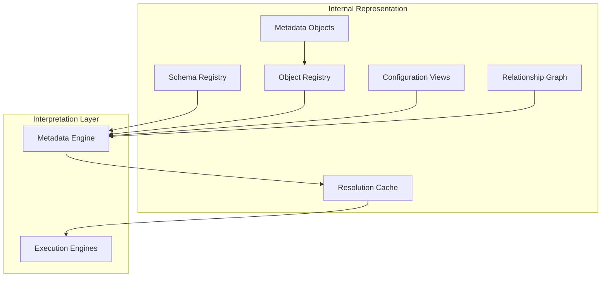

### 2.2 Platform Object inheritance

Every metadata record **is-a** Platform Object. Primitive type is a **role discriminator** — not a separate inheritance hierarchy.

```
PlatformObject (abstract envelope)
  ├── identity.*
  ├── metadata.*
  ├── configuration.*
  ├── lifecycle.*
  ├── relationships.*
  ├── dependencies.*
  ├── security.*
  ├── observability.* (derived)
  ├── governance.*
  ├── versioning.*
  ├── commercial.*
  ├── runtime.* (binding + instance)
  ├── audit.* (pointers)
  └── extensions.*

Capability : PlatformObject + metadata.technical.capability_tag
Workflow   : PlatformObject + metadata.technical.states
Provider   : PlatformObject + metadata.technical.provider_type
...
```

**Inheritance rules** ([PLATFORM_PRIMITIVES.md](./PLATFORM_PRIMITIVES.md) §4.6):

| Kind | Applies to | Semantics |
|------|------------|-----------|
| **Envelope inheritance** | All objects | Full Platform Object sections |
| **Specialisation inheritance** | Capability, Policy, Provider, Execution Profile | Child extends parent schema; single parent |
| **Configuration inheritance** | All objects | Child merges ancestor configuration |
| **Composition** | Solution Pack, Workflow, Studio | Parent owns or pins children |

### 2.3 Composition

**Composition** expresses **strong aggregation** in metadata:

- A **Solution Pack** composes references to Studios, Workflows, Policies, Providers, Capabilities, Execution Profiles, Plugins
- A **Workflow** composes step definitions referencing Capabilities
- A **Studio** composes default templates and namespace scope

Composition is stored as **typed relationship edges** with optional version pins:

```json
{
  "type": "composition",
  "target_primitive_type": "Workflow",
  "target_id": "wf-greenfield-001",
  "version_constraint": "^3.0.0",
  "pin": "3.2.1"
}
```

Composition does not duplicate child blobs; it **references** Published versions.

### 2.4 Configuration inheritance

Effective configuration is computed by the Metadata Engine using a **fixed merge order** ([PLATFORM_CONTRACTS.md](./PLATFORM_CONTRACTS.md) §7):

```
Global → Tenant → Environment → Project → User → Object
```

Within object scope:

```
Parent object defaults → Object defaults → Environment override → Object override
```

Merge is **deep** for objects; scalars and arrays **replace**. Result is cached as `effective_configuration` view.

### 2.5 Runtime resolution

Runtime resolution transforms **Active metadata bindings** into an **execution plan** — a materialised DAG consumed by Orchestrator and Agent Runtime without hardcoded domain logic.

Resolution inputs:

| Input | Source |
|-------|--------|
| Trigger event | Event Bus |
| Active Workflow version | Workflow Registry |
| Step Capability tags | Workflow metadata |
| Agent binding | Agent Registry by capability |
| Provider binding | Tool Registry by capability tag |
| Execution Profile | Referenced from Capability or Workflow step |
| Policies | Attached + global Active policies |
| Resources | Quotas from Resource + Entitlement |
| Context template | Assembled by Context Assembler |

Resolution output: **Execution Plan Document** (ephemeral, not Published) — see [§7](#7-execution-resolution).

---

## 3. Metadata engine

The **Metadata Engine** is the platform subsystem responsible for **all metadata lifecycle and resolution**. It is not the Orchestrator and does not execute Capabilities; it **materialises truth** for engines that do.

### 3.1 Responsibilities

| Responsibility | Description |
|----------------|-------------|
| **Object Registry** | Canonical index of all Platform Objects by tenant and primitive type |
| **Schema Registry** | JSON Schema (or equivalent) per primitive + extension schemas |
| **Validation** | Multi-layer validation before publish ([PLATFORM_CONTRACTS.md](./PLATFORM_CONTRACTS.md) §12) |
| **Composition** | Expand composition edges; verify pins and constraints |
| **Dependency resolution** | Build DAG; detect cycles |
| **Configuration resolution** | Compute `effective_configuration` per object and environment |
| **Configuration overrides** | Apply deterministic override stack (§6) — tenant, environment, object layers |
| **Runtime resolution** | Materialise Execution Plan Documents and Active bindings at dispatch time |
| **Inheritance** | Resolve specialisation parent chain |
| **Version resolution** | Select highest compatible Published version |
| **Lifecycle management** | State transitions; immutability on Published |
| **Publishing** | Freeze blob; index in registries |
| **Approval** | Integrate Human Approval Checkpoint + Policy |
| **Discovery** | Search, list, graph traversal APIs |

### 3.2 Metadata engine architecture

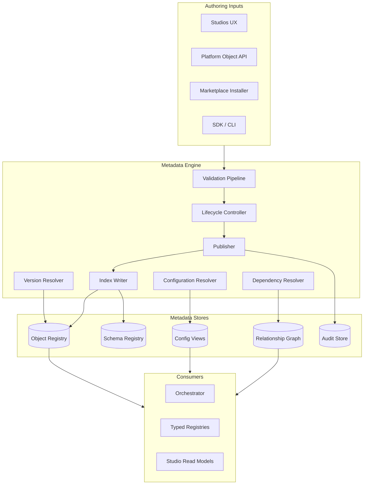

### 3.3 Processing pipelines

| Pipeline | Trigger | Output |
|----------|---------|--------|
| **Authoring** | Draft save | Validated draft blob |
| **Publish** | Transition to Published | Immutable version + registry index |
| **Activate** | Transition to Active | Environment binding record |
| **Resolve** | Workflow start / task dispatch | Execution Plan Document |
| **Install** | Marketplace install | Composed object graph + entitlement linkage |
| **Deprecate** | Lifecycle transition | Warning index + metrics flag |

### 3.4 Non-responsibilities

The Metadata Engine **must not**:

- Execute agent logic
- Call external Provider APIs directly
- Bypass Policy Engine
- Store secrets outside vault references
- Perform cross-tenant reads

---

## 4. Metadata schema

### 4.1 Canonical object document

Every Platform Object metadata document **must** contain the sections below. Sections map 1:1 to [PLATFORM_CONTRACTS.md](./PLATFORM_CONTRACTS.md) clauses.

| Section | Purpose | Persisted | Published immutable |
|---------|---------|-----------|---------------------|
| **Identity** | Who, what, where in namespace | Yes | Yes |
| **Metadata** | Business + technical description | Yes | Yes |
| **Configuration** | Declarative behaviour knobs | Yes | Yes (defaults); Active bindings may override |
| **Relationships** | Graph edges | Yes | Yes |
| **Dependencies** | Prerequisite DAG | Yes | Yes |
| **Capabilities** | *Primitive-specific:* Capability tags this object exposes or requires | Yes | Yes |
| **Policies** | Attached Policy references | Yes | Yes |
| **Execution Profile** | Default or bound profile refs | Yes | Yes |
| **Resources** | Resource reservations / quotas | Yes | Yes |
| **Context** | Context template refs (Workflow, Capability) | Yes | Yes |
| **Events** | Declared event types emitted | Yes | Yes |
| **Metrics** | Declared metric definitions | Yes | Yes |
| **Audit** | Audit policy + retention pointers | Yes | Yes |
| **Health** | Health check declarations | Yes | Yes |
| **Security** | RBAC, classification, visibility | Yes | Yes |
| **Commercial** | License, edition, entitlements | Yes | Yes |
| **Version** | Semver + changelog + compatibility | Yes | Yes |
| **Extension Points** | Plugin hooks, custom schemas | Yes | Yes |
| **Validation Rules** | Business rule refs | Yes | Yes |

> **Note:** `Capabilities`, `Policies`, `Execution Profile`, `Resources`, and `Context` sections appear as **reference blocks** on objects that bind them. Primitive-specific payload lives in `metadata.technical`.

### 4.2 Schema registry structure

```
schemas/
  platform-object.base.json          # envelope all primitives extend
  primitives/
    studio.json
    capability.json
    workflow.json
    provider.json
    execution-profile.json
    policy.json
    context.json
    resource.json
    artifact.json
    plugin.json
    solution-pack.json
    commercial-pack.json
    entitlement.json
  extensions/
    {tenant_id}/{schema_name}/{version}.json
```

### 4.3 Schema evolution rules

| Change | Schema bump | Migration |
|--------|-------------|-----------|
| Add optional field | MINOR | None |
| Add required field | MAJOR | Migration rule required |
| Rename field | MAJOR | Migration rule required |
| Tighten enum | MINOR or MAJOR | Depends on breakage |

### 4.4 Illustrative document skeleton

```json
{
  "identity": { },
  "metadata": { "business": {}, "technical": {}, "labels": {} },
  "configuration": { "defaults": {}, "schema_ref": "schemas/primitives/workflow.json" },
  "relationships": { "composition": [], "references": [], "parent": null },
  "dependencies": { "hard": [], "soft": [], "runtime": [] },
  "policies": { "attached": ["pol-uuid-1"] },
  "execution_profile": { "default_ref": "ep-standard-backend" },
  "resources": { "required": ["res-token-quota"] },
  "context": { "template_ref": "ctx-greenfield" },
  "events": { "emits": ["WorkflowStarted", "StateTransitioned"] },
  "metrics": { "declares": ["workflow_runs_total"] },
  "security": { },
  "commercial": { },
  "versioning": { "semver": "3.2.1", "changelog": "..." },
  "extensions": { },
  "validation": { "rules": ["rule-ref-1"] }
}
```

---

## 5. Registry architecture

### 5.1 Generic registry model

All primitives participate in a **two-tier registry**:

| Tier | Name | Scope |
|------|------|-------|
| **Tier 1** | **Platform Object Catalog** | Unified index — all primitives, all tenants |
| **Tier 2** | **Typed Registries** | Optimised views for resolution (capability index, tool index, etc.) |

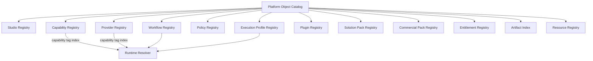

### 5.2 Registry record (normative shape)

Every registry entry **must** contain:

| Field | Purpose |
|-------|---------|
| `registry_id` | Entry identifier |
| `tenant_id` | Partition key |
| `primitive_type` | Discriminator |
| `object_id` | Platform Object id |
| `version` | Published semver |
| `status` | Lifecycle status |
| `name`, `namespace` | Discovery |
| `labels` | Indexed metadata |
| `capability_tags` | When applicable |
| `health` | Aggregate health |
| `effective_from` / `effective_to` | Optional window |
| `ownership` | Owner principal |

### 5.3 Registry operations

| Operation | Description |
|-----------|-------------|
| `register` | Index on Published |
| `deregister` | Mark Retired; remove from resolution |
| `lookup` | By id + version |
| `search` | By labels, name, status |
| `resolve_capability` | Tag → ranked Provider/Capability list |
| `resolve_version` | Constraint → highest compatible version |
| `health_aggregate` | Roll up dependency health |

### 5.4 Typed registry mapping

| Primitive | Typed registry | Primary index key |
|-----------|----------------|-------------------|
| Studio | Studio Registry | `namespace` |
| Capability | Capability Registry | `capability_tag` |
| Provider | Provider Registry | `capability_tags[]` |
| Workflow | Workflow Registry | `workflow_type` |
| Policy | Policy Registry | `enforcement_point` |
| Execution Profile | Execution Profile Registry | `name` |
| Plugin | Plugin Registry | `hooks[]` |
| Solution Pack | Solution Pack Catalog | `pack_type` |
| Commercial Pack | Commercial Pack Catalog | `sku` |
| Entitlement | Entitlement Registry | `tenant_id` + `sku` |
| Artifact | Artifact Index | `workflow_run_id` |
| Resource | Resource Registry | `resource_type` |

**Rule:** Typed registries are **materialised views** of the Object Catalog — not separate sources of truth.

### 5.5 Discovery

Discovery APIs support:

- Full-text search on `display_name`, `description`
- Label selectors (`domain=development,risk=high`)
- Graph traversal from any object
- Marketplace browse (global catalog with entitlement filter)

---

## 6. Configuration model

### 6.1 Configuration hierarchy

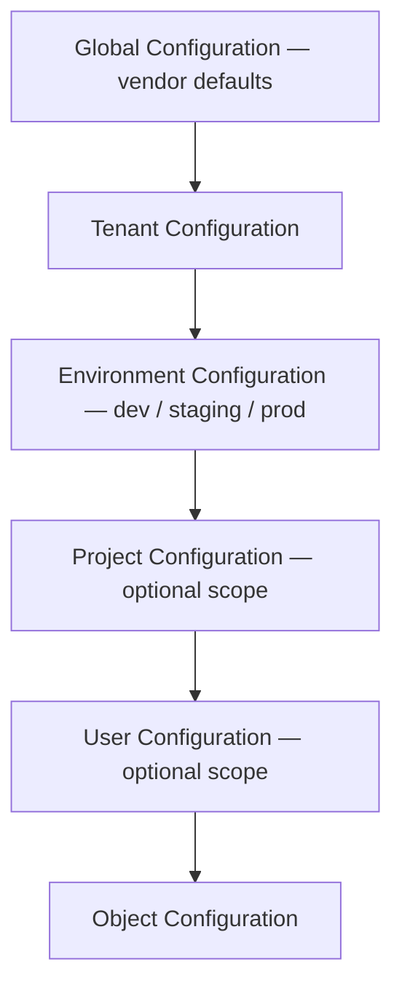

| Layer | Owner | Typical content |
|-------|-------|-----------------|
| **Global** | Platform vendor | Safe defaults, engine feature flags |
| **Tenant** | Customer admin | Org-wide limits, default Providers |
| **Environment** | Customer ops | Endpoints, ceilings, approval groups |
| **Project** | Team / programme | Namespace defaults, Workflow pins |
| **User** | Individual | UI preferences; non-security overrides only |
| **Object** | Object author | Primitive-specific declarative fields |

### 6.2 Override rules

| Rule ID | Rule |
|---------|------|
| `CFG-01` | Higher layer wins on scalar conflict |
| `CFG-02` | Object merge is deep for nested objects |
| `CFG-03` | Arrays replace entirely; no implicit merge |
| `CFG-04` | Security classifications cannot be lowered by User layer |
| `CFG-05` | Commercial limits cannot be raised by Tenant without Entitlement |
| `CFG-06` | Secrets never appear in any layer — vault refs only |

### 6.3 Inheritance rules

- Objects inherit from **parent object** in specialisation or composition hierarchy
- Solution Pack activation injects pack-level defaults at **Tenant** layer
- Commercial Pack injects edition defaults at **Tenant** layer

### 6.4 Conflict resolution

When concurrent drafts target same override path:

1. Optimistic locking on object `modified_at`
2. First Published wins for immutable blobs
3. Active binding conflicts require explicit admin resolution UI
4. Emit `ConfigurationConflictDetected` event

### 6.5 Materialised views

Metadata Engine maintains:

- `effective_configuration(tenant, environment, object_id, version)`
- `effective_configuration_hash` for cache invalidation

Studios and runtime read **materialised** effective config — not recompute per request.

---

## 7. Execution resolution

### 7.1 Resolution philosophy

Execution resolution is **declarative graph walking** — not hardcoded `if workflow == X` logic in Orchestrator. The Orchestrator interprets an **Execution Plan Document** produced by the Metadata Engine.

### 7.2 Resolution chain

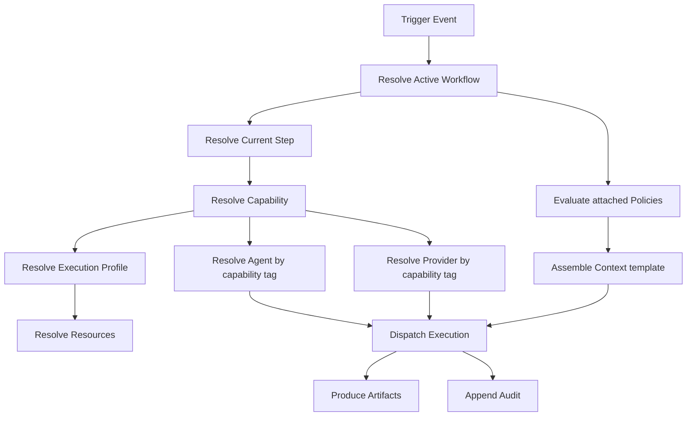

### 7.3 Resolution algorithm (normative outline)

```
1. LOAD trigger context (tenant_id, workflow_run_id, event_type)
2. RESOLVE workflow := WorkflowRegistry.active(trigger.workflow_type, tenant, environment)
3. RESOLVE step := workflow.state_machine.current_state(step_id)
4. RESOLVE capability := step.capability_tag
5. RESOLVE agent := AgentRegistry.resolve_capability(capability, tenant)
6. RESOLVE execution_profile := merge(step.profile_ref, capability.default_profile, workflow.default_profile)
7. RESOLVE providers := ProviderRegistry.resolve_capability(capability.required_provider_tags, tenant)
8. EVALUATE policies := PolicyEngine.attachments(workflow, step, capability, tenant)
9. IF deny THEN emit ExecutionDenied STOP
10. RESOLVE resources := ResourceRegistry.allocate(execution_profile.resource_refs, tenant)
11. ASSEMBLE context := ContextAssembler.build(step.context_template, workflow_run_id)
12. MATERIALISE ExecutionPlanDocument
13. DISPATCH to Agent Runtime (event-mediated)
14. ON completion RESOLVE artifact bindings and append audit
```

### 7.4 Execution plan document (ephemeral)

| Field | Source |
|-------|--------|
| `plan_id` | Generated UUID |
| `workflow_id`, `workflow_version` | Resolved Workflow |
| `step_id` | Current state |
| `capability_tag` | Step metadata |
| `agent_id` | Agent Registry |
| `execution_profile_id`, `version` | Merged profile |
| `provider_bindings[]` | Resolved Providers |
| `policy_evaluation_id` | Policy Engine |
| `resource_allocations[]` | Resource Registry |
| `context_handle` | Context Assembler |
| `effective_configuration_hash` | Config resolver |

Not Published; stored for run duration in working store; referenced in audit.

### 7.5 No hardcoded logic rule

Orchestrator **must not** contain domain-specific switches on customer object names. All branching derives from **workflow metadata** (guards, policies, capability tags).

---

## 8. Dependency model

### 8.1 Object relationships

Stored in **Relationship Graph** as directed, typed edges:

| Edge type | Use |
|-----------|-----|
| `parent` / `child` | Hierarchy |
| `references` | Loose coupling |
| `composes` | Strong aggregation |
| `extends` | Specialisation inheritance |
| `depends_on` | Dependency DAG |
| `associates` | Bidirectional link |

### 8.2 Composition vs inheritance vs dependency

| Concept | Question answered | Lifecycle |
|---------|-------------------|-----------|
| **Composition** | What is this object made of? | Parent may pin child versions |
| **Inheritance** | What schema/profile does this extend? | Child overrides parent fields |
| **Dependency** | What must exist first? | Hard deps block publish |

### 8.3 Dependency graph

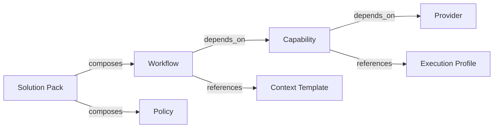

### 8.4 Circular dependency detection

Run **topological sort** on hard dependencies at publish time. Cycle → `DEPENDENCY_CYCLE` rejection.

Runtime dependencies may use **lazy resolution** — resolved at execute time if optional.

### 8.5 Lazy vs eager resolution

| Mode | When | Use |
|------|------|-----|
| **Eager** | Publish / Activate | Hard dependencies |
| **Lazy** | Execute | Runtime dependencies, optional providers |
| **Cached** | Post-first resolution | Stable Provider bindings per tenant |

---

## 9. Persistence strategy

### 9.1 Metadata vs transactional data

| Class | Nature | Examples | Ownership |
|-------|--------|----------|-----------|
| **Metadata** | Declarative, versioned, Published immutable | Workflow, Policy, Provider | Metadata Engine / Object Registry |
| **Transactional** | Ephemeral run state | Task state, execution plan | Task Engine |
| **Reference data** | Slow-changing lookup | Capability tag catalog, edition flags | Platform vendor |
| **Master data** | Tenant-owned definitions | Tenant Providers, custom Policies | Tenant |
| **Event data** | Stream | Kafka topics | Event Bus |
| **Audit data** | Append-only | Approvals, mutations | Audit Store |
| **Historical data** | Cold archive | Retired object versions | Metadata Engine archive tier |
| **Vector knowledge** | Embeddings + metadata | Long-term memory | Memory Store |
| **Cache** | Derived | Effective config, resolution | Redis or equivalent |

**Rule:** Metadata is **not** task state. Task state is **not** metadata. Never conflate stores ([CONSTITUTION.md](../../CONSTITUTION.md) M2).

### 9.2 Storage patterns

| Pattern | Apply to |
|---------|----------|
| **Immutable versioned blobs** | Published Platform Objects |
| **Mutable draft store** | Draft lifecycle only |
| **Active binding table** | `(tenant, environment, primitive_type, name) → version` |
| **Graph store** | Relationships |
| **Append-only log** | Audit |
| **Time-series** | Metrics |
| **Object storage** | Large Artifact payloads (URI reference in metadata) |
| **Vector index** | Memory embeddings with metadata filters |

### 9.3 Ownership boundaries

| Store | Writer | Reader |
|-------|--------|--------|
| Object Registry | Metadata Engine | All engines, Studios |
| Task state | Task Engine | Orchestrator, Agent Runtime |
| Audit | All services (append) | Governance, Studios |
| Memory | Memory Service | Context Assembler |
| Secrets | Secrets Vault | Providers at invoke time |

**No service reads another service's owned store directly** ([CONSTITUTION.md](../../CONSTITUTION.md) AR5). Cross-boundary access is via API or events.

### 9.4 SQL vs document guidance

| Prefer relational | Prefer document |
|-------------------|-----------------|
| Lifecycle transitions (ACID) | Variable `metadata.technical` payloads |
| Active binding pointers | Large Workflow state machine JSON |
| Audit adjacency | Extension custom metadata |

Canonical store choice is implementation — **logical model** in this document is binding.

---

## 10. Event model

### 10.1 Metadata change events

Every metadata mutation **must** emit an Event Bus message using the standard envelope ([contracts/event-envelope.schema.json](../../contracts/event-envelope.schema.json)).

### 10.2 Normative metadata event types

| Event | When |
|-------|------|
| `ObjectCreated` | First persist |
| `ObjectUpdated` | Draft mutation |
| `ObjectPublished` | Transition to Published |
| `ObjectDeprecated` | Transition to Deprecated |
| `ObjectArchived` | Transition to Archived |
| `ObjectRetired` | Terminal state |
| `ObjectInstalled` | Marketplace / Solution Pack install |
| `ObjectConfigured` | Effective configuration changed |
| `ObjectApproved` | Governance approval recorded |
| `ObjectValidationFailed` | Publish blocked |
| `ObjectLifecycleTransitioned` | Any lifecycle change |

### 10.3 Runtime metadata events

| Event | When |
|-------|------|
| `ExecutionResolved` | Execution Plan materialised |
| `ExecutionStarted` | Dispatch to Agent Runtime |
| `ExecutionCompleted` | Success |
| `ExecutionFailed` | Failure |
| `ArtifactCreated` | Output registered |

### 10.4 Event payload requirements

All metadata events include:

```
tenant_id, object_id, primitive_type, object_version, actor_principal, timestamp
```

Subscribers **must** be idempotent ([CONSTITUTION.md](../../CONSTITUTION.md) event principles).

### 10.5 Event-driven registry updates

Typed registries update from events — not synchronous dual-writes. **Eventual consistency** bounded by SLO (target: < 2s index freshness).

---

## 11. Runtime composition

### 11.1 Customer composition without code

Customers build an **Engineering Platform instance** by binding metadata:

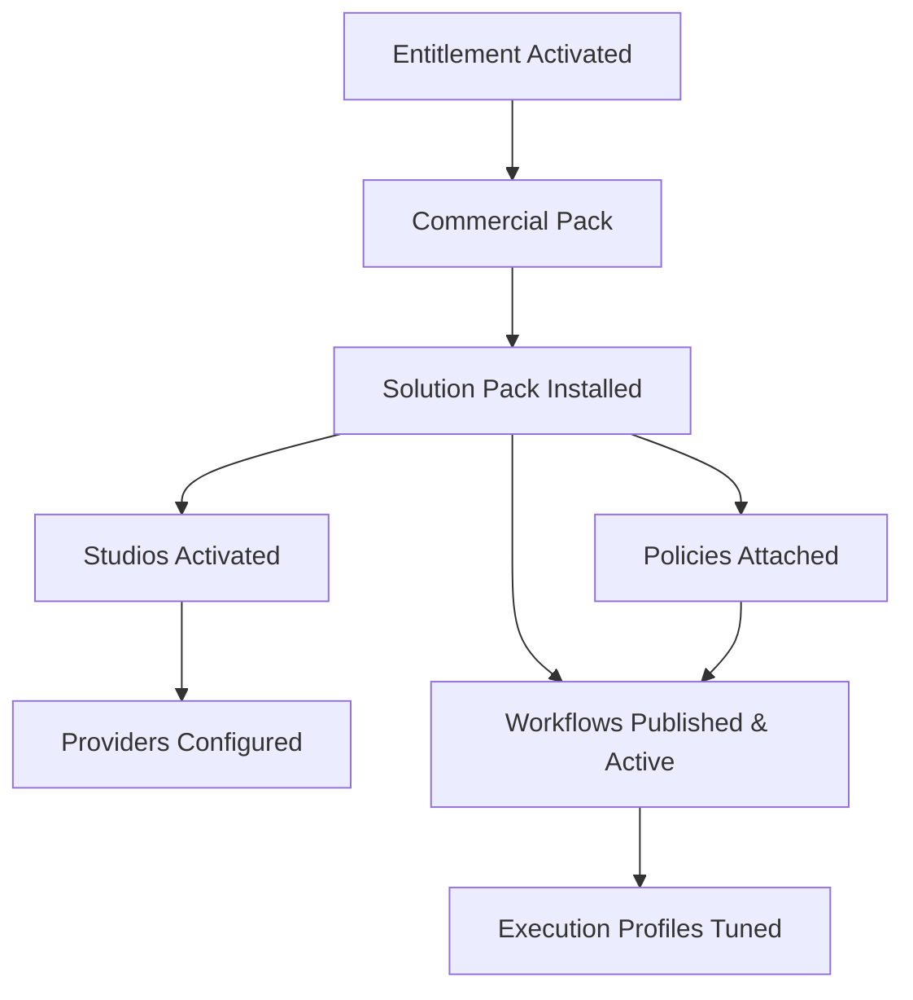

### 11.2 Composition activities (metadata only)

| Activity | Primitive | Action |
|----------|-----------|--------|
| Enable edition | Entitlement | Grant SKU |
| Install vertical pack | Solution Pack | Compose objects into tenant |
| Open Studio | Studio | Activate namespace |
| Connect GitHub | Provider | Publish connector config |
| Set model limits | Execution Profile | Override cost ceiling |
| Customise release process | Workflow | Clone template → edit states → publish |
| Add compliance | Policy | Attach to Workflow transitions |
| Extend normalisation | Plugin | Register hook |

### 11.3 Active binding model

Per environment, tenant maintains **Active binding table**:

```
(tenant_id, environment, primitive_type, logical_name) → published_version_id
```

Runtime resolution uses Active bindings — not latest Published globally.

---

## 12. Marketplace integration

### 12.1 Philosophy

The **Marketplace** distributes **metadata packages and plugins** — never platform binaries and **never business logic**. Marketplace content is declarative configuration interpreted by immutable engines.

**Distributed artefact types (Architecture v2):**

| Category | Examples |
|----------|----------|
| **Provider Plugins** | Connectors, MCP servers, certified agents |
| **Workflow Plugins** | Workflow templates and step libraries |
| **Policy Plugins** | Policy rule packs |
| **Execution Profiles** | Reusable model and prompt profiles |
| **Knowledge Packs** | Context templates and corpora |
| **Solution Packs** | Composed industry, team, or engineering bundles |
| **Studio Extensions** | Studio UX and dashboard plugins |
| **UI Extensions** | Design-system and inspector extensions |

Installation **updates registries automatically** via Metadata Engine install pipeline. Connectors (Provider Plugins) **auto-register** capability advertisements on install.

### 12.2 Install pipeline

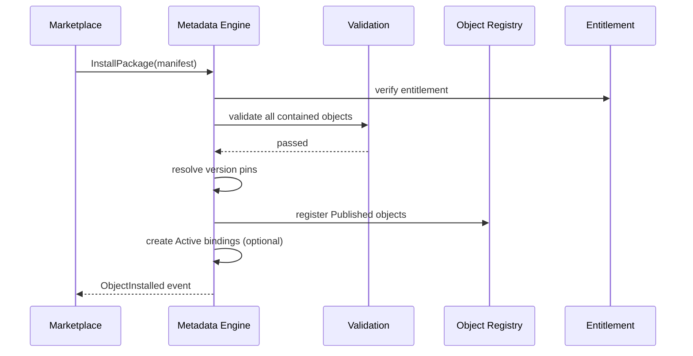

### 12.3 Package manifest

| Field | Purpose |
|-------|---------|
| `package_id`, `version` | Package identity |
| `contains[]` | Object blobs or references |
| `prerequisites` | Platform version, entitlements |
| `activation_script` | Ordered bind operations (metadata) |
| `signature` | Integrity verification |

### 12.4 No hardcoded registration

Marketplace **must not** require code registration in Platform Core. Install pipeline writes to **Object Catalog** and emits **ObjectInstalled** — typed registries update from events.

### 12.5 Uninstall / upgrade

| Operation | Behaviour |
|-----------|-----------|
| **Upgrade** | New package version; migration rules; Active pointer update |
| **Uninstall** | Deprecate pack objects; remove Active bindings; Retire if unused |
| **Rollback** | Reactivate prior Active binding set (audit required) |

---

## 13. Extension model

### 13.1 Partner extensions

Partners extend the platform by publishing **metadata + optional Plugin bundles**:

| Extension | Delivered as |
|-----------|--------------|
| Studio | Studio object + Studio UX Plugin |
| Capability | Capability metadata + Provider registration |
| Workflow | Workflow template metadata |
| Policy | Policy rule metadata |
| Execution Profile | Profile metadata |
| Connector | Provider metadata (`provider_kind: connector`) + Plugin normaliser |
| Plugin | Plugin metadata + signed artefact |

### 13.2 Certification

Partner objects pass **validation + security review** before marketplace **certified** flag. Tenants may install uncertified objects only with explicit admin policy.

### 13.3 No Platform Core modification

**Forbidden:** Partner patches to Orchestrator, Metadata Engine, or Agent Runtime source.

**Required:** All behaviour through declared hooks ([PLATFORM_CONTRACTS.md](./PLATFORM_CONTRACTS.md) §19).

### 13.4 SDK extensions

SDKs may provide **authoring helpers** — they generate metadata documents conforming to Schema Registry. SDKs do not bypass server validation.

---

## 14. Platform rules

| ID | Rule |
|----|------|
| **MM-01** | No customer-specific implementation inside Platform Core |
| **MM-02** | Everything configurable through metadata |
| **MM-03** | Everything versioned (Published immutable) |
| **MM-04** | Everything governed (lifecycle + policy) |
| **MM-05** | Everything observable (automatic telemetry) |
| **MM-06** | Everything auditable (append-only) |
| **MM-07** | Everything measurable (usage + cost meters) |
| **MM-08** | Metadata and transactional state physically separated |
| **MM-09** | Typed registries are views — Object Catalog is canonical |
| **MM-10** | Resolution is declarative — no domain switches in engines |
| **MM-11** | Marketplace installs metadata — not core code |
| **MM-12** | `tenant_id` partitions all metadata stores |
| **MM-13** | Connectors are Provider metadata ([PLATFORM_PRIMITIVES.md](./PLATFORM_PRIMITIVES.md) §5.1) |
| **MM-14** | Effective configuration is materialised — not ad hoc per service |
| **MM-15** | Cross-store access only via API or events |
| **MM-16** | Metadata Engine owns configuration overrides and runtime resolution |
| **MM-17** | Provider Builder output is validated Provider metadata — no core code paths |
| **MM-18** | Marketplace never hosts executable business logic |
| **MM-19** | Customer-specific behaviour is metadata-only ([PLATFORM_PRIMITIVES.md](./PLATFORM_PRIMITIVES.md) PR-03) |

---

## 15. Conceptual diagrams

### 15.1 Metadata engine (summary)

See [§3.2](#32-metadata-engine-architecture).

### 15.2 Registry model (summary)

See [§5.1](#51-generic-registry-model).

### 15.3 Composition model

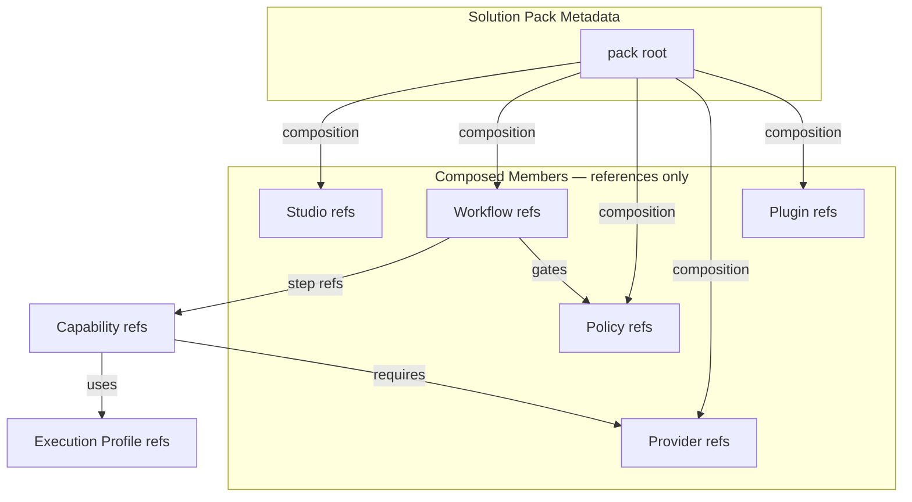

### 15.4 Execution resolution (summary)

See [§7.2](#72-resolution-chain).

### 15.5 Configuration hierarchy (summary)

See [§6.1](#61-configuration-hierarchy).

### 15.6 Object relationships (summary)

See [§8.3](#83-dependency-graph).

### 15.7 Runtime resolution (end-to-end)

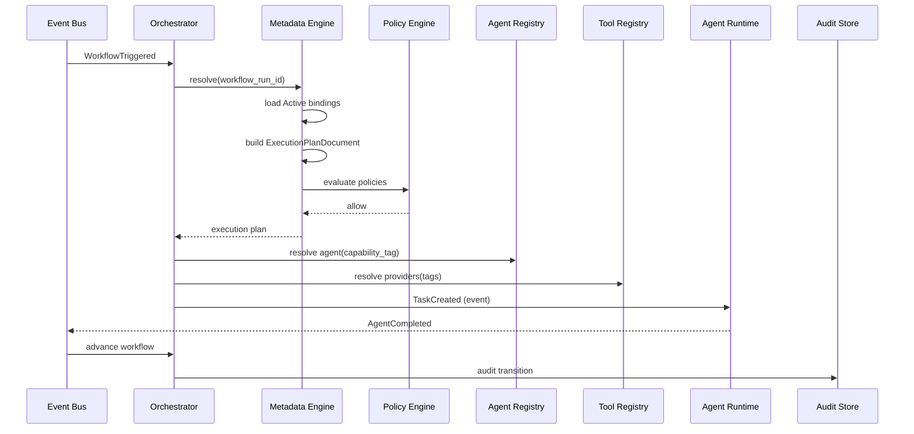

### 15.8 Document authority stack

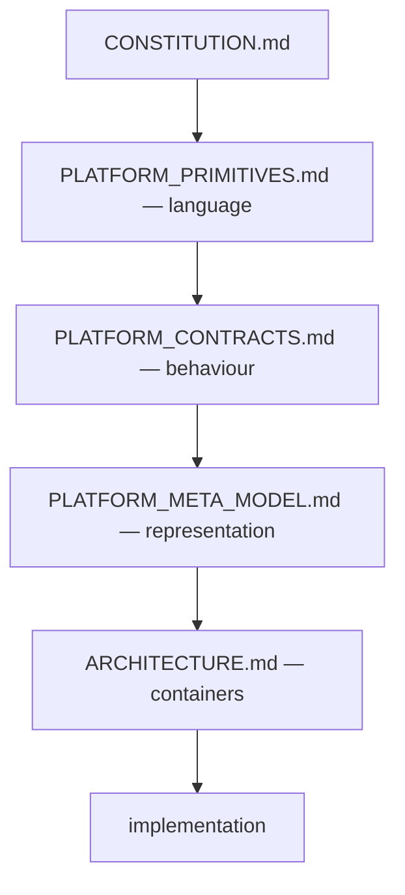

---

## Appendix A — Salesforce / ServiceNow / Kubernetes mapping

| External concept | Platform meta model |
|------------------|---------------------|
| Salesforce Custom Object | Platform Object + primitive |
| Salesforce Flow | Workflow metadata |
| Salesforce Connected App | Provider metadata |
| ServiceNow Workflow | Workflow metadata |
| ServiceNow IntegrationHub spoke | Provider (Connector) |
| ServiceNow Update Set | Solution Pack manifest |
| Kubernetes desired state YAML | Published Workflow + Policy metadata |
| Kubernetes controller | Orchestrator + engines |
| Helm chart | Solution Pack |

---

## Appendix B — Metadata engine SLOs (informative)

| SLO | Target |
|-----|--------|
| Publish validation latency | p99 < 2s |
| Registry index freshness after event | < 2s |
| Resolution latency (cached) | p99 < 50ms |
| Resolution latency (cold) | p99 < 500ms |
| Effective configuration cache hit rate | > 95% |

---

## Appendix C — Glossary

| Term | Definition |
|------|------------|
| **Metadata** | Declarative Platform Object representation |
| **Published** | Immutable approved metadata version |
| **Active binding** | Environment-specific version selection |
| **Execution Plan Document** | Ephemeral resolved execution graph |
| **Object Catalog** | Canonical metadata index |
| **Materialised view** | Derived registry or config cache |
| **Connector** | Provider metadata for external integration |

---

*This document is the internal representation standard from which every service, API, registry, database schema, SDK, workflow, UI, plugin, and execution engine is derived. Implementation must conform to this meta model — not redefine it.*
