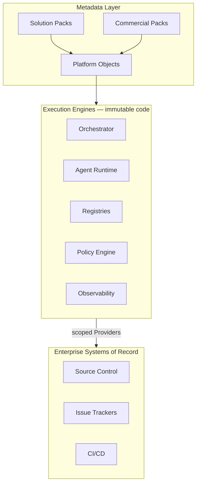
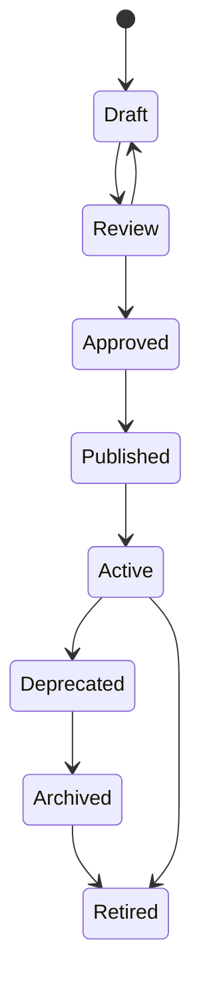
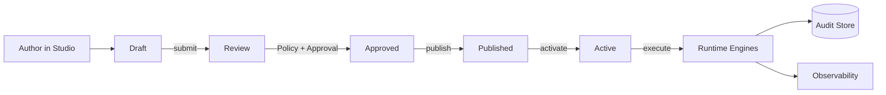
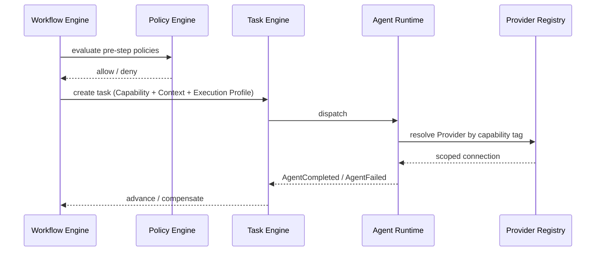
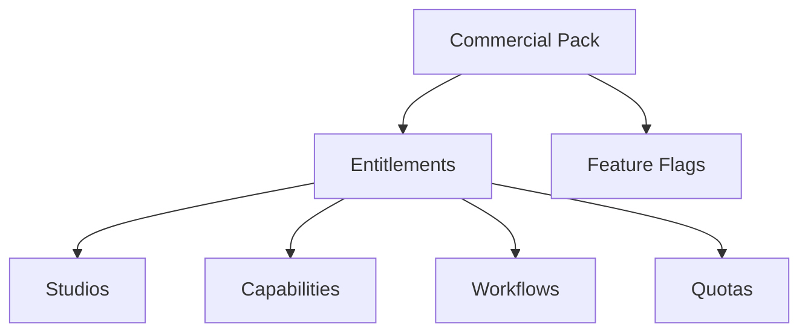
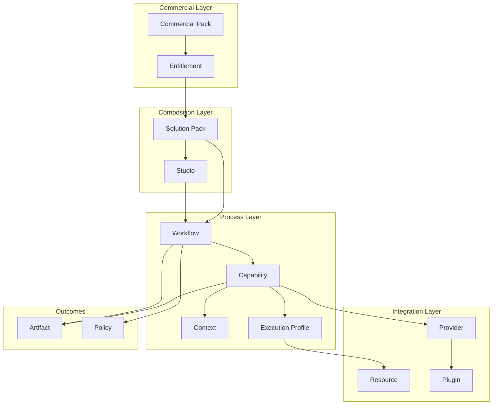
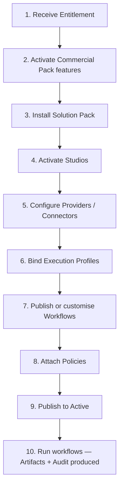

# Agentic Engineering Platform — Platform Primitives

**Status:** Normative architectural meta-model  
**Version:** 2.0 (extends v1.0; backward compatible)  
**Effective:** 1 July 2026  
**Architecture release:** Platform Architecture v2  
**Authority:** Subordinate to [CONSTITUTION.md](../../CONSTITUTION.md); supersedes all product and implementation documents on matters of platform object semantics  
**Audience:** Chief architects, platform engineers, Studio owners, integration partners, enterprise customers

---

## Document charter

This document defines the **universal language** of the Agentic Engineering Platform.

It is **not** implementation documentation, a delivery roadmap, or a product specification. It is the **Platform Meta Model** from which every service, API, database schema, SDK, workflow, UI surface, and plugin is derived.

After reading this document, an engineer should understand that **Studios**, **Capabilities**, **Providers**, **Policies**, **Execution Profiles**, **Workflows**, **Resources**, **Artifacts**, **Plugins**, **Solution Packs**, **Commercial Packs**, and **Entitlements** are specialised **Platform Objects** with additional domain behaviour — not parallel type systems.

**Stability intent:** Primitive names, the Platform Object envelope, lifecycle states, and platform rules defined here are designed to remain valid for years. Domain semantics may evolve through **versioned metadata** and **Solution Packs**, not through ad hoc code forks.

---

## Table of contents

1. [Platform philosophy](#1-platform-philosophy)
2. [Metadata-driven platform](#2-metadata-driven-platform)
3. [Platform Object](#3-platform-object)
4. [Cross-cutting models](#4-cross-cutting-models)
5. [Primitive catalog](#5-primitive-catalog)
6. [Primitive specifications](#6-primitive-specifications)
7. [Relationship model](#7-relationship-model)
8. [Platform rules](#8-platform-rules)
9. [Customer composition](#9-customer-composition)
10. [Governance of this document](#10-governance-of-this-document)

---

## 1. Platform philosophy

### 1.1 What the platform is

The Agentic Engineering Platform is a **metadata-driven orchestration plane** for enterprise software engineering. It coordinates people, AI agents, external tools, and governance structures that an organisation already operates. It is a **planner and referee**, never a player ([CONSTITUTION.md](../../CONSTITUTION.md) — Core Philosophy).

The platform introduces **no new system of record**. It orchestrates authoritative systems — source control, issue trackers, CI/CD, security scanners, identity providers — through scoped, capability-based contracts.

### 1.2 Design convictions

| Conviction | Meaning |
|------------|---------|
| **One object model** | Every definable platform entity is a Platform Object. Primitives are roles, not separate frameworks. |
| **Metadata over code** | Behaviour, composition, and policy are declared in versioned metadata. Code implements engines; customers configure outcomes. |
| **Events, not calls** | Runtime coordination is event-mediated. Objects publish facts; engines decide transitions ([CONSTITUTION.md](../../CONSTITUTION.md) P3). |
| **Humans at gates** | Non-bypassable human approval is a first-class primitive concern, not a UI afterthought. |
| **Tenant sovereignty** | Every object is tenant-scoped. Cross-tenant visibility is forbidden by construction. |
| **Audit by default** | If an action occurred, it is reconstructable from immutable audit records. |
| **Extension without fork** | Customers and partners extend through Plugins, Solution Packs, and metadata — not platform source modification. |
| **Configuration over customization** | Customers assemble Studios, Providers, Workflows, and Packs from metadata; platform source remains unchanged (§4.13). |

### 1.3 Architectural stance



**Engines are shared and versioned by the platform vendor.** **Objects are composed and versioned by the customer.** This separation is what makes the platform reusable across industries without per-tenant code forks.

---

## 2. Metadata-driven platform

### 2.1 Why metadata-driven

Traditional engineering platforms hard-code workflows, integrations, and policies into application logic. Every new customer segment requires engineering time. Every regulatory change requires a release train.

The Agentic Engineering Platform inverts this: **engines interpret metadata**. A Workflow is not a hard-coded state machine in code; it is a **published Platform Object** the Workflow Engine executes. A Provider is not an import of a vendor SDK in agent logic; it is a **registered integration profile** the Tool Registry resolves at runtime.

This is how the platform achieves **Salesforce-class configurability** and **ServiceNow-class process composition** while remaining an **engineering orchestration** product rather than a generic low-code tool.

### 2.2 Metadata-driven vs code-driven

| Dimension | Code-driven (anti-pattern) | Metadata-driven (platform) |
|-----------|---------------------------|----------------------------|
| New workflow | Deploy new service version | Publish new Workflow object |
| New tool integration | Patch agent imports | Register Provider + Capability bindings |
| Policy change | Conditional logic in orchestrator | Publish Policy object; engine evaluates |
| Customer variation | Fork repository per tenant | Compose Solution Pack from primitives |
| Upgrade path | Merge customer forks | Migrate metadata versions |
| Audit | Parse logs | Query object audit envelope |

### 2.3 Configuration surfaces

Customers and operators interact with metadata through **Studios** — product modules that expose designers for Workflows, Policies, Providers, Execution Profiles, and Solution Packs. Studios are themselves Platform Objects; they do not bypass the meta model.

**Runtime rule:** No production path may read customer intent from source code. Customer intent lives in **published Platform Object metadata** stored in platform registries and configuration services.

### 2.4 Derivation chain

```
Platform Object (abstract)
    → Primitive (role)
        → Published metadata instance
            → Runtime execution (task, event, trace)
                → Artifact (output)
                    → Audit record (immutable)
```

Every API, SDK method, UI screen, and database table that represents definable platform intent **must map to this chain**.

---

## 3. Platform Object

The **Platform Object** is the **conceptual base class** and foundational abstraction of the entire platform. Every Platform Primitive **inherits** this specification in full — Studios, Capabilities, Workflows, Providers, Policies, Execution Profiles, Context, Resources, Artifacts, Plugins, Solution Packs, Commercial Packs, and Entitlements are all specialisations of Platform Object. No primitive may redefine, subset, or replace any section below.

All platform services, APIs, registries, SDKs, UI components, database entities, and plugins **must** treat primitives through this common envelope.

### 3.1 Identity

| Field | Type (conceptual) | Required | Description |
|-------|-------------------|----------|-------------|
| `id` | UUID v4 | Yes | Globally unique object identifier within tenant namespace |
| `name` | kebab-case string | Yes | Machine name; stable across versions within namespace |
| `display_name` | string | Yes | Human-facing label for UI and reports |
| `description` | string | Yes | Purpose and scope in business language |
| `version` | semver string | Yes | Semantic version of this object instance |
| `namespace` | string | Yes | Logical grouping (studio, domain, or organisational unit) |
| `tenant_id` | string | Yes | Owning tenant; mandatory on all queries |
| `owner` | principal reference | Yes | Responsible party (user, group, or service account) |
| `created_by` | principal reference | Yes | Actor who created the object |
| `created_at` | ISO 8601 timestamp | Yes | Creation time (UTC) |
| `modified_at` | ISO 8601 timestamp | Yes | Last metadata mutation time (UTC) |
| `status` | lifecycle enum | Yes | Current lifecycle state (see §4.1) |
| `tags` | string[] | No | Searchable labels |
| `category` | string | No | Taxonomy bucket for browse/filter UX |

**Identity invariants**

- `id` is immutable after creation.
- `name` + `namespace` + `tenant_id` + major version uniquely identifies a **family**; individual revisions are addressed by full semver.
- Objects are never deleted; they transition to **Retired** (see lifecycle).

### 3.2 Metadata

| Sub-section | Purpose |
|-------------|---------|
| **Business metadata** | Intent, outcomes, KPIs, business owner narrative |
| **Technical metadata** | Engine hints, runtime selectors, schema references |
| **Custom metadata** | Tenant-defined key-value properties |
| **Labels** | Indexed key-value pairs for selection and policy |
| **Annotations** | Non-indexed notes and tooling hints |
| **Classification** | Data sensitivity, regulatory scope |
| **Documentation links** | URIs to ADRs, runbooks, external specs |
| **Examples** | Reference instances for authors and validators |

Metadata **must** be extensible without platform code changes. Unknown keys are preserved and forwarded. Engines ignore keys they do not understand.

### 3.3 Configuration

| Sub-section | Purpose |
|-------------|---------|
| **Default configuration** | Vendor-supplied baseline |
| **Customer overrides** | Tenant-specific values |
| **Environment overrides** | Dev / staging / prod deltas |
| **Configuration validation** | JSON Schema or policy-backed constraints |
| **Configuration templates** | Reusable partial configurations |
| **Configuration history** | Immutable prior values for rollback |

Configuration supports **inheritance**: child objects merge parent configuration depth-first; explicit child values win. Merge semantics are deterministic and logged in audit.

### 3.4 Lifecycle

Every Platform Object follows the **same** lifecycle state machine:



| State | Meaning |
|-------|---------|
| **Draft** | Editable by authors; not executable |
| **Review** | Awaiting governance approval |
| **Approved** | Governance accepted; not yet visible to runtime |
| **Published** | Immutable version available for binding |
| **Active** | Selected for runtime use in an environment |
| **Deprecated** | Usable but discouraged; successors identified |
| **Archived** | Not selectable for new bindings; historical retention |
| **Retired** | No runtime use; audit retention only |

**Lifecycle transitions are governed by Policy.** The Policy Engine may require Human Approval Checkpoint records before `Review → Approved` or `Approved → Published`.

No primitive may introduce an alternate lifecycle.

### 3.5 Dependencies

| Sub-section | Purpose |
|-------------|---------|
| **Depends on** | Objects required for validity |
| **Required by** | Inverse dependency index (maintained by registry) |
| **Optional dependencies** | Enhance but do not block |
| **Runtime dependencies** | Must be Active at execution time |
| **Version constraints** | Semver ranges (`^`, `~`, exact) |
| **Dependency graph** | Materialised DAG for impact analysis |
| **Circular dependency detection** | Publish-time validation; cycles reject publication |

### 3.6 Relationships

| Relationship type | Cardinality | Meaning |
|-------------------|-------------|---------|
| **Parent** | 0..1 | Containment in hierarchy |
| **Children** | 0..n | Owned descendants |
| **Associations** | 0..n | Loose coupling |
| **Composition** | 0..n | Strong aggregate (lifecycle bound) |
| **Inheritance** | 0..1 | Specialisation of another object |
| **References** | 0..n | Non-owning pointer |
| **Linked objects** | 0..n | Cross-primitive navigation |
| **Relationship graph** | — | Exposed via Platform Object API and UI graph |

### 3.7 Security

| Sub-section | Purpose |
|-------------|---------|
| **RBAC** | Role bindings on object and operations |
| **Ownership** | Primary owner and delegates |
| **Visibility** | Tenant-wide, namespace, or restricted |
| **Permissions** | CRUD + execute + publish matrix |
| **Secrets** | References to Secrets Vault handles only — never inline values |
| **Authentication** | Required identity strength |
| **Authorization** | Policy and RBAC evaluation order |
| **Approval requirements** | Gate definitions for sensitive transitions |
| **Security classification** | Public, internal, confidential, restricted |
| **Least privilege** | Default deny; explicit grants only |

No primitive may introduce its own security model.

### 3.8 Observability

Every Platform Object **must** emit telemetry automatically — **no primitive is exempt**:

| Signal | Requirement |
|--------|-------------|
| **Events** | Lifecycle and runtime facts on Event Bus |
| **Metrics** | Counters and histograms with `tenant_id`, `object_id`, `primitive_type` |
| **Logs** | Structured JSON with correlation IDs |
| **Distributed traces** | Spans for publish, validate, execute paths |
| **Audit records** | Immutable mutation and execution audit entries |
| **Health** | Aggregate health derived from dependencies |
| **Cost** | Token, compute, and external API cost attribution |
| **Usage** | Invocation counts, metering dimensions |
| **Performance** | Latency percentiles per operation |
| **Correlation IDs** | `task_id`, `workflow_run_id`, `trace_id`, `span_id` on every signal |
| **Execution history** | Append-only run records (retained) |

No primitive may introduce its own observability model.

### 3.9 Governance

| Sub-section | Purpose |
|-------------|---------|
| **Approval workflow** | Required approver roles per transition |
| **Compliance rules** | Regulatory tags and control mappings |
| **Audit trail** | Immutable change record |
| **Policy enforcement** | Attached Policy objects evaluated on mutation and execution |
| **Retention rules** | Data lifecycle for metadata and outputs |
| **Data classification** | Handling constraints |
| **Risk level** | Low / medium / high / critical |
| **Business owner** | Accountable executive sponsor |
| **Technical owner** | Accountable engineering sponsor |

### 3.10 Versioning

| Sub-section | Purpose |
|-------------|---------|
| **Semantic version** | MAJOR.MINOR.PATCH |
| **Draft version** | Pre-publish mutable workspace |
| **Published version** | Immutable snapshot |
| **Rollback support** | Reactivate prior Published version |
| **Compatibility matrix** | Declared interoperability between versions |
| **Migration rules** | Automated or guided metadata upgrades |
| **Change history** | Human-readable changelog per version |

**Versioning rules**

- **MAJOR** — breaking change to runtime contract or consumer interpretation
- **MINOR** — backward-compatible capability addition
- **PATCH** — backward-compatible correction

No primitive may introduce its own versioning model.

### 3.11 Extension points

| Extension | Mechanism |
|-----------|-----------|
| **Plugins** | Registered Plugin objects hook engine callbacks |
| **Hooks** | Pre/post execution interception points |
| **Events** | Subscribe to primitive lifecycle and runtime events |
| **Callbacks** | Synchronous policy or validation callbacks (timeout bounded) |
| **Policies** | Declarative rules attached to objects |
| **Custom actions** | Named operations exposed in Studio UX |
| **Custom metadata** | Schema-registered tenant extensions |
| **Customer extensions** | Packaged as Solution Pack or Plugin — never core fork |

**Rule:** No Platform Object shall require source-code modification to extend.

### 3.12 Validation

Validation runs at **authoring**, **publish**, and **runtime** boundaries:

| Validator | When |
|-----------|------|
| **Schema validation** | Structure and types |
| **Business rule validation** | Domain constraints |
| **Dependency validation** | Graph acyclicity and version satisfaction |
| **Policy validation** | Governance and compliance |
| **Configuration validation** | Merged config against schema |
| **Security validation** | Permissions, classification, secret references |

Failed publish validation **blocks** transition to Published.

### 3.13 Commercial

| Sub-section | Purpose |
|-------------|---------|
| **License required** | Boolean; ties to Commercial Pack |
| **Edition** | Product edition gate |
| **Entitlements** | Entitlement objects granting use |
| **Usage limits** | Numeric caps |
| **Quota** | Metered consumption thresholds |
| **Billing metrics** | Named meters for chargeback |
| **Feature flags** | Boolean capability switches |
| **Commercial policies** | Payment, renewal, suspension rules |

### 3.14 Runtime behaviour

| Sub-section | Purpose |
|-------------|---------|
| **Execution state** | Idle, scheduled, running, succeeded, failed, compensating |
| **Current status** | Human-readable runtime summary |
| **Retry policy** | Backoff, max attempts, idempotency key strategy |
| **Timeout** | Wall-clock and processing limits |
| **Execution profile** | Bound Execution Profile object |
| **Scheduling** | Cron, event-triggered, or manual |
| **Resource consumption** | CPU, memory, tokens, API calls |
| **SLA** | Target latency and availability |

### 3.15 Audit

| Field | Purpose |
|-------|---------|
| **Who created** | Principal |
| **Who changed** | Principal per mutation |
| **When changed** | Timestamp |
| **Reason** | Required for production mutations |
| **Approval history** | Gate decisions |
| **Execution history** | Run-level record |
| **Configuration changes** | Diff of config merges |
| **Security events** | AuthZ denials, secret access |

Audit records are **append-only** and tenant-scoped.

---

## 4. Cross-cutting models

### 4.1 Lifecycle model (normative)

See §3.4. All primitives use identical states and transitions.

### 4.2 Common metadata model

All primitives carry §3.2 in full. Primitive specifications below define **additional technical metadata keys** only.

### 4.3 Governance model



**Governance principles**

1. **Separation of duties** — authors ≠ approvers for high-risk objects.
2. **Immutable publish** — Published versions are never mutated; new version supersedes.
3. **Policy precedes execution** — no runtime path bypasses Policy Engine evaluation.
4. **Human gates are records** — approval without audit record is void ([CONSTITUTION.md](../../CONSTITUTION.md)).

### 4.4 Observability model

Telemetry is **object-centric**. Every signal includes:

```
tenant_id, object_id, primitive_type, object_version, workflow_run_id, task_id, emitted_by
```

Engines attach primitive-specific attributes without removing the common envelope.

### 4.5 Versioning model

See §3.10. **Binding rule:** Runtime bindings reference exact Published semver or a resolved "latest compatible" range declared in Solution Pack metadata — never floating unversioned references in production.

### 4.6 Inheritance model

| Inheritance kind | Applies to | Semantics |
|------------------|------------|-----------|
| **Configuration inheritance** | All objects | Child merges parent configuration |
| **Specialisation inheritance** | Capability, Policy, Provider, Execution Profile | Child extends parent schema; parent must be Published |
| **Studio inheritance** | Studio | Child Studio inherits default Workflows and Policies |

Inheritance is **single-parent** for specialisation. Multiple composition relationships are allowed.

### 4.7 Composition model

| Pattern | Description | Example |
|---------|-------------|---------|
| **Aggregation** | Solution Pack composes primitives | Pack contains Workflows + Policies + Providers |
| **Strong composition** | Child lifecycle bound to parent | Workflow step references Capability |
| **Reference** | Non-owning link | Workflow references Execution Profile by id |

Composition depth is limited (max 8 levels) at publish time to prevent runaway graphs.

### 4.8 Extension model

Extensions enter the platform only through:

1. **Plugin** — code + metadata registered in Plugin Registry
2. **Solution Pack** — metadata-only or pack+plugin bundles
3. **Custom metadata schemas** — registered extensions validated at publish

Extensions **cannot** modify engine source or bypass CONSTITUTION principles.

### 4.9 Configuration model

```
defaults (vendor)
  → edition defaults (Commercial Pack)
    → solution pack defaults
      → tenant overrides
        → environment overrides
          → object overrides
```

Effective configuration is the **deterministic merge** of this stack, validated once at publish and again at runtime activation.

### 4.10 Execution model



**Execution invariants** ([CONSTITUTION.md](../../CONSTITUTION.md)):

- Orchestrator plans; agents execute.
- Agents publish results; they never command peer agents.
- Tool access is capability-resolved, never hard-coded vendor calls.

### 4.11 Commercial model



**Commercial Pack** defines what is sellable. **Entitlement** grants a tenant the right to bind specific primitives. Runtime checks Entitlement before Active objects execute.

### 4.12 Solution Pack model

A **Solution Pack** is a versioned, publishable **composition** of primitives that delivers a vertical or horizontal solution (e.g. "Regulated Banking Engineering", "Greenfield Product Studio Bundle").

Solution Packs are how customers receive **opinionated defaults** without code forks.

**Pack categories (Architecture v2):**

| Category | Typical audience |
|----------|------------------|
| **Engineering Pack** | Cross-studio engineering process bundles |
| **Industry Pack** | Vertical compliance and domain templates |
| **Team Pack** | Squad-scoped workflows and policies |
| **Customer Pack** | Tenant-authored private compositions |
| **Partner Pack** | ISV or SI certified distributions |

**Composable members:** Studios, Capabilities, Providers, Policies, Workflows, Execution Profiles, Knowledge (Context templates), Dashboards, Reports, Templates, and referenced Plugins.

### 4.13 Platform governance (Architecture v2)

Every Platform Object participates in a **unified governance model** enforced by the Metadata Engine and Policy Engine:

| Concern | Mechanism |
|---------|-----------|
| **Versioning** | Semver; immutable Published blobs |
| **Approval** | Lifecycle transitions; Human Approval Checkpoint |
| **Publishing** | Validation gate before Published |
| **Rollback** | Active binding to prior Published version |
| **Audit** | Append-only mutation and execution history |
| **Ownership** | Business and technical owner fields |
| **Dependencies** | DAG validation at publish |
| **Validation** | Schema, business, policy, security layers |
| **Security** | RBAC, classification, least privilege |
| **Lifecycle** | Single state machine (§3.4) |

No primitive may opt out of any governance concern.

## 5. Primitive catalog

The platform is based on **exactly** these thirteen primitives. No additional primitives exist in the meta model.

| Primitive | One-line purpose |
|-----------|------------------|
| **Studio** | Product module exposing designers and runtime views for a domain |
| **Capability** | Declarable unit of work; satisfied by one or more Providers |
| **Workflow** | Event-driven state machine orchestrating engineering process |
| **Provider** | Executable or integratable backend that **advertises Capabilities** (AI agent, connector, human, script, API, MCP, etc.) |
| **Execution Profile** | Reusable runtime profile: preferred/fallback/consensus models, prompts, context policy, budget, latency, quality, retry |
| **Policy** | Machine-evaluable rule governing mutation, access, or execution |
| **Context** | Scoped knowledge bundle available during execution |
| **Resource** | Metered platform asset (model quota, compute, connection slot) |
| **Artifact** | Durable output of execution (PR, ADR, scan report, document) |
| **Plugin** | Registered extension hooking platform engines |
| **Solution Pack** | Composed offering of primitives for a customer outcome |
| **Commercial Pack** | Product SKU binding features, limits, and billing |
| **Entitlement** | Tenant grant to use specific commercial and technical objects |

### 5.1 Lexical notes: Connectors, Agents, and the Provider Model (Architecture v2)

**Provider Model:** The **Provider** is the generic first-class primitive for anything that **exposes Capabilities** at runtime. The **Planner** (Orchestrator) discovers Providers dynamically by capability tag — not by implementation class. Legacy documentation and containers may reference "Agent Registry" or "Agent Runtime"; architecturally these are **typed views and hosts for `provider_kind: ai-agent` Providers**, not a separate meta-model primitive.

**Provider kinds** (metadata discriminator `provider_kind`):

| Kind | Role |
|------|------|
| `ai-agent` | LLM or specialist agent execution |
| `connector` | External system of record integration |
| `human` | Human task queue / approval surface |
| `script` | Sandboxed script execution |
| `rest-api` | Generic REST invocation |
| `container` | Containerised workload |
| `mcp` | Model Context Protocol server |
| `automation` | External automation platform (e.g. RPA) |
| `marketplace` | Certified marketplace Provider template |
| `partner` | Partner-certified Provider template |

**Connector:** A **Connector** is a **Provider Plugin** — a Provider where `provider_kind: connector`, typically installed from Marketplace, that advertises integration Capabilities (e.g. GitHub, Jira). Connectors **self-register** in the Provider Registry on install and activation. Connector is **not** a separate primitive.

**Provider Builder:** Customers and partners author new Providers through **Provider Builder** — a metadata authoring experience (see [PLATFORM_UX_MODEL.md](./PLATFORM_UX_MODEL.md)) that emits Provider Platform Objects without platform code changes. Supported builder templates align with `provider_kind` values above.

**Agent (deprecated as primitive):** "Agent" remains valid as **product language** for `ai-agent` Providers and for constitutional references to agent execution containers. It is **not** a fourteenth primitive.

## 6. Primitive specifications

The following sections use a **normative template**. Unless marked optional, each heading applies to every primitive.

---

### 6.1 Studio

#### Purpose

A **Studio** is an independently valuable product module on the Engineering Platform. It provides authoring UX, runtime dashboards, and default compositions of Workflows, Capabilities, and Policies for a domain (Requirements, Architecture, Development, Testing, Security, Release, etc.).

#### Responsibilities

- Expose designers bound to Platform Object APIs
- Namespace primitives under a studio `namespace`
- Provide default Solution Pack fragments for its domain
- Publish Studio-specific Policy templates
- Surface execution history and Artifacts for domain users
- Never bypass Platform Object lifecycle or Policy Engine

#### Lifecycle

Standard Platform Object lifecycle (§3.4). Studio activation requires Commercial Entitlement.

#### Metadata (technical extensions)

| Key | Description |
|-----|-------------|
| `studio_type` | `domain` \| `admin` \| `integration` |
| `primary_personas` | Role names for RBAC templates |
| `default_workflow_ids` | Published Workflow references |
| `icon_uri` | UI asset |
| `entry_routes` | UI navigation manifest |

#### Relationships

| Relation | Target primitives |
|----------|-------------------|
| Parent | Solution Pack (optional) |
| Children | Workflow, Capability templates, Policy templates |
| Associations | Commercial Pack, Entitlement |
| Composition | Default Solution Pack fragment |

#### Ownership

- **Business owner:** Product line owner
- **Technical owner:** Studio engineering lead
- **Tenant owner:** Customer platform admin (for custom Studio configurations)

#### Configuration

- UI layout and feature toggles per edition
- Default namespace prefix
- Environment-specific dashboard bindings

#### Versioning

Studio MAJOR version bumps when default compositions break backward compatibility.

#### Events

| Event | When |
|-------|------|
| `StudioPublished` | Studio reaches Published |
| `StudioActivated` | Studio becomes Active in tenant |
| `StudioDeprecated` | Successor Studio identified |

#### Metrics

| Metric | Description |
|--------|-------------|
| `studio_active_users` | Distinct principals per period |
| `studio_workflow_starts` | Workflows initiated from Studio |
| `studio_artifact_count` | Artifacts produced |

#### Audit

All Studio configuration changes, entitlement grants, and activation events.

#### Permissions

| Operation | Typical roles |
|-----------|---------------|
| Author | `studio-author` |
| Publish | `studio-admin` |
| Activate | `tenant-admin` |
| View | domain users |

#### Extension points

- Plugin hooks: `studio.menu`, `studio.dashboard.panel`
- Custom metadata schema per Studio edition

#### Examples

- **Requirements Studio** — scope documents, acceptance criteria workflows
- **Development Studio** — implementation workflows, PR artifacts
- **Security Studio** — scan orchestration, vulnerability gates

---

### 6.2 Capability

#### Purpose

A **Capability** is the smallest **declarable unit of work** the platform can route, permission, meter, and audit. Agents register **capability tags**; the Agent Registry indexes Capabilities for selection.

#### Responsibilities

- Declare input and output schema references
- Declare cost class (`low` \| `medium` \| `high`)
- Declare required Provider capability tags (not vendor names)
- Bind to Execution Profile defaults
- Remain vendor-neutral ([CONSTITUTION.md](../../CONSTITUTION.md) P4)

#### Lifecycle

Standard lifecycle. Capabilities must be **Published** before binding in Active Workflows.

#### Metadata (technical extensions)

| Key | Description |
|-----|-------------|
| `capability_tag` | kebab-case verb-noun identifier |
| `input_schema_ref` | URI to JSON Schema |
| `output_schema_ref` | URI to JSON Schema |
| `cost_class` | Routing hint for Model Router |
| `idempotency_strategy` | e.g. `task_id`, `task_id+branch` |
| `required_provider_tags` | Capability tags Providers must satisfy |

#### Relationships

| Relation | Target |
|----------|--------|
| Inheritance | Parent Capability (specialisation) |
| References | Execution Profile, Policy |
| Required by | Workflow steps, Agent registrations |

#### Ownership

- **Platform vendor** for core capabilities
- **Tenant** for custom capabilities in custom agents (via Plugin + Agent registration)

#### Configuration

- Default timeout and retry overrides
- Model tier hints

#### Versioning

Output schema MAJOR change requires Capability MAJOR bump.

#### Events

| Event | When |
|-------|------|
| `CapabilityPublished` | New version published |
| `CapabilityInvoked` | Task dispatched with capability tag |
| `CapabilityCompleted` | Successful execution |
| `CapabilityFailed` | Failed execution |

#### Metrics

`capability_invocations_total`, `capability_duration_seconds`, `capability_cost_units`

#### Audit

Invocation records with input/output hashes (not secrets), task_id, workflow_run_id.

#### Permissions

`capability.execute` granted to Provider runtime service accounts and delegated roles.

#### Extension points

Custom Capability schemas via Plugin-registered validators.

#### Examples

- `generates-unit-tests`
- `create-pull-request`
- `analyses-requirements`
- `runs-security-scan`

---

### 6.3 Workflow

#### Purpose

A **Workflow** is a **published state machine** that orchestrates engineering process from trigger to completion. The Workflow Engine executes Workflows; the Orchestrator (Planner) enforces gates and **Provider selection by capability tag**.

#### Responsibilities

- Define states, transitions, and entry/exit actions
- Reference Capabilities by tag (never agent names)
- Attach Policies at transitions
- Define human gates (non-bypassable)
- Declare compensation paths
- Remain deterministic under platform restart

#### Lifecycle

Standard lifecycle. Only **Published** Workflows may be started in production environments.

#### Metadata (technical extensions)

| Key | Description |
|-----|-------------|
| `workflow_type` | kebab-case template identifier |
| `trigger` | manual \| event \| schedule |
| `states` | State machine definition |
| `transitions` | Guarded edges |
| `gates` | Human approval requirements |
| `compensation` | Saga rollback definitions |

#### Relationships

| Relation | Target |
|----------|--------|
| Composition | Workflow steps → Capability |
| References | Execution Profile, Policy, Context template |
| Parent | Studio, Solution Pack |

#### Ownership

- **Business owner:** Process owner (e.g. release manager)
- **Technical owner:** Platform workflow architect

#### Configuration

- Per-environment variable bindings
- Gate approver group mappings

#### Versioning

New workflow runs use the Published version active at start time; in-flight runs complete on start version.

#### Events

`WorkflowStarted`, `StateTransitioned`, `GateBlocked`, `GateApproved`, `WorkflowCompleted`, `WorkflowFailed`, `WorkflowCompensating`

#### Metrics

`workflow_runs_total`, `workflow_duration_seconds`, `gate_wait_seconds`, `workflow_failure_rate`

#### Audit

Every state transition and gate decision with full correlation context.

#### Permissions

`workflow.start`, `workflow.approve_gate`, `workflow.view`

#### Extension points

Plugin hooks: `workflow.transition.before`, `workflow.transition.after`

#### Examples

- `greenfield-product-development`
- `brownfield-defect-resolution`
- `release-hardening`

---

### 6.4 Provider

#### Purpose

A **Provider** is the **generic execution and integration primitive** — anything that **advertises and satisfies Capabilities** at runtime. Providers replace "Agent" as a first-class architectural concept; AI agents are one `provider_kind` among many. Providers are resolved by **capability tag**, never by vendor name or legacy agent name in orchestration logic.

In product language, a **Connector** is a **Provider Plugin** (`provider_kind: connector`) for a specific external product (GitHub, Jira, Azure DevOps). Connectors install from Marketplace and **register automatically** in the Provider Registry on activation.

#### Responsibilities

- **Advertise** supported capability tags
- Declare `provider_kind` and runtime binding (see §5.1)
- Declare scope (`read` \| `write` \| `admin` — default `read`)
- Reference authentication via Secrets Vault handles
- Normalise responses to platform schemas (via Plugin normaliser when needed)
- Enforce rate limits and tenant isolation
- Support **Provider Builder** authoring path for customer-created Providers

#### Provider Builder (Architecture v2)

Customers create Providers **without platform code changes** using Provider Builder templates:

| Builder template | `provider_kind` |
|------------------|---------------|
| AI Agent | `ai-agent` |
| Connector | `connector` |
| Human task provider | `human` |
| Script | `script` |
| REST API | `rest-api` |
| Container workload | `container` |
| MCP Server | `mcp` |
| Marketplace template | `marketplace` |
| Partner template | `partner` |

Builder output is a standard Provider Platform Object validated and published through the Metadata Engine.

#### Lifecycle

Standard lifecycle. Active Providers require valid secrets and Entitlement.

#### Metadata (technical extensions)

| Key | Description |
|-----|-------------|
| `provider_kind` | See §5.1 — `ai-agent`, `connector`, `human`, `script`, `rest-api`, `container`, `mcp`, `automation`, `marketplace`, `partner` |
| `provider_type` | Legacy alias; prefer `provider_kind` (v2) |
| `vendor` | Informational vendor string (not used for resolution) |
| `capability_tags` | Tags this Provider satisfies |
| `scope` | Maximum privilege level |
| `auth_secret_ref` | Vault handle |
| `rate_limit` | Requests per period |
| `response_normaliser` | Plugin reference for shape mapping |
| `builder_template` | Provider Builder template id if customer-authored |
| `auto_register` | Marketplace connectors: `true` — registry updated on activate |

#### Relationships

| Relation | Target |
|----------|--------|
| Required by | Capability registrations |
| References | Plugin (normaliser), Resource (connection pool) |
| Associations | Solution Pack integration sets |

#### Ownership

- **Tenant admin** for tenant-specific Provider instances
- **Vendor** for certified connector packs

#### Configuration

- Endpoint URLs, region, project scope
- OAuth vs token auth profile

#### Versioning

Provider MAJOR bump when capability contract breaks.

#### Events

`ProviderPublished`, `ProviderActivated`, `ProviderInvocation`, `ProviderAuthFailure`

#### Metrics

`provider_requests_total`, `provider_latency_seconds`, `provider_error_rate`

#### Audit

All credential access (handle only), scope elevation attempts, invocation summaries.

#### Permissions

`provider.configure`, `provider.invoke` (service accounts only for invoke)

#### Extension points

Plugin normalisers and custom auth flows.

#### Examples

- `github-prod` — `provider_kind: connector`; satisfies `create-pull-request`, `read-repository`
- `coding-agent-v2` — `provider_kind: ai-agent`; satisfies `generates-backend`
- `cab-approvers` — `provider_kind: human`; satisfies `approve-release-gate`
- `anthropic-tier-1` — `provider_kind: ai-agent`; model backend for Execution Profile
- `mcp-docs-server` — `provider_kind: mcp`; satisfies `read-documentation`

---

### 6.5 Execution Profile

#### Purpose

An **Execution Profile** is a **reusable Platform Object** that defines **how** Capabilities execute — replacing ad hoc model routing with a governed, versioned profile. Profiles bundle model strategy, prompt strategy, context policy, cost, latency, quality, and retry semantics.

#### Responsibilities

- Declare **preferred**, **fallback**, and **consensus** model strategies (not single-model routing)
- Bind **Prompt Profiles** and **Context Policies**
- Cap cost per task and per workflow run
- Declare **retry strategy** and idempotency alignment with Capability
- Enforce latency and quality tier targets
- Select compute Resource class

#### Lifecycle

Standard lifecycle.

#### Metadata (technical extensions)

| Key | Description |
|-----|-------------|
| `preferred_models` | Ordered list with tier and vendor-neutral selector |
| `fallback_models` | Cascade on failure or quota exhaustion |
| `consensus_models` | Multi-model voting configuration (optional) |
| `prompt_profile_refs` | Named prompt template bindings |
| `context_policy_ref` | Token budget, truncation, redaction rules |
| `model_tier` | `economy` \| `standard` \| `premium` (summary hint) |
| `max_tokens` | Integer |
| `temperature_range` | Min/max |
| `timeout_seconds` | Wall clock |
| `retry_strategy` | Backoff, max attempts, idempotency key strategy |
| `cost_ceiling` | Per execution |
| `latency_target_p95_ms` | Latency SLO hint |
| `quality_tier` | Quality vs cost preference |
| `resource_class` | Resource reference |

#### Relationships

| Relation | Target |
|----------|--------|
| References | Provider (model), Resource, Policy |
| Required by | Capability defaults, Workflow steps |

#### Ownership

- **FinOps** + **platform engineering** jointly for org defaults

#### Configuration

Per-environment cost ceilings.

#### Versioning

Tightening limits may be MINOR; loosening safety caps requires governance review.

#### Events

`ExecutionProfileApplied`, `CostCeilingReached`, `TimeoutExceeded`

#### Metrics

`execution_cost_units`, `token_usage_total`, `timeout_total`

#### Audit

Profile changes and ceiling breach events.

#### Permissions

`execution_profile.bind`, `execution_profile.author`

#### Extension points

Custom cost attribution hooks via Plugin.

#### Examples

- `standard-backend-implementation`
- `economy-documentation-pass`
- `premium-architecture-review`

---

### 6.6 Policy

#### Purpose

A **Policy** is a **machine-evaluable rule** governing whether an object may be mutated, accessed, or executed. Evaluated by the Policy Engine (OPA-backed); never embedded as ad hoc code in Orchestrator ([CONSTITUTION.md](../../CONSTITUTION.md)).

#### Responsibilities

- Express Rego or declarative rule sets
- Attach to lifecycle transitions, Workflow gates, and Provider invocations
- Return allow / deny with reason
- Support human-readable denial messages for Studio UX

#### Lifecycle

Standard lifecycle. Deny-by-default platform ships baseline Policies in Active state.

#### Metadata (technical extensions)

| Key | Description |
|-----|-------------|
| `policy_type` | `access` \| `compliance` \| `commercial` \| `lifecycle` |
| `rule_language` | `rego` \| `cel` (edition-gated) |
| `rule_body` | Policy source |
| `enforcement_point` | `publish` \| `execute` \| `mutation` |
| `severity` | `advisory` \| `blocking` |

#### Relationships

| Relation | Target |
|----------|--------|
| Attachments | Any Platform Object |
| References | Entitlement, Commercial Pack |

#### Ownership

- **Security / compliance** for regulatory policies
- **Tenant admin** for tenant policies

#### Configuration

- Exception windows (time-bounded, audited)
- Policy bundles per environment

#### Versioning

Policy MAJOR when default effect changes from allow to deny.

#### Events

`PolicyEvaluated`, `PolicyDenied`, `PolicyExceptionGranted`

#### Metrics

`policy_evaluations_total`, `policy_denials_total`, `policy_evaluation_duration_seconds`

#### Audit

Every deny and exception with full object context.

#### Permissions

`policy.author`, `policy.publish`, `policy.view`

#### Extension points

Plugin-supplied policy libraries (signed packages).

#### Examples

- `require-approval-for-prod-deploy`
- `deny-admin-scope-without-ticket`
- `enforce-tenant-isolation`

---

### 6.7 Context

#### Purpose

**Context** is a **scoped knowledge bundle** available during execution — working memory for a task or workflow run. Context separates **ephemeral assembly** from **durable memory** ([ARCHITECTURE.md](../../ARCHITECTURE.md) Memory Store).

#### Responsibilities

- Declare context sources (memory queries, Artifacts, external Provider reads)
- Enforce tenant and classification boundaries
- Define TTL and redaction rules
- Never become an unscoped shared mutable store between agents

#### Lifecycle

Standard lifecycle for **Context templates**. **Context instances** are runtime ephemeral with execution-bound TTL.

#### Metadata (technical extensions)

| Key | Description |
|-----|-------------|
| `context_type` | `working` \| `assembled` \| `reference` |
| `sources` | Memory query specs, Artifact refs |
| `ttl_seconds` | Instance TTL |
| `redaction_rules` | PII / secret patterns |
| `max_token_budget` | Assembly limit |

#### Relationships

| Relation | Target |
|----------|--------|
| References | Artifact, Provider (read), Memory schema |
| Required by | Workflow, Capability |

#### Ownership

- **Workflow author** for templates
- **Runtime** for instances (system-owned)

#### Configuration

Source priority and truncation strategy.

#### Versioning

Context template changes follow semver; running tasks retain start snapshot.

#### Events

`ContextAssembled`, `ContextExpired`, `ContextRedacted`

#### Metrics

`context_assembly_duration_seconds`, `context_token_count`

#### Audit

Source lineage (which objects contributed), not raw secret content.

#### Permissions

`context.read`, `context.assemble` (system and authorised agents)

#### Extension points

Plugin context providers (read-only).

#### Examples

- `greenfield-feature-context` — ADR + scope doc + repo snapshot metadata
- `incident-hotfix-context` — runbook + recent deploy Artifact

---

### 6.8 Resource

#### Purpose

A **Resource** is a **metered platform asset** — model quota, compute slot, API rate pool, concurrent execution semaphore.

#### Responsibilities

- Declare capacity and allocation strategy
- Enforce quotas with Entitlement
- Emit billing metrics
- Prevent noisy-neighbour cross-tenant consumption

#### Lifecycle

Standard lifecycle for Resource definitions. Allocations are runtime records.

#### Metadata (technical extensions)

| Key | Description |
|-----|-------------|
| `resource_type` | `compute` \| `model_quota` \| `api_pool` \| `concurrency_slot` |
| `capacity` | Numeric limit |
| `allocation_strategy` | `fair_share` \| `priority` |
| `billing_meter` | Commercial meter name |

#### Relationships

| Relation | Target |
|----------|--------|
| References | Provider, Commercial Pack |
| Required by | Execution Profile |

#### Ownership

- **Platform ops** for shared pools
- **Tenant admin** for dedicated Resources

#### Configuration

Burst limits, reservation percentages.

#### Versioning

Capacity changes are PATCH; strategy changes may be MINOR.

#### Events

`ResourceAllocated`, `ResourceExhausted`, `ResourceReleased`

#### Metrics

`resource_utilisation_ratio`, `resource_denials_total`

#### Audit

Allocation and denial events per tenant.

#### Permissions

`resource.configure`, `resource.consume`

#### Extension points

Custom metering exporters via Plugin.

#### Examples

- `tenant-model-tokens-monthly`
- `premium-gpu-concurrency`

---

### 6.9 Artifact

#### Purpose

An **Artifact** is a **durable output** of execution — pull request, ADR, scan report, migration script, scope document. Artifacts link engineering evidence to Workflow runs and gates.

#### Responsibilities

- Store metadata and pointer to authoritative system of record
- Carry classification and retention policy
- Bind to producing Capability and Workflow run
- Never duplicate authoritative content when URI to system of record suffices

#### Lifecycle

Standard lifecycle for Artifact **types**. Instances are created **Published** at completion (immutable content reference).

#### Metadata (technical extensions)

| Key | Description |
|-----|-------------|
| `artifact_type` | `pull_request` \| `adr` \| `scan_report` \| `document` \| ... |
| `uri` | Authoritative location |
| `content_hash` | Integrity check |
| `produced_by_capability` | Capability tag |
| `workflow_run_id` | Originating run |
| `retention_policy` | Governance reference |

#### Relationships

| Relation | Target |
|----------|--------|
| References | Workflow, Capability, Provider |
| Used by | Context, gates, Audit |

#### Ownership

- **Producing agent's human owner** for business accountability
- **Tenant** for retention

#### Configuration

Retention and export rules.

#### Versioning

Artifact instances are immutable; new execution produces new instance.

#### Events

`ArtifactCreated`, `ArtifactLinked`, `ArtifactRetired`

#### Metrics

`artifacts_produced_total`, `artifact_size_bytes`

#### Audit

Creation, access, export, deletion (retirement).

#### Permissions

`artifact.read`, `artifact.export`, `artifact.retire`

#### Extension points

Plugin renderers for Studio preview.

#### Examples

- PR URL from `create-pull-request`
- ADR markdown in docs repository
- SARIF upload from security scan

---

### 6.10 Plugin

#### Purpose

A **Plugin** registers **trusted extensions** that hook platform engines — normalisers, validators, Studio panels, policy libraries — without modifying core source.

#### Responsibilities

- Declare hook points and permissions
- Ship signed artefact bundle
- Declare compatibility matrix with platform version
- Run sandboxed with least privilege

#### Lifecycle

Standard lifecycle plus **certification** gate (vendor or tenant admin) before Published.

#### Metadata (technical extensions)

| Key | Description |
|-----|-------------|
| `plugin_id` | Unique kebab-case |
| `hooks` | Hook point identifiers |
| `permissions` | Declared API surface |
| `artefact_digest` | Immutable bundle hash |
| `platform_compat` | Semver range |

#### Relationships

| Relation | Target |
|----------|--------|
| Extends | Provider, Studio, Policy, Workflow hooks |
| Packaged in | Solution Pack |

#### Ownership

- **ISV partner** or **tenant** for private plugins

#### Configuration

Plugin-specific schema (validated).

#### Versioning

Plugin MAJOR independent of platform; compat matrix required.

#### Events

`PluginInstalled`, `PluginEnabled`, `PluginHookInvoked`, `PluginFailed`

#### Metrics

`plugin_invocations_total`, `plugin_error_rate`

#### Audit

Install, enable, disable, hook failures.

#### Permissions

`plugin.install`, `plugin.enable` (admin only)

#### Extension points

Plugins **are** the extension mechanism.

#### Examples

- Custom GitHub Enterprise normaliser
- Studio dashboard for FinOps cost view

---

### 6.11 Solution Pack

#### Purpose

A **Solution Pack** is a **versioned composition** of primitives delivering a customer outcome — industry vertical, regulatory bundle, or Studio starter kit.

#### Responsibilities

- Compose Workflows, Policies, Providers, Capabilities, Studios, Execution Profiles
- Declare activation prerequisites
- Provide migration from prior pack version
- Remain installable without code deployment

#### Lifecycle

Standard lifecycle. Activation is tenant-scoped operation post-publish.

#### Metadata (technical extensions)

| Key | Description |
|-----|-------------|
| `pack_type` | `engineering` \| `industry` \| `team` \| `customer` \| `partner` \| `vertical` \| `horizontal` \| `starter` (legacy values retained) |
| `contains` | Object reference manifest — Studios, Capabilities, Providers, Policies, Workflows, Execution Profiles, Knowledge, Dashboards, Reports, Templates, Plugins |
| `prerequisites` | Entitlements, platform version |
| `activation_script` | Ordered bind operations (metadata) |

#### Relationships

| Relation | Target |
|----------|--------|
| Composition | All primitives except Entitlement |
| References | Commercial Pack |

#### Ownership

- **Platform vendor** for certified packs
- **SI partner** for partner packs

#### Configuration

Pack-level defaults merged on activation.

#### Versioning

Pack MAJOR when contained Workflow breaking changes.

#### Events

`SolutionPackInstalled`, `SolutionPackActivated`, `SolutionPackUpgraded`

#### Metrics

`pack_activations_total`, `pack_upgrade_success_rate`

#### Audit

Install, upgrade, rollback per tenant.

#### Permissions

`solution_pack.install`, `solution_pack.activate`

#### Extension points

Pack may include Plugins.

#### Examples

- `regulated-banking-engineering`
- `greenfield-saas-starter`
- `enterprise-security-hardening`

---

### 6.12 Commercial Pack

#### Purpose

A **Commercial Pack** defines **what is sold** and **what may be activated** — licensing, feature availability, marketplace access, and usage limits. Commercial Packs **produce Entitlements**; Entitlements enable platform capabilities for a tenant.

#### Responsibilities

- Map SKUs to Entitlement templates
- Define **licensing** terms and edition
- Gate **Studios**, **Marketplace** access, **Execution Profiles**, **Providers**, **Solution Packs**
- Set **connector limits** and Provider quotas
- Define usage limits, overage rules, and **support levels**
- Declare **feature flags** and billing meters
- Integrate with billing (external system of record)

#### Lifecycle

Standard lifecycle. Commercial Packs are vendor-published.

#### Metadata (technical extensions)

| Key | Description |
|-----|-------------|
| `sku` | Commercial identifier |
| `edition` | `community` \| `professional` \| `enterprise` |
| `licensing` | License model and terms reference |
| `feature_flags` | Boolean map — feature availability |
| `studio_allowlist` | Studios enabled by this pack |
| `marketplace_access` | Marketplace tier and catalog scope |
| `execution_profile_allowlist` | Profiles included or gated |
| `provider_allowlist` | Provider kinds or instances permitted |
| `solution_pack_allowlist` | Solution Packs included |
| `connector_limits` | Max connectors per tenant |
| `usage_limits` | Token, task, workflow quotas |
| `support_level` | `community` \| `standard` \| `premium` \| `enterprise` |
| `default_quotas` | Resource limits (legacy key retained) |
| `billing_meters` | Meter definitions |

#### Relationships

| Relation | Target |
|----------|--------|
| Grants | Entitlement templates |
| References | Solution Pack availability |

#### Ownership

- **Product management** + **finance**

#### Configuration

Regional pricing references (external).

#### Versioning

Commercial terms MAJOR on entitlement reduction.

#### Events

`CommercialPackPublished`, `LicenseExpired`, `QuotaThresholdReached`

#### Metrics

`revenue_meters`, `quota_utilisation`

#### Audit

License changes, suspension events.

#### Permissions

`commercial.admin` (vendor); read-only for tenant billing admin.

#### Extension points

Billing connector as Provider.

#### Examples

- `AEP-Enterprise-2026`
- `AEP-Professional-2026`

---

### 6.13 Entitlement

#### Purpose

An **Entitlement** is a **tenant-specific grant** to use primitives governed by a Commercial Pack — the runtime bridge between commercial intent and technical activation.

#### Responsibilities

- Bind tenant to SKU capabilities
- Carry expiry and suspension state
- Enforce quotas on execution
- Be consultable in <10ms at runtime

#### Lifecycle

Standard lifecycle plus runtime states: `granted`, `suspended`, `expired`, `revoked`.

#### Metadata (technical extensions)

| Key | Description |
|-----|-------------|
| `commercial_pack_ref` | Source SKU |
| `granted_objects` | Explicit primitive allow-list (optional) |
| `effective_from` / `effective_to` | Validity window |
| `quota_overrides` | Tenant-specific limits |

#### Relationships

| Relation | Target |
|----------|--------|
| References | Commercial Pack, Solution Pack, Studio |
| Required for | Active Studio, Provider, Workflow execution (edition-gated) |

#### Ownership

- **Vendor provisioning** + **tenant admin** read access

#### Configuration

Per-tenant quota overrides (contractual).

#### Versioning

Entitlement updates are new Published versions; runtime holds effective grant.

#### Events

`EntitlementGranted`, `EntitlementSuspended`, `EntitlementRevoked`, `EntitlementDenied`

#### Metrics

`entitlement_checks_total`, `entitlement_denials_total`

#### Audit

All grant, deny, suspend, revoke with actor and reason.

#### Permissions

`entitlement.manage` (vendor); `entitlement.view` (tenant admin)

#### Extension points

External license server Provider.

#### Examples

- Tenant ACME granted `AEP-Enterprise-2026` + `regulated-banking-engineering` pack

---

## 7. Relationship model

### 7.1 Primitive relationship matrix

| From \ To | Studio | Capability | Workflow | Provider | Exec Profile | Policy | Context | Resource | Artifact | Plugin | Sol. Pack | Com. Pack | Entitlement |
|-----------|--------|------------|----------|----------|--------------|--------|---------|----------|----------|--------|-----------|-----------|-------------|
| **Studio** | — | defines | hosts | — | defaults | templates | templates | — | views | extends UI | composed in | gated by | requires |
| **Capability** | belongs | inherits | used by | requires | uses | governed | consumes | uses | produces | extends | packaged | gated | requires |
| **Workflow** | belongs | invokes | — | indirect | binds | governed | assembles | reserves | produces | hooks | packaged | gated | requires |
| **Provider** | — | satisfies | indirect | inherits | supplies | governed | read source | pools | stores | normalised | packaged | — | requires |
| **Execution Profile** | defaults | bounds | bound | uses | inherits | governed | — | reserves | — | — | packaged | — | — |
| **Policy** | attaches | governs | governs | governs | governs | inherits | governs | governs | governs | supplies | packaged | commercial | — |
| **Context** | templates | feeds | bound | reads | — | governed | — | — | references | providers | packaged | — | — |
| **Resource** | — | limits | limits | backs | constrains | governed | — | — | — | meters | packaged | defined | enforced |
| **Artifact** | displayed | output | evidence | URI | — | classified | contributes | — | — | renders | — | — | — |
| **Plugin** | extends | validates | hooks | adapts | — | supplies | provides | meters | renders | — | packaged | — | — |
| **Solution Pack** | contains | contains | contains | contains | contains | contains | contains | contains | — | may include | — | refs | activates |
| **Commercial Pack** | gates | gates | gates | — | — | supplies | — | defines | — | — | bundles | — | templates |
| **Entitlement** | enables | enables | enables | enables | — | — | — | quotas | — | — | enables | implements | — |

### 7.2 Canonical runtime graph



---

## 8. Platform rules

These rules are **mandatory**. Violation is a constitutional defect, not a style preference.

| ID | Rule |
|----|------|
| **PR-01** | Every primitive MUST implement the full Platform Object specification (§3). |
| **PR-02** | No primitive may introduce its own lifecycle, security, versioning, or observability model. |
| **PR-03** | Customer-specific behaviour MUST be expressed as metadata, not platform source fork ([CONSTITUTION.md](../../CONSTITUTION.md) MT3). |
| **PR-04** | Runtime resolution uses **capability tags**, never vendor names or agent names in orchestration logic. |
| **PR-05** | All inter-engine coordination uses the Event Bus; no synchronous inter-container calls for workflow progression ([CONSTITUTION.md](../../CONSTITUTION.md) P3). |
| **PR-06** | Every mutation and execution MUST produce audit records. |
| **PR-07** | Every query and object MUST include `tenant_id`. |
| **PR-08** | Secrets MUST be vault references only ([CONSTITUTION.md](../../CONSTITUTION.md) S2). |
| **PR-09** | Published objects are immutable; changes require new versions. |
| **PR-10** | Human gates MUST NOT be bypassable by configuration or code path ([CONSTITUTION.md](../../CONSTITUTION.md) H2). |
| **PR-11** | Extensions MUST enter via Plugin or Solution Pack, not orchestrator modification ([CONSTITUTION.md](../../CONSTITUTION.md) A3). |
| **PR-12** | Connectors are Providers; no separate connector type system (§5.1). |
| **PR-13** | Effective configuration MUST be the deterministic merge of the inheritance stack (§4.9). |
| **PR-14** | Entitlement MUST be checked before Active objects execute in production. |
| **PR-15** | Relationship graphs MUST be exposed through Platform Object APIs and UI. |
| **PR-16** | Every definable entity MUST inherit Platform Object (§3); no parallel type hierarchies. |
| **PR-17** | Customer Providers MUST be authored via Provider Builder metadata — not platform source changes (§6.4). |
| **PR-18** | Execution Profiles MUST declare model strategy (preferred, fallback, consensus) — not ad hoc routing (§6.5). |
| **PR-19** | Marketplace distributes metadata and plugins only — never business logic ([PLATFORM_META_MODEL.md](./PLATFORM_META_MODEL.md) §12). |
| **PR-20** | Every Platform Object MUST emit the full observability signal set (§3.8); no exemptions. |
| **PR-21** | Platform governance concerns (§4.13) apply uniformly; no primitive may opt out. |

---

## 9. Customer composition

### 9.1 Composing an Engineering Platform without code changes

A customer assembles their **Engineering Platform** by activating metadata objects in this order:



| Step | Customer action | Primitives touched |
|------|-----------------|-------------------|
| 1 | Procurement / trial provisioning | Entitlement, Commercial Pack |
| 2 | Enable edition features | Commercial Pack feature flags |
| 3 | Install vertical or starter pack | Solution Pack |
| 4 | Enable domain modules | Studio |
| 5 | Connect GitHub, Jira, CI, scanners | Provider (Connectors) |
| 6 | Set cost and model guardrails | Execution Profile, Resource |
| 7 | Tailor process templates | Workflow |
| 8 | Apply compliance rules | Policy |
| 9 | Promote through lifecycle to Active | All authored objects |
| 10 | Engineers execute work | Capability, Context, Artifact |

No step requires modifying `src/platform/` or agent source trees.

### 9.2 Salesforce / ServiceNow analogy

| Salesforce / ServiceNow concept | Platform primitive |
|----------------------------------|-------------------|
| App / Module | Studio |
| Flow / Workflow | Workflow |
| Integration (Mule, spokes) | Provider (Connector) |
| Approval Process | Policy + Workflow gate |
| Permission Set | RBAC on Platform Object |
| Managed Package | Solution Pack |
| SKU / License | Commercial Pack + Entitlement |
| Custom Field | Custom metadata on Platform Object |
| Platform Event | Event Bus envelope |

The platform differs in one crucial respect: it orchestrates **AI agents and engineering systems of record**, not generic CRM records. The meta model is equally metadata-driven.

### 9.3 Inheritance and override example

```
Solution Pack: greenfield-saas-starter (vendor)
  └── Tenant ACME overrides:
        Execution Profile: lower cost ceiling
        Policy: require-security-scan-before-merge
        Provider: github-acme-prod (tenant credentials)
        Workflow: adds extra architecture gate
```

Effective runtime = vendor metadata ⊕ tenant overrides, validated at publish.

---

## 10. Governance of this document

### 10.1 Authority hierarchy

```
CONSTITUTION.md          (immutable principles)
    ↓
PLATFORM_PRIMITIVES.md   (this document — meta model)
    ↓
ARCHITECTURE.md          (container and service structure)
    ↓
contracts/               (machine schemas)
    ↓
implementation           (src/, infra/)
```

If implementation contradicts this document, **implementation is wrong** unless a Decision Record amends the meta model.

### 10.2 Amendment process

Changes to primitive names, Platform Object sections, lifecycle states, or platform rules require:

1. Decision Record in `DECISIONS.md`
2. Major version bump of this document
3. Migration guide for metadata authors
4. Explicit CONSTITUTION compliance review

### 10.3 Conformance

Every PI delivery MUST demonstrate which primitives it materialises in registries, APIs, and schemas. PI documentation references primitive names from this document — it does not invent parallel nouns.

---

## Appendix A — Platform Object API shape (informative)

Implementations SHOULD expose a uniform CRUD + lifecycle API:

```
GET    /api/v1/objects/{primitive_type}/{id}
POST   /api/v1/objects/{primitive_type}
PUT    /api/v1/objects/{primitive_type}/{id}/draft
POST   /api/v1/objects/{primitive_type}/{id}/transitions/{target_state}
GET    /api/v1/objects/{primitive_type}/{id}/relationships
GET    /api/v1/objects/{primitive_type}/{id}/audit
GET    /api/v1/objects/{primitive_type}/{id}/effective-configuration
```

Response body embeds all §3 sections. Primitive-specific fields appear under `metadata.technical`.

---

## Appendix B — Event envelope alignment (informative)

All primitive events MUST use the standard Event Envelope ([contracts/event-envelope.schema.json](../../contracts/event-envelope.schema.json)) with:

- `event_type` — PascalCase primitive event name
- `payload.object_id`, `payload.primitive_type`, `payload.version`
- `tenant_id`, `workflow_run_id`, `task_id` when applicable

---

## Appendix C — Glossary

| Term | Definition |
|------|------------|
| **Platform Object** | Universal metadata envelope for all definable entities |
| **Primitive** | Named role specialising Platform Object semantics |
| **Connector** | Product term for a Provider implementing external system integration |
| **Studio** | Domain product module for authoring and monitoring |
| **Published** | Immutable, versioned metadata available for runtime binding |
| **Active** | Selected for use in a target environment |
| **Engine** | Immutable platform code that interprets metadata (Orchestrator, Policy Engine, etc.) |

---

*This document is the architectural constitution for all future implementation. No service, schema, or SDK may introduce definable platform intent outside the Platform Object model and the thirteen primitives defined herein.*
