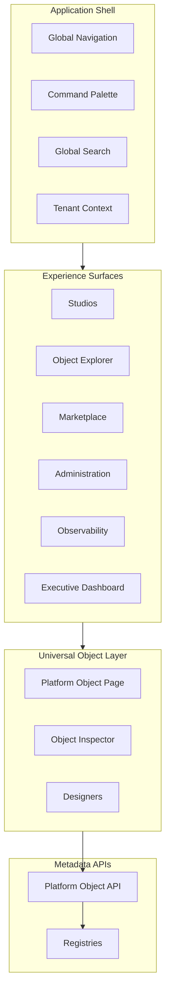
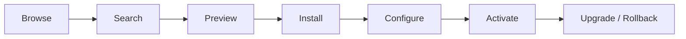
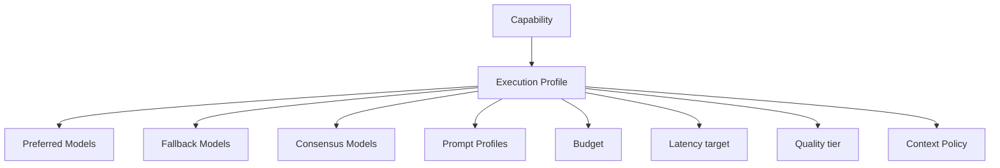

# Agentic Engineering Platform — Platform UX Model

**Status:** Normative UX architecture (UX Constitution)  
**Version:** 1.0  
**Effective:** 1 July 2026  
**Authority:** Subordinate to [CONSTITUTION.md](../../CONSTITUTION.md); implements [PLATFORM_PRIMITIVES.md](./PLATFORM_PRIMITIVES.md), [PLATFORM_CONTRACTS.md](./PLATFORM_CONTRACTS.md), and [PLATFORM_META_MODEL.md](./PLATFORM_META_MODEL.md)  
**Audience:** Product design, UX engineering, Studio owners, frontend architects, accessibility leads, enterprise customers

---

## Document charter

The backend meta model is defined. The platform is **metadata-driven**. This document defines the **User Experience Architecture** — how humans discover, configure, govern, and operate the Engineering Platform.

This is **not** a Figma file. This is **not** React implementation. This is the **UX Constitution** every future UI surface must follow.

| Layer | Document |
|-------|----------|
| Language | [PLATFORM_PRIMITIVES.md](./PLATFORM_PRIMITIVES.md) |
| Behaviour | [PLATFORM_CONTRACTS.md](./PLATFORM_CONTRACTS.md) |
| Representation | [PLATFORM_META_MODEL.md](./PLATFORM_META_MODEL.md) |
| **Experience** | **This document** |

**Design benchmark:** Enterprise quality comparable to Salesforce, ServiceNow, GitHub, Linear, Azure Portal, Datadog, and Atlassian — focused on **Engineering AI**, not generic low-code.

**Consistency rule:** UX remains identical in **pattern** regardless of how many Studios, Capabilities, Plugins, or Connectors exist. Domain differs in **content**, not **chrome**.

**No production code** is specified herein.

---

## Table of contents

1. [Design philosophy](#1-design-philosophy)
2. [Navigation architecture](#2-navigation-architecture)
3. [Platform Object UX](#3-platform-object-ux)
4. [Object Explorer](#4-object-explorer)
5. [Studio UX](#5-studio-ux)
6. [Marketplace UX](#6-marketplace-ux)
7. [Workflow Designer](#7-workflow-designer)
8. [Policy Designer](#8-policy-designer)
9. [Execution Profile Designer](#9-execution-profile-designer)
10. [Connector configuration UX](#10-connector-configuration-ux)
11. [Solution Pack UX](#11-solution-pack-ux)
12. [Commercial UX](#12-commercial-ux)
13. [Administration UX](#13-administration-ux)
14. [Observability UX](#14-observability-ux)
15. [AI Operations UX](#15-ai-operations-ux)
16. [Object Inspector](#16-object-inspector)
17. [UX rules](#17-ux-rules)
18. [Accessibility](#18-accessibility)
19. [Conceptual wireframes](#19-conceptual-wireframes)

---

## 1. Design philosophy

### 1.1 North star

> **One platform. One object model. One UX grammar. Infinite engineering configurations.**

Users never learn a new interaction model per Studio. They learn **Platform Objects once**, then apply that literacy everywhere.

### 1.2 Core principles

| Principle | Meaning | Reference product pattern |
|-----------|---------|---------------------------|
| **Metadata-driven UX** | UI renders from Platform Object schema — not hard-coded screens | Salesforce Object Manager |
| **Platform Object UX** | Every primitive inherits identical tab structure and actions | ServiceNow CI form |
| **Configuration over code** | Visual designers produce metadata; YAML export optional, never required | Azure Portal blades |
| **Consistency** | Same verbs, icons, empty states, error codes everywhere | GitHub settings |
| **Discoverability** | Search, Object Explorer, command palette surface all objects | Linear command menu |
| **Minimal learning curve** | First task completable in <15 minutes with templates | Atlassian project templates |
| **Accessibility** | WCAG 2.2 AA minimum; keyboard-first | Microsoft Fluent |
| **Keyboard first** | All primary flows reachable without pointer | Linear, GitHub |
| **Command palette** | `Ctrl/Cmd+K` universal action surface | GitHub, Linear, Datadog |
| **Responsive** | 1280px desktop primary; 768px tablet usable; 375px critical paths | Azure Portal |
| **Dark mode** | System preference + manual toggle; parity with light | GitHub, Datadog |
| **Multi-tenant** | Tenant context always visible; no cross-tenant leakage in UI | Salesforce org switcher |

### 1.3 UX architecture layers



### 1.4 Emotional design goals

| Goal | UX expression |
|------|---------------|
| **Trust** | Audit and approval visible at point of action |
| **Control** | Effective configuration preview before publish |
| **Confidence** | Simulation in Workflow and Policy designers |
| **Speed** | Command palette + keyboard shortcuts |
| **Clarity** | Lifecycle state badge on every object header |

### 1.5 Anti-patterns (forbidden)

- Per-primitive custom navigation trees
- Studio-specific CRUD that bypasses Platform Object API
- Client-side policy or permission bypass
- Hidden approval requirements
- Connector setup requiring raw YAML as only path
- Inconsistent lifecycle button labels (`Deploy` vs `Activate` vs `Enable`)

---

## 2. Navigation architecture

### 2.1 Global navigation (primary rail)

Persistent left rail (collapsible). Order is **fixed** across tenants:

| # | Section | Purpose |
|---|---------|---------|
| 1 | **Home** | Personalised landing + recent objects |
| 2 | **Engineering Studios** | Domain workspaces (expandable) |
| 3 | **Platform Core** | Registries, event bus health, runtime status |
| 4 | **Marketplace** | Browse and install packs and plugins |
| 5 | **Object Explorer** | Cross-primitive metadata browser |
| 6 | **Observability** | Metrics, logs, traces, cost |
| 7 | **AI Operations** | Models, profiles, token analytics |
| 8 | **Administration** | Identity, RBAC, secrets, audit |
| 9 | **Executive Dashboard** | Roll-up KPIs (role-gated) |

**Tenant context** displays top-right: `tenant name` + environment badge (`dev` | `staging` | `prod`).

### 2.2 Engineering Studios (secondary navigation)

Studios appear as **expandable group** under primary rail. Each Studio opens its **Studio shell** — same chrome, studio-specific home dashboard.

| Studio | Rail icon semantics |
|--------|-------------------|
| Requirements | Scope / document |
| Architecture | Structure / diagram |
| Development | Code / branch |
| Testing | Check / flask |
| Security | Shield |
| Release | Rocket / tag |
| Operations | Incident / heartbeat |
| AI Operations | Also reachable from global; duplicated entry for convenience |

### 2.3 Platform Core navigation

Read-heavy operational views:

- Service health matrix (16+ services)
- Agent Registry browser
- Tool Registry browser
- Workflow Engine monitor
- Event Bus topology
- Configuration portal (tenant-wide)

### 2.4 Search

**Global search** (`/` or header field):

- Objects across all primitives
- Recent workflow runs
- Artifacts by URI or title
- Documentation links
- Actions (`Create workflow`, `Install pack`)

Search results grouped: **Objects** | **Runs** | **Artifacts** | **Actions** | **Docs**

### 2.5 Command palette

**Shortcut:** `Ctrl+K` / `Cmd+K`

| Category | Examples |
|----------|----------|
| Navigate | `Go to Development Studio`, `Open Observability` |
| Create | `New Workflow`, `New Policy`, `New Connector` |
| Act | `Activate object`, `Submit for review`, `Compare versions` |
| Search | Inline fuzzy find |
| Admin | `Invite user`, `Rotate secret` (role-gated) |

Palette is **metadata-aware** — suggests actions valid for current object context.

### 2.6 Breadcrumb model

```
{Tenant} > {Surface} > {Studio?} > {Object Type} > {display_name} v{version}
```

Every Platform Object page includes breadcrumbs linking to Object Explorer filtered view.

### 2.7 Navigation wireframe (ASCII)

```
┌──────────────────────────────────────────────────────────────────────────────┐
│ [≡] Agentic Platform    [Search…        ] [/]     ACME Corp ▾  prod ▾  [⌘K] │
├────────────┬─────────────────────────────────────────────────────────────────┤
│ Home       │  Breadcrumb > Development Studio > Workflows > Greenfield v3.2   │
│ Studios ▾  │ ┌─────────────────────────────────────────────────────────────┐ │
│  Require…  │ │ Object Header: Greenfield Product Development    [Active] │ │
│  Arch…     │ │ [Overview][Config][Relations]…[Audit]    [Submit][Activate]  │ │
│  Develop…  │ └─────────────────────────────────────────────────────────────┘ │
│ Core       │                                                                 │
│ Marketplace│              Main content area                                    │
│ Explorer   │                                                                 │
│ Observ…    │                                                                 │
│ AI Ops     │                                                                 │
│ Admin      │                                                                 │
│ Executive  │                                                                 │
└────────────┴─────────────────────────────────────────────────────────────────┘
```

---

## 3. Platform Object UX

### 3.1 Universal object page

Every Platform Object **automatically** renders a **Platform Object Page** — no custom page hierarchy per primitive.

### 3.2 Mandatory tabs

Tabs appear in **fixed order**. Primitive-specific content lives **inside** tabs as sections — never as replacement tabs.

| # | Tab | Content |
|---|-----|---------|
| 1 | **Overview** | Identity, description, lifecycle, owners, tags, quick actions |
| 2 | **Configuration** | Layer editor + effective configuration preview |
| 3 | **Relationships** | Graph + table; parent, children, associations |
| 4 | **Dependencies** | Hard/soft/runtime; version constraints |
| 5 | **Execution** | Runtime bindings, execution history link, profile refs |
| 6 | **Versions** | Version list, compare, changelog, rollback |
| 7 | **Metrics** | Embedded charts (usage, latency, errors) |
| 8 | **Health** | Dependency rollup, last check, incidents |
| 9 | **Audit** | Immutable audit timeline |
| 10 | **History** | Configuration + lifecycle history unified |
| 11 | **Permissions** | RBAC matrix (read); admin edit |
| 12 | **Documentation** | Linked docs, ADRs, examples |
| 13 | **Examples** | Reference instances, sample payloads |

**Rule:** No object may add, remove, or rename tabs. Studio-specific **views** are dashboard widgets on Overview or studio home — not alternate object chrome.

### 3.3 Universal header actions

| Action | When visible |
|--------|--------------|
| **Edit** | Draft only |
| **Clone** | Always |
| **Submit for review** | Draft → Review |
| **Approve / Reject** | Review (role-gated) |
| **Publish** | Approved |
| **Activate** | Published + entitlement |
| **Deprecate** | Active |
| **Compare** | ≥2 versions exist |
| **Export metadata** | Read permission |

Lifecycle buttons use **identical labels** across primitives ([PLATFORM_CONTRACTS.md](./PLATFORM_CONTRACTS.md) §8).

### 3.4 State visualization

| State | Badge colour semantics | Icon |
|-------|------------------------|------|
| Draft | Neutral grey | Pencil |
| Review | Amber | Eye |
| Approved | Blue | Check |
| Published | Purple | Lock |
| Active | Green | Play |
| Deprecated | Orange | Warning |
| Archived | Grey | Archive |
| Retired | Dark grey | Stop |

### 3.5 Empty and error states

| State | Pattern |
|-------|---------|
| No metrics yet | "No executions in selected period" + link to docs |
| Validation failed | Inline error list with `code` + fix link |
| Permission denied | Explain required role; no data leakage |
| Entitlement required | Link to Commercial UX upgrade path |

---

## 4. Object Explorer

### 4.1 Purpose

**Salesforce Object Manager**-class browser for all platform metadata — cross-studio, cross-primitive.

### 4.2Browsable types

All thirteen primitives ([PLATFORM_PRIMITIVES.md](./PLATFORM_PRIMITIVES.md)):

Studios, Capabilities, Providers (Connectors), Workflows, Policies, Execution Profiles, Context templates, Resources, Artifacts, Plugins, Solution Packs, Commercial Packs, Entitlements

### 4.3 Explorer layout

| Pane | Function |
|------|----------|
| **Left** | Primitive type selector + saved filters |
| **Centre** | Object table (virtualised) |
| **Right** | Object Inspector (collapsible) |

### 4.4 Table columns (default)

`display_name` | `name` | `namespace` | `version` | `status` | `owner` | `modified_at` | `labels`

### 4.5 Search and filters

| Mechanism | Examples |
|-----------|----------|
| **Full text** | Name, description, tags |
| **Filters** | Status, namespace, studio, owner, edition |
| **Label selectors** | `domain=security,risk=high` |
| **Grouping** | By namespace, status, primitive type |
| **Tags** | Clickable chip filters |
| **Favorites** | Star per object; "My favorites" saved view |

### 4.6 Bulk actions (role-gated)

- Export selected metadata
- Submit for review (Draft only)
- Add label
- Compare versions (max 2)

### 4.7 Explorer wireframe (ASCII)

```
┌──────────────── Object Explorer ─────────────────────────────────────────────┐
│ Type: [Workflows ▾]   Filter: [Active ▾] [dev-studio ▾]   [🔍 Search…]      │
├───────────────────────────────┬──────────────────────────────────────────────┤
│ GROUP BY: Namespace ▾         │ Name              Ver   Status    Modified    │
│                               │ greenfield-prod   3.2   Active    2h ago  ★ │
│ ★ Favorites                   │ brownfield-fix    1.4   Published 1d ago    │
│ Recent                        │ release-harden    2.0   Draft     3d ago    │
│ Labels: security, release     │ ...                                          │
├───────────────────────────────┴──────────────────┬───────────────────────────┤
│                                                  │ Inspector: greenfield…   │
│                                                  │ Status: Active           │
│                                                  │ [Open] [Clone] [Metrics] │
└──────────────────────────────────────────────────┴───────────────────────────┘
```

---

## 5. Studio UX

Each Studio shares **Studio Shell** components: home dashboard, object lists filtered by namespace, studio-scoped command palette actions, and deep links to Platform Object pages.

### 5.1 Requirements Studio

| Dimension | Definition |
|-----------|------------|
| **Purpose** | Turn intent into traceable scope — stories, acceptance criteria, scope documents |
| **Primary persona** | Product owner, business analyst, engineering lead |
| **Navigation** | Home, Scope documents, Workflows, Capabilities, Artifacts |
| **Primary views** | Scope board, AC matrix, workflow run linkage |
| **Common actions** | Start discovery workflow, link issue tracker, approve scope gate |
| **Dashboards** | Scope completeness, open gates, requirement coverage |
| **Platform objects** | Workflows (intake), Capabilities (`analyses-requirements`), Artifacts (scope docs), Providers (issue tracker) |

### 5.2 Architecture Studio

| Dimension | Definition |
|-----------|------------|
| **Purpose** | ADRs, discovery, dependency intelligence before implementation |
| **Primary persona** | Solution architect, principal engineer |
| **Navigation** | Home, ADRs, Discovery runs, Memory explorer, Workflows |
| **Primary views** | ADR catalog, dependency graph, context assembly preview |
| **Common actions** | Publish ADR, run discovery workflow, link memory context |
| **Dashboards** | ADR freshness, open architecture gates, tech debt signals |
| **Platform objects** | Context templates, Artifacts (ADRs), Capabilities (`discovery-*`), Memory refs |

### 5.3 Development Studio

| Dimension | Definition |
|-----------|------------|
| **Purpose** | AI-assisted implementation — code, PRs, migrations with human gates |
| **Primary persona** | Software engineer, full-stack developer |
| **Navigation** | Home, Active runs, PR artifacts, Workflows, Connectors |
| **Primary views** | Task queue, PR list, diff summary, migration status |
| **Common actions** | Start implementation workflow, review agent output, approve merge gate |
| **Dashboards** | PR throughput, agent success rate, cost per feature |
| **Platform objects** | Workflows (greenfield/brownfield), Capabilities (`generates-*`), Providers (Git), Artifacts (PRs) |

### 5.4 Testing Studio

| Dimension | Definition |
|-----------|------------|
| **Purpose** | Generated tests, regression evidence, quality gates |
| **Primary persona** | QA engineer, SDET, CI owner |
| **Navigation** | Home, Test runs, Regression suites, Workflows |
| **Primary views** | Coverage trends, failing tests, gate evidence |
| **Common actions** | Trigger test workflow, attach CI Provider, approve quality gate |
| **Dashboards** | Pass rate, regression delta, flake detection |
| **Platform objects** | Capabilities (`generates-unit-tests`), Providers (CI/CD), Artifacts (reports) |

### 5.5 Security Studio

| Dimension | Definition |
|-----------|------------|
| **Purpose** | Vulnerability scanning, security gates, compliance evidence |
| **Primary persona** | AppSec, security champion, compliance officer |
| **Navigation** | Home, Findings, Policies, Scan workflows, Connectors |
| **Primary views** | Finding severity board, policy compliance matrix |
| **Common actions** | Run security workflow, attach scanner Provider, block release |
| **Dashboards** | Open criticals, MTTR, policy violations |
| **Platform objects** | Policies (security), Providers (scanners), Artifacts (SARIF) |

### 5.6 Release Studio

| Dimension | Definition |
|-----------|------------|
| **Purpose** | Controlled promotion — changelog, artifacts, deployment with approvals |
| **Primary persona** | Release manager, DevOps lead |
| **Navigation** | Home, Releases, Approval queue, Deploy workflows |
| **Primary views** | Release train calendar, gate status, changelog builder |
| **Common actions** | Cut release, approve CAB gate, trigger deploy workflow |
| **Dashboards** | Release frequency, failed gates, lead time to prod |
| **Platform objects** | Workflows (release), Policies (CAB), Artifacts (changelog) |

### 5.7 Operations Studio

| Dimension | Definition |
|-----------|------------|
| **Purpose** | Incident response, root cause, reliability programmes |
| **Primary persona** | SRE, incident commander |
| **Navigation** | Home, Incidents, Runbooks, Workflow monitor |
| **Primary views** | Incident timeline, platform health, runbook library |
| **Common actions** | Start hotfix workflow, link traces, approve emergency gate |
| **Dashboards** | SLO burn, incident count, MTTR |
| **Platform objects** | Workflows (incident), Context (runbooks), Observability links |

### 5.8 AI Operations Studio

See [§15](#15-ai-operations-ux) — also linked from global nav.

### 5.9 Marketplace (surface)

See [§6](#6-marketplace-ux).

### 5.10 Administration (surface)

See [§13](#13-administration-ux).

### 5.11 Executive Dashboard

| Dimension | Definition |
|-----------|------------|
| **Purpose** | Engineering effectiveness KPIs for leadership — not operational debugging |
| **Primary persona** | VP Engineering, CTO, programme director |
| **Navigation** | Home, Programmes, Cost, Risk, Compliance roll-up |
| **Primary views** | DORA-style metrics, AI cost vs delivery, gate pass rates |
| **Common actions** | Export board report, drill to Observability (read-only) |
| **Dashboards** | Deployment frequency, lead time, change failure rate, AI spend |
| **Platform objects** | Read-only aggregation — no direct mutation |

### 5.12 Studio landing wireframe (ASCII)

```
┌──────────────── Development Studio ──────────────────────────────────────────┐
│ Good morning, Jane · 3 active runs · 1 gate awaiting you                     │
├──────────────────────────────────────────────────────────────────────────────┤
│ [Start workflow ▾]  [Open task queue]  [⌘K]                                  │
├──────────────────────┬──────────────────────┬────────────────────────────────┤
│ YOUR GATES (1)       │ ACTIVE RUNS (3)      │ RECENT ARTIFACTS               │
│ Security review #42  │ greenfield / build   │ PR #128 auth-service           │
│ [Open approval]      │ brownfield / test    │ ADR-014 caching strategy       │
├──────────────────────┴──────────────────────┴────────────────────────────────┤
│ METRICS (7d): PRs merged 12 · Agent success 94% · Cost $1.2k                 │
└──────────────────────────────────────────────────────────────────────────────┘
```

---

## 6. Marketplace UX

### 6.1 Purpose

Discover, evaluate, install, and lifecycle-manage **metadata packages** — never platform binaries ([PLATFORM_META_MODEL.md](./PLATFORM_META_MODEL.md) §12).

### 6.2 Installable categories

| Category | Primitive / packaging |
|----------|----------------------|
| Connector Plugins | Provider + Plugin normaliser |
| Agent Plugins | Capability + Agent registration |
| Workflow Plugins | Workflow templates |
| Execution Profiles | Execution Profile metadata |
| Policies | Policy packs |
| Knowledge Packs | Context templates + memory seeds |
| Solution Packs | Composed multi-primitive bundles |
| Studio Extensions | Studio metadata + UI Plugin |
| UI Extensions | Plugin hooks for shell panels |

### 6.3 Marketplace flows



| Flow | UX requirements |
|------|-----------------|
| **Browse** | Categories, certified badge, edition requirements |
| **Search** | Full text + capability tag + vendor |
| **Install** | Entitlement check upfront; show blockers before commit |
| **Configure** | Wizard for secrets, endpoints, namespace |
| **Upgrade** | Version comparison; breaking change warnings |
| **Remove** | Impact analysis — dependent Active bindings |
| **Rollback** | One-click prior Active set + audit reason |
| **Version comparison** | Side-by-side diff of contained objects |
| **Dependencies** | Graph of required packs, platform version, entitlements |
| **Compatibility** | Platform version matrix; conflict badges |

### 6.4 Marketplace wireframe (ASCII)

```
┌──────────────── Marketplace ─────────────────────────────────────────────────┐
│ [Connectors] [Workflows] [Solution Packs] [Plugins]     [🔍 Search…]         │
├──────────────────────────────────────────────────────────────────────────────┤
│ ┌─────────────────────┐  Regulated Banking Pack          ★ Certified  v2.0      │
│ │      [icon]         │  Workflows 8 · Policies 15 · Providers 6              │
│ │                     │  Requires: Enterprise · Platform ≥ 1.4               │
│ └─────────────────────┘  [Preview] [Install]                                  │
│ ┌─────────────────────┐  GitHub Enterprise Connector           v2.4.1         │
│ │      [icon]         │  Capabilities: create-pr, read-repo                    │
│ └─────────────────────┘  [Preview] [Install]                                  │
└──────────────────────────────────────────────────────────────────────────────┘
```

---

## 7. Workflow Designer

### 7.1 Purpose

**Visual, metadata-first** workflow authoring — ServiceNow Flow Designer class — producing Workflow Platform Objects.

### 7.2 Canvas capabilities

| Node type | Maps to |
|-----------|---------|
| **Agent step** | Capability tag + Execution Profile |
| **Human gate** | Approval node (non-bypassable) |
| **Policy check** | Policy evaluation node |
| **Decision** | Conditional branch on metadata expression |
| **Connector action** | Provider capability invocation |
| **Event wait** | Event Bus trigger / wait |
| **Timer** | Schedule / delay |
| **Script** | Sandboxed expression (visual editor; no raw code default) |
| **Sub-workflow** | Nested Workflow reference |

### 7.3 Designer features

| Feature | Requirement |
|---------|-------------|
| **Drag-and-drop** | Snap grid; keyboard nudge |
| **Validation** | Real-time; unreachable state detection |
| **Simulation** | Dry-run with mock context; step-through |
| **Versioning** | Draft → publish; diff visualisation |
| **Execution overlay** | Show live run progress on canvas (monitor mode) |

### 7.4 Designer wireframe (ASCII)

```
┌──────────────── Workflow Designer: greenfield v3 (Draft) ────────────────────┐
│ [Validate] [Simulate] [Submit for review]              Palette: [+ Step ▾]  │
├──────────────────────────────────────────────────────────────────────────────┤
│   [Trigger]──►[Scope Gate: Human]──►[Implement: Agent]──►[Test: Agent]     │
│                      │                         │                              │
│                      ▼                         ▼                              │
│                 [Policy: SOC2]          [Decision: pass?]──►[Release]        │
├──────────────────────────────────────────────────────────────────────────────┤
│ Properties: Implement · Capability: generates-backend · Profile: standard     │
└──────────────────────────────────────────────────────────────────────────────┘
```

---

## 8. Policy Designer

### 8.1 Purpose

Visual rule builder for Policy objects — conditions and actions without Rego/YAML as default path.

### 8.2 Components

| Component | Function |
|-----------|----------|
| **Conditions** | Field / object / context predicates |
| **Actions** | Allow, deny, require approval, log |
| **Inheritance** | Extend parent policy; show overrides |
| **Overrides** | Tenant-specific exception windows (audited) |
| **Simulation** | Test against sample object or run |
| **Validation** | Compile check; conflict detection |

### 8.3 UX patterns

- **If / Then** rows (Salesforce validation rule familiarity)
- **Severity** badge: advisory vs blocking
- **Enforcement point** selector: publish | execute | mutation
- **Effective preview** on attached Workflow canvas

---

## 9. Execution Profile Designer

### 9.1 Purpose

Administrators configure **how** capabilities execute — visually chaining model strategy, cost, latency, and context policy.

### 9.2 Resolution stack (visual)



### 9.3 Designer panels (no YAML default)

| Panel | Controls |
|-------|----------|
| **Model routing** | Drag priority list; tier badges (economy / standard / premium) |
| **Fallback** | Visual cascade on failure or quota |
| **Consensus** | Multi-model voting slider (advanced) |
| **Prompt profiles** | Named template picker + variable bindings |
| **Budget** | Per-run and per-day caps with gauges |
| **Latency** | Target p95; timeout slider |
| **Quality** | Tier selector linked to model tier |
| **Context policy** | Token budget, truncation strategy, redaction toggles |

**Advanced:** Export metadata JSON optional — never required for configuration.

### 9.4 Designer wireframe (ASCII)

```
┌──────── Execution Profile: standard-backend ─────────────────────────────────┐
│ Capability binding: generates-backend (inherits)                             │
├──────────────────────────────┬───────────────────────────────────────────────┤
│ MODEL ROUTING                │ BUDGET & LIMITS                               │
│ 1. ● Premium (claude-*)      │ Per run:  $2.00  [────●──]                    │
│ 2. ○ Standard (gpt-*)       │ Per day:  $50    [──●────]                    │
│ 3. ○ Economy (haiku-*)      │ Timeout:  600s   [────●──]                    │
│ [+ Add fallback]             │ Context:  8k tok [──●────]                    │
├──────────────────────────────┴───────────────────────────────────────────────┤
│ Prompt profile: [backend-impl-v2 ▾]   Context policy: [redact-secrets ✓]    │
└──────────────────────────────────────────────────────────────────────────────┘
```

---

## 10. Connector configuration UX

**Connector** = Provider in UX copy where user-facing; metadata primitive remains Provider.

### 10.1 Setup wizard (mandatory pattern)

| Step | Content |
|------|---------|
| 1. **Install** | From Marketplace or clone template |
| 2. **Authentication** | OAuth flow **or** API token path |
| 3. **Secrets** | Vault handle assignment; never show secret value post-save |
| 4. **Capabilities** | Toggle enabled capability tags; scope selector (read/write) |
| 5. **Health check** | Test connection; display latency |
| 6. **Permissions** | Who may use connector |
| 7. **Review & activate** | Effective config summary |

### 10.2 Ongoing management tabs

Uses standard Platform Object tabs plus:

- **Logs** (invoke summary, not raw secrets)
- **Metrics** (requests, errors, latency)
- **Version** (upgrade available badge)

### 10.3 OAuth UX

- Inline browser OAuth popup
- Clear scope explanation
- Re-auth banner on token expiry

---

## 11. Solution Pack UX

| Flow | UX |
|------|-----|
| **Browse** | Marketplace category; vertical filters |
| **Preview** | Contents tree: objects by primitive type |
| **Install** | Entitlement + dependency check |
| **Contents** | Expandable list with version pins |
| **Dependencies** | Required packs, platform version |
| **Commercial** | Edition badge; upgrade CTA if blocked |
| **Upgrade** | Diff summary; migration warnings |
| **Rollback** | Restore prior Active binding set |

---

## 12. Commercial UX

### 12.1 Surfaces

| Surface | Purpose |
|---------|---------|
| **Subscriptions** | SKU, renewal date, seats |
| **Licensing** | Key / contract metadata (admin) |
| **Entitlements** | Granted objects and editions |
| **Usage** | Meters vs limits |
| **Quota** | Threshold alerts |
| **Billing** | Invoice summary link (external system of record) |
| **Feature flags** | Edition capability matrix |
| **Consumption** | Token, execution, provider call charts |

### 12.2 UX principles

- Show **limit proximity** before hard block (80%, 95% warnings)
- Hard block displays **actionable** upgrade or admin contact
- Cost visible in **AI Operations** and **Executive Dashboard** — same numbers

---

## 13. Administration UX

### 13.1 Sections

| Section | Function |
|---------|----------|
| **Users** | Invite, deactivate, SCIM status |
| **Roles** | RBAC role definitions |
| **RBAC** | Permission matrix by primitive |
| **Secrets** | Vault handle registry; rotation |
| **Configuration** | Tenant + environment layers |
| **Policies** | Global policy attachments |
| **Audit** | Cross-object audit search |
| **Approvals** | Pending gate queue |
| **Platform health** | Core service matrix |

### 13.2 Administration wireframe (ASCII)

```
┌──────────────── Administration ──────────────────────────────────────────────┐
│ [Users] [Roles] [Secrets] [Config] [Policies] [Audit] [Approvals] [Health]  │
├──────────────────────────────────────────────────────────────────────────────┤
│ Pending approvals (4)                                                          │
│ ┌──────────────────────────────────────────────────────────────────────────┐ │
│ │ Workflow greenfield v3.2 · CAB approval · Requested by jane@ · [Review] │ │
│ │ Provider github-prod scope elevation · security@ ·           [Review] │ │
│ └──────────────────────────────────────────────────────────────────────────┘ │
└──────────────────────────────────────────────────────────────────────────────┘
```

---

## 14. Observability UX

### 14.1 Datadog-class unified experience

| Pillar | UX |
|--------|-----|
| **Metrics** | Dashboards; Prometheus queries |
| **Logs** | Structured JSON search; correlation |
| **Traces** | Tempo/Jaeger-style waterfall |
| **Audit** | Governance timeline (cross-link) |
| **Execution timeline** | Task-level stepper |
| **Workflow timeline** | State machine progress |
| **Provider timeline** | External call spans |
| **Cost** | Per run, workflow, tenant |
| **Failures** | Grouped by error code |
| **SLA** | Burn charts; error budget |

### 14.2 Correlation UX

Clicking `task_id`, `workflow_run_id`, or `trace_id` in any view **pivots** all pillars — same correlation model as backend ([PLATFORM_META_MODEL.md](./PLATFORM_META_MODEL.md) §13).

### 14.3 Entry points

- Global Observability nav
- Metrics tab on every Platform Object
- "View traces" on execution rows
- Executive Dashboard drill-down (read-only)

---

## 15. AI Operations UX

### 15.1 Purpose

**Model Router control plane** for ML platform, FinOps, and agent owners.

### 15.2 Sections

| Section | Function |
|---------|----------|
| **Model registry** | Available models by tier; vendor neutrality |
| **Execution profiles** | Link to profile designer |
| **Prompt profiles** | Versioned prompt templates |
| **Evaluation** | Quality benchmarks; regression on model change |
| **Model cost** | Spend by model, team, workflow |
| **Routing** | Visualise tier selection outcomes |
| **Context policies** | Token budgets; truncation stats |
| **Prompt history** | Redacted prompt/response audit (classification-aware) |
| **Token analytics** | In/out tokens; forecast |

### 15.3 UX rules

- Never display full prompts containing **restricted** classification without permission
- Model changes show **impact preview** on dependent Execution Profiles

---

## 16. Object Inspector

### 16.1 Purpose

**Right-panel quick inspect** — Azure Portal properties blade — without full navigation away from list context.

### 16.2 Inspector sections (fixed order)

1. Identity (name, version, status, owner)
2. Relationships (top 5 edges + "view all")
3. Configuration (effective summary)
4. Dependencies (hard deps status)
5. Execution (last run link)
6. Metrics (sparkline 24h)
7. Health (badge)
8. Audit (last 3 events)
9. History (last change)
10. Permissions (your access level)
11. Version (quick switch for compare)

### 16.3 Inspector actions

**Open full page** | **Clone** | **Favorite** | **Copy ID**

Inspector is **read-only** except quick actions that open modals (clone, favorite).

---

## 17. UX rules

### 17.1 Universal behaviour matrix

| Concern | Rule |
|---------|------|
| **CRUD** | Create → Draft; Edit → Draft only; View → all states |
| **Search** | Same query syntax globally |
| **Filtering** | Label selectors consistent |
| **History** | Unified timeline component |
| **Audit** | Same table component |
| **Metrics** | Same chart kit |
| **Permissions** | Same matrix component |
| **Versioning** | Same compare UI |
| **Relationships** | Same graph component |

### 17.2 UX rule IDs

| ID | Rule |
|----|------|
| **UX-01** | No primitive-specific tab navigation |
| **UX-02** | Lifecycle verbs identical platform-wide |
| **UX-03** | Command palette available on every page |
| **UX-04** | Tenant + environment visible at all times |
| **UX-05** | Destructive actions require reason + confirm |
| **UX-06** | Publish/Activate show validation summary modal |
| **UX-07** | Errors display API `code` with help link |
| **UX-08** | Classification controls field masking |
| **UX-09** | No client-side permission bypass |
| **UX-10** | Wizards produce metadata — not local-only state |
| **UX-11** | Dark mode parity with light mode |
| **UX-12** | Keyboard shortcuts documented in `?` overlay |

### 17.3 Component ownership

A single **Platform Design System** (future implementation) realises these rules. Studios **consume** components — do not fork.

---

## 18. Accessibility

### 18.1 Standards

**WCAG 2.2 Level AA** minimum for all surfaces.

### 18.2 Requirements

| Area | Requirement |
|------|-------------|
| **Keyboard navigation** | Full tab order; visible focus rings; skip links |
| **Screen readers** | ARIA labels on graph nodes; live regions for async |
| **High contrast** | System + forced; chart patterns not colour-only |
| **Localization** | i18n keys; RTL-ready layout |
| **Responsive** | Touch targets ≥44px on tablet |
| **Motion** | Respect `prefers-reduced-motion` |

### 18.3 Keyboard shortcuts (normative)

| Shortcut | Action |
|----------|--------|
| `Ctrl/Cmd+K` | Command palette |
| `/` | Focus global search |
| `g then o` | Go to Object Explorer |
| `g then h` | Go to Home |
| `?` | Shortcut help |
| `Esc` | Close modal / inspector |

Workflow Designer additionally supports arrow keys for node movement.

---

## 19. Conceptual wireframes

### 19.1 Global navigation

See [§2.7](#27-navigation-wireframe-ascii).

### 19.2 Studio landing page

See [§5.12](#512-studio-landing-wireframe-ascii).

### 19.3 Platform Object page

```
┌──────────────────────────────────────────────────────────────────────────────┐
│ ACME · Development · Workflows · Greenfield Product Development v3.2.1      │
│ Status: [Active]  Owner: platform-team  Risk: High  [Clone] [Deprecate]      │
├──────────────────────────────────────────────────────────────────────────────┤
│ Overview | Configuration | Relationships | Dependencies | Execution | …     │
├──────────────────────────────────────────────────────────────────────────────┤
│ OVERVIEW                                                                      │
│ Description: End-to-end greenfield product workflow                           │
│ Namespace: dev-studio   Tags: greenfield, product                             │
│ Active environments: prod, staging                                            │
│ ┌─────────────────────┐  ┌─────────────────────┐                              │
│ │ Last 24h runs: 14   │  │ Success rate: 92%   │                              │
│ └─────────────────────┘  └─────────────────────┘                              │
│ Recent audit: StateTransitioned · GateApproved · 2h ago                       │
└──────────────────────────────────────────────────────────────────────────────┘
```

### 19.4 Marketplace

See [§6.4](#64-marketplace-wireframe-ascii).

### 19.5 Workflow Designer

See [§7.4](#74-designer-wireframe-ascii).

### 19.6 Execution Profile Designer

See [§9.4](#94-designer-wireframe-ascii).

### 19.7 Administration

See [§13.2](#132-administration-wireframe-ascii).

### 19.8 Executive Dashboard

```
┌──────────────── Executive Dashboard · ACME Corp ─────────────────────────────┐
│ Period: [Last 30 days ▾]                              [Export board pack]     │
├────────────────────┬────────────────────┬───────────────────────────────────┤
│ Deployment freq.   │ Lead time to prod  │ Change failure rate               │
│   12 / week ↑      │   3.2 days ↓       │   4.1% →                          │
├────────────────────┴────────────────────┴───────────────────────────────────┤
│ AI spend vs delivery:  $24k total · $1.1k per merged PR                     │
│ [████████████████░░░░]  78% of AI budget consumed                          │
├──────────────────────────────────────────────────────────────────────────────┤
│ Programme health: Platform modernisation ████████░░ on track                │
│ Top risk: Security gate failures up 2x in Release Studio [Drill down]        │
└──────────────────────────────────────────────────────────────────────────────┘
```

---

## Appendix A — Document authority

```
CONSTITUTION.md
PLATFORM_PRIMITIVES.md
PLATFORM_CONTRACTS.md      (UI Contract §23)
PLATFORM_META_MODEL.md
PLATFORM_UX_MODEL.md       ← this document
implementation (design system, frontend)
```

Amendments require Decision Record and version bump.

---

## Appendix B — Mapping to PI-09 Developer Experience

[PI-09](../../docs/04-program/PI-09-Developer-Experience/README.md) delivers the **unified shell** implementing this UX model:

| PI-09 deliverable | UX model section |
|-------------------|------------------|
| Dashboard shell | Navigation §2 |
| Workflow Designer | §7 |
| Agent Registry UI | Object Explorer §4 + AI Ops §15 |
| Approval Console | Administration §13 |
| Metrics Dashboard | Observability §14 |
| Config Portal | Administration §13 |

---

## Appendix C — Glossary

| Term | Definition |
|------|------------|
| **Shell** | Persistent navigation and context chrome |
| **Studio Shell** | Studio-scoped variant of application shell |
| **Platform Object Page** | Universal 13-tab object experience |
| **Object Inspector** | Right-panel quick view |
| **Command palette** | Keyboard-driven action surface |
| **Connector** | User-facing label for Provider configuration |

---

*This document is the UX Constitution of the Agentic Engineering Platform. Every future UI — Studio, Marketplace, Administration, and Observability — must conform to these patterns.*
