# Agentic Engineering Platform — Technical Architecture Diagrams

**Status:** Living document  
**Version:** 1.0  
**Date:** 28 June 2026  
**Authority:** Reference Architecture v1.0 · [CONSTITUTION.md](../../CONSTITUTION.md) · [ARCHITECTURE.md](../ARCHITECTURE.md)  
**Audience:** Platform engineers, solution architects, CTOs, Fortune 500 enterprise evaluators

---

## Document Purpose

This document is the single authoritative home for every technical architecture diagram of the Agentic Engineering Platform. It covers all 15 architectural dimensions required for a production-grade enterprise deployment at Fortune 500 scale:

1. [Architecture Overview](#1-architecture-overview)
2. [C4 Level 1 — System Context](#2-c4-level-1--system-context)
3. [C4 Level 2 — Containers](#3-c4-level-2--containers)
4. [C4 Level 3 — Orchestrator Components](#4-c4-level-3--orchestrator-components)
5. [C4 Level 4 — Agent Runtime Internals](#5-c4-level-4--agent-runtime-internals)
6. [Folder Structure](#6-folder-structure)
7. [Microservices Map](#7-microservices-map)
8. [Deployment Architecture](#8-deployment-architecture)
9. [Kubernetes Layout](#9-kubernetes-layout)
10. [Networking Architecture](#10-networking-architecture)
11. [Database Architecture](#11-database-architecture)
12. [Event Flow Architecture](#12-event-flow-architecture)
13. [Memory Architecture](#13-memory-architecture)
14. [Security Architecture](#14-security-architecture)
15. [Observability Architecture](#15-observability-architecture)
16. [Scalability Architecture](#16-scalability-architecture)
17. [High Availability Architecture](#17-high-availability-architecture)
18. [Disaster Recovery Architecture](#18-disaster-recovery-architecture)
19. [API Architecture](#19-api-architecture)
20. [Multi-Tenancy Architecture](#20-multi-tenancy-architecture)
21. [Workflow Engine Architecture](#21-workflow-engine-architecture)
22. [Agent Lifecycle](#22-agent-lifecycle)
23. [Tool Integration Architecture](#23-tool-integration-architecture)
24. [Model Routing Architecture](#24-model-routing-architecture)
25. [SDK Architecture](#25-sdk-architecture)

---

## 1. Architecture Overview

The platform is a **distributed, event-driven, multi-tenant agentic orchestration system** comprising 16 independently deployable microservices. All inter-service communication is event-mediated through Kafka. No service calls another service synchronously except for registry lookups and security checks.

### Service Tier Map

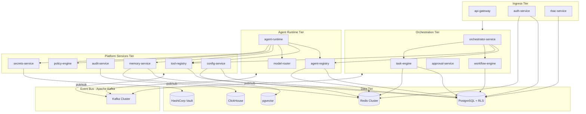

### Constitutional Invariants Enforced in Architecture

| Invariant | Architectural Enforcement |
|-----------|--------------------------|
| Agents NEVER call agents | NetworkPolicy blocks agent-to-agent TCP; Kafka-only output |
| Orchestrator plans, never executes | Service boundary — no LLM SDK in orchestrator-service |
| New agents plug in via registry | agent-registry is the ONLY extension point |
| Humans approve at every gate | approval-service blocks state transition via GateEnforcer |
| Every decision is reconstructable | audit-service consumes ALL Kafka topics |
| Vendor-neutral by construction | tool-registry + model-router abstract all vendor APIs |

---

## 2. C4 Level 1 — System Context

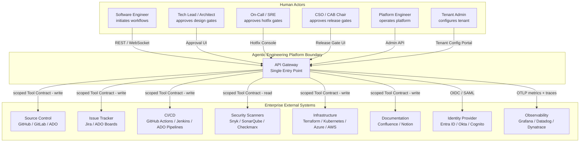

> **Key relationships:** Governance actors interact with the platform via **gates, not notifications** — the workflow cannot advance without a recorded decision. External system access is always per a scoped Tool Contract (Section 7, RA), never blanket credentials.

---

## 3. C4 Level 2 — Containers

```mermaid
flowchart TB
    subgraph external [External]
        USER[Users / Actors]
        EXT[External Systems]
    end

    subgraph platform [Platform Boundary - 16 Microservices]
        subgraph ingressTier [Ingress Tier]
            AGW[api-gateway :8080\nKong / custom\nRate limiting, TLS, routing]
            AUTH[auth-service :8081\nFastAPI\nOIDC JWT issuance + validation]
            RBAC[rbac-service :8082\nFastAPI\nRole assignment + permission]
        end

        subgraph orchTier [Orchestration Tier]
            ORCH[orchestrator-service :8090\nFastAPI\nPlanner, dispatcher, gate enforcer]
            WFE[workflow-engine :8091\nFastAPI\nState machine templates + transitions]
            TASK[task-engine :8092\nFastAPI\nDurable task persistence + scheduling]
            APPR[approval-service :8093\nFastAPI\nHuman-in-the-loop gate management]
        end

        subgraph runtimeTier [Agent Runtime Tier]
            AR[agent-runtime :8100\nFastAPI\nAgent execution host]
            AREG[agent-registry :8101\nFastAPI\nCapability-based discovery]
            MR[model-router :8102\nFastAPI\nLLM tier routing + quota]
        end

        subgraph platformTier [Platform Services Tier]
            TR[tool-registry :8110\nFastAPI\nExternal integration resolution]
            MEM[memory-service :8111\nFastAPI\nWorking context + vector memory]
            AUD[audit-service :8112\nFastAPI\nImmutable append-only audit]
            SS[secrets-service :8113\nFastAPI\nVault-backed token issuance]
            POL[policy-engine :8114\nFastAPI\nOPA agent action governance]
            CFG[config-service :8115\nFastAPI\nPer-tenant configuration]
        end

        KAFKA[Apache Kafka\nEvent Bus - Sole inter-service bus]
    end

    subgraph dataTier [Data Tier]
        PG[(PostgreSQL 16\nAurora / Flexible Server\nOLTP + RLS)]
        RD[(Redis 7 Cluster\nCache + Working State)]
        VEC[(pgvector\nLong-Term Memory)]
        CLK[(ClickHouse\nAudit + Analytics\nAppend-only)]
        VLT[(HashiCorp Vault\nSecrets + PKI)]
    end

    USER --> AGW
    AGW --> AUTH & RBAC
    AGW --> ORCH & APPR & AREG & CFG

    ORCH & WFE & TASK & APPR <-->|publish/subscribe| KAFKA
    AR & AUD <-->|publish/subscribe| KAFKA

    ORCH --> AREG & TR & WFE & TASK
    AR --> AREG & TR & MR & MEM & POL & SS
    AUD --> CLK
    MEM --> VEC & RD
    TASK --> PG & RD
    AREG --> PG & RD
    WFE --> PG
    TR --> PG
    CFG --> PG & RD
    AUTH --> PG & RD
    RBAC --> PG
    SS --> VLT

    AR -->|Tool Contracts| EXT
```

---

## 4. C4 Level 3 — Orchestrator Components

> The orchestrator is a **planner and referee, never a player**. No component here writes code, calls an LLM, or executes a tool.

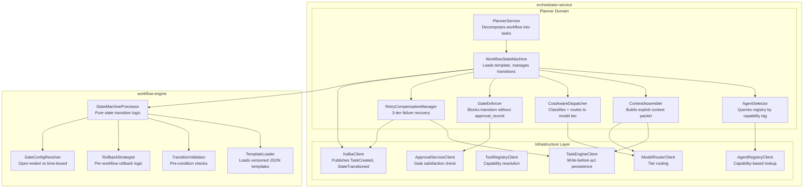

---

## 5. C4 Level 4 — Agent Runtime Internals

```mermaid
flowchart TB
    subgraph agentRuntime [agent-runtime - execution host]
        subgraph executor [Executor Layer]
            AE[AgentExecutor\nOrchestrates agent lifecycle]
            AL[AgentLoader\nDynamic import + validation]
            IK[IdempotencyKeyResolver\nPrevents duplicate side-effects on retry]
        end

        subgraph baseClass [Agent Base Class - SDK]
            AB[Agent\nBase class all agents inherit]
            TC[ToolClient\nRequests tools by capability tag]
            MC[MemoryClient\nWorking context + LTM queries]
            EC[EventClient\nPublishes AgentStarted / Completed / Failed]
            RT[RetryHandler\nExponential backoff + jitter]
            SC[SecurityContext\nPolicy check + scoped token]
            OT[OtelInstrumentation\nAuto-traces every agent method]
            LG[StructuredLogger\nJSON + task_id + workflow_run_id]
            MET[MetricsEmitter\nHistogram per agent per operation]
        end

        subgraph contracts [Agent Contract Validation]
            CV[ContractValidator\nValidates at load time]
            INP[InputSchemaValidator]
            OUT[OutputSchemaValidator]
        end
    end

    subgraph externalClients [External Service Clients]
        TREG[ToolRegistryClient]
        MREG[AgentRegistryClient]
        MSVC[MemoryServiceClient]
        PSVC[PolicyEngineClient]
        SSVC[SecretsServiceClient]
        KPROD[KafkaProducer]
        OTEL[OpenTelemetry SDK]
    end

    AE --> AL & IK
    AL --> CV --> INP & OUT
    AE --> AB
    AB --> TC & MC & EC & RT & SC & OT & LG & MET
    TC --> TREG & SSVC
    MC --> MSVC
    EC --> KPROD
    SC --> PSVC & SSVC
    OT --> OTEL
```

---

## 6. Folder Structure

```
agentic-engineering-platform/
│
├── platform/                           # 16 core microservices
│   ├── api-gateway/                    # Kong / custom Go gateway
│   │   ├── src/
│   │   ├── Dockerfile
│   │   └── pyproject.toml / go.mod
│   ├── auth-service/                   # OIDC + JWT (FastAPI)
│   ├── rbac-service/                   # Role + permission (FastAPI)
│   ├── orchestrator-service/           # Planner, dispatcher, gate enforcer
│   │   ├── src/
│   │   │   ├── domain/
│   │   │   │   ├── planner.py
│   │   │   │   ├── workflow_state_machine.py
│   │   │   │   ├── agent_selector.py
│   │   │   │   ├── context_assembler.py
│   │   │   │   ├── cost_aware_dispatcher.py
│   │   │   │   ├── gate_enforcer.py
│   │   │   │   └── retry_compensation_manager.py
│   │   │   ├── application/
│   │   │   ├── infrastructure/
│   │   │   └── api/
│   │   ├── tests/
│   │   └── Dockerfile
│   ├── workflow-engine/                # State machine templates
│   ├── task-engine/                    # Durable task queue
│   ├── approval-service/               # Human-in-the-loop gates
│   ├── agent-runtime/                  # Agent execution host
│   ├── agent-registry/                 # Capability-based discovery
│   ├── model-router/                   # LLM tier routing + quota
│   ├── tool-registry/                  # External integration registry
│   ├── memory-service/                 # Working + long-term memory
│   ├── audit-service/                  # Immutable event audit
│   ├── secrets-service/                # Vault-backed token issuance
│   ├── policy-engine/                  # OPA-based agent governance
│   └── config-service/                 # Centralised configuration
│
├── sdk/
│   ├── agent-sdk/                      # Python SDK for building agents
│   │   ├── aep_sdk/
│   │   │   ├── agent.py               # Base Agent class
│   │   │   ├── context.py
│   │   │   ├── events.py
│   │   │   ├── memory.py
│   │   │   ├── tools.py
│   │   │   ├── retry.py
│   │   │   ├── security.py
│   │   │   ├── metrics.py
│   │   │   └── registry.py
│   │   └── pyproject.toml
│   └── tool-sdk/                       # SDK for building tool connectors
│
├── agents/                             # 15 specialist agents (Phase 4)
│   ├── requirement-agent/
│   ├── architecture-agent/
│   ├── discovery-agent/
│   ├── dependency-analysis-agent/
│   ├── backend-agent/
│   ├── frontend-agent/
│   ├── testing-agent/
│   ├── regression-agent/
│   ├── security-agent/
│   ├── performance-agent/
│   ├── documentation-agent/
│   ├── review-agent/
│   ├── release-agent/
│   ├── migration-agent/
│   └── root-cause-agent/
│
├── tools/                              # 11 external connectors (Phase 7)
│   ├── github-tool/
│   ├── azure-devops-tool/
│   ├── gitlab-tool/
│   ├── jira-tool/
│   ├── confluence-tool/
│   ├── sonarqube-tool/
│   ├── snyk-tool/
│   ├── terraform-tool/
│   ├── kubernetes-tool/
│   ├── azure-tool/
│   └── aws-tool/
│
├── workflows/                          # 8 workflow templates
│   ├── greenfield-v1.0.0.json
│   ├── brownfield-v1.0.0.json
│   ├── defect-resolution-v1.0.0.json
│   ├── feature-enhancement-v1.0.0.json
│   ├── security-remediation-v1.0.0.json
│   ├── technical-debt-v1.0.0.json
│   ├── migration-v1.0.0.json
│   └── release-management-v1.0.0.json
│
├── contracts/                          # JSON Schema (Phase 1 — done)
│
├── frontend/                           # React dashboard (Phase 9)
│   └── src/
│       ├── pages/
│       │   ├── WorkflowDesigner/
│       │   ├── AgentRegistry/
│       │   ├── WorkflowMonitor/
│       │   ├── TaskExplorer/
│       │   ├── AuditExplorer/
│       │   ├── MemoryExplorer/
│       │   ├── ApprovalConsole/
│       │   ├── MetricsDashboard/
│       │   └── ConfigPortal/
│       └── components/
│
├── infra/
│   ├── terraform/
│   │   ├── modules/
│   │   │   ├── eks/
│   │   │   ├── aks/
│   │   │   ├── kafka/
│   │   │   ├── postgres/
│   │   │   ├── redis/
│   │   │   ├── pgvector/
│   │   │   ├── clickhouse/
│   │   │   └── vault/
│   │   └── envs/
│   │       ├── dev/
│   │       ├── staging/
│   │       └── prod/
│   ├── k8s/
│   │   ├── base/
│   │   │   ├── namespaces.yaml
│   │   │   ├── network-policies/
│   │   │   └── rbac/
│   │   └── services/           # One folder per service
│   └── helm/
│       └── aep/
│           ├── Chart.yaml
│           ├── values.yaml
│           └── templates/
│
├── observability/
│   ├── grafana/dashboards/
│   ├── prometheus/rules/
│   ├── otel-collector/
│   └── langfuse/
│
├── docs/
│   ├── artifacts/
│   │   └── TECHNICAL_ARCHITECTURE.md   ← this document
│   └── reference/
│
└── .github/workflows/                  # CI/CD (Phase 10)
```

---

## 7. Microservices Map

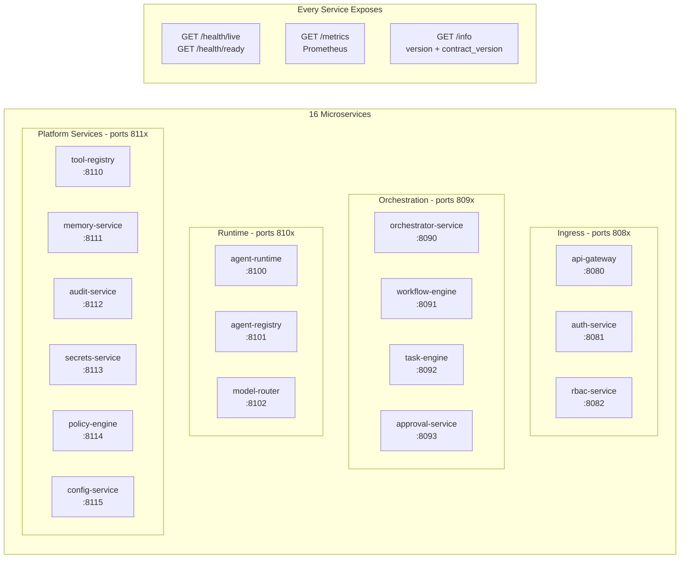

| Service | Language | Framework | Key Dependency | Purpose |
|---------|----------|-----------|----------------|---------|
| `api-gateway` | Go | Echo | Kong plugins | Rate limiting, routing, TLS |
| `auth-service` | Python | FastAPI | PostgreSQL, Redis | OIDC/JWT |
| `rbac-service` | Python | FastAPI | PostgreSQL | Role + permissions |
| `orchestrator-service` | Python | FastAPI | Kafka, PostgreSQL | Planner, gate enforcer |
| `workflow-engine` | Python | FastAPI | PostgreSQL | State machines |
| `task-engine` | Python | FastAPI | PostgreSQL, Redis | Durable tasks |
| `approval-service` | Python | FastAPI | Kafka, PostgreSQL | Human gates |
| `agent-runtime` | Python | FastAPI | Kafka | Agent execution |
| `agent-registry` | Python | FastAPI | PostgreSQL, Redis | Agent discovery |
| `model-router` | Python | FastAPI | Redis, Config | LLM routing + quota |
| `tool-registry` | Python | FastAPI | PostgreSQL | Tool resolution |
| `memory-service` | Python | FastAPI | pgvector, Redis | Working + LTM |
| `audit-service` | Python | FastAPI | Kafka, ClickHouse | Immutable audit |
| `secrets-service` | Python | FastAPI | HashiCorp Vault | Token issuance |
| `policy-engine` | Python | FastAPI | OPA, PostgreSQL | Agent governance |
| `config-service` | Python | FastAPI | PostgreSQL, Redis | Configuration |

---

## 8. Deployment Architecture

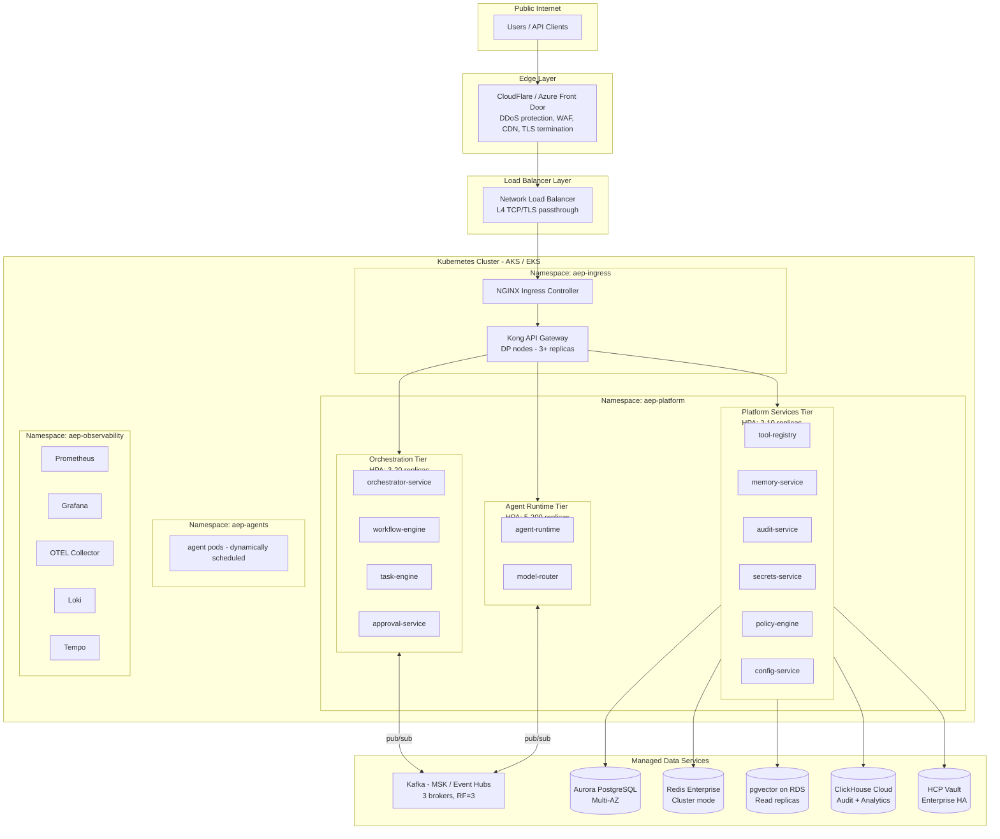

---

## 9. Kubernetes Layout

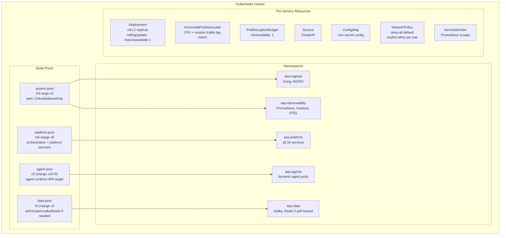

### Key HPA Configurations

```
agent-runtime:
  minReplicas: 5
  maxReplicas: 200
  metric: kafka_consumer_lag{topic="aep.task.created"} < 100
  scaleDown.stabilizationWindowSeconds: 300

orchestrator-service:
  minReplicas: 3
  maxReplicas: 20
  metric: cpu utilization < 70%

audit-service:
  minReplicas: 2
  maxReplicas: 10
  metric: kafka_consumer_lag{topic="aep.audit.events"} < 1000
```

---

## 10. Networking Architecture

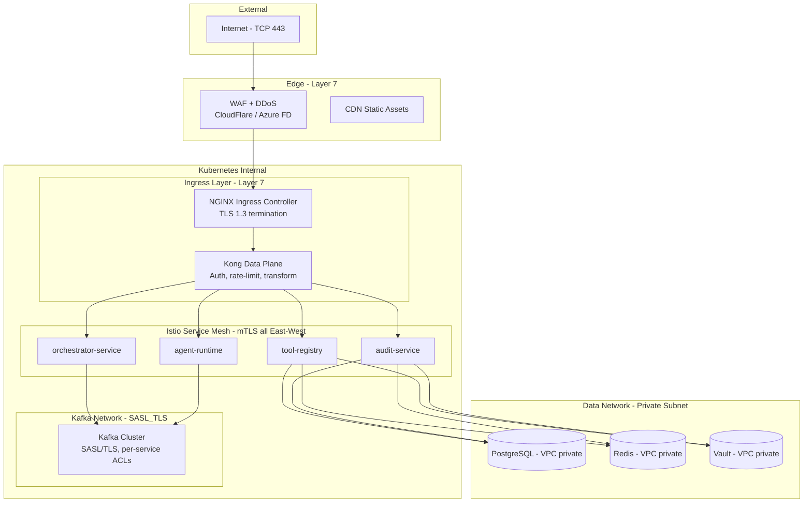

### Network Policy Matrix (critical rules)

| Source Service | Destination | Protocol | Allowed |
|----------------|-------------|----------|---------|
| `agent-runtime` | `orchestrator-service` | TCP | ❌ Event bus only |
| `agent-runtime` | `agent-runtime` | Any | ❌ Agents never call agents |
| `agent-runtime` | Kafka | TCP 9092 | ✅ |
| `agent-runtime` | `tool-registry` | TCP 8110 | ✅ (capability lookup) |
| `agent-runtime` | `policy-engine` | TCP 8114 | ✅ (action check) |
| `agent-runtime` | `secrets-service` | TCP 8113 | ✅ (token issuance) |
| `orchestrator-service` | `agent-runtime` | Any | ❌ Event bus only |
| `orchestrator-service` | Kafka | TCP 9092 | ✅ |
| `orchestrator-service` | `agent-registry` | TCP 8101 | ✅ |
| `orchestrator-service` | `workflow-engine` | TCP 8091 | ✅ |
| Any | Vault directly | Any | ❌ Via `secrets-service` only |

---

## 11. Database Architecture

### PostgreSQL — Schema Layout

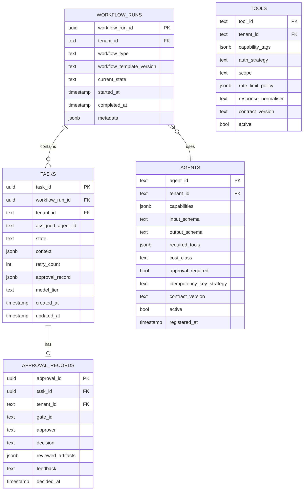

### Row-Level Security Policy (applied to every table)

```sql
-- Every table has this policy — no exceptions
CREATE POLICY tenant_isolation ON orchestrator.workflow_runs
  USING (tenant_id = current_setting('app.current_tenant_id'));

-- Application sets this at connection time:
SET app.current_tenant_id = 'tenant-acme-corp';
```

### Redis Key Schema

```
aep:{tenant_id}:ctx:{task_id}           TTL 24h    Working context packet
aep:{tenant_id}:agent:{agent_id}:hb     TTL 30s    Agent heartbeat
aep:{tenant_id}:sess:{session_id}       TTL 8h     User session
aep:{tenant_id}:quota:{tier}:tokens     TTL 1h     Model quota window
aep:{tenant_id}:rl:{tool_id}:{min}      TTL 60s    Tool rate limit
aep:lock:{resource_id}                  TTL 30s    Distributed lock (Redlock)
```

### ClickHouse — Audit Store

```sql
-- Append-only. No UPDATE. No DELETE. Ever.
CREATE TABLE audit.events
(
    event_id         UUID,
    event_type       LowCardinality(String),
    tenant_id        LowCardinality(String),
    task_id          UUID,
    workflow_run_id  UUID,
    emitted_by       String,
    payload          String,     -- JSON
    timestamp        DateTime64(3),
    date             Date MATERIALIZED toDate(timestamp)
)
ENGINE = MergeTree()
PARTITION BY toYYYYMM(date)
ORDER BY (tenant_id, workflow_run_id, timestamp)
TTL date + INTERVAL 7 YEAR;
```

### pgvector — Long-Term Memory

```sql
CREATE TABLE memory.entries (
    memory_id      UUID PRIMARY KEY DEFAULT gen_random_uuid(),
    tenant_id      TEXT NOT NULL,
    source_type    TEXT NOT NULL CHECK (source_type IN ('standard','adr','incident','codebase')),
    content        TEXT NOT NULL,
    embedding      vector(1536),
    recency_weight FLOAT NOT NULL DEFAULT 1.0,
    provenance     JSONB NOT NULL,    -- {workflow_run_id, task_id, written_by}
    metadata       JSONB,
    created_at     TIMESTAMPTZ DEFAULT now()
);
-- IVFFlat index for ANN search
CREATE INDEX ON memory.entries USING ivfflat (embedding vector_cosine_ops) WITH (lists = 100);
-- Composite index for filtered queries
CREATE INDEX ON memory.entries (tenant_id, source_type, recency_weight DESC);
-- Row-Level Security
ALTER TABLE memory.entries ENABLE ROW LEVEL SECURITY;
CREATE POLICY tenant_isolation ON memory.entries
  USING (tenant_id = current_setting('app.current_tenant_id'));
```

---

## 12. Event Flow Architecture

### Core Event Topology (Kafka Topics)

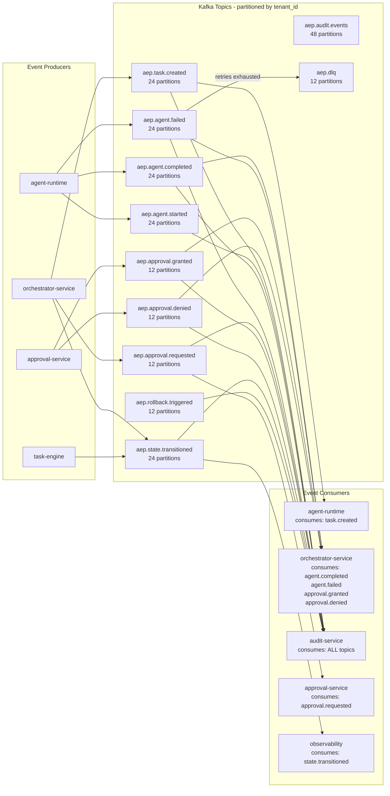

### End-to-End Task Lifecycle

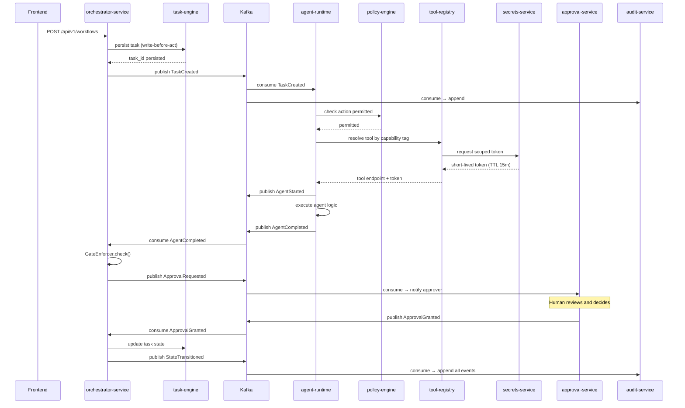

### Failure and Retry Flow

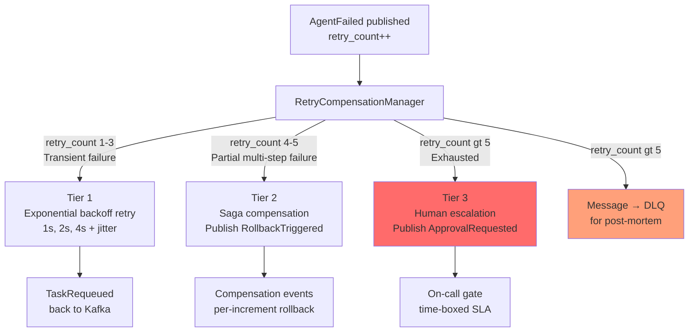

---

## 13. Memory Architecture

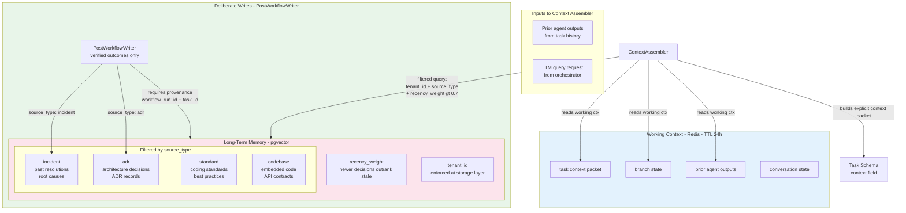

**Strict separation rule:** `WorkingContextService` and `LongTermMemoryService` are separate classes. No method calls across. ContextAssembler is the only component that uses both.

---

## 14. Security Architecture

```mermaid
flowchart TB
    subgraph l1 [Layer 1 - Transport Security]
        TLS2[TLS 1.3\nexternal HTTPS]
        MTLS2[mTLS\nIstio service mesh\ninternal east-west]
    end

    subgraph l2 [Layer 2 - Identity]
        OIDC2[OIDC / SAML\nEntra ID / Okta / Cognito]
        JWT2[JWT validation\nauth-service\nshort-lived tokens]
    end

    subgraph l3 [Layer 3 - Human Authorization]
        RBAC3[rbac-service\nrole ↔ permission model\nwho can approve which gate]
        GE2[GateEnforcer\nnon-bypassable\nno bypass flag exists]
    end

    subgraph l4 [Layer 4 - Agent Authorization]
        OPA2[OPA - Open Policy Agent\npolicy-engine service]
        BUNDLE[per-tenant policy bundles\npolicy-as-code]
    end

    subgraph l5 [Layer 5 - Credential Security]
        VAULT2[HashiCorp Vault\nkv-v2, database, pki, transit]
        SS3[secrets-service\nonly service that touches Vault]
        SCOPE2[Tool scope ceiling\nread/write/admin enforced\nregardless of underlying key]
        TTL2[Short-lived tokens\nTTL 15 minutes per invocation]
    end

    subgraph l6 [Layer 6 - Data Isolation]
        RLS2[PostgreSQL RLS\ntenant_id on every table]
        KAFKA3[Kafka ACLs\nper-service per-topic]
        VNS2[pgvector tenant filter\nat storage layer not API]
        REDIS2[Redis keyspace\naep:{tenant_id}:* prefix]
    end

    l1 --> l2 --> l3 --> l4 --> l5 --> l6
```

**Three security controls — never merged (Constitution S1):**

| Control | Service | Governs |
|---------|---------|---------|
| RBAC | `rbac-service` | Which humans approve which gates |
| Policy Engine | `policy-engine` (OPA) | Which agent actions are permitted, regardless of triggering user |
| Secrets Vault | `secrets-service` + Vault | Credential issuance — no agent holds credentials |

---

## 15. Observability Architecture

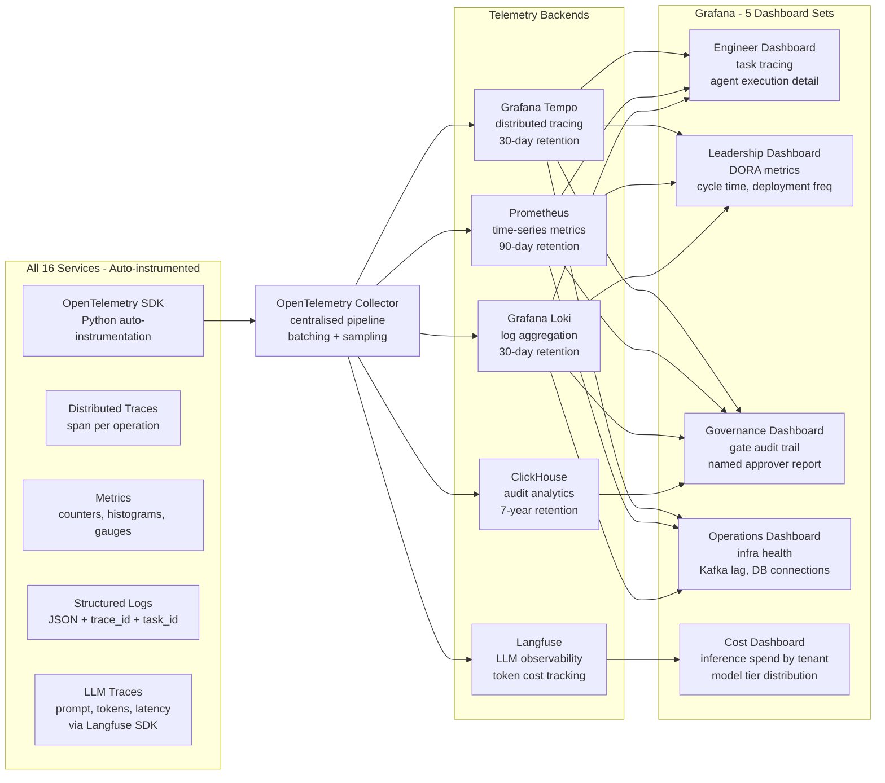

### Key Platform Metrics

```
# Throughput
aep_tasks_total{tenant, workflow_type, state}
aep_workflows_total{tenant, workflow_type, terminal_state}

# Agent performance
aep_agent_execution_duration_seconds{agent_id, cost_class}
aep_agent_retries_total{agent_id, retry_tier}

# Gate metrics
aep_gate_wait_duration_seconds{gate_id, workflow_type}
aep_gate_decisions_total{gate_id, decision}

# Model cost
aep_model_tokens_total{tier, tenant, agent_id}
aep_model_cost_usd_total{tier, tenant}

# Infrastructure health
aep_kafka_consumer_lag{topic, consumer_group}
aep_db_connection_pool_used{service, pool}
aep_cache_hit_rate{service, cache_type}
```

---

## 16. Scalability Architecture

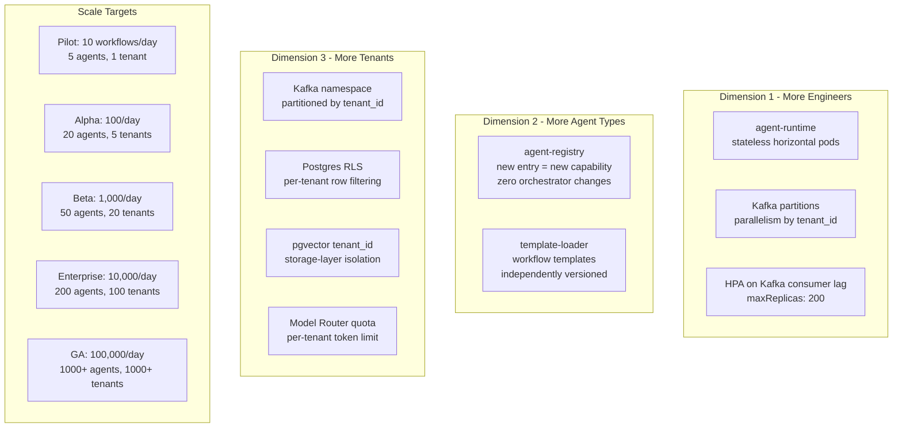

**Honest limit (Constitution AI2):** This architecture scales coordination capacity. Model quality is a separate investment. A weak model does not improve because the platform around it is well-architected.

---

## 17. High Availability Architecture

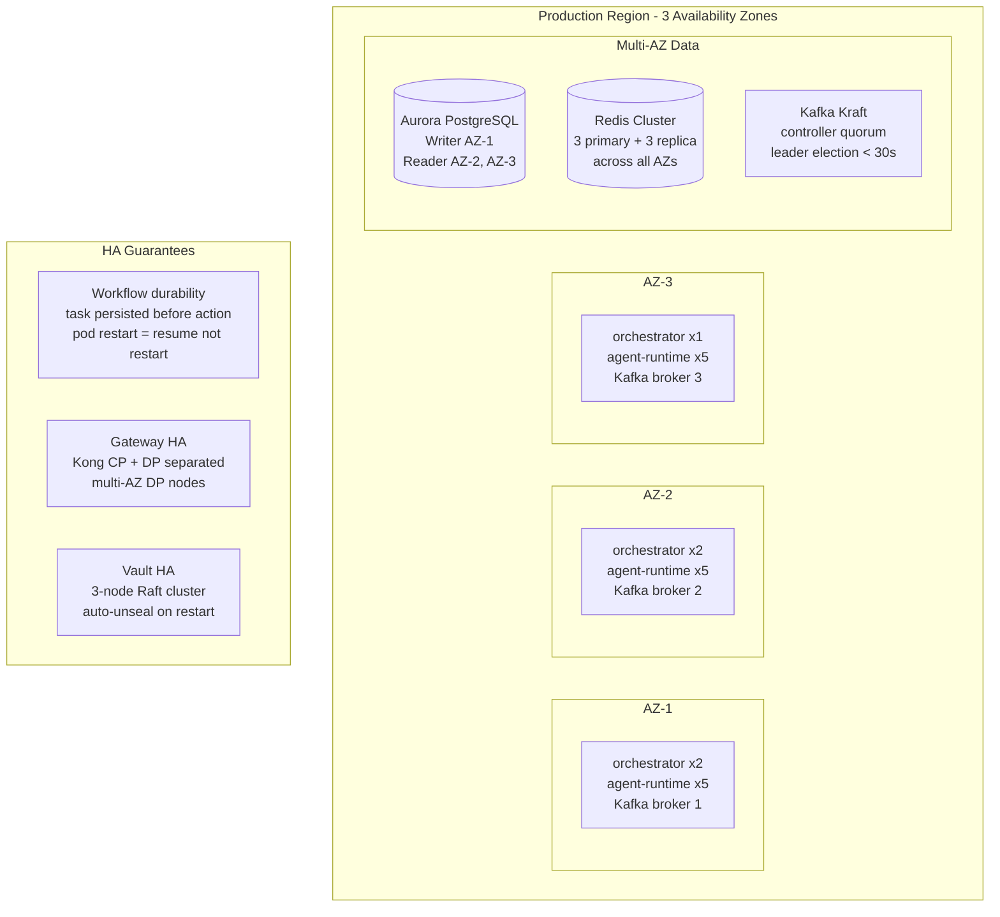

| Component | HA Strategy | RTO | RPO |
|-----------|-------------|-----|-----|
| All services | Deployment min 2 replicas per AZ, PDB | < 30s | 0 (stateless) |
| PostgreSQL | Aurora Multi-AZ, auto-failover | < 60s | < 5s |
| Redis | Cluster mode 3+3, Sentinel | < 30s | < 1s |
| Kafka | RF=3, min-ISR=2, 3 brokers | < 60s | 0 |
| pgvector | Streaming read replicas | < 30s | < 5s |
| ClickHouse | Keeper 3-node quorum | < 60s | < 5s |
| Vault | Raft 3-node HA, auto-unseal | < 30s | 0 |

---

## 18. Disaster Recovery Architecture

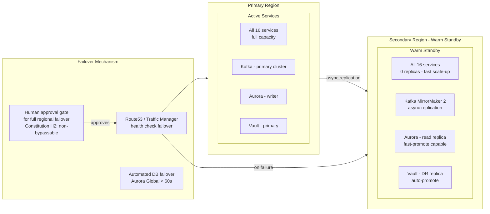

### Backup Schedule

| Data Store | Backup Method | Retention | RTO |
|------------|--------------|-----------|-----|
| PostgreSQL | Continuous WAL + daily snapshot | 30 days | < 60s (Aurora) |
| ClickHouse | Daily cold export → S3 | 7 years (audit) | < 4 hours |
| pgvector | pg_dump + WAL archiving | 30 days | < 60s |
| Kafka | Cross-region MirrorMaker 2 | 30 days | 0 (replicated) |
| Vault | Auto-snapshot → encrypted S3 | 90 days | < 30s |
| Redis | RDB snapshot every 15 min | No persistence needed | Warm from DB |

---

## 19. API Architecture

```mermaid
flowchart TB
    subgraph clients [API Clients]
        WEBCLIENT[React Frontend\nREST + WebSocket]
        SDKCLIENT[Agent SDK\ngRPC internal]
        EXTCLIENT[External Integrations\nREST webhooks]
    end

    subgraph gateway [API Gateway - Kong]
        RT[Routing]
        AT[Auth validation\nJWT]
        RL[Rate limiting\nper-tenant]
        TF[Transform\nrequest/response]
    end

    subgraph apis [Service APIs]
        subgraph rest [REST APIs - OpenAPI 3.1]
            WFA[/api/v1/workflows]
            AGENTA[/api/v1/agents]
            TOOLA[/api/v1/tools]
            APPROVA[/api/v1/approvals]
            AUDITA[/api/v1/audit]
            MEMA[/api/v1/memory]
        end
        subgraph ws [WebSocket]
            WS2[/ws/workflows/{id}\nreal-time state updates]
            WSAPPR[/ws/approvals\npending gate notifications]
        end
        subgraph grpc [gRPC - internal services]
            AGENTGRPC[AgentRegistry.Resolve\nToolRegistry.Resolve]
            MEMGRPC[MemoryService.Query\nMemoryService.Write]
            POLICYGRPC[PolicyEngine.Check]
        end
    end

    WEBCLIENT --> gateway --> rest & ws
    SDKCLIENT --> grpc
    EXTCLIENT --> gateway
```

---

## 20. Multi-Tenancy Architecture

```mermaid
flowchart TB
    subgraph tenants [Multiple Tenants - One Platform Deployment]
        subgraph tenantA [Tenant A - FinTech Corp]
            TA_POLICY[gates: architecture + security required]
            TA_TOOLS[tools: github-prod + jira-tenant-a]
            TA_QUOTA[quota: 100k tokens/hour]
        end
        subgraph tenantB [Tenant B - HealthCare Org]
            TB_POLICY[gates: CAB + CSO required]
            TB_TOOLS[tools: azure-devops-b + confluence-b]
            TB_QUOTA[quota: 50k tokens/hour]
        end
        subgraph tenantC [Tenant C - Manufacturing]
            TC_POLICY[gates: tech lead only]
            TC_TOOLS[tools: gitlab-c + jira-c]
            TC_QUOTA[quota: 200k tokens/hour]
        end
    end

    subgraph isolation [3-Layer Isolation]
        subgraph layer1a [Layer 1 - Data]
            KPART[Kafka partitioned\nby tenant_id]
            RLS4[PostgreSQL RLS\ncurrent_setting tenant_id]
            VFILT[pgvector tenant_id\nstorage filter]
            RKEY[Redis keyspace\naep:{tenant_id}:*]
        end
        subgraph layer2a [Layer 2 - Policy]
            TPOL[Per-tenant gate config\nOPA bundle per tenant]
            TTOOLS[Per-tenant tool visibility]
            TAGENTS[Per-tenant agent visibility]
        end
        subgraph layer3a [Layer 3 - Resources]
            TQUOTA[Per-tenant model quota\nRedis token counter]
            TRATE[Per-tenant tool rate limit\nsliding window]
        end
    end

    tenants --> isolation
```

---

## 21. Workflow Engine Architecture

```mermaid
stateDiagram-v2
    [*] --> Scoped : WorkflowInitiated

    Scoped --> Architected : ApprovalGranted\n[scope gate - Product Owner]
    Scoped --> Scoped : ApprovalDenied\n[revision task created]

    Architected --> Implemented : ApprovalGranted\n[arch gate - Tech Lead]
    Architected --> Architected : ApprovalDenied\n[revision task]

    Implemented --> Tested : AgentCompleted\n[coding agent]
    Tested --> Scanned : AgentCompleted\n[test agent]
    Scanned --> Merged : ApprovalGranted\n[merge gate - Senior Eng]
    Merged --> Released : ApprovalGranted\n[release gate - Release Mgr]

    Implemented --> Failed : AgentFailed × 5
    Tested --> Failed : AgentFailed × 5
    Released --> RolledBack : RollbackTriggered
    Released --> [*]
    RolledBack --> [*]
    Failed --> [*]
```

### Workflow Template Structure

```
{
  workflow_type, version, initial_state, terminal_states,
  states: [
    {
      name, required_capability,
      gate: { id, strategy: "open-ended"|"time-boxed", sla_minutes, required_role },
      transitions_to
    }
  ],
  context_handoff: { state → [context_keys] },
  rollback_strategy: { pre_merge, post_release },
  success_criteria: [...]
}
```

---

## 22. Agent Lifecycle

```mermaid
stateDiagram-v2
    [*] --> Registered : SDK registers agent\ncontract validated

    Registered --> Available : Health check passed\nagent-runtime loaded

    Available --> Dispatched : TaskCreated event\nmatched by capability

    Dispatched --> Executing : AgentStarted published\ntools resolved\ntokens issued

    Executing --> Completed : AgentCompleted published\nresult in output_schema

    Executing --> Failed : AgentFailed published\nerror_code + retry_count

    Failed --> Dispatched : Tier 1 retry\nretry_count lt 3

    Failed --> Compensating : Tier 2 saga\nretry_count 3-5

    Failed --> Escalated : Tier 3 human gate\nretry_count gt 5

    Completed --> Available : Ready for next task

    Compensating --> Available
    Escalated --> [*]
    Completed --> Deregistered : SDK deregisters\nrolling update
    Deregistered --> [*]
```

---

## 23. Tool Integration Architecture

```mermaid
flowchart LR
    subgraph agent [agent-runtime]
        REQ[Agent requests\ncreate-pull-request]
    end

    subgraph toolReg [tool-registry]
        CAP[capability lookup\ncreate-pull-request]
        RESOLVE[resolve to\ntenant tool config]
        NORM[response_normaliser\nvendor → common shape]
    end

    subgraph vault3 [secrets-service + Vault]
        TOKEN[short-lived token\nscoped to repo\nTTL 15 min]
    end

    subgraph vendors [Vendor APIs]
        GH2[GitHub API]
        ADO[Azure DevOps API]
        GL[GitLab API]
    end

    subgraph commonShape [Common Response Shape]
        PR[pr_id, pr_url, status, branch]
    end

    REQ --> CAP --> RESOLVE
    RESOLVE --> TOKEN
    TOKEN --> GH2
    TOKEN --> ADO
    TOKEN --> GL
    GH2 & ADO & GL --> NORM --> PR --> agent
```

**Tool Contract fields:** `tool_id · capability_tags · auth_strategy · scope · rate_limit_policy · response_normaliser · contract_version`

---

## 24. Model Routing Architecture

```mermaid
flowchart TB
    subgraph dispatch [Cost-Aware Dispatcher]
        COSTCLASS[Agent cost_class hint\nlow / medium / high]
        TASKMETA[Task metadata\nsecurity_critical flag\ncomplexity_score]
        TENQUOTA[Tenant quota check\nRedis token counter]
    end

    subgraph router [model-router service]
        CLASSIFY[TaskClassifier\nfinal tier decision]
        ROUTE[TierRouter\nroute to endpoint]
    end

    subgraph tiers [Model Tiers - endpoints are config not code]
        LOW[Low Tier\nroutine tasks\ntest scaffolding\ndocumentation]
        MED[Medium Tier\nfeature development\ncode review]
        HIGH[High Tier\narchitecture design\nsecurity critical\nincident root cause]
    end

    subgraph quota [Per-Tenant Quota Enforcement]
        QCHECK[Token counter in Redis\nsliding window 1h]
        QBACKP[Backpressure on exceed\ntask queued not dropped]
    end

    COSTCLASS & TASKMETA --> CLASSIFY
    CLASSIFY --> TENQUOTA --> ROUTE
    ROUTE --> LOW & MED & HIGH
    TENQUOTA --> QCHECK
    QCHECK --> QBACKP
```

---

## 25. SDK Architecture

```mermaid
flowchart TB
    subgraph agentSDK [aep-agent-sdk - Python Package]
        subgraph base [Base Classes]
            AGENT[Agent\nAbstract base class\nall agents inherit]
            CTX[AgentContext\ntyped context packet]
            RESULT[AgentResult\ntyped output]
        end

        subgraph capabilities [Auto-Inherited Capabilities]
            LOGCAP[logging\nstructured JSON\ntask_id + workflow_run_id]
            MEMCAP[memory\nworking context\nLTM query]
            EVCAP[events\nAgentStarted/Completed/Failed\ncorrect envelope]
            RETRYCAP[retry\nexponential backoff\nidempotency check]
            SECCAP[security\npolicy check\nscoped token]
            TOOLCAP[tool access\ncapability-based\nnot vendor-specific]
            METCAP[metrics\nhistogram per operation]
            CFGCAP[configuration\nper-tenant\nfrom config-service]
        end

        subgraph registration [Registry Integration]
            REG[AgentRegistration\ncontract validation\nheartbeat]
        end
    end

    subgraph usage [Usage Pattern]
        IMPL[class ReviewAgent\n    inherits Agent\n\n    async def execute\n        self.tools.invoke\n        self.memory.query\n        return AgentResult]
    end

    AGENT --> LOGCAP & MEMCAP & EVCAP & RETRYCAP & SECCAP & TOOLCAP & METCAP & CFGCAP
    AGENT --> REG
    IMPL --> AGENT
```

---

## Phase Execution Summary

| Phase | Deliverable | Key Acceptance Criterion |
|-------|-------------|--------------------------|
| **1** | Repository structure, service scaffolding, technology stack, ADRs, dev guidelines | CI green, service boundaries enforced |
| **2** | All 16 core platform microservices | Contract tests pass, integration suite green |
| **3** | Agent SDK + Tool SDK | Third-party agent registers in < 1 day |
| **4** | 15 specialist agents | All implement Agent Contract, idempotency verified |
| **5** | 8 workflow templates | End-to-end run with full audit trail |
| **6** | All database schemas + migrations | RLS verified, cross-tenant leakage = 0 |
| **7** | 11 external connectors | Tool Contract compliance, response normalisation |
| **8** | REST / gRPC / WebSocket APIs + OpenAPI | Contract tests, load tests |
| **9** | React dashboard (9 views) | Approval console blocks workflow |
| **10** | Docker, Compose, K8s, Helm, Terraform, CI/CD | Deploy to dev with one command |
| **11** | Full observability stack | 3 Grafana audiences from real runs |
| **12** | Unit, integration, contract, load, workflow, chaos | > 80% coverage, chaos: zero workflow loss |
| **13** | Architecture, Developer, Operator, API, SDK guides | Peer-reviewed, published |

---

## Document Relationships

| Document | Role |
|----------|------|
| [CONSTITUTION.md](../../CONSTITUTION.md) | Immutable principles — this diagram doc must not violate any |
| [ARCHITECTURE.md](../ARCHITECTURE.md) | Source architecture this document visualises |
| [DECISIONS.md](./DECISIONS.md) | ADRs explaining why each architectural choice was made |
| [CLAUDE.md](../CLAUDE.md) | Implementation rules derived from this architecture |
| [ROADMAP.md](../ROADMAP.md) | Delivery timeline for each architectural layer |
| [TASKS.md](../TASKS.md) | Engineering breakdown implementing each diagram |

---

*This is a living document. Every new architectural diagram belongs here. Update when containers, data flows, security controls, or deployment topology changes. Changes that conflict with CONSTITUTION.md require a Decision Record.*
