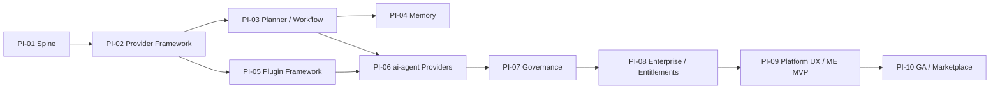

# Architecture v2.0 — Engineering Roadmap Alignment Report

**Status:** Normative engineering alignment  
**Version:** 1.0  
**Effective:** 1 July 2026  
**Authority:** Subordinate to [ARCHITECTURE_BASELINE_V2.md](../architecture/ARCHITECTURE_BASELINE_V2.md) and [CONSTITUTION.md](../../CONSTITUTION.md)  
**Audience:** PI leads, platform engineers, architects (internal only — not customer-facing)

---

## Executive summary

Architecture Baseline v2.0 is **approved**. This report aligns the **internal PI execution plan** (`docs/04-program/`) with v2 ontology **without deleting PI folders, removing implementation work, or rewriting completed documentation**.

**Alignment rules applied:**

| Rule | Application |
|------|-------------|
| PI folder names unchanged | `PI-02-Agent-Runtime` remains; v2 maps to **Provider Framework** conceptually |
| Completed work preserved | `src/` spine progress, contracts, workflows, merged stories, and tests stand |
| Surgical evolution only | Objectives, capabilities, and migration notes updated where v2 requires |
| Customer vocabulary separate | Glossary and UX model govern external language; PIs remain engineering shorthand |

**Summary by classification:**

| Classification | PIs |
|----------------|-----|
| **Unchanged** | PI-01 (spine), PI-04 (memory) |
| **Renamed** (conceptual only) | PI-02, PI-05, PI-09 |
| **Extended** | PI-02, PI-03, PI-05, PI-06, PI-07, PI-08, PI-09, PI-10 |
| **Deferred** | Marketplace GA, Workflow-as-Object migration, brownfield templates (within existing PI schedule) |
| **Deprecated** (concepts, not folders) | Agent-as-primitive, ad-hoc Model Router, dual agent/tool contract long-term |
| **New** (capabilities inside existing PIs) | Metadata Engine, Provider Builder, Execution Profiles, Entitlements runtime, Marketplace pipeline |

**Recommended order:** Complete PI-01 → PI-02 → PI-03 → PI-05 → PI-04 → PI-06 → PI-07 → PI-08 → PI-09 → PI-10 (sequence unchanged; scope enriched per v2).

---

## v2 concept rename map (engineering ↔ architecture)

| v1 engineering term (PI / service) | v2 architecture term | PI ownership | Migration note |
|-----------------------------------|----------------------|--------------|----------------|
| Agent Runtime | **Provider Framework** (execution host) | PI-02 | `agent-runtime` service path unchanged; hosts `provider_kind: ai-agent` |
| Agent Registry | **Provider Registry** (ai-agent index) | PI-02 | Capability-tag discovery unchanged; unified schema in PI-09 (G-02) |
| Tool Registry | **Plugin Framework** (connector index) | PI-05 | `tool-registry` unchanged; indexes `connector` / `rest-api` Providers |
| Model Router | **Execution Profile Service** (resolver) | PI-02 → PI-06 | v1 `cost_class` routing first; Profile metadata in PI-09 (G-04) |
| Workflow Engine | **Workflow Framework** | PI-03 | JSON templates now; Platform Objects in registry later (G-09) |
| Orchestrator | **Planner** (within Execution Engine) | PI-03 | No specialist logic; Provider resolution by capability tag |
| Developer Experience | **Platform UX Framework** | PI-09 | Builders, Object Explorer, Metadata Engine MVP |
| Engineering Agents | **ai-agent Providers** (catalog) | PI-06 | Agent SDK remains; registers as Provider metadata |
| config-service | **Configuration hierarchy** + ME Phase 1 | PI-08 | Evolves toward Metadata Engine (G-01) |

Reference: [ARCHITECTURE.md](../../ARCHITECTURE.md) § Baseline v2 lexical mapping.

---

## PI-by-PI impact assessment

### PI-01 — Platform Spine

| Attribute | Value |
|-----------|-------|
| **Classification** | **Unchanged** (minor **Extended**) |
| **v2 impact** | Foundation for all v2 engines; observability baseline supports v2 metrics/audit requirements |
| **Folder / service paths** | No rename |
| **Completed work preserved** | `contracts/`, `workflows/greenfield-v1.0.0.json`, `src/platform/*` skeletons, US-01.01–01.07 stories, integration tests |

**Document review:**

| Artifact | Action |
|----------|--------|
| Objectives | ✅ Already references Baseline v2 |
| Capabilities | Unchanged — spine capabilities valid |
| Features | N/A (capability-driven) |
| User Stories | **Unchanged** — US-01.01 through US-01.07 |
| Acceptance Criteria | **Unchanged** |
| Prompt Mapping | ✅ Baseline header present |
| Sprint Plan | **Unchanged** |

**Architecture impacts:** Reserve container slot for future **Metadata Engine** service (documented in baseline; not a PI-01 deliverable). CI must validate v1 contracts until `provider-contract.schema.json` lands (PI-09).

**Migration note:** None required for in-flight PI-01 work. Update README status table as stories complete — do not remove delivered items.

**Risks:** README "Not started" table may understate `src/` progress — align status during PI-01 closeout only.

---

### PI-02 — Agent Runtime

| Attribute | Value |
|-----------|-------|
| **Classification** | **Renamed** (conceptual) + **Extended** |
| **v2 concept** | **Provider Framework** — execution host for `ai-agent` Providers |
| **Folder / service paths** | `agent-runtime/`, `agent-registry/`, `model-router/` unchanged |

**Document review:**

| Artifact | Action |
|----------|--------|
| Objectives | ✅ O3 notes Execution Profile evolution (G-04) |
| Capabilities | **Extended** — add Provider Contract validation path when schema available |
| Features | **Extended** — Profile resolver hook (deferred detail to PI-09) |
| User Stories | **Unchanged** IDs; O3 acceptance evolves when Profiles land |
| Acceptance Criteria | **Extended** for O3 only when PI-09 delivers Profile schema |
| Prompt Mapping | ✅ Baseline header present |
| Sprint Plan | **Unchanged** sequence; add Profile integration sprint after PI-09 dependency |

**New capabilities (within PI-02):** Provider-kind discriminator on registration; prepare registry for unified Provider Contract.

**Deprecated concepts:** Treating "agent" as a separate primitive (use Provider language in new docs/comments).

**Migration note:** Implement v1 agent-contract first. Map fields to Provider Contract when G-02 closes — no re-registration of completed agents required if mapping is backward-compatible.

**Affected gap register:** G-02, G-04.

---

### PI-03 — Orchestrator

| Attribute | Value |
|-----------|-------|
| **Classification** | **Extended** |
| **v2 concept** | **Planner** + **Workflow Framework** |
| **Folder / service paths** | `orchestrator-service`, `workflow-engine`, `task-engine`, `approval-service` unchanged |

**Document review:**

| Artifact | Action |
|----------|--------|
| Objectives | ✅ Planner + capability-tag Provider resolution |
| Capabilities | **Extended** — Workflow Engine reads file templates; registry path documented for G-09 |
| Features | Unchanged for MVP greenfield file-based workflow |
| User Stories | **Unchanged** |
| Acceptance Criteria | **Unchanged** |
| Prompt Mapping | ✅ Baseline header present |
| Sprint Plan | **Unchanged** |

**Deferred:** Workflow definitions as published Platform Objects (G-09) — post-MVP within PI-03 or early PI-09.

**Migration note:** `workflows/greenfield-v1.0.0.json` remains authoritative until Metadata Engine publishes workflow objects. Dual-path migration: file → registry without breaking in-flight runs.

**Affected gap register:** G-09, G-14.

---

### PI-04 — Memory

| Attribute | Value |
|-----------|-------|
| **Classification** | **Unchanged** |
| **v2 impact** | Memory Store primitive unchanged; Context Assembler consumes resolved metadata context |

**Document review:**

| Artifact | Action |
|----------|--------|
| Objectives | Add baseline reference on touch |
| Capabilities | **Unchanged** — M1–M4 constitutional constraints stand |
| Features / Stories / AC / Sprint | **Unchanged** |
| Prompt Mapping | ✅ Baseline header present |

**Migration note:** LTM writes remain PostWorkflowWriter-only. No Provider Model change to memory layers.

---

### PI-05 — Tool Registry

| Attribute | Value |
|-----------|-------|
| **Classification** | **Renamed** (conceptual) + **Extended** |
| **v2 concept** | **Plugin Framework** — `connector` and `rest-api` Provider index |
| **Folder / service paths** | `tool-registry/`, `github-tool/`, etc. unchanged |

**Document review:**

| Artifact | Action |
|----------|--------|
| Objectives | **Extended** — baseline reference added |
| Capabilities | **Extended** — connector Provider registration semantics |
| Features | **Unchanged** F1–F5 |
| User Stories | **Unchanged** |
| Prompt Mapping | ✅ Baseline header present |
| README | ✅ Already documents Provider mapping |

**Migration note:** Tool Contract remains valid v1 schema. Connector Providers map to tool-contract fields until Provider Contract unifies (PI-09).

**Affected gap register:** G-02.

---

### PI-06 — Engineering Agents

| Attribute | Value |
|-----------|-------|
| **Classification** | **Extended** |
| **v2 concept** | Catalog of **`ai-agent` Providers** |

**Document review:**

| Artifact | Action |
|----------|--------|
| Objectives | **Extended** — baseline reference |
| Capabilities | **Extended** — Execution Profile binding per agent class (high/medium/low) |
| Features | **Unchanged** agent list |
| User Stories | **Unchanged** |
| README | ✅ Already v2-aligned |

**New capabilities:** Agents declare default Execution Profile reference (metadata) when Profile schema exists.

**Migration note:** `aep-agent-sdk` and agent-contract unchanged for MVP. Profile refs additive.

**Affected gap register:** G-04.

---

### PI-07 — Governance

| Attribute | Value |
|-----------|-------|
| **Classification** | **Extended** |
| **v2 impact** | Governance by default on all Platform Objects; Policy Engine unchanged in role |

**Document review:**

| Artifact | Action |
|----------|--------|
| Objectives | **Extended** — baseline reference |
| Capabilities | **Extended** — audit events for metadata publish/approve (PI-09 handoff) |
| Features / Stories | **Unchanged** |
| Prompt Mapping / README | ✅ Baseline references present |

**Migration note:** Gate enforcement unchanged (H2). Future: Policy rules target Platform Object types generically.

---

### PI-08 — Enterprise

| Attribute | Value |
|-----------|-------|
| **Classification** | **Extended** |
| **v2 concepts** | **Entitlements**, configuration hierarchy, Marketplace preparation |

**Document review:**

| Artifact | Action |
|----------|--------|
| Objectives | **Extended** — Entitlement enforcement, effective_configuration |
| Capabilities | **New:** Entitlement runtime checks (G-10); config-service as ME Phase 1 |
| Features | **Extended** — Commercial Pack grant enforcement hooks |
| User Stories | Add stories for Entitlement deny path when PI-08 planning sprint starts |
| README | ✅ Already v2-aligned |

**Deferred:** Full Marketplace install pipeline → PI-09/PI-10 (G-06).

**Migration note:** Multi-tenancy model unchanged (MT1–MT3). Entitlements layer on top of RBAC/Policy — do not merge services (S1).

**Affected gap register:** G-01 (Phase 1), G-06, G-10.

---

### PI-09 — Developer Experience

| Attribute | Value |
|-----------|-------|
| **Classification** | **Renamed** (conceptual) + **Extended** |
| **v2 concept** | **Platform UX Framework** + **Metadata Engine MVP** |

**Document review:**

| Artifact | Action |
|----------|--------|
| Objectives | **Extended** — baseline reference; ME MVP, Provider Builder |
| Capabilities | **New:** Metadata Engine publish/validate/registry; Provider Builder; Object Explorer |
| Features | **Extended** — F1 must include ME + Builders per README |
| User Stories | **New stories required** when sprint planning: US-ME-01 (publish), US-PB-01 (builder), US-OE-01 (explorer) |
| Acceptance Criteria | **Extended** for new stories only |
| README | ✅ Already detailed v2 scope |

**New capabilities (critical path):**

- `provider-contract.schema.json` (G-02)
- `platform-object.schema.json` envelope (G-05)
- Metadata Engine MVP (G-01)
- Provider Builder UX (G-07)

**Migration note:** Dashboard "Agent Registry" view = Provider Registry filtered to `ai-agent`. No UI rename required in PI docs until implementation.

**Affected gap register:** G-01, G-02, G-05, G-07.

---

### PI-10 — General Availability

| Attribute | Value |
|-----------|-------|
| **Classification** | **Extended** |
| **v2 impact** | Marketplace operational, partner Solution Packs, ecosystem hardening |

**Document review:**

| Artifact | Action |
|----------|--------|
| Objectives | **Extended** — partner Marketplace certification |
| Capabilities | **New:** Marketplace install at scale; Commercial Pack lifecycle |
| Features / Stories | **Extended** at planning time — no rewrite now |
| Prompt Mapping | ✅ Baseline header present |

**Migration note:** GA exit criteria unchanged; add Marketplace soak test when G-06 implementation completes.

**Affected gap register:** G-06.

---

## Renamed capabilities (summary)

| Engineering capability ID / name | v2 name | PI |
|----------------------------------|---------|-----|
| Agent execution | Provider dispatch (`ai-agent`) | PI-02 |
| Agent discovery | Provider Registry query by capability tag | PI-02 |
| Tool resolution | Connector Provider resolution | PI-05 |
| Model tier routing | Execution Profile resolution | PI-02, PI-06 |
| Workflow template file | Workflow Platform Object (future) | PI-03, PI-09 |
| Dev portal / dashboard | Platform UX / Builders | PI-09 |

**No capability IDs renamed in PI-01** — CAP-01 through CAP-06 stand.

---

## New capabilities (within existing PIs)

| Capability | Description | Primary PI | Dependency |
|------------|-------------|------------|------------|
| **Metadata Engine MVP** | Publish, validate, registry index for Platform Objects | PI-09 (Phase 1 in PI-08 config-service) | PI-01 spine |
| **Provider Contract** | Unified schema for all Provider kinds | PI-09 | agent + tool contracts |
| **Platform Object envelope** | Generic validation wrapper | PI-09 | contracts CI |
| **Execution Profiles** | preferred/fallback/consensus model strategy | PI-09 design; PI-02/06 consume | Model Router |
| **Provider Builder** | Customer-authored Provider metadata | PI-09 | Provider Contract |
| **Object Explorer** | Global Platform Object catalogue UI | PI-09 | Metadata Engine |
| **Entitlement enforcement** | Commercial Pack grant checks at activation | PI-08 | config-service |
| **Marketplace pipeline** | Certified install + auto_register | PI-08 prep, PI-10 GA | Metadata Engine |
| **Solution / Commercial Packs** | Composed metadata bundles | PI-08, PI-10 | Entitlements |

---

## Deprecated concepts (not removed from repo)

| Concept | Replacement | PI transition |
|---------|-------------|---------------|
| Agent as first-class primitive | Provider (`provider_kind`) | Language only until Provider Contract |
| Separate agent + tool type trees | Provider Contract single hierarchy | PI-09 schema |
| Model Router as sole routing authority | Execution Profile metadata + resolver | PI-02 MVP → PI-09 |
| Orchestrator dispatches "agents" by name | Planner dispatches Providers by capability tag | PI-03 (already in objectives) |
| Per-tenant platform forks | Configuration + Packs | PI-08 Entitlements |

**Not deprecated:** Service directory names, Kafka topic names, v1 contract schemas (remain valid until MINOR/MAJOR schema version bump).

---

## Story changes

| PI | Story change type | Detail |
|----|-------------------|--------|
| PI-01 | **None** | US-01.01–01.07 preserved; in-progress implementation in `src/` retained |
| PI-02 | **Extend acceptance** | O3 / model routing: add Profile-based criteria when PI-09 delivers schema |
| PI-03 | **None** (MVP) | File-based greenfield unchanged |
| PI-04 | **None** | |
| PI-05 | **None** | |
| PI-06 | **Extend** | Optional Profile ref on agent registration (new AC line) |
| PI-07 | **None** (MVP) | Metadata audit stories added at PI-09 boundary |
| PI-08 | **New** (at planning) | Entitlement deny, Pack activation stories |
| PI-09 | **New** (at planning) | ME publish, Provider Builder, Object Explorer stories |
| PI-10 | **Extend** (at planning) | Marketplace certification soak test |

**Rule:** Do not delete or renumber existing story IDs. Add new stories with new IDs only.

---

## Risks

| ID | Risk | Likelihood | Impact | Mitigation |
|----|------|------------|--------|------------|
| R-01 | Engineers implement agent-only patterns ignoring Provider Model | Medium | High | Baseline + this report + glossary in prompt mappings |
| R-02 | PI-09 scope creep (all Builders at once) | High | Medium | MVP: Provider + Workflow builders first; defer Policy Builder |
| R-03 | Dual contract validation (agent + provider) during migration | Medium | Medium | PI-09 ships mapping layer; CI accepts both until MAJOR bump |
| R-04 | Model Router rebuilt before Profile schema | Medium | High | Keep cost_class routing in PI-02; Profile is additive (G-04) |
| R-05 | Workflow file + object dual maintenance | Low | Medium | G-09 migration plan: file deprecated only after registry parity test |
| R-06 | README status drift vs `src/` reality | Medium | Low | PI-01 closeout audit only — do not rewrite mid-PI |

---

## Recommended implementation order

| Phase | PI | v2 focus | Gate |
|-------|-----|----------|------|
| **Now** | PI-01 | Spine + observability | 16 services healthy, CI green |
| **Next** | PI-02 | Provider Framework MVP | TaskCreated → AgentCompleted |
| | PI-03 | Planner + greenfield file workflow | E2E workflow + gates |
| | PI-05 | Plugin Framework | GitHub/Jira/Confluence connectors |
| **Alpha** | PI-04 | Memory layers | RLS + no blind vector search |
| | PI-06 | 15 ai-agent Providers | Contract + idempotency per agent |
| **Beta** | PI-07 | Policy + audit | RBAC ≠ Policy ≠ Secrets |
| **Enterprise** | PI-08 | Entitlements + config hierarchy | Two-tenant isolation |
| **UX** | PI-09 | ME MVP + Builders + Provider Contract | Publish Platform Object in UI |
| **GA** | PI-10 | Marketplace + hardening | 10k workflows/day |

**Critical path for v2 differentiation:** PI-01 → PI-02 → PI-03 → **PI-09** (Metadata Engine + Provider Contract) → PI-08 Entitlements → PI-10 Marketplace.

---

## Repository impact

| Area | Impact |
|------|--------|
| `docs/04-program/` | Migration notes in READMEs; new stories at planning time only |
| `contracts/` | Add `provider-contract`, `platform-object`, `execution-profile` schemas in PI-09 (see [contracts/README.md](../../contracts/README.md)) |
| `src/platform/` | Service paths unchanged; registry services gain Provider-kind fields |
| `workflows/` | JSON files remain; registry migration later |
| `.ai/skills/` | Optional baseline links (G-13) — PI-09 scope |
| `ROADMAP.md` | Pointer to this report |

---

## Implementation impact

| Workstream | Change from v1 plan |
|------------|---------------------|
| Spine | None — complete PI-01 |
| Runtime | Register Providers, not "agents only" in new code |
| Registry | Prepare unified Provider index; keep separate services |
| Routing | cost_class now; Execution Profiles in PI-09 |
| UX | PI-09 significantly larger — Builders + ME |
| Enterprise | Entitlements enforcement required before Marketplace revenue |
| GA | Partner certification uses Marketplace pipeline |

---

## Related documents

| Document | Role |
|----------|------|
| [ARCHITECTURE_BASELINE_V2.md](../architecture/ARCHITECTURE_BASELINE_V2.md) | Ontology authority |
| [ARCHITECTURE_CHANGELOG_V2.md](../architecture/ARCHITECTURE_CHANGELOG_V2.md) | What changed in v2 |
| [IMPLEMENTATION_READINESS.md](../architecture/IMPLEMENTATION_READINESS.md) | Readiness score (76/100) |
| [PLATFORM_GLOSSARY.md](../architecture/PLATFORM_GLOSSARY.md) | Vocabulary |
| [ROADMAP.md](../../ROADMAP.md) | Release phases |
| [DECISIONS.md](../../DECISIONS.md) | ADR-025–027 Provider Model, Metadata Engine |

---

*PI folders are the engineering execution plan. v2 vocabulary applies to architecture and customer-facing docs. When in doubt, [ARCHITECTURE_BASELINE_V2.md](../architecture/ARCHITECTURE_BASELINE_V2.md) prevails on ontology; PI READMEs prevail on sprint execution.*
