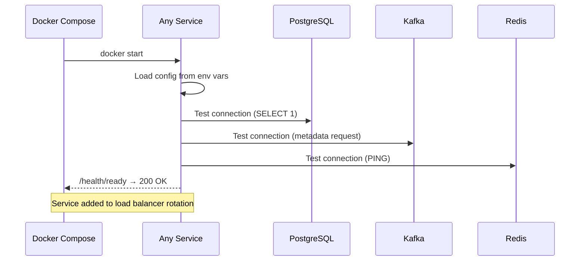
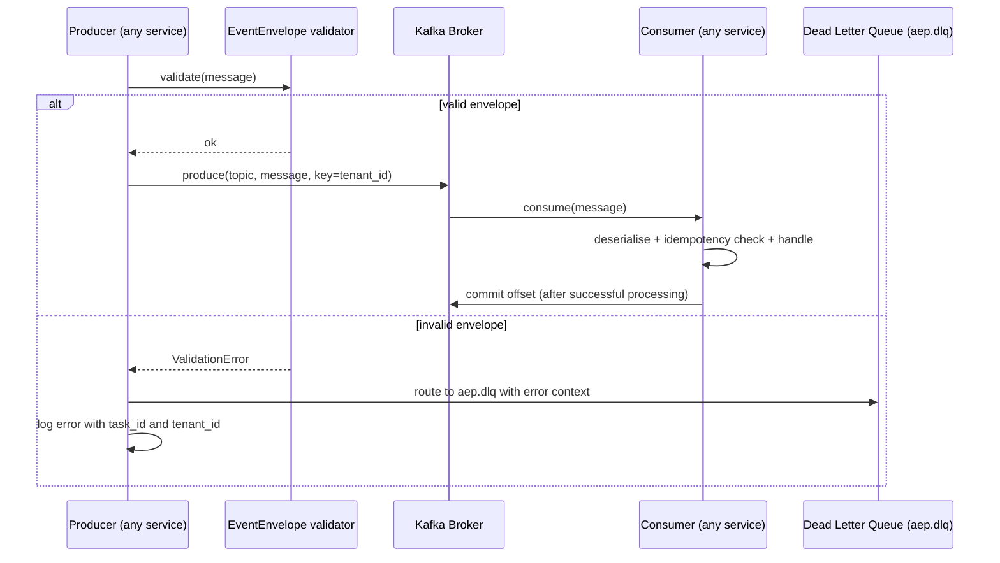
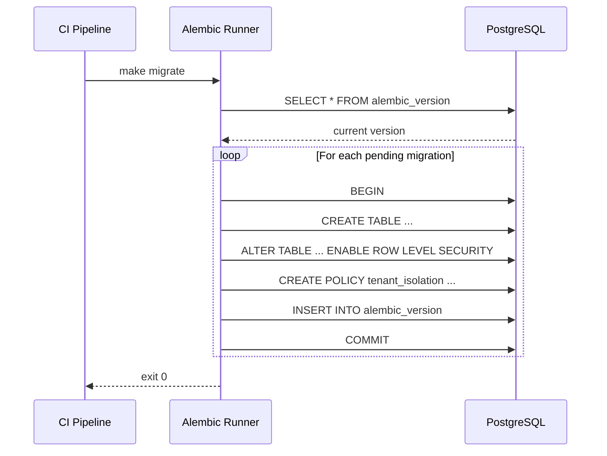

# PI-01 — Capabilities

> **Architecture Baseline v2.0:** [ARCHITECTURE_BASELINE_V2.md](../../../architecture/ARCHITECTURE_BASELINE_V2.md). PI-01 establishes the **container spine**; metadata-driven Platform Objects and Metadata Engine are defined in architecture docs and delivered in PI-08/09.

> This document defines what PI-01 builds: what each capability is, what it delivers,
> and the technical contracts it establishes. Implementation guidance lives in `IMPLEMENTATION.md`.
> Stories and acceptance criteria live in `USER_STORIES.md` and `ACCEPTANCE_CRITERIA.md`.

---

## CAP-01: Service Scaffolding

**Delivers:** `US-01.01`

Create the directory structure and operational boilerplate for all 16 platform services. Every service is production-shaped from day one — no scaffolding to strip out later.

### What every service contains

| File | Purpose |
|------|---------|
| `Dockerfile` | Multi-stage build, non-root user, `HEALTHCHECK` instruction |
| `pyproject.toml` / `go.mod` | Language-specific package manifest |
| `src/main.py` / `src/main.go` | FastAPI (Python) or Echo (Go) app factory |
| `src/config.py` | Pydantic Settings — all config from environment variables |
| `src/api/health.py` | `/health/live` and `/health/ready` routes |
| `src/api/metrics.py` | `/metrics` Prometheus text format |
| `src/api/info.py` | `/info` service metadata |
| `src/domain/` | Business logic (empty at PI-01 — populated in subsequent PIs) |
| `src/infrastructure/` | DB, Kafka, Redis clients |
| `tests/test_health.py` | Health endpoint unit tests |
| `.env.example` | All environment variable names with safe example values |

### Services

`api-gateway` (Go), `auth-service`, `rbac-service`, `orchestrator-service`, `workflow-engine`,
`task-engine`, `approval-service`, `agent-runtime`, `agent-registry`, `model-router`,
`tool-registry`, `memory-service`, `audit-service`, `secrets-service`, `policy-engine`,
`config-service` (all Python except api-gateway)

### Standard endpoint contracts (all 16 services)

**`GET /health/live`** — Kubernetes liveness probe

```json
200 OK
{ "status": "ok" }
```

**`GET /health/ready`** — Kubernetes readiness probe

```json
200 OK
{
  "status": "ok",
  "checks": {
    "database": "ok",
    "kafka": "ok",
    "redis": "ok"
  }
}
```

```json
503 Service Unavailable
{
  "status": "degraded",
  "checks": {
    "database": "error",
    "kafka": "ok"
  }
}
```

**`GET /metrics`** — Prometheus text format

```
# HELP aep_http_requests_total Total HTTP requests
# TYPE aep_http_requests_total counter
aep_http_requests_total{service="orchestrator-service",method="GET",status="200"} 42

# HELP aep_http_request_duration_seconds HTTP request duration
# TYPE aep_http_request_duration_seconds histogram
aep_http_request_duration_seconds_bucket{le="0.05"} 38
```

**`GET /info`** — Service metadata

```json
200 OK
{
  "service": "orchestrator-service",
  "version": "0.1.0",
  "contract_version": "1.0.0",
  "environment": "dev"
}
```

### Service startup sequence



---

## CAP-02: Shared Library — aep-common

**Delivers:** `US-01.06`

Python package providing shared utilities imported by all Python services. No service reimplements these concerns. Every module is independently importable — no forced dependency on the full package.

### Modules

| Module | Responsibility |
|--------|---------------|
| `aep_common.logging` | Structured JSON logger factory (structlog). Adds `service`, `task_id`, `workflow_run_id`, `tenant_id` to every line automatically |
| `aep_common.health` | FastAPI health router — live + ready with dependency injection |
| `aep_common.kafka` | Producer + consumer base classes with EventEnvelope validation |
| `aep_common.schemas` | Pydantic models for EventEnvelope and all shared types |
| `aep_common.tracing` | OTEL tracer factory |
| `aep_common.errors` | Typed platform exception hierarchy — all errors serialisable to JSON |
| `aep_common.security` | JWT decode + `tenant_id` extraction middleware |

### EventEnvelope contract

Every message on every Kafka topic MUST conform to `contracts/event-envelope.schema.json`.
The authoritative schema is that file. The Pydantic model mirrors it:

```python
class EventEnvelope(BaseModel):
    event_id:          UUID
    event_type:        str        # PascalCase: "TaskCreated"
    schema_version:    str        # "1.0.0"
    emitted_by:        str        # service name, e.g. "orchestrator-service"
    tenant_id:         str
    task_id:           UUID | None
    workflow_run_id:   UUID | None
    timestamp:         datetime
    payload:           dict
```

---

## CAP-03: Local Development Environment

**Delivers:** `US-01.02`

A single command brings up the complete platform locally. A developer with `git`, `docker`, and `python 3.12` can onboard in under 30 minutes.

### Docker Compose services

| Container | Purpose |
|-----------|---------|
| All 16 platform services | Wired together |
| Kafka (3 KRaft brokers) | No ZooKeeper dependency |
| Kafka init container | Topic provisioning on first start |
| PostgreSQL 16 | With `vector` extension enabled |
| Redis 7 | Single instance for local dev |
| OTEL Collector | Receives traces + metrics from services |
| Prometheus | Scrapes all 16 `/metrics` endpoints |
| Grafana | Pre-loaded service health dashboard |

### Makefile targets

| Target | Action |
|--------|--------|
| `make dev-up` | Start all containers, run migrations, verify health |
| `make dev-down` | Stop and remove all containers and volumes |
| `make dev-logs` | Tail aggregated logs from all services |
| `make migrate` | Run all pending Alembic migrations |
| `make test` | Run full test suite (unit + integration) |
| `make lint` | Run ruff + black + mypy |

---

## CAP-04: Kafka Topic Provisioning

**Delivers:** `US-01.03`

A provisioning init container and script that creates all Kafka topics with production-equivalent configuration and per-service ACLs, applied idempotently on every `make dev-up`.

### Topics provisioned

| Topic | Partitions | Producers | Consumers |
|-------|-----------|-----------|-----------|
| `aep.task.created` | 12 | orchestrator-service | agent-runtime |
| `aep.task.completed` | 12 | agent-runtime | orchestrator-service |
| `aep.task.failed` | 12 | agent-runtime | orchestrator-service |
| `aep.agent.started` | 6 | agent-runtime | audit-service |
| `aep.agent.completed` | 6 | agent-runtime | orchestrator-service, audit-service |
| `aep.agent.failed` | 6 | agent-runtime | orchestrator-service, audit-service |
| `aep.workflow.state.changed` | 6 | orchestrator-service | audit-service |
| `aep.approval.requested` | 3 | orchestrator-service | approval-service |
| `aep.approval.decided` | 3 | approval-service | orchestrator-service |
| `aep.memory.written` | 6 | agent-runtime | memory-service |
| `aep.audit.event` | 12 | all services | audit-service |
| `aep.dlq` | 3 | all services (error paths) | audit-service, on-call alert |

### Kafka event round-trip sequence



---

## CAP-05: Database Foundation

**Delivers:** `US-01.04`

All database tables used by subsequent PIs are created via versioned Alembic migrations in PI-01. Row Level Security is applied to every table — tenant isolation is enforced at the storage layer, not just the application layer.

### Core tables (schema + RLS)

**`orchestrator.workflow_runs`**

```sql
CREATE TABLE orchestrator.workflow_runs (
    workflow_run_id          UUID PRIMARY KEY DEFAULT gen_random_uuid(),
    tenant_id                TEXT NOT NULL,
    workflow_type            TEXT NOT NULL,
    workflow_template_version TEXT NOT NULL,
    current_state            TEXT NOT NULL,
    started_at               TIMESTAMPTZ DEFAULT now(),
    completed_at             TIMESTAMPTZ,
    metadata                 JSONB DEFAULT '{}'::jsonb,
    created_at               TIMESTAMPTZ DEFAULT now(),
    updated_at               TIMESTAMPTZ DEFAULT now()
);
ALTER TABLE orchestrator.workflow_runs ENABLE ROW LEVEL SECURITY;
CREATE POLICY tenant_isolation ON orchestrator.workflow_runs
    USING (tenant_id = current_setting('app.current_tenant_id'));
CREATE INDEX idx_wfr_tenant_state ON orchestrator.workflow_runs (tenant_id, current_state);
```

**`orchestrator.tasks`**

```sql
CREATE TABLE orchestrator.tasks (
    task_id          UUID PRIMARY KEY DEFAULT gen_random_uuid(),
    workflow_run_id  UUID NOT NULL REFERENCES orchestrator.workflow_runs(workflow_run_id),
    tenant_id        TEXT NOT NULL,
    assigned_agent_id TEXT,
    state            TEXT NOT NULL DEFAULT 'pending',
    context          JSONB NOT NULL DEFAULT '{}'::jsonb,
    retry_count      INT NOT NULL DEFAULT 0,
    approval_record  JSONB,
    model_tier       TEXT,
    created_at       TIMESTAMPTZ DEFAULT now(),
    updated_at       TIMESTAMPTZ DEFAULT now()
);
ALTER TABLE orchestrator.tasks ENABLE ROW LEVEL SECURITY;
CREATE POLICY tenant_isolation ON orchestrator.tasks
    USING (tenant_id = current_setting('app.current_tenant_id'));
CREATE INDEX idx_tasks_wfr   ON orchestrator.tasks (workflow_run_id, state);
CREATE INDEX idx_tasks_agent ON orchestrator.tasks (assigned_agent_id, state);
```

**`agents.registrations`**

```sql
CREATE TABLE agents.registrations (
    agent_id                  TEXT PRIMARY KEY,
    tenant_id                 TEXT NOT NULL,
    capabilities              JSONB NOT NULL DEFAULT '[]'::jsonb,
    input_schema              TEXT NOT NULL,
    output_schema             TEXT NOT NULL,
    required_tools            JSONB NOT NULL DEFAULT '[]'::jsonb,
    cost_class                TEXT NOT NULL CHECK (cost_class IN ('low','medium','high')),
    approval_required         BOOLEAN NOT NULL DEFAULT false,
    idempotency_key_strategy  TEXT NOT NULL,
    contract_version          TEXT NOT NULL,
    active                    BOOLEAN NOT NULL DEFAULT true,
    registered_at             TIMESTAMPTZ DEFAULT now()
);
ALTER TABLE agents.registrations ENABLE ROW LEVEL SECURITY;
CREATE POLICY tenant_isolation ON agents.registrations
    USING (tenant_id = current_setting('app.current_tenant_id'));
CREATE INDEX idx_agents_capabilities ON agents.registrations USING GIN (capabilities);
```

**`memory.entries`** (pgvector)

```sql
CREATE EXTENSION IF NOT EXISTS vector;
CREATE TABLE memory.entries (
    memory_id      UUID PRIMARY KEY DEFAULT gen_random_uuid(),
    tenant_id      TEXT NOT NULL,
    source_type    TEXT NOT NULL CHECK (source_type IN ('standard','adr','incident','codebase')),
    content        TEXT NOT NULL,
    embedding      vector(1536),
    recency_weight FLOAT NOT NULL DEFAULT 1.0,
    provenance     JSONB NOT NULL,
    metadata       JSONB,
    created_at     TIMESTAMPTZ DEFAULT now()
);
ALTER TABLE memory.entries ENABLE ROW LEVEL SECURITY;
CREATE POLICY tenant_isolation ON memory.entries
    USING (tenant_id = current_setting('app.current_tenant_id'));
CREATE INDEX ON memory.entries USING ivfflat (embedding vector_cosine_ops) WITH (lists = 100);
CREATE INDEX idx_memory_tenant_type ON memory.entries (tenant_id, source_type, recency_weight DESC);
```

### Redis key schema

```
aep:{tenant_id}:ctx:{task_id}         TTL 24h    Working context for an in-flight task
aep:{tenant_id}:sess:{session_id}     TTL 8h     User session
aep:{tenant_id}:quota:{tier}:tokens   TTL 1h     Model token quota window
aep:{tenant_id}:rl:{tool_id}:{min}    TTL 60s    Tool rate limit window
aep:lock:{resource_id}                TTL 30s    Distributed lock (no tenant scope — global)
```

### Database migration sequence



---

## CAP-06: CI/CD Pipeline — Phase 1

**Delivers:** `US-01.05`

GitHub Actions workflows providing automated quality gates on every pull request and automated deployment to the development cluster on every merge to `main`.

### Workflows

**`ci.yml`** — runs on every PR targeting `main`

| Stage | Tool | Pass criterion |
|-------|------|----------------|
| Lint | ruff + black (Python), golangci-lint (Go) | Zero warnings |
| Type check | mypy --strict (Python) | Zero errors |
| Unit tests | pytest | All pass, ≥ 80% coverage on changed files |
| Contract validation | `scripts/validate_contract.py` | All schemas valid |
| Container build | Docker buildx | All 16 images build |
| Security scan | Trivy (images), pip-audit, detect-secrets | Zero critical/high |

**`cd-dev.yml`** — runs on merge to `main`

| Stage | Action |
|-------|--------|
| Build + push | Build all images, push to container registry with `main-{sha}` tag |
| Deploy to dev | Apply Kubernetes manifests to dev cluster |
| Smoke test | Verify all 16 `/health/ready` return 200 |

### Pipeline duration target

Total `ci.yml` duration ≤ 8 minutes on a standard GitHub-hosted runner.
