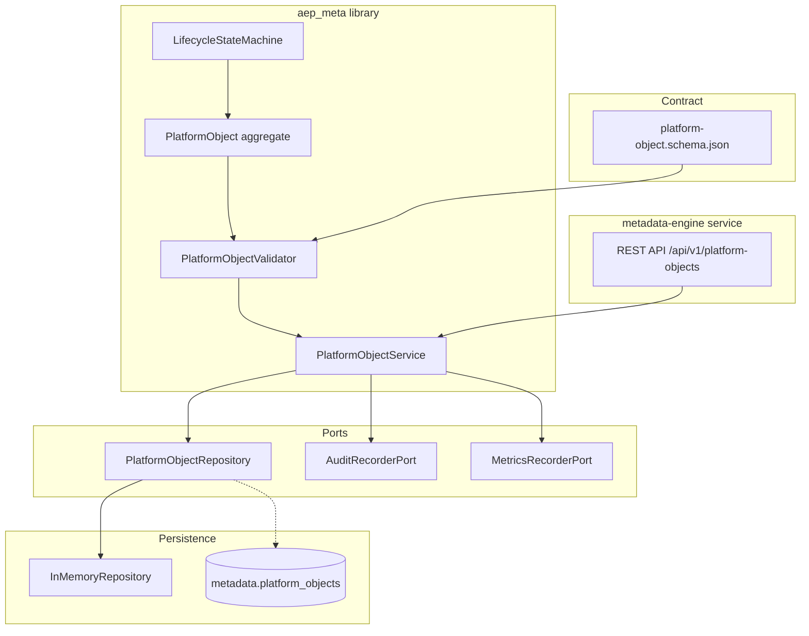

# Platform Object Framework — Architecture Diagram

**Story:** US-02.01  
**PI:** PI-02 Metadata Engine

## Layer responsibilities

| Layer | Responsibility |
|-------|----------------|
| **Contract** | Authoritative JSON Schema for all primitives |
| **Domain** | Identity, metadata, lifecycle, relationships — no I/O |
| **Application** | Validation orchestration, lifecycle use cases |
| **Infrastructure** | Schema adapter, repository implementations |
| **Service** | HTTP adapter only — no business rules |
