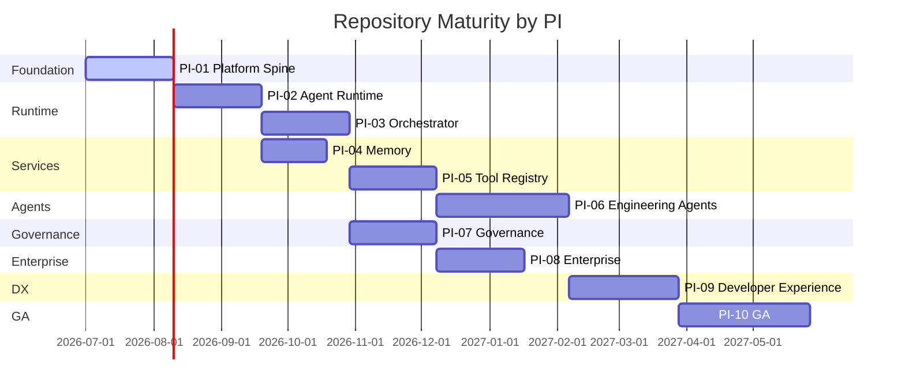

# Repository Migration Plan

**Author:** Chief Platform Architect  
**Date:** 28 June 2026  
**Status:** Approved  
**Purpose:** Reorganise the repository from final-vision appearance to current-maturity representation

---

## Guiding Principle

> A repository must represent what is built today, not what will be built in 3 years.  
> Future capabilities are documented, not pre-coded as empty folders.

---

## Current State (Before Migration)

```
agentic-engineering-platform/
├── CONSTITUTION.md         ✅ Complete
├── ARCHITECTURE.md         ✅ Complete
├── CLAUDE.md               ✅ Complete
├── DECISIONS.md            ✅ Complete
├── ROADMAP.md              ✅ Complete
├── TASKS.md                ✅ Complete
├── VISION.md               ✅ Complete
├── README.md               ✅ Complete
├── .gitignore              ✅ Complete
├── requirements-dev.txt    ✅ Complete
├── contracts/              ✅ Complete — 7 schemas + examples
├── workflows/
│   └── greenfield-v1.0.0.json  ✅ Complete
├── scripts/
│   └── validate_contract.py    ✅ Complete
└── docs/
    ├── artifacts/
    │   └── REFERENCE_ARCHITECTURE.md  ✅ Complete
    └── reference/
        └── *.docx              ✅ Complete
```

**What does NOT exist (and should not be empty folders):**
- `platform/` — 16 microservices
- `agents/` — 15 specialist agents
- `tools/` — 11 tool connectors
- `sdk/` — agent SDK, tool SDK
- `frontend/` — React dashboard
- `infra/` — Terraform, Kubernetes, Helm
- `observability/` — Grafana dashboards
- 7 remaining workflow templates

---

## Target State (After Migration)

```
agentic-engineering-platform/
├── [root docs — unchanged]
├── contracts/              ✅ STAYS — production deliverable
├── workflows/
│   └── greenfield-v1.0.0.json  ✅ STAYS
├── scripts/                ✅ STAYS
└── docs/
    ├── artifacts/          ✅ STAYS
    ├── reference/          ✅ STAYS
    ├── 04-program/         🆕 NEW — 10 PI execution plans
    │   ├── PI-01-Platform-Core/   (16 files)
    │   ├── PI-02-Metadata-Engine/    (16 files)
    │   ├── PI-03-Provider-Framework/     (16 files)
    │   ├── PI-04-Workflow-Framework/           (16 files)
    │   ├── PI-05-Execution-Framework/    (16 files)
    │   ├── PI-06-Studio-Framework/ (16 files)
    │   ├── PI-07-Platform-Services/       (16 files)
    │   ├── PI-08-Solution-Packs/       (16 files)
    │   ├── PI-09-Platform-UX/ (16 files)
    │   └── PI-10-General-Availability/ (16 files)
    └── 05-blueprints/      🆕 NEW — 11 future capability blueprints
        ├── platform-services/
        ├── agent-runtime/
        ├── specialist-agents/
        ├── tool-connectors/
        ├── agent-sdk/
        ├── tool-sdk/
        ├── frontend-dashboard/
        ├── infra-terraform/
        ├── infra-kubernetes/
        ├── observability-stack/
        └── workflow-templates/
```

---

## Decision Table

### What STAYS — Unchanged

| Path | Reason |
|------|--------|
| `CONSTITUTION.md` | Immutable. Source of truth for all decisions. |
| `ARCHITECTURE.md` | Long-term architecture preserved for vision alignment. |
| `CLAUDE.md` | AI implementation rules. Active document. |
| `DECISIONS.md` | ADR repository. Living document. |
| `ROADMAP.md` | Delivery timeline. Living document. |
| `TASKS.md` | Engineering work breakdown. Active tracking. |
| `VISION.md` | Product vision and market positioning. |
| `README.md` | Repository index. |
| `contracts/` | **Production deliverable**. All 7 schemas validated in CI. |
| `workflows/greenfield-v1.0.0.json` | **Production deliverable**. First complete workflow template. |
| `scripts/validate_contract.py` | **Active CI tool**. Used in every PR. |
| `docs/artifacts/` | Architecture diagrams. Living document. |
| `docs/reference/` | Source reference architecture. |
| `.gitignore`, `requirements-dev.txt` | Operational files. |

**Rationale:** Every item in STAYS is either an immutable document, a production deliverable, or an active operational tool. It represents real current work.

---

### What is NEW — Added in This Migration

| Path | What It Is | Rationale |
|------|-----------|-----------|
| `docs/engineering/implementation-roadmap/PI-01` through `PI-10` | 10 Program Increments × 16 files = 160 documentation files | Replaces "future code folders that don't exist" with "execution plans that engineering teams can act on immediately". Each PI has: README, objectives, features, user stories, acceptance criteria, implementation guide, AI prompts, sprint plan, testing, risks, DoD, API spec, sequence diagrams, data model, review checklist, demo script. |
| `docs/reference/blueprints/` × 11 blueprints | 11 BLUEPRINT.md files describing every future capability | Preserves the long-term architecture vision without creating empty code folders. A blueprint is a contract with the future team, not a placeholder. |

**Rationale:** Engineering teams need plans, not empty directories. A PI plan with a sprint breakdown and AI prompts is immediately actionable. An empty `platform/orchestrator-service/` folder is misleading about what is built.

---

### What is DEFERRED — Not Yet in Repository

| Path | Deferred To | Reason |
|------|------------|--------|
| `platform/` (16 services) | PI-01 → PI-09 | Services are scaffolded at the start of their PI. PI-01 creates skeletons; later PIs add production logic. Creating empty folders now misleads contributors. |
| `agents/` (15 specialist agents) | PI-06 | Agents require SDK (PI-02) and Tool Registry (PI-05) to be complete first. Blueprint in `docs/reference/blueprints/specialist-agents/`. |
| `tools/` (11 connectors) | PI-05 (3 tools) + PI-06 (5 tools) + PI-07 (3 tools) | Tool connectors require Tool Registry and Secrets Service first. Blueprint in `docs/reference/blueprints/tool-connectors/`. |
| `sdk/aep-agent-sdk/` | PI-02 | Depends on agent-runtime architecture being finalised. Blueprint in `docs/reference/blueprints/agent-sdk/`. |
| `sdk/aep-tool-sdk/` | PI-05 | Depends on tool-registry architecture being finalised. Blueprint in `docs/reference/blueprints/tool-sdk/`. |
| `frontend/` | PI-09 | Requires REST APIs and WebSocket layer first. Blueprint in `docs/reference/blueprints/frontend-dashboard/`. |
| `infra/terraform/` | PI-10 | Infrastructure as code requires all services and schemas to be stable first. Blueprint in `docs/reference/blueprints/infra-terraform/`. |
| `infra/k8s/` | PI-10 | K8s manifests require all services, HPA targets, and NetworkPolicy rules to be defined. Blueprint in `docs/reference/blueprints/infra-kubernetes/`. |
| `observability/grafana/` (full) | PI-10 | Full dashboard set requires all services to be running. OTEL wiring starts in PI-01. Blueprint in `docs/reference/blueprints/observability-stack/`. |
| `workflows/brownfield-v1.0.0.json` and 6 others | PI-05 + PI-06 | Additional workflow templates implemented when agents they depend on are available. Blueprint in `docs/reference/blueprints/workflow-templates/`. |

---

## Phase Execution Order (Implementation Maturity Ladder)



---

## How New Code Folders Are Introduced

When a PI begins, the platform engineer creates the folder and scaffolds the service:

```bash
# At the start of PI-02:
mkdir -p platform/agent-runtime/src
mkdir -p platform/agent-registry/src
mkdir -p platform/model-router/src
mkdir -p sdk/aep-agent-sdk/aep_sdk

# The folder contains REAL code from day one
# No empty folders, no placeholder files
```

The PI's `IMPLEMENTATION.md` and `SPRINT_PLAN.md` define exactly what goes in the folder and when.

---

## What This Migration Does NOT Do

| Action | Why Not |
|--------|---------|
| Delete any existing file | No information is lost. Everything preserved. |
| Alter CONSTITUTION.md | Immutable. |
| Change contracts/ schemas | Production deliverables. Versioned independently. |
| Rename existing root documents | Would break any existing links or bookmarks. |
| Remove ARCHITECTURE.md vision | Long-term architecture preserved for alignment. |

---

## Outcome

After this migration:

1. **A new developer** clones the repo and immediately understands: what is built, what is being built, and what comes next.

2. **An engineering team** starting PI-02 opens `docs/engineering/implementation-roadmap/PI-02-Metadata-Engine/` and has a complete sprint plan, implementation guide, AI prompts, and acceptance criteria — ready to execute.

3. **An enterprise evaluator** sees a mature, well-governed development programme rather than a repository of empty placeholder folders that overpromise the current state.

4. **Future capabilities** are fully documented in `docs/reference/blueprints/` — preserved for long-term alignment without misleading anyone about today's implementation.
