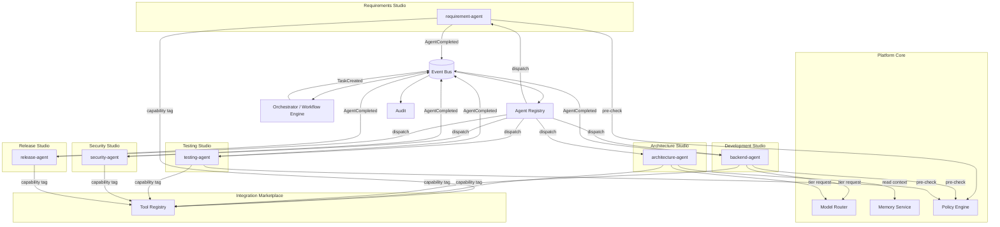
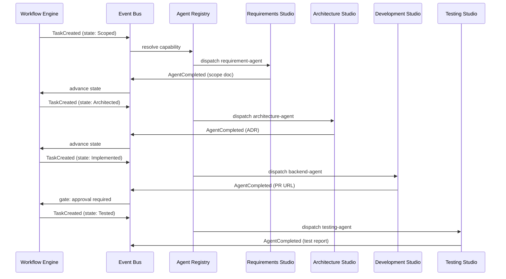
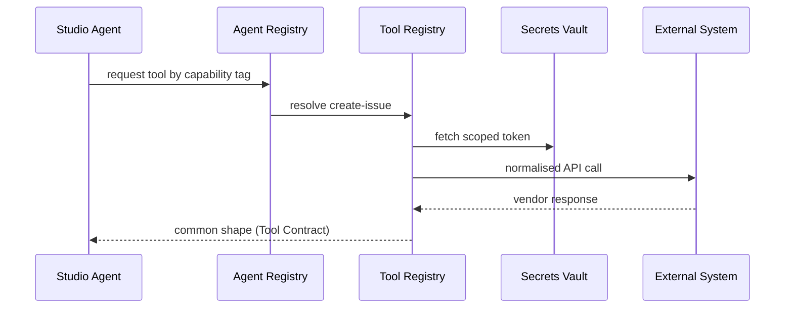
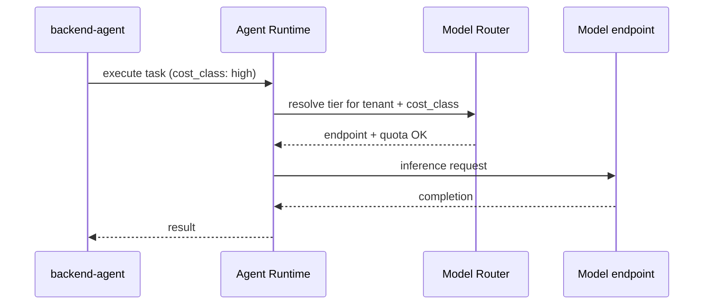
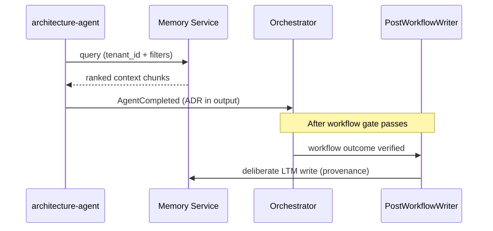
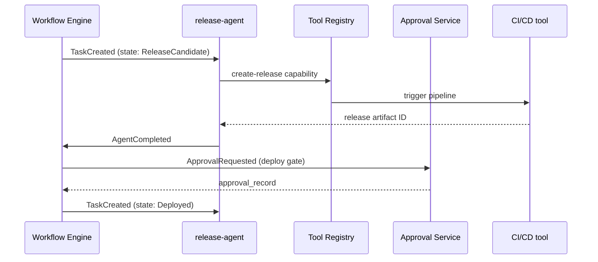
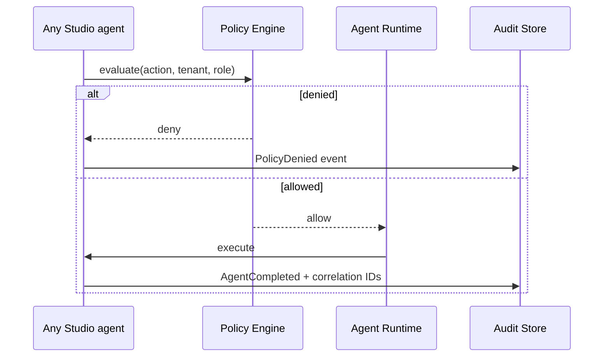

# Domain Interaction

**Status:** Living document  
**Version:** 1.0  
**Last updated:** 29 June 2026

---

## Principle

Studios **never call each other directly**. Collaboration is always **mediated by Platform Core**: Event Bus events, registry lookups, workflow state transitions, memory reads, and policy checks ([CONSTITUTION.md](../../CONSTITUTION.md) A1, AR4).

Sequence and API detail live in PI `SEQUENCE_DIAGRAMS.md` files and [ARCHITECTURE.md](../../ARCHITECTURE.md). This document describes **product-level interaction patterns** only.

---

## Interaction Topology

---

## Pattern 1 — Workflow-Orchestrated Studio Handoff

**Scenario:** Greenfield workflow moves from scope → architecture → implementation → test.

**Core services used:** Workflow Engine, Event Bus, Agent Registry, Gate Enforcer (human approval between states — [PI-03](../engineering/implementation-roadmap/PI-03-Provider-Framework/README.md)).

---

## Pattern 2 — Tool Registry (Integration Marketplace)

Studios invoke external systems **only** by capability tag through Tool Registry — never by embedding vendor SDKs in agents ([CONSTITUTION.md](../../CONSTITUTION.md) AP5).

| Studio | Example capability tag | Typical tool |
|--------|------------------------|--------------|
| Requirements Studio | `create-issue` | Jira ([PI-05](../engineering/implementation-roadmap/PI-05-Execution-Framework/README.md)) |
| Development Studio | `create-pull-request` | GitHub |
| Testing Studio | `run-automated-suite` | Katalon / CI CD |
| Security Studio | `scan-repository` | Security scanner |
| Release Studio | `trigger-deployment` | CI/CD pipeline |
| Architecture Studio | `publish-document` | Confluence |

---

## Pattern 3 — Model Router (AI Operations + Development)

**Scenario:** Development Studio agents request LLM inference with cost governance.

**PI reference:** [PI-02](../engineering/implementation-roadmap/PI-02-Metadata-Engine/README.md) O3; enterprise quotas in [PI-08](../engineering/implementation-roadmap/PI-08-Solution-Packs/README.md).

---

## Pattern 4 — Memory Service (Architecture + Requirements)

**Scenario:** Architecture Studio retrieves project context; Requirements Studio does not write long-term memory directly.

**Constraints:** [PI-04](../engineering/implementation-roadmap/PI-04-Workflow-Framework/README.md) — agents never write LTM directly (M3, AI3).

---

## Pattern 5 — Release Studio + Workflow Engine

**Scenario:** Release Studio orchestrates deployment through workflow states and approval gates.

---

## Pattern 6 — Administration (Policy + Audit)

Every Studio action passes through policy and emits audit evidence.

**PI reference:** [PI-07 Governance](../engineering/implementation-roadmap/PI-07-Platform-Services/README.md).

---

## Pattern 7 — Observability (Cross-Cutting)

All Studios and Core services emit structured logs and OTEL traces with `task_id`, `workflow_run_id`, and `tenant_id`. The **Observability** product domain packages dashboards ([PI-09](../engineering/implementation-roadmap/PI-09-Platform-UX/README.md) Metrics Dashboard; [PI-01](../engineering/implementation-roadmap/PI-01-Platform-Core/README.md) baseline stack).

Studios do not implement bespoke monitoring stacks — they consume Core observability contracts.

---

## Anti-Patterns (Forbidden)

| Anti-pattern | Why forbidden | Constitutional ref |
|--------------|---------------|-------------------|
| `testing-agent` calls `backend-agent` directly | Breaks event mediation | A1 |
| Studio bypasses Tool Registry for GitHub | Vendor lock-in in agent code | AP5 |
| Agent writes to LTM without PostWorkflowWriter | Unaudited memory mutation | M3 |
| Orchestrator generates code or runs tests | Specialist logic in Orchestrator | A2 |
| Cross-tenant memory query without `tenant_id` | Data isolation breach | SR3 |

---

## Further Reading

| Topic | Document |
|-------|----------|
| Container boundaries | [ARCHITECTURE.md](../../ARCHITECTURE.md) |
| Event types | [contracts/event-envelope.schema.json](../../contracts/event-envelope.schema.json) |
| Workflow templates | [workflows/](../../workflows/) |
| PI sequence diagrams | `docs/engineering/implementation-roadmap/PI-*/SEQUENCE_DIAGRAMS.md` |
| Studio summaries | [STUDIO_OVERVIEW.md](./STUDIO_OVERVIEW.md) |
| PI ↔ domain map | [PI_TO_DOMAIN_MAPPING.md](./PI_TO_DOMAIN_MAPPING.md) |
