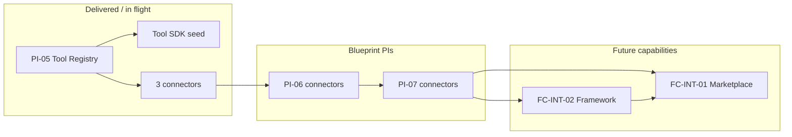
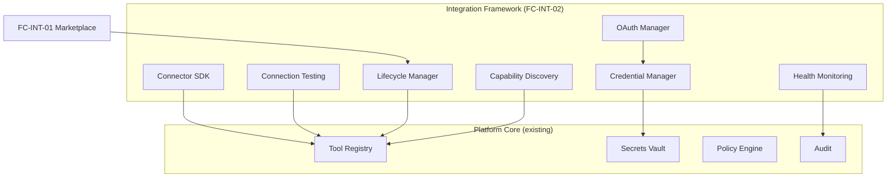

# Future Capabilities — Integration Programme

**Status:** Living document  
**Version:** 1.0  
**Last updated:** 29 June 2026  
**Type:** Product backlog (information architecture only)

---

## Purpose

This document records **planned but not yet scheduled** platform capabilities for the [Integration Marketplace](./PRODUCT_DOMAINS.md#domain-catalog) product domain. It closes the gap between:

- **What exists today** — Tool Registry spine and PI-05 connector scope
- **What the enterprise product requires** — marketplace UX, connector lifecycle, and a full integration framework

**Rules:**

- Does **not** change PI-01 through PI-10 names, sequencing, user stories, or acceptance criteria.
- Does **not** authorise immediate implementation — these are **future capabilities** to be promoted into PIs or epics when the programme is ready.
- Links to authoritative implementation docs; does not duplicate schemas or API specs.

**Related:**

- [PI-05 Tool Registry](../engineering/implementation-roadmap/PI-05-Execution-Framework/README.md) — current delivery increment
- [tool-connectors blueprint](../reference/blueprints/tool-connectors/BLUEPRINT.md) — connector inventory (PI-05/06/07)
- [tool-sdk blueprint](../reference/blueprints/tool-sdk/BLUEPRINT.md) — connector SDK (PI-05)
- [STUDIO_OVERVIEW.md](./STUDIO_OVERVIEW.md#integration-marketplace) — Integration Marketplace studio
- [PLATFORM_CORE.md](./PLATFORM_CORE.md) — Tool Registry as Core service

---

## Current vs Future Boundary

| Layer | Capability | Status | Owner |
|-------|------------|--------|--------|
| **Platform Core** | Tool Registry (capability-tag resolution, scope ceiling) | **PI-05** (planned) | Platform Core |
| **Platform Core** | Secrets Vault / short-lived tokens per invocation | **PI-05** (planned) | Platform Core |
| **Integration** | First connectors (GitHub, Jira, Confluence) | **PI-05** (planned) | Integration Marketplace |
| **Integration** | Tool SDK (base class, normaliser, scope) | **PI-05** (planned) | Integration Framework (seed) |
| **Integration** | Additional connectors (see blueprint PI-06/07) | **Blueprint** | Integration Marketplace |
| **Integration** | Enterprise Tool Marketplace | **FC-INT-01** (future) | Integration Marketplace |
| **Integration** | Integration Framework (full) | **FC-INT-02** (future) | Integration Marketplace + Platform Core |

**Product message:** PI-05 establishes **registry + first connectors**. The **marketplace experience** and **enterprise integration framework** are a **separate programme** (FC-INT-01 / FC-INT-02), typically after PI-05 proves the Tool Contract and secrets pattern in production.

---

## FC-INT-01 — Enterprise Integration Marketplace

**Product domain:** Integration Marketplace  
**Priority:** P0 (enterprise positioning)  
**Proposed window:** Post-PI-05; after Tool Registry and Tool SDK are proven (no PI folder created yet)

### Problem

Tool Registry resolves connectors by capability tag, but tenants cannot **discover, install, configure, and enable** integrations through a product experience. Today, connector registration is operator-driven.

### Target outcome

An **enterprise tool marketplace** where administrators and integration engineers manage the full connector lifecycle without editing platform internals.

### Capability breakdown

| ID | Capability | Description |
|----|------------|-------------|
| FC-INT-01.1 | **Marketplace catalog** | Browse certified and community connectors with metadata (vendor, capabilities, scopes, compliance tier) |
| FC-INT-01.2 | **One-click install** | Install connector package into tenant namespace from catalog (no manual K8s/compose edits) |
| FC-INT-01.3 | **Configure** | Tenant-scoped configuration wizard (endpoints, OAuth app, feature flags) |
| FC-INT-01.4 | **Enable** | Activate connector for selected Studios/workflows; enforce policy approval |
| FC-INT-01.5 | **Use** | Agents resolve installed connectors via existing Tool Registry capability tags |
| FC-INT-01.6 | **Connector lifecycle** | Version upgrades, rollback, disable, uninstall, deprecation notices |
| FC-INT-01.7 | **Marketplace admin** | Publisher onboarding, certification workflow, partner tier (aligns with [ROADMAP.md](../../ROADMAP.md) GA “certified partner catalog” theme) |

### User journey (product)

### UX surfaces (future)

Likely delivered through [PI-09](../engineering/implementation-roadmap/PI-09-Platform-UX/README.md) Config Portal and a dedicated **Integrations** view — **not** part of current PI-09 scope. Track as FC-INT-01 extension when PI is chartered.

### Dependencies

- PI-05 Tool Registry operational
- FC-INT-02 Integration Framework (OAuth, connection test, health)
- Administration (PI-07/08) for tenant policy and RBAC on install/enable actions

### Out of scope for FC-INT-01

- Replacing Tool Registry — marketplace is a **layer above** registry
- Agent-to-agent integration — remains forbidden ([CONSTITUTION.md](../../CONSTITUTION.md) A1)

---

## FC-INT-02 — Integration Framework

**Product domain:** Integration Marketplace (product) + Platform Core (services)  
**Priority:** P0 (foundation for FC-INT-01 and all enterprise connectors)  
**Proposed window:** Parallel or immediately before FC-INT-01 marketplace UX; starts after PI-05 Tool SDK baseline

### Problem

PI-05 delivers registry, secrets, and a **seed** Tool SDK. Enterprise integrations require a **consistent platform framework** for auth, credentials, discovery, testing, health, and lifecycle — not ad hoc logic per connector.

### Target outcome

Any connector (first-party or partner) implements one framework; platform operators get observability and lifecycle controls across all integrations.

### Capability breakdown

| ID | Capability | Current state | Future state |
|----|------------|---------------|--------------|
| FC-INT-02.1 | **Connector SDK** | Tool SDK blueprint → PI-05 | Extend: packaging, certification hooks, marketplace manifest |
| FC-INT-02.2 | **OAuth Manager** | Auth strategies in SDK blueprint only | Central OAuth2/OIDC flows, token refresh, tenant consent UI |
| FC-INT-02.3 | **Credential Manager** | `secrets-service` short-lived tokens (PI-05) | Unified credential vault UI, rotation, audit, scope policies |
| FC-INT-02.4 | **Capability discovery** | Tool Registry capability tags (PI-05) | Marketplace + runtime discovery API for Studio UIs |
| FC-INT-02.5 | **Connection testing** | Not planned | Pre-enable “test connection” with structured pass/fail |
| FC-INT-02.6 | **Health monitoring** | Service `/health` only | Per-connector health, SLOs, degraded mode, alert routing |
| FC-INT-02.7 | **Connector lifecycle** | Manual registration | State machine: `installed → configured → enabled → degraded → disabled → uninstalled` |

### Framework architecture (logical)

### Dependencies

- PI-05 Tool Registry + Tool SDK
- PI-07 Policy Engine + Audit (policy on enable, audit on credential use)
- PI-08 Enterprise (per-tenant isolation for credentials and connector config)

### Relationship to PI-05

| PI-05 delivers | FC-INT-02 adds |
|----------------|----------------|
| Register tool by contract | Marketplace manifest + certification |
| Fetch token per invocation | OAuth consent + rotation + admin UI |
| Capability-tag lookup | Discovery API for UIs |
| Scope ceiling | Connection test + health + lifecycle states |

---

## Connector Catalog — Target List

Connectors are delivered in **phases**. Phases A–B align with existing programme docs; **Phase C** is the FC-INT enterprise expansion (future PI/epic).

### Phase A — PI-05 (committed programme)

| Connector | Primary studios | Auth (planned) | Reference |
|-----------|-----------------|----------------|-----------|
| GitHub | Development, Release | GitHub App | [tool-connectors blueprint](../reference/blueprints/tool-connectors/BLUEPRINT.md) |
| Jira | Requirements, Administration | OAuth2 | Same |
| Confluence | Architecture, Development | OAuth2 | Same |

### Phase B — Blueprint PI-06 / PI-07 (committed in blueprint, not new FC)

| Connector | Primary studios | Target PI |
|-----------|-----------------|-----------|
| Azure DevOps | Development, Release | PI-06 |
| GitLab | Development | PI-06 |
| SonarQube | Security | PI-06 |
| Snyk | Security | PI-06 |
| Terraform | Release, Engineering Operations | PI-07 |
| Kubernetes | Release, Engineering Operations | PI-07 |
| Azure / AWS | Engineering Operations | PI-07 |

### Phase C — FC-INT enterprise catalog (future capability)

| Connector | Primary studios | Notes | Proposed phase |
|-----------|-----------------|-------|----------------|
| Katalon | Testing Studio | `run-automated-suite`, test report normalisation | FC-INT + Testing Studio epic |
| Jenkins | Release, Testing | CI/CD trigger + build status | FC-INT |
| ServiceNow | Administration, Engineering Operations | ITSM, change records | FC-INT |
| Slack | All (notifications) | Workflow/gate notifications — not agent channel | FC-INT |
| Microsoft Teams | All (notifications) | Same pattern as Slack | FC-INT |
| SAP | Enterprise integrations | Partner/certified tier; high compliance | FC-INT (GA-era) |
| Microsoft Outlook | Requirements, Administration | Calendar/mail hooks for gates | FC-INT (GA-era) |

Phase C connectors require **FC-INT-02** (OAuth Manager, connection test, health) before marketplace **one-click install** (FC-INT-01).

---

## Promotion Path — From Future Capability to PI

When the programme is ready to implement FC-INT-01 or FC-INT-02:

1. **Charter a new PI or epic** in `TASKS.md` / `ROADMAP.md` (does not renumber PI-01–PI-10).
2. **Split stories** — marketplace UI vs framework services vs each Phase C connector.
3. **Reference this document** for capability IDs (`FC-INT-01.x`, `FC-INT-02.x`).
4. **Keep Tool Registry** as the runtime resolution layer — marketplace installs **into** registry, never replaces it.

Suggested naming when chartered (examples only):

| Future charter | Suggested name | Scope |
|----------------|----------------|--------|
| Framework first | `PI-11-Integration-Framework` or epic E1.Fx | FC-INT-02.2–02.7 |
| Marketplace UX | `PI-12-Integration-Marketplace` or epic E1.Fy | FC-INT-01.1–01.7 |
| Connector waves | Stories under above PIs | Phase C catalog rows |

*Names are proposals — official PI folders are created only when the programme approves charter.*

---

## Summary

| Question | Answer |
|----------|--------|
| Is Tool Registry done? | Planned in **PI-05** — not GA yet |
| Is Enterprise Marketplace done? | **No** — **FC-INT-01** (future) |
| Is Integration Framework done? | **Partial** — PI-05 seeds SDK + secrets; **FC-INT-02** completes it |
| Should we build now? | **No** — finish PI-05 spine first |
| Where is this tracked? | **This document** + [PRODUCT_MAP.md](./PRODUCT_MAP.md) |
