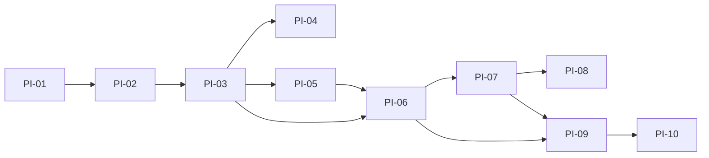

# PI to Product Domain Mapping

**Status:** Living document  
**Version:** 1.0  
**Last updated:** 29 June 2026

---

## Rules

- **Logical mapping only** — no files or folders were moved.
- **PI names and sequence are authoritative** for delivery ([ROADMAP.md](../../ROADMAP.md)).
- **Primary domain** = where the PI's customer value is positioned in product language.
- **Secondary domains** = additional Studios touched by the same PI deliverables.

---

## Summary Matrix

| PI | Folder (unchanged) | Primary product domain | Secondary product domains |
|----|-------------------|------------------------|---------------------------|
| PI-01 | `PI-01-Platform-Spine` | Platform Core | Observability |
| PI-02 | `PI-02-Agent-Runtime` | Platform Core | AI Operations |
| PI-03 | `PI-03-Orchestrator` | Platform Core | Release Studio, Engineering Operations |
| PI-04 | `PI-04-Memory` | Platform Core | Architecture Studio, Requirements Studio |
| PI-05 | `PI-05-Tool-Registry` | Integration Marketplace | Platform Core (Tool Registry service) |
| PI-06 | `PI-06-Engineering-Agents` | *(multi-studio)* | Development, Testing, Architecture, Requirements, Security, Release Studios |
| PI-07 | `PI-07-Governance` | Administration | Engineering Operations, Observability |
| PI-08 | `PI-08-Enterprise` | Administration | AI Operations, Engineering Operations |
| PI-09 | `PI-09-Developer-Experience` | All Studios (UX shell) | Observability, Administration |
| PI-10 | `PI-10-General-Availability` | Platform Core | Engineering Operations |

---

## PI-01 — Platform Spine

**Primary:** Platform Core  
**Secondary:** Observability (OTEL, Prometheus, Grafana in US-01.02)

| PI deliverable | Product positioning |
|----------------|---------------------|
| 16 service skeletons | Core runtime footprint |
| Kafka topic catalog | Event Bus |
| Alembic migrations + RLS | Core data foundation |
| CI pipeline | Core engineering guardrails |
| `make dev-up` | Core local platform |

**Execution docs:** [docs/04-program/PI-01-Platform-Spine/](../04-program/PI-01-Platform-Spine/)

---

## PI-02 — Agent Runtime

**Primary:** Platform Core  
**Secondary:** AI Operations (Model Router, `cost_class` routing)

| PI deliverable | Product positioning |
|----------------|---------------------|
| Agent execution lifecycle | Agent Runtime |
| Capability-based discovery | Agent Registry consumption |
| Tier-1 retry | Task Engine + Runtime resilience |
| Agent SDK | Core extension mechanism for all Studios |

**Execution docs:** [docs/04-program/PI-02-Agent-Runtime/](../04-program/PI-02-Agent-Runtime/)

---

## PI-03 — Orchestrator

**Primary:** Platform Core  
**Secondary:** Release Studio (gate transitions), Engineering Operations (saga, escalation)

| PI deliverable | Product positioning |
|----------------|---------------------|
| Greenfield workflow E2E | Workflow Engine + Planner |
| Gate Enforcer | Shared gate primitive for all Studios |
| Saga compensation / Tier 3 escalation | Core reliability patterns |

**Execution docs:** [docs/04-program/PI-03-Orchestrator/](../04-program/PI-03-Orchestrator/)

---

## PI-04 — Memory

**Primary:** Platform Core  
**Secondary:** Architecture Studio, Requirements Studio (context for design and scope)

| PI deliverable | Product positioning |
|----------------|---------------------|
| Working context (Redis) | Core ephemeral memory |
| Long-term memory (pgvector) | Core durable knowledge |
| Context Assembler / PostWorkflowWriter | Core orchestration hooks |

**Execution docs:** [docs/04-program/PI-04-Memory/](../04-program/PI-04-Memory/)

---

## PI-05 — Tool Registry

**Primary:** Integration Marketplace  
**Secondary:** Platform Core (Tool Registry is a Core container)

| PI deliverable | Product positioning |
|----------------|---------------------|
| Tool Contract + registration | Marketplace catalog (runtime layer) |
| First connectors (e.g. source control) | Phase A connectors — not full marketplace UX |
| Secrets Vault integration | Credential Manager seed (see [FC-INT-02](./FUTURE_CAPABILITIES.md#fc-int-02--integration-framework)) |
| Capability-tag resolution | Core pattern used by every Studio |

**Future (not PI-05):** Enterprise marketplace install/configure/enable flow and connector lifecycle — [FUTURE_CAPABILITIES.md](./FUTURE_CAPABILITIES.md#fc-int-01--enterprise-integration-marketplace).

**Execution docs:** [docs/04-program/PI-05-Tool-Registry/](../04-program/PI-05-Tool-Registry/)

---

## PI-06 — Engineering Agents

**Primary:** Multi-studio agent catalog (single PI, multiple product domains)

PI-06 implements specialist agents. Each agent maps to a Studio for **product** discussions; all agents still register and run through **Platform Core**.

| Agent | Product domain (Studio) |
|-------|-------------------------|
| `requirement-agent` | Requirements Studio |
| `architecture-agent` | Architecture Studio |
| `discovery-agent` | Architecture Studio |
| `dependency-analysis-agent` | Architecture Studio |
| `backend-agent` | Development Studio |
| `frontend-agent` | Development Studio |
| `migration-agent` | Development Studio |
| `review-agent` | Development Studio |
| `documentation-agent` | Development Studio |
| `testing-agent` | Testing Studio |
| `regression-agent` | Testing Studio |
| `performance-agent` | Testing Studio |
| `security-agent` | Security Studio |
| `release-agent` | Release Studio |
| `root-cause-agent` | Engineering Operations |

**Execution docs:** [docs/04-program/PI-06-Engineering-Agents/](../04-program/PI-06-Engineering-Agents/)

---

## PI-07 — Governance

**Primary:** Administration  
**Secondary:** Engineering Operations (audit queries, compliance exports), Observability (dashboards)

| PI deliverable | Product positioning |
|----------------|---------------------|
| Policy Engine (OPA) | Administration — policy-as-code |
| Audit Store (ClickHouse) | Administration — immutable record |
| Auth + RBAC | Administration — access control |
| Governance dashboards | Administration + Observability UX |

**Execution docs:** [docs/04-program/PI-07-Governance/](../04-program/PI-07-Governance/)

---

## PI-08 — Enterprise

**Primary:** Administration  
**Secondary:** AI Operations (quotas), Engineering Operations (SLA monitoring)

| PI deliverable | Product positioning |
|----------------|---------------------|
| Multi-tenancy (3 layers) | Administration — tenant isolation |
| Config service / feature flags | Administration — Configuration (Core) |
| Enterprise SSO / SCIM | Administration |
| Data residency | Administration + Engineering Operations |

**Execution docs:** [docs/04-program/PI-08-Enterprise/](../04-program/PI-08-Enterprise/README.md)

---

## PI-09 — Developer Experience

**Primary:** All Studios (unified product shell)  
**Secondary:** Observability (Metrics Dashboard), Administration (Approval Console, Config Portal)

PI-09 does not introduce a new Studio. It provides **cross-studio UX**: dashboard, CLI, SDK docs, REST/WebSocket APIs.

| Dashboard view | Studio served |
|----------------|---------------|
| Workflow Designer | All |
| Agent Registry | All (agent owners) |
| Workflow Monitor | Engineering Operations |
| Task Explorer | All |
| Audit Explorer | Administration |
| Memory Explorer | Architecture, Requirements |
| Approval Console | Administration, Release |
| Metrics Dashboard | Observability |
| Config Portal | Administration |

**Execution docs:** [docs/04-program/PI-09-Developer-Experience/](../04-program/PI-09-Developer-Experience/)

---

## PI-10 — General Availability

**Primary:** Platform Core (production-grade Core)  
**Secondary:** Engineering Operations (chaos, DR, load testing, operator docs)

| PI deliverable | Product positioning |
|----------------|---------------------|
| K8s + Terraform production manifests | Core + enterprise deployment |
| Chaos engineering | Engineering Operations |
| Load / DR / penetration testing | GA confidence for all domains |
| External beta pilot | Whole platform |

**Execution docs:** [docs/04-program/PI-10-General-Availability/](../04-program/PI-10-General-Availability/)

---

## Reverse Lookup: Studio → PIs

| Product domain | Contributing PIs |
|----------------|------------------|
| Platform Core | PI-01, PI-02, PI-03, PI-04, PI-05 (service), PI-10 |
| Requirements Studio | PI-06 (`requirement-agent`) |
| Architecture Studio | PI-04 (context), PI-06 (architecture agents) |
| Development Studio | PI-06 (dev agents), PI-05 (SCM tools) |
| Testing Studio | PI-06 (testing agents), PI-05 (CI/test tools) |
| Security Studio | PI-06 (`security-agent`), PI-07 (policy) |
| Release Studio | PI-03 (gates), PI-06 (`release-agent`) |
| Engineering Operations | PI-07, PI-08, PI-10, PI-06 (`root-cause-agent`) |
| AI Operations | PI-02, PI-08 |
| Integration Marketplace | PI-05 |
| Administration | PI-07, PI-08, PI-09 (config/approval UI) |
| Observability | PI-01, PI-09, PI-07 (dashboards) |
| All Studios (UX) | PI-09 |

---

## Implementation Path Unchanged

Product domains do not alter this graph. They provide a **parallel organizational lens** for stakeholders who think in enterprise product modules rather than delivery increments.
