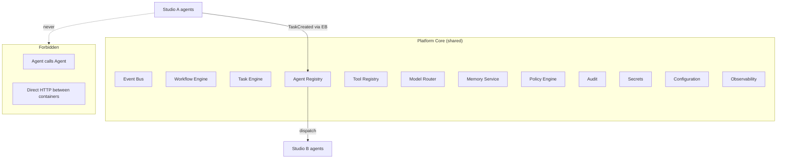

# Platform Core

**Status:** Living document  
**Version:** 1.0  
**Last updated:** 29 June 2026

---

## Role

**Platform Core** is the shared kernel of the Engineering Platform. All Studios consume Core capabilities through **events**, **registries**, and **documented APIs** — never through direct service-to-service HTTP calls between agents ([CONSTITUTION.md](../../CONSTITUTION.md) A1, AR4).

Technical container boundaries, deployment topology, and data ownership are defined in [ARCHITECTURE.md](../../ARCHITECTURE.md). This document names Core **product capabilities** only.

---

## Core Capability Catalog

| Product capability | Platform responsibility | Primary ARCHITECTURE reference |
|------------------|-------------------------|--------------------------------|
| **Planner** | Selects next workflow step; dispatches work; never executes specialist logic | Orchestrator — Cost-Aware Dispatcher, Agent Selector |
| **Workflow Engine** | State machine execution, template versioning, gate transitions | Task Queue & Workflow Engine, Orchestrator |
| **Task Engine** | Durable task persistence, scheduling, retry metadata | Task Queue |
| **Event Bus** | Async, contract-validated inter-container communication | Event Bus (Kafka) |
| **Agent Runtime** | Hosts agent execution; publishes completion/failure events | Agent Runtime |
| **Agent Registry** | Capability-based agent discovery and registration | Agent Registry |
| **Tool Registry** | Capability-based tool resolution; scope enforcement | Tool Registry |
| **Model Router** | Model tier routing; per-tenant quota enforcement | Platform Services — Model Router |
| **Memory Service** | Working context + long-term memory (separate layers) | Memory Store |
| **Policy Engine** | Pre-execution policy checks (OPA) | Platform Services — Policy Engine |
| **Audit** | Immutable, append-only platform event record | Audit Store |
| **Secrets** | Short-lived, scoped credentials for tools | Secrets Vault |
| **Configuration** | Tenant configuration and feature flags | Config service ([PI-08](../engineering/implementation-roadmap/PI-08-Solution-Packs/README.md)) |
| **Observability** | Traces, metrics, structured logs | Observability stack |

These capabilities are **unchanged** by the Product Domain layer. Naming here aligns with product language; implementation names in `src/platform/` follow [REPOSITORY_GUIDE.md](../../REPOSITORY_GUIDE.md).

---

## Core vs Studio Boundary

---

## Which PIs Build Platform Core

| PI | Core capabilities delivered |
|----|----------------------------|
| [PI-01](../engineering/implementation-roadmap/PI-01-Platform-Core/README.md) | Service skeletons, Event Bus topology, database foundation, CI spine, local dev |
| [PI-02](../engineering/implementation-roadmap/PI-02-Metadata-Engine/README.md) | Agent Runtime, Agent Registry integration, Model Router routing |
| [PI-03](../engineering/implementation-roadmap/PI-03-Provider-Framework/README.md) | Planner, Workflow Engine integration, Gate Enforcer, saga compensation |
| [PI-04](../engineering/implementation-roadmap/PI-04-Workflow-Framework/README.md) | Memory Service (working + LTM), Context Assembler hooks |
| [PI-10](../engineering/implementation-roadmap/PI-10-General-Availability/README.md) | Production hardening of all Core services (K8s, chaos, DR) |

PI-05 (Tool Registry) is classified under **Integration Marketplace** as a product domain but implements a **Core registry service** — see [PI_TO_DOMAIN_MAPPING.md](./PI_TO_DOMAIN_MAPPING.md).

---

## Contracts and Events

All Core interactions use:

- [contracts/event-envelope.schema.json](../../contracts/event-envelope.schema.json) — Kafka messages
- [contracts/agent-contract.schema.json](../../contracts/agent-contract.schema.json) — agent registration
- [contracts/tool-contract.schema.json](../../contracts/tool-contract.schema.json) — tool registration
- [contracts/task-schema.schema.json](../../contracts/task-schema.schema.json) — task payloads
- [contracts/memory-schema.schema.json](../../contracts/memory-schema.schema.json) — memory operations

Studios do not define alternate envelopes. Product documentation does not duplicate schema fields — refer to `contracts/` and PI `DATA_MODEL.md` files.

---

## Consumption Pattern for Studios

Every Studio follows the same integration pattern:

1. **Register** agents/tools in registries (capability tags, not names).
2. **Subscribe** to workflow states via Orchestrator / Workflow Engine events.
3. **Execute** work in Agent Runtime; publish `AgentCompleted` or `AgentFailed`.
4. **Resolve** external systems only through Tool Registry.
5. **Read/write memory** only through Memory Service APIs (agents do not write LTM directly — [PI-04](../engineering/implementation-roadmap/PI-04-Workflow-Framework/README.md)).
6. **Pass policy** before side effects; emit audit events for human and agent actions.

Examples: [DOMAIN_INTERACTION.md](./DOMAIN_INTERACTION.md)
