# Product Domains

**Status:** Living document  
**Version:** 1.0  
**Last updated:** 29 June 2026

---

## Definition

A **Product Domain** is a top-level area of the Engineering Platform that delivers **independent customer value**. Domains are organized as **Studios** (product modules) built on a shared **Platform Core**.

Studios are **not** delivery phases. Program Increments (PIs) remain the authoritative implementation sequence in [docs/engineering/implementation-roadmap/](../engineering/implementation-roadmap/).

---

## Domain Catalog

| Domain | Studio name | One-line purpose |
|--------|-------------|------------------|
| Shared foundation | **Platform Core** | Event-driven runtime, workflow, task, agent, and tool infrastructure |
| Intent → scope | **Requirements Studio** | Capture, refine, and trace engineering intent |
| Design → structure | **Architecture Studio** | System design, discovery, ADRs, dependency intelligence |
| Build → change | **Development Studio** | Code generation, PRs, migrations, implementation |
| Verify → quality | **Testing Studio** | Unit, integration, regression, and quality signals |
| Protect → comply | **Security Studio** | Vulnerability scanning, security gates, compliance evidence |
| Ship → operate | **Release Studio** | Release orchestration, changelog, deployment workflows |
| Run → improve | **Engineering Operations** | Incidents, RCA, SRE workflows, platform health |
| Model → cost | **AI Operations** | Model routing, quotas, cost governance, agent lifecycle |
| Connect → extend | **Integration Marketplace** | Tool registry, connectors, vendor normalisation |
| Govern → administer | **Administration** | Auth, RBAC, policy, audit, tenant administration |
| Measure → observe | **Observability** | Metrics, traces, logs, dashboards (cross-cutting) |

---

## Studio Ownership Model

Each Studio **owns** the product definition for:

| Asset type | Owned by Studio | Implemented via |
|------------|-----------------|-----------------|
| **Features** | Studio product backlog | PI features in `docs/engineering/implementation-roadmap/PI-*/FEATURES.md` |
| **Capabilities** | Studio capability tags / outcomes | Agents, tools, workflows |
| **Agents** | Studio specialist agents | `agents/` (see [PI-06 README](../engineering/implementation-roadmap/PI-06-Studio-Framework/README.md)) |
| **Workflows** | Studio workflow templates | `workflows/` |
| **UI** | Studio views and consoles | [PI-09](../engineering/implementation-roadmap/PI-09-Platform-UX/README.md) dashboard views |
| **APIs** | Studio-facing API surfaces | Per-PI `API_SPEC.md`, gateway routes |

Studios **do not** own Platform Core containers directly. They **consume** Core services through contracts and events. See [PLATFORM_CORE.md](./PLATFORM_CORE.md).

---

## Platform Core vs Studios

```mermaid
flowchart LR
    subgraph Studios["Studios (Product Domains)"]
        direction TB
        S1[Requirements]
        S2[Architecture]
        S3[Development]
        S4[Testing]
        S5[Security]
        S6[Release]
    end

    subgraph Core["Platform Core"]
        direction TB
        C1[Workflow Engine]
        C2[Event Bus]
        C3[Agent Runtime]
        C4[Tool Registry]
        C5[Memory Service]
        C6[Policy Engine]
    end

    Studios -->|events + APIs| Core
    Core -->|TaskCreated, AgentCompleted| Studios
```

**Rule:** Studios collaborate **through** Platform Core — never by direct agent-to-agent calls ([CONSTITUTION.md](../../CONSTITUTION.md) principle A1).

---

## Mapping Studios to Implementation Artifacts

| Need | Go to |
|------|--------|
| Which PI builds a capability | [PI_TO_DOMAIN_MAPPING.md](./PI_TO_DOMAIN_MAPPING.md) |
| Studio descriptions and users | [STUDIO_OVERVIEW.md](./STUDIO_OVERVIEW.md) |
| Container and service design | [ARCHITECTURE.md](../../ARCHITECTURE.md) |
| Agent list and capability tags | [PI-06 Engineering Agents](../engineering/implementation-roadmap/PI-06-Studio-Framework/README.md) |
| Tool integrations | [PI-05 Tool Registry](../engineering/implementation-roadmap/PI-05-Execution-Framework/README.md) |
| Dashboard / UX | [PI-09 Developer Experience](../engineering/implementation-roadmap/PI-09-Platform-UX/README.md) |

---

## Design Principles (Product IA)

1. **Modular product, sequential delivery** — Studios describe *what* customers buy; PIs describe *when* it ships.
2. **Single core, many studios** — All studios share Platform Core; differentiation is in agents, workflows, and UX.
3. **No duplicate specs** — Product docs link to PI and architecture docs; they do not copy acceptance criteria or schemas.
4. **ERP-style domain boundaries** — Each studio could be sold, staffed, or roadmapped independently while sharing the same kernel.
