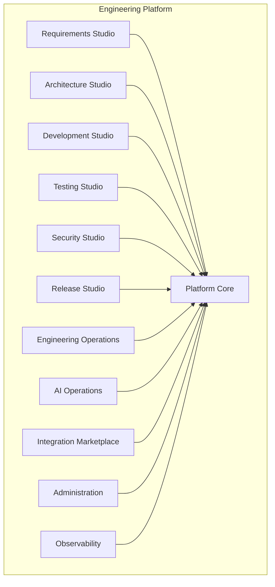

# Engineering Platform — Product Map

**Status:** Living document  
**Version:** 1.0  
**Last updated:** 29 June 2026  
**Type:** Information Architecture (product organization only)

---

## Purpose

This document is the **entry point** for how the Agentic Engineering Platform is organized as an **enterprise product**. It introduces a Product Domain layer above the existing Program Increment (PI) execution structure.

**This layer does not replace implementation planning.** All engineering work continues to be defined, sequenced, and delivered through:

- [ROADMAP.md](../../ROADMAP.md) — release phases and milestones
- [TASKS.md](../../TASKS.md) — epics, features, stories
- [docs/04-program/](../04-program/) — PI-01 through PI-10 execution packs
- [ARCHITECTURE.md](../../ARCHITECTURE.md) — technical system structure
- [CONSTITUTION.md](../../CONSTITUTION.md) — immutable principles

---

## Product Topology

Studios are **not sequential**. They are independently valuable product areas that **collaborate through Platform Core** services (Event Bus, registries, workflow engine, memory, policy, and so on). See [DOMAIN_INTERACTION.md](./DOMAIN_INTERACTION.md).

---

## Document Index

| Document | Audience | Contents |
|----------|----------|----------|
| [PRODUCT_DOMAINS.md](./PRODUCT_DOMAINS.md) | Product, engineering leadership | Domain definitions and ownership model |
| [STUDIO_OVERVIEW.md](./STUDIO_OVERVIEW.md) | Buyers, PMs, squad leads | Studio value propositions and primary users |
| [PLATFORM_CORE.md](./PLATFORM_CORE.md) | Architects, platform engineers | Shared capabilities all Studios consume |
| [PI_TO_DOMAIN_MAPPING.md](./PI_TO_DOMAIN_MAPPING.md) | Delivery teams | Logical PI → Product Domain map (no file moves) |
| [DOMAIN_INTERACTION.md](./DOMAIN_INTERACTION.md) | Architects, integrators | How Studios collaborate via Platform Core |
| [FUTURE_CAPABILITIES.md](./FUTURE_CAPABILITIES.md) | Product, architects | Post-PI-05 integration programme (marketplace + framework) |

---

## How Product Domains Relate to PIs

| Layer | Role | Location |
|-------|------|----------|
| **Product Domain** | *What* the platform offers — modular Studios on a shared core | `docs/product/` (this folder) |
| **Program Increment (PI)** | *When* and *how* capabilities are built — sequenced delivery | `docs/04-program/PI-0N-*` |
| **User Story / AC** | *Done* criteria for each increment | Per-PI `USER_STORIES.md`, `ACCEPTANCE_CRITERIA.md` |
| **Implementation** | Code, contracts, infra | `src/`, `contracts/`, `workflows/`, `infra/` |

PI names, story IDs, acceptance criteria, and delivery order are **unchanged**. Product Domains are a **view** over the same roadmap.

---

## Quick PI → Domain Reference

| PI | Primary product domain(s) | Details |
|----|---------------------------|---------|
| PI-01 | Platform Core | [PI_TO_DOMAIN_MAPPING.md](./PI_TO_DOMAIN_MAPPING.md#pi-01--platform-spine) |
| PI-02 | Platform Core | [PI_TO_DOMAIN_MAPPING.md](./PI_TO_DOMAIN_MAPPING.md#pi-02--agent-runtime) |
| PI-03 | Platform Core | [PI_TO_DOMAIN_MAPPING.md](./PI_TO_DOMAIN_MAPPING.md#pi-03--orchestrator) |
| PI-04 | Platform Core | [PI_TO_DOMAIN_MAPPING.md](./PI_TO_DOMAIN_MAPPING.md#pi-04--memory) |
| PI-05 | Integration Marketplace | [PI_TO_DOMAIN_MAPPING.md](./PI_TO_DOMAIN_MAPPING.md#pi-05--tool-registry) |
| PI-06 | Multiple Studios | [PI_TO_DOMAIN_MAPPING.md](./PI_TO_DOMAIN_MAPPING.md#pi-06--engineering-agents) |
| PI-07 | Administration, Engineering Operations | [PI_TO_DOMAIN_MAPPING.md](./PI_TO_DOMAIN_MAPPING.md#pi-07--governance) |
| PI-08 | Administration, AI Operations, Engineering Operations | [PI_TO_DOMAIN_MAPPING.md](./PI_TO_DOMAIN_MAPPING.md#pi-08--enterprise) |
| PI-09 | All Studios (experience layer) | [PI_TO_DOMAIN_MAPPING.md](./PI_TO_DOMAIN_MAPPING.md#pi-09--developer-experience) |
| PI-10 | Platform Core, Engineering Operations | [PI_TO_DOMAIN_MAPPING.md](./PI_TO_DOMAIN_MAPPING.md#pi-10--general-availability) |

---

## Migration Summary (Information Architecture Only)

### What changed

- Added `docs/product/` with six product-organization documents.
- Introduced **Product Domain** and **Studio** vocabulary for enterprise positioning.
- Published logical **PI → Product Domain** mappings.

### What did not change

| Artifact | Status |
|----------|--------|
| PI folder names (`PI-01-Platform-Spine` … `PI-10-General-Availability`) | Unchanged |
| User story IDs and acceptance criteria | Unchanged |
| [ROADMAP.md](../../ROADMAP.md) sequencing | Unchanged |
| [ARCHITECTURE.md](../../ARCHITECTURE.md) containers and boundaries | Unchanged |
| [contracts/](../../contracts/) schemas | Unchanged |
| `src/` layout | Unchanged |
| Implementation files in `docs/04-program/` | Unchanged |

### How teams should use both layers

1. **Product conversations** (roadmap reviews, enterprise demos, studio squads) → start in `docs/product/`.
2. **Delivery conversations** (sprints, PRs, `/implement-story`, release gates) → continue in `docs/04-program/PI-0N-*`.
3. **Technical design** → [ARCHITECTURE.md](../../ARCHITECTURE.md) and [DECISIONS.md](../../DECISIONS.md).

No repository paths were moved. This migration is **documentation-only**.

---

## Related Authority Documents

- [VISION.md](../../VISION.md) — platform vision
- [REPOSITORY_GUIDE.md](../../REPOSITORY_GUIDE.md) — where code and docs live
- [docs/MIGRATION_REPORT.md](../MIGRATION_REPORT.md) — prior docs restructuring (execution layer)
